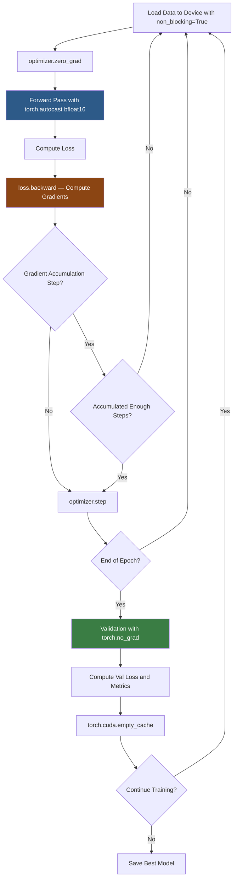

# 3. Tensors and PyTorch Basics

## 3.1 What Are Tensors: From Scalars to N-Dimensional Arrays

A tensor is the fundamental data structure in deep learning — it is a generalization of scalars, vectors, and matrices to an arbitrary number of dimensions:

| Concept | Dimensions | Example |
|---------|-----------|---------|
| Scalar | 0D | `torch.tensor(3.14)` — a single number |
| Vector | 1D | `torch.tensor([1.0, 2.0, 3.0])` — a list of numbers |
| Matrix | 2D | `torch.tensor([[1, 2], [3, 4]])` — a table of numbers |
| Tensor | 3D+ | `torch.randn(2, 3, 4)` — a multi-dimensional array |

The **rank** (or number of dimensions) of a tensor is the number of indices you need to access a single element. A 4D tensor of shape `(B, C, H, W)` requires 4 indices: `tensor[b, c, h, w]`.

Tensors are not just arrays — they also carry metadata that is crucial for deep learning:
- **`dtype`**: The data type (float32, bfloat16, int64, etc.)
- **`device`**: Where the tensor lives (CPU or GPU)
- **`requires_grad`**: Whether to track gradients through this tensor
- **`grad`**: The accumulated gradient (only if `requires_grad=True`)

Understanding tensors deeply is non-negotiable for working with PyTorch. Every model input, output, parameter, and intermediate activation is a tensor. Every error you will encounter in training is a tensor shape mismatch or device mismatch.

## 3.2 Tensor Shapes and Their Meaning in Deep Learning

The shape of a tensor tells you everything about what it represents. In deep learning, certain shape conventions are nearly universal:

### Image Tensors: `(B, C, H, W)` — Batch, Channels, Height, Width
- **B**: Batch size — how many images processed together
- **C**: Channels — 3 for RGB, 1 for grayscale
- **H**: Height in pixels
- **W**: Width in pixels

In TAMER OCR, the Swin encoder expects `(B, 3, 256, 1024)` — a batch of RGB images at 256×1024 resolution. This "wide" format accommodates math formulas which are typically much wider than they are tall.

### Sequence Tensors: `(B, T, D)` — Batch, Time/Sequence Length, Features/Dimension
- **B**: Batch size
- **T**: Sequence length — number of tokens
- **D**: Feature/embedding dimension

In the decoder, token embeddings have shape `(B, T, D)` where `T` is the number of LaTeX tokens and `D` is the model dimension (e.g., 256 or 512).

### Attention Tensors: `(B, H, T, T)` — Batch, Heads, Query Length, Key Length
- **H**: Number of attention heads
- The last two dimensions form the attention matrix — each entry tells how much token $i$ attends to token $j$

### Why Shape Matters Practically
Shape mismatches are the #1 source of bugs in deep learning code. When you see `RuntimeError: mat1 and mat2 shapes cannot be multiplied`, it means you are trying to multiply tensors whose dimensions are incompatible for matrix multiplication. Learning to "read" tensor shapes fluently — and to debug shape issues quickly — is an essential skill.

**Tip**: Use `tensor.shape` (or `tensor.size()`) liberally. Print shapes at every step when debugging a new model. The shape should transform predictably through each layer.

## 3.3 Key Tensor Operations

### Reshape / View
Change the shape of a tensor without changing its data:

```python
x = torch.randn(2, 3, 4)   # shape: (2, 3, 4)
y = x.view(2, 12)           # shape: (2, 12)
z = x.reshape(6, 4)         # shape: (6, 4)
```

`view` requires the tensor to be contiguous in memory; `reshape` works on any tensor (it may copy data if needed). In attention mechanisms, reshaping is used constantly to rearrange `(B, T, D)` into `(B, H, T, D//H)` for multi-head attention.

### Permute / Transpose
Rearrange the dimensions of a tensor:

```python
# Convert from HWC to CHW format (for PyTorch image processing)
img_hwc = torch.randn(256, 1024, 3)  # H, W, C
img_chw = img_hwc.permute(2, 0, 1)    # C, H, W → (3, 256, 1024)
```

`transpose` swaps exactly two dimensions; `permute` reorders all dimensions. This is critical when converting between PIL/OpenCV format (HWC) and PyTorch format (CHW).

### Matrix Multiplication (matmul / @)
```python
A = torch.randn(2, 3, 4)
B = torch.randn(2, 4, 5)
C = A @ B  # shape: (2, 3, 5) — batched matrix multiplication
```

Matrix multiplication is the computational core of every neural network layer. Every `nn.Linear` call is essentially `output = input @ weight.T + bias`. In attention, the QK^T product is a batched matmul.

### Broadcasting
PyTorch automatically "expands" tensors along dimensions of size 1 to make operations compatible:

```python
x = torch.randn(2, 3, 4)  # shape: (2, 3, 4)
y = torch.randn(1, 3, 1)  # shape: (1, 3, 1)
z = x + y                  # shape: (2, 3, 4) — y is broadcast
```

Broadcasting is powerful but dangerous — it can silently hide shape bugs. Always verify shapes when broadcasting is involved.

## 3.4 GPU Tensors vs CPU Tensors

PyTorch tensors can live on either the CPU or GPU. Operations between tensors on different devices will fail with an error:

```python
# Moving tensors between devices
tensor_cpu = torch.randn(3, 4)
tensor_gpu = tensor_cpu.to('cuda')          # CPU → GPU
tensor_back = tensor_gpu.to('cpu')           # GPU → CPU

# Common patterns
device = torch.device('cuda' if torch.cuda.is_available() else 'cpu')
model = model.to(device)
data = data.to(device, non_blocking=True)
```

**`non_blocking=True`** is an important optimization. When using a `DataLoader` with `pin_memory=True`, data transfers from CPU to GPU can overlap with computation on the GPU. Setting `non_blocking=True` tells PyTorch: "start the transfer but don't wait for it to finish — I'll use the tensor later." This can significantly speed up training by hiding data transfer latency behind computation.

**In TAMER OCR**, the training loop uses:
```python
images = images.to(device, non_blocking=True)
labels = labels.to(device, non_blocking=True)
```

This ensures that the GPU doesn't sit idle while waiting for data to be copied from CPU memory.

## 3.5 PyTorch's Autograd: Automatic Differentiation

PyTorch's autograd system is what makes deep learning practical. You write the forward pass, and it automatically computes the backward pass (gradients). Here's how it works:

### `requires_grad`
By default, tensors do not track gradients. You must opt in:

```python
x = torch.randn(3, requires_grad=True)  # Track gradients
w = torch.randn(3, requires_grad=True)  # Track gradients
y = (x * w).sum()                        # PyTorch records this operation
y.backward()                             # Compute gradients
print(x.grad)  # ∂y/∂x = w
print(w.grad)  # ∂y/∂w = x
```

Model parameters (`nn.Parameter`) automatically have `requires_grad=True`.

### `.backward()`
Computes gradients for all tensors with `requires_grad=True` in the computational graph. After calling `.backward()`, each tensor's `.grad` attribute contains its gradient.

### `.grad`
Stores the accumulated gradient. **Important**: `.grad` accumulates by default — if you call `.backward()` multiple times without zeroing, gradients add up. This is why we must call `optimizer.zero_grad()` before each backward pass.

## 3.6 The Training Step Pattern in PyTorch

The canonical training step in PyTorch follows a strict order. Memorize this:

```python
# 1. Zero out gradients from the previous step
optimizer.zero_grad()

# 2. Forward pass: compute predictions
outputs = model(inputs)

# 3. Compute loss
loss = criterion(outputs, targets)

# 4. Backward pass: compute gradients
loss.backward()

# 5. Update weights using the optimizer
optimizer.step()
```

**Why this order?**
1. `zero_grad()` must come first — otherwise gradients from the previous step contaminate the current step
2. Forward pass must come before loss computation (obviously)
3. Loss must be computed before `backward()` (gradients need a scalar loss to start from)
4. `backward()` must come before `step()` (you need gradients before you can update)
5. `step()` uses the computed gradients to actually change the weights

This pattern is followed in every training loop in TAMER OCR. With mixed precision (BFloat16), a few extra steps are added (using `torch.autocast` and `GradScaler`), but the core pattern remains the same.

## 3.7 torch.no_grad() and Evaluation

During evaluation, we don't need gradients — we're only computing outputs, not updating weights. Using `torch.no_grad()` provides two benefits:

```python
with torch.no_grad():
    outputs = model(inputs)
    loss = criterion(outputs, targets)
```

1. **Memory savings**: PyTorch doesn't store intermediate activations needed for backpropagation. This can save 50%+ of GPU memory.
2. **Speed**: Fewer operations are recorded, so the forward pass is slightly faster.

**Always use `torch.no_grad()` during validation and testing.** Forgetting this is a common source of OOM (out of memory) errors — the model runs fine during training but crashes during validation because intermediate activations from validation are being retained unnecessarily.

## 3.8 Gradient Accumulation

When the desired batch size doesn't fit in GPU memory, **gradient accumulation** simulates a larger batch by accumulating gradients over multiple forward-backward passes before updating weights:

```python
accumulation_steps = 4
optimizer.zero_grad()

for i, (inputs, targets) in enumerate(dataloader):
    outputs = model(inputs)
    loss = criterion(outputs, targets)
    loss = loss / accumulation_steps  # Scale loss down
    loss.backward()                    # Gradients accumulate (not zeroed!)

    if (i + 1) % accumulation_steps == 0:
        optimizer.step()               # Update weights
        optimizer.zero_grad()          # Reset gradients
```

**Why divide loss by `accumulation_steps`?** When you call `loss.backward()`, the gradient of the loss is added to `.grad`. If you accumulate over 4 steps, the total gradient is 4× too large. Dividing the loss by 4 means each backward pass contributes 1/4 of the gradient, so the accumulated total is correct.

Mathematically: $\nabla_\theta \left(\frac{\mathcal{L}}{4}\right) = \frac{1}{4} \nabla_\theta \mathcal{L}$. Accumulating 4 such terms gives $\frac{1}{4} \times 4 \times \nabla_\theta \mathcal{L} = \nabla_\theta \mathcal{L}$, which is the correct gradient for the full batch.

**In TAMER OCR**, gradient accumulation is used when training on high-resolution images (256×1024) with batch sizes that would otherwise not fit on a single GPU.

## 3.9 Memory Management

GPU memory is a scarce resource. Understanding how to manage it is critical:

### `torch.cuda.empty_cache()`
Releases cached memory back to the system. PyTorch holds onto GPU memory even after tensors are freed, to avoid repeated allocation overhead. `empty_cache()` forces it to release this memory. Use it when you know you won't need the memory soon (e.g., after a validation run).

### `del` tensors
Explicitly delete tensors you no longer need:

```python
outputs = model(inputs)
loss = criterion(outputs, targets)
del outputs  # Free memory immediately
loss.backward()
```

Without `del`, the tensor stays in memory until the variable goes out of scope. In a long training loop, this can cause OOM errors.

### Memory Profiling
Use `torch.cuda.memory_allocated()` and `torch.cuda.max_memory_allocated()` to monitor GPU memory usage. If you're running out of memory, these functions help identify which part of the code is the culprit.

**Tip**: The most memory-intensive operation in TAMER training is the attention computation in the Swin encoder, which creates large intermediate tensors for the attention matrices. The 256×1024 input resolution means 64×256 = 16,384 patch tokens at the first stage — much more than a typical 224×224 image (which produces only 49 tokens).

## 3.10 BFloat16 vs Float16 vs Float32

This is critically important for TAMER OCR, which uses BFloat16 Automatic Mixed Precision (AMP).

### Float32 (Single Precision)
- **1 sign bit + 8 exponent bits + 23 mantissa bits** = 32 bits total
- Range: ~$\pm 3.4 \times 10^{38}$
- Precision: ~7 decimal digits
- The default format for PyTorch tensors and operations
- **2× memory** compared to Float16/BFloat16

### Float16 (Half Precision)
- **1 sign bit + 5 exponent bits + 10 mantissa bits** = 16 bits total
- Range: ~$\pm 65,504$ — **very limited dynamic range!**
- Precision: ~3 decimal digits
- Can overflow easily (any value > 65,504 becomes `inf`)
- Can underflow easily (very small values become 0)
- **Requires a GradScaler** to prevent loss scaling issues

### BFloat16 (Brain Float16)
- **1 sign bit + 8 exponent bits + 7 mantissa bits** = 16 bits total
- Range: same as Float32 (~$\pm 3.4 \times 10^{38}$) — **same exponent bits!**
- Precision: ~2 decimal digits
- Cannot overflow or underflow (within Float32 range)
- **Does NOT require a GradScaler** — this is a huge simplification

### Why TAMER Uses BFloat16

The key advantage of BFloat16 over Float16 is the **matching exponent range** with Float32. This means:

1. **No overflow risk**: The attention scores, loss values, and intermediate computations that would overflow in Float16 work fine in BFloat16
2. **No loss scaling needed**: Float16 AMP requires a `GradScaler` to multiply the loss by a large factor before backward (to prevent gradient underflow), then divide the gradients back. BFloat16 doesn't need this because the exponent range is the same as Float32
3. **Simpler code**: No `GradScaler`, no `scaler.scale(loss)`, no `scaler.unscale_(optimizer)`, no `scaler.step()`, no `scaler.update()`

The tradeoff is lower precision (7 mantissa bits vs 10 for Float16), but in practice, neural networks are robust to reduced precision — the noise from quantization acts almost like a regularizer.

```python
# BFloat16 AMP in TAMER OCR
with torch.autocast(device_type='cuda', dtype=torch.bfloat16):
    outputs = model(inputs)
    loss = criterion(outputs, targets)

loss.backward()  # No scaler needed!
optimizer.step()
```

## 3.11 The PyTorch Training Loop — Mermaid Diagram



This diagram captures the full training loop as implemented in TAMER OCR, including the BFloat16 autocast context, gradient accumulation logic, and the validation cycle with proper memory management.

**Key Takeaways for TAMER OCR:**
- BFloat16 AMP halves memory usage while matching Float32's dynamic range
- Gradient accumulation enables effective large batch training on limited GPU memory
- `torch.no_grad()` during validation prevents memory leaks
- `non_blocking=True` overlaps data transfer with computation for throughput
