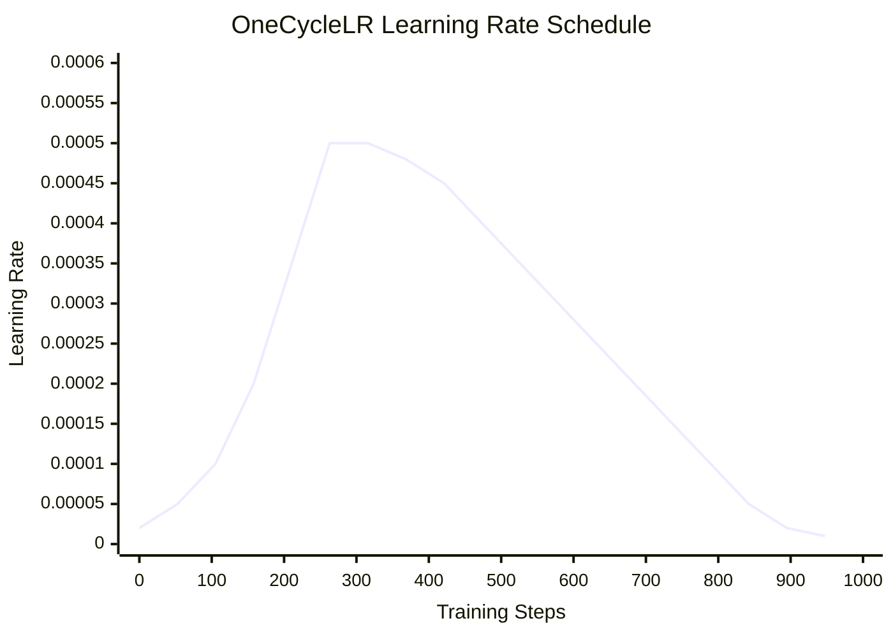
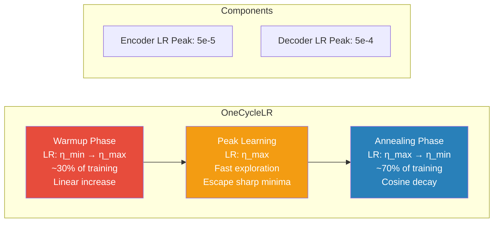

# 4. Gradient Descent and Optimizers

## 4.1 Gradient Descent Intuition: Walking Downhill on the Loss Landscape

Imagine you are standing on a hilly terrain in dense fog. You can't see the landscape, but you can feel the slope beneath your feet. Your goal is to reach the lowest point (minimum loss). What do you do? You take a step in the direction where the ground slopes downward most steeply. This is gradient descent.

The loss landscape is the surface defined by $\mathcal{L}(\theta)$ — the loss as a function of all model parameters. The **gradient** $\nabla_\theta \mathcal{L}$ points in the direction of steepest ascent. To go downhill, we step in the opposite direction:

$$\theta_{t+1} = \theta_t - \eta \nabla_\theta \mathcal{L}(\theta_t)$$

where $\eta$ (eta) is the **learning rate** — the size of each step.

In practice, we never compute the gradient over the entire dataset (that would be **full-batch gradient descent**). Instead, we use **mini-batch gradient descent**: compute the gradient on a small random subset (batch) of the data. This introduces noise (stochasticity) but is computationally feasible and often converges faster due to the noise helping escape local minima.

The loss landscape of a deep network like TAMER OCR is extremely high-dimensional (millions of parameters) and highly non-convex — it has many local minima, saddle points, and flat regions. The optimizer's job is to navigate this landscape efficiently.

## 4.2 Learning Rate: The Most Important Hyperparameter

The learning rate $\eta$ controls how large each update step is. Getting it right is crucial:

- **Too large**: The model overshoots minima, the loss oscillates wildly or diverges to infinity. You'll see loss = NaN or loss bouncing without decreasing.
- **Too small**: The model takes tiny steps and converges extremely slowly. It may also get stuck in poor local minima because it can't "jump" out.
- **Just right**: The loss decreases steadily and converges to a good minimum.

```python
# Visualizing the effect of learning rate
η_too_small = 1e-7   # Barely moves — takes forever
η_good      = 1e-4   # Steady progress downward
η_too_big   = 1.0    # Bounces wildly, may diverge
```

There is no universal "good" learning rate — it depends on the model architecture, batch size, optimizer, and even the dataset. This is why learning rate schedules (discussed below) are so important: they start with a reasonable LR and adjust it during training.

**In TAMER OCR**, the encoder uses `lr=5e-5` and the decoder uses `lr=5e-4` — a 10× difference. This is because the encoder (Swin Transformer v2) is pretrained and already has good features, so it needs only small updates. The decoder, initialized randomly, needs larger updates to learn from scratch.

## 4.3 SGD with Momentum

Stochastic Gradient Descent (SGD) is the simplest optimizer:

$$\theta_{t+1} = \theta_t - \eta \cdot g_t$$

where $g_t = \nabla_\theta \mathcal{L}(\theta_t)$ is the gradient at step $t$.

**SGD with momentum** adds a velocity term that accumulates past gradients:

$$v_t = \mu \cdot v_{t-1} + g_t$$
$$\theta_{t+1} = \theta_t - \eta \cdot v_t$$

where $\mu$ is the momentum coefficient (typically 0.9).

Momentum helps in two ways:
1. **Acceleration in consistent directions**: If the gradient points the same way for many steps, momentum builds up velocity, effectively increasing the step size
2. **Damping in oscillating directions**: If the gradient alternates sign (common in narrow valleys), the oscillations cancel out, preventing the optimizer from bouncing

Think of momentum like a ball rolling downhill — it gains speed on consistent slopes and dampens on rough terrain. This makes SGD with momentum much more effective than vanilla SGD, especially on ill-conditioned loss landscapes.

Despite its simplicity, SGD with momentum can match or exceed Adam on well-tuned problems, and it often generalizes better. However, it requires more careful learning rate tuning.

## 4.4 Adam: Adaptive Learning Rates Per Parameter

Adam (Adaptive Moment Estimation) maintains per-parameter learning rates by tracking two moments of the gradient:

**First moment** (mean of gradients — like velocity):
$$m_t = \beta_1 \cdot m_{t-1} + (1 - \beta_1) \cdot g_t$$

**Second moment** (uncentered variance of gradients):
$$v_t = \beta_2 \cdot v_{t-1} + (1 - \beta_2) \cdot g_t^2$$

**Bias correction** (important in early steps when $m_t$ and $v_t$ are biased toward zero):
$$\hat{m}_t = \frac{m_t}{1 - \beta_1^t}, \quad \hat{v}_t = \frac{v_t}{1 - \beta_2^t}$$

**Update**:
$$\theta_{t+1} = \theta_t - \eta \cdot \frac{\hat{m}_t}{\sqrt{\hat{v}_t} + \epsilon}$$

Default hyperparameters: $\beta_1 = 0.9$, $\beta_2 = 0.999$, $\epsilon = 10^{-8}$.

**What Adam does intuitively**: Parameters with large, consistent gradients get smaller effective learning rates (because $\sqrt{\hat{v}_t}$ is large, dividing the update). Parameters with small or rare gradients get larger effective learning rates. This adaptive behavior means Adam works reasonably well across many problems with less tuning than SGD.

In TAMER OCR, AdamW (discussed next) is used because it provides stable training without extensive LR tuning — important when training a complex encoder-decoder model on four different datasets.

## 4.5 AdamW: Why Weight Decay Matters

AdamW decouples weight decay from the gradient-based update. This is a subtle but important distinction from "Adam with L2 regularization."

### L2 Regularization in Adam (Wrong Way)
Adding L2 penalty to the loss: $\mathcal{L}_{reg} = \mathcal{L} + \frac{\lambda}{2} \|\theta\|^2$

The gradient becomes: $g_t^{reg} = g_t + \lambda \theta_t$

This gradient is then fed into Adam's adaptive mechanism. The problem is that Adam divides by $\sqrt{\hat{v}_t}$, which means the L2 penalty is also scaled by the adaptive learning rate. Parameters with large historical gradients get a smaller weight decay effect — the opposite of what we want.

### Decoupled Weight Decay in AdamW (Right Way)
$$\theta_{t+1} = \theta_t - \eta \cdot \frac{\hat{m}_t}{\sqrt{\hat{v}_t} + \epsilon} - \eta \cdot \lambda \cdot \theta_t$$

Weight decay is applied **directly** to the parameters, independent of the adaptive gradient. This ensures all parameters are regularized equally regardless of their gradient history.

**Why this matters**: Proper weight decay prevents the model from growing large weights, which is a form of regularization that improves generalization. In TAMER OCR, the weight decay coefficient (e.g., 0.01 or 0.05) helps prevent overfitting on the CROHME dataset (which is relatively small) and improves generalization across all four datasets.

The difference between Adam and AdamW may seem minor, but it leads to measurably better generalization, especially on large-scale tasks. This was demonstrated in the Loshchilov & Hutter (2019) paper and has since become standard practice — every modern Transformer model (BERT, GPT, ViT, Swin) uses AdamW.

## 4.6 Learning Rate Schedules: Why Fixed LR Is Suboptimal

A fixed learning rate is like driving at one speed regardless of road conditions. At the start of training, the model's parameters are far from a good solution — you want large steps to make rapid progress. Later, when the model is near a good solution, you want small steps to fine-tune without overshooting.

A learning rate schedule adjusts $\eta$ over the course of training. Common schedules include:

- **Step decay**: Reduce LR by a factor every $N$ epochs (e.g., halve every 10 epochs). Simple but crude.
- **Exponential decay**: $\eta_t = \eta_0 \cdot \gamma^t$. Smoother but still arbitrary.
- **Cosine annealing**: $\eta_t = \eta_{min} + \frac{1}{2}(\eta_{max} - \eta_{min})(1 + \cos(\pi t / T))$. Smooth, periodic, and empirically excellent.
- **Warmup + decay**: Start with a small LR, linearly increase to the target LR over a few epochs, then decay. Essential for Transformers.

**Why warmup is critical for Transformers**: At the start of training, the model's random initialization produces large, erratic gradients. A large learning rate on these erratic gradients can destabilize training. Warmup gives the model time to settle into a reasonable region of parameter space before taking large steps. Without warmup, Transformer training often diverges in the first few hundred steps.

## 4.7 OneCycleLR: Warmup Plus Cosine Annealing

OneCycleLR (Smith & Topin, 2019) is the schedule used in TAMER OCR. It implements the "1cycle" policy:

1. **Warmup phase**: LR linearly increases from $\eta_{min}$ to $\eta_{max}$ over the first ~30% of training
2. **Annealing phase**: LR cosine-anneals from $\eta_{max}$ back down to $\eta_{min}$ over the remaining ~70% of training
3. **Optional tail**: A brief final phase at very low LR for fine convergence

```python
from torch.optim.lr_scheduler import OneCycleLR

scheduler = OneCycleLR(
    optimizer,
    max_lr=5e-4,           # Peak learning rate
    total_steps=num_training_steps,
    pct_start=0.3,         # 30% warmup
    anneal_strategy='cos', # Cosine annealing
    div_factor=25,         # Initial LR = max_lr / 25
    final_div_factor=1000  # Final LR = max_lr / 25000
)
```

**Why OneCycleLR works well:**
- The warmup phase prevents early divergence
- The high LR in the middle of training allows the model to explore the loss landscape and escape sharp minima (leading to better generalization)
- The gradual decrease at the end allows fine convergence
- The "super-convergence" effect: OneCycleLR often achieves the same accuracy in fewer epochs than a fixed LR

**In TAMER OCR**, the encoder and decoder have different `max_lr` values (5e-5 and 5e-4 respectively), and each has its own OneCycleLR schedule. The encoder's smaller max_lr reflects its pretrained status — large updates would destroy the useful features already learned.

## 4.8 Differential Learning Rates: Encoder vs Decoder

TAMER OCR uses **different learning rates for different parts of the model**:

| Component | Learning Rate | Rationale |
|-----------|--------------|-----------|
| Swin Encoder | 5e-5 | Pretrained on ImageNet — already has good features |
| Transformer Decoder | 5e-4 | Randomly initialized — needs to learn from scratch |

This 10× difference is crucial. If we used the same high LR for both:
- The encoder's pretrained features would be destroyed (catastrophic forgetting)
- The model would lose the visual representations that make the encoder useful

If we used the same low LR for both:
- The decoder would learn too slowly
- Training would take many more epochs to converge

**Implementing differential LRs in PyTorch:**

```python
param_groups = [
    {'params': encoder.parameters(), 'lr': 5e-5},
    {'params': decoder.parameters(), 'lr': 5e-4},
]
optimizer = AdamW(param_groups, weight_decay=0.01)
```

This pattern — lower LR for pretrained components, higher LR for new/random components — is extremely common in transfer learning and fine-tuning. It appears in fine-tuning BERT, in LoRA training, and in almost any setting where a pretrained model is adapted to a new task.

**Advanced variant**: Some practitioners gradually unfreeze the encoder during training (discriminative fine-tuning), starting with only the decoder, then gradually allowing earlier encoder layers to update. This is a form of curriculum learning at the parameter level.

## 4.9 Gradient Clipping: max_grad_norm=1.0

Gradient clipping prevents training explosions by capping the gradient norm:

```python
torch.nn.utils.clip_grad_norm_(model.parameters(), max_norm=1.0)
```

This rescales all gradients so that their combined L2 norm does not exceed `max_norm`. If $\|g\|_2 > 1.0$, the gradients are multiplied by $\frac{1.0}{\|g\|_2}$.

**Why gradient clipping is essential:**
- Even with Adam and careful LR scheduling, occasional outlier gradients can occur (especially early in training or on unusual data samples)
- A single gradient explosion can push the model into a region of parameter space from which it cannot recover (loss goes to NaN or infinity)
- Clipping is a safety net — it rarely activates, but when it does, it prevents catastrophic training failures

**When does clipping typically activate?**
- Very early in training, when the model is random and outputs are erratic
- When the batch contains an unusual or difficult sample
- When using mixed precision, where the reduced precision can amplify gradient spikes

In TAMER OCR, `max_grad_norm=1.0` is applied after `loss.backward()` and before `optimizer.step()`. The value 1.0 is a common default that works well across many architectures — it's large enough to not impede normal training but small enough to prevent explosions.

## 4.10 The Relationship Between Batch Size and Learning Rate

The **linear scaling rule** states that when you multiply the batch size by $k$, you should also multiply the learning rate by $k$ (for SGD):

$$\eta_{new} = \eta_{base} \times \frac{\text{batch\_size}_{new}}{\text{batch\_size}_{base}}$$

**Intuition**: A larger batch provides a more accurate gradient estimate (less noise). With a more accurate gradient, you can safely take larger steps. The gradient of a batch of size $B$ is approximately $B$ times the gradient of a single sample (because it's averaged, not summed — but the reduced noise means the effective step can be larger).

**Caveats for Adam**: The linear scaling rule is derived for SGD. For Adam, the relationship is less clean because Adam's adaptive learning rates already compensate for gradient scale. In practice, a square root scaling ($\eta \propto \sqrt{B}$) often works better for Adam.

**In TAMER OCR context**: If you increase the effective batch size (e.g., by using gradient accumulation or multiple GPUs), you may need to adjust the learning rate upward. Conversely, if you reduce the batch size (due to GPU memory constraints), you may need a smaller learning rate.

**Warning**: Very large batch sizes (e.g., 512+) can hurt generalization even with adjusted LRs. The noise in small-batch training acts as implicit regularization. With very large batches, the gradient is so accurate that the model converges to sharp minima that generalize poorly. This is another manifestation of the bias-variance tradeoff.

## 4.11 OneCycleLR Schedule — Mermaid Diagram





The first diagram shows the characteristic shape of the OneCycleLR schedule: a linear ramp up during warmup, followed by a smooth cosine decay. The second diagram annotates the three phases and shows the differential LRs used for the encoder and decoder.

**Key Takeaways for TAMER OCR:**
- AdamW with weight decay provides stable, well-regularized optimization
- Differential learning rates (5e-5 encoder, 5e-4 decoder) preserve pretrained features while allowing the decoder to learn fast
- OneCycleLR with warmup prevents early training divergence
- Gradient clipping (`max_grad_norm=1.0`) is the safety net against occasional gradient explosions
- Batch size and learning rate are coupled — adjust both together
