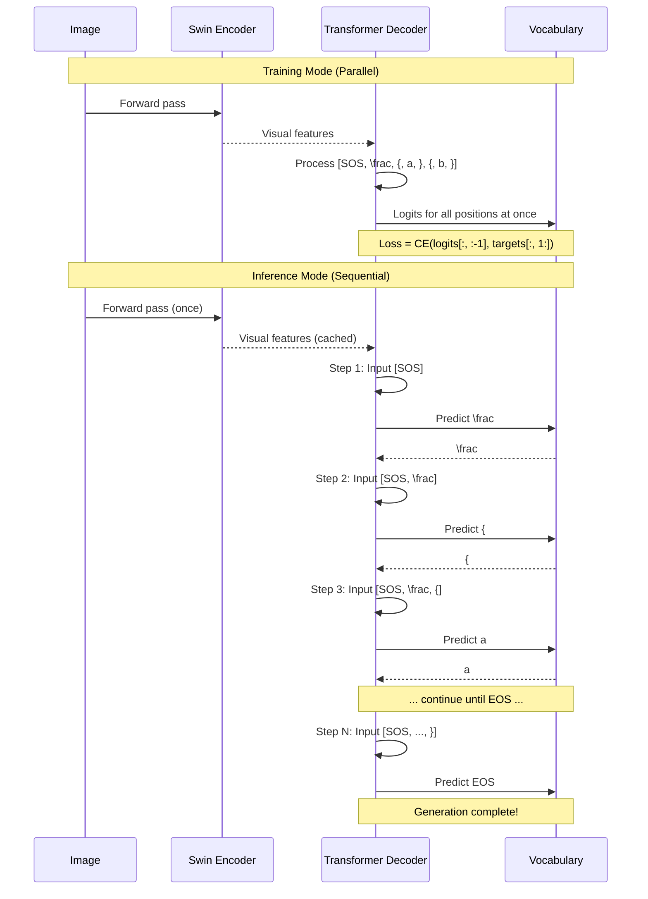
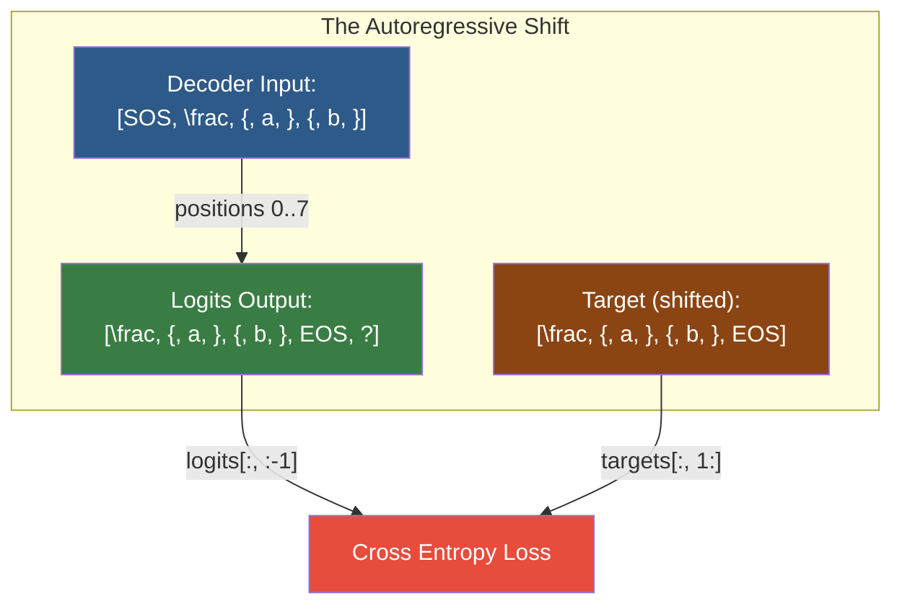

# 5. Sequence Modeling and Autoregressive Generation

## 5.1 What Is a Sequence: Ordered Data Where Position Matters

A sequence is an ordered collection of elements where the **position of each element carries meaning**. Unlike a set (where order doesn't matter) or an image (where spatial structure is 2D), a sequence has a single, strict ordering.

In the context of TAMER OCR, the output LaTeX string is a sequence:

$$\text{LaTeX: } \texttt{\textbackslash frac\{a\}\{b\}} \rightarrow [\texttt{\textbackslash frac}, \texttt{\{}, \texttt{a}, \texttt{\}}, \texttt{\{}, \texttt{b}, \texttt{\}}]$$

The tokens appear in a specific order, and changing the order changes the meaning entirely. $\texttt{\textbackslash frac\{a\}\{b\}} \neq \texttt{\textbackslash frac\{b\}\{a\}}$. This is fundamentally different from, say, image classification where the output is a single label without internal structure.

Sequences have unique challenges compared to other data types:

1. **Variable length**: Different formulas produce LaTeX of different lengths. A simple "x" might be 1 token, while a complex integral could be 50+ tokens.
2. **Long-range dependencies**: The `\frac{` at position 3 might determine what's expected at position 47 (the matching `}`).
3. **Autoregressive dependence**: Each token depends on all previous tokens. You cannot generate the 5th token correctly without knowing tokens 1–4.

## 5.2 Autoregressive Models: Predicting the Next Token

An autoregressive model factorizes the joint probability of a sequence into a product of conditional probabilities:

$$P(y_1, y_2, \ldots, y_T) = P(y_1) \cdot P(y_2 | y_1) \cdot P(y_3 | y_1, y_2) \cdots P(y_T | y_1, \ldots, y_{T-1})$$

$$= \prod_{t=1}^{T} P(y_t | y_{<t})$$

At each step, the model predicts the **next token** given all previously generated tokens. This is the "chain rule of probability" applied to sequence modeling.

**Why autoregressive?** This factorization is universal — it makes no assumptions about the data beyond the ordering. Any sequence distribution can be expressed this way. The model doesn't need to figure out which tokens depend on which; it just conditions on everything that came before.

In TAMER OCR, the autoregressive model is:

$$P(\text{LaTeX} | \text{image}) = \prod_{t=1}^{T} P(y_t | y_{<t}, \text{image})$$

Each token prediction conditions on both the previously generated LaTeX tokens (through decoder self-attention) and the image features (through cross-attention to the Swin encoder output).

## 5.3 Teacher Forcing: Using Ground Truth During Training

During training, we don't actually generate tokens one at a time — that would be far too slow. Instead, we use **teacher forcing**: we feed the model the **ground truth** previous tokens and ask it to predict the next token at every position simultaneously.

```python
# Teacher forcing during training
# Input:  [SOS, \frac, {, a, }, {, b]
# Target: [\frac, {, a, }, {, b, EOS]
# At each position, the model sees all tokens to the left (ground truth)
# and predicts the token at that position
```

The name "teacher forcing" comes from the idea that a teacher is forcing the correct answer into the model's input at each step. The model never sees its own predictions during training — it always sees the correct previous tokens.

**Advantages of teacher forcing:**
- **Parallelism**: All positions are predicted in a single forward pass, making training efficient
- **Stability**: The model always receives correct inputs, preventing error accumulation
- **Better gradients**: Since the model always conditions on correct context, the gradients are cleaner

**Disadvantages of teacher forcing:**
- **Exposure bias**: During inference, the model must condition on its own predictions, which may be wrong. Mistakes compound — one wrong token can derail the entire sequence. The model has never experienced this during training.

This exposure bias is mitigated in practice by:
- Scheduled sampling: gradually replacing some teacher-forced tokens with model predictions
- Beam search: exploring multiple hypotheses simultaneously
- Training with token-level accuracy metrics to ensure most predictions are correct

## 5.4 The Autoregressive Shift: Logits at Position t Predict Token at Position t+1

This is the crucial mechanical detail that confuses many beginners. Let's break it down carefully.

The decoder processes an input sequence and produces logits (unnormalized scores) at each position. Due to the causal mask in self-attention, position $t$ can only attend to positions $\leq t$. Therefore:

- **Logits at position 0** (computed from SOS token) → predict token at position 1
- **Logits at position 1** (computed from SOS + first token) → predict token at position 2
- **Logits at position $t$** → predict token at position $t+1$
- **Logits at position $T-1$** → predict token at position $T$ (which is EOS)

The input is shifted right by one position relative to the output. This is the "autoregressive shift."

### Concrete Example

For the LaTeX `\frac{a}{b}`, after tokenization:

| Index | Input to Decoder | Logits Predict |
|-------|-----------------|----------------|
| 0 | SOS | `\frac` |
| 1 | `\frac` | `{` |
| 2 | `{` | `a` |
| 3 | `a` | `}` |
| 4 | `}` | `{` |
| 5 | `{` | `b` |
| 6 | `b` | `}` |
| 7 | `}` | EOS |

The input column is what the model sees (via teacher forcing). The logits column is what the model predicts. Notice that the predicted token at each row is always the **next** token after the input.

## 5.5 Why We Shift Logits vs Targets in the Loss

In code, the autoregressive shift manifests as:

```python
logits = decoder(input_ids)  # shape: (B, T, vocab_size)
loss = criterion(logits[:, :-1, :], targets[:, 1:])
```

**Why `logits[:, :-1, :]`?** We discard the logits at the last position. These logits would predict the token *after* EOS, which doesn't exist. We don't need them.

**Why `targets[:, 1:]`?** We discard the first element of the targets (which is SOS — no model should predict SOS as the next token). Each remaining target $y_{t+1}$ is the correct answer for the logits at position $t$.

Let's verify with our example:

| Position | logits[:  , :-1] position | targets[:  , 1:] position | Prediction → Target |
|----------|--------------------------|--------------------------|---------------------|
| 0 | Logits from SOS | `\frac` | SOS → `\frac` ✓ |
| 1 | Logits from `\frac` | `{` | `\frac` → `{` ✓ |
| 2 | Logits from `{` | `a` | `{` → `a` ✓ |
| ... | ... | ... | ... |
| 6 | Logits from `b` | `}` | `b` → `}` ✓ |
| 7 | Logits from `}` | EOS | `}` → EOS ✓ |

The shift ensures that each logit position is paired with the correct target — the token that should come next.

**Common bug**: Forgetting the shift and computing `criterion(logits, targets)` directly. This aligns each position's logits with the current token instead of the next token, and the model learns to copy the input instead of predicting the next token.

## 5.6 SOS and EOS Tokens

### SOS (Start of Sequence)
- A special token that tells the decoder: "Begin generating."
- Always the first input to the decoder, even before any real token exists
- Gives the model a consistent starting point
- In TAMER OCR, the SOS token is typically index 0 or the first special token in the vocabulary

### EOS (End of Sequence)
- A special token that signals: "Generation is complete."
- The model predicts EOS when it believes the formula is finished
- During inference, we stop generating when EOS is predicted (or when max length is reached)
- The EOS token is the target for the last real token in the sequence

Without these tokens, the model would have no way to know when to start or stop generating. The SOS token provides a "Go" signal, and the EOS token provides a "Stop" signal.

**During training**, EOS is included in the target sequence. The model learns to predict EOS after the last LaTeX token. During inference, we monitor for EOS to know when to stop.

## 5.7 Padding Tokens and Why We Ignore Them in Loss

Different formulas have different lengths, but PyTorch requires all sequences in a batch to have the same length. We solve this with **padding**:

```
Sequence 1: [SOS, \frac, {, a, }, {, b, }, EOS]
Sequence 2: [SOS, x, EOS, PAD, PAD, PAD, PAD, PAD]
Sequence 3: [SOS, \int, _, 0, ^, \infty, x, dx, EOS]  → needs padding to match max length
```

The `PAD` token is a special token that carries no meaning. We must ensure the loss function ignores it:

```python
criterion = nn.CrossEntropyLoss(ignore_index=PAD_IDX)
```

**Why ignore padding in the loss?** If we included padding positions in the loss, the model would waste capacity learning to predict PAD tokens after EOS. This is useless (we never need to predict PAD during inference) and would distort the gradient signal. The `ignore_index` parameter tells the loss function to skip these positions entirely — they contribute zero to the loss and zero to the gradients.

**Practical consideration**: The amount of padding depends on the length of the longest sequence in the batch. If one formula is 100 tokens long and the rest are 10 tokens, 90% of the batch is padding. This wastes computation. To mitigate this, TAMER OCR uses **bucketing** — sorting training examples by length and batching similar-length examples together. This minimizes padding and maximizes training efficiency.

## 5.8 Sequence Length Constraints and Why Long Sequences Are Expensive

The computational cost of a Transformer scales as $O(T^2 \cdot d)$ for the self-attention mechanism (where $T$ is the sequence length and $d$ is the model dimension). This is because every token attends to every other token, requiring a $T \times T$ attention matrix.

For TAMER OCR, this quadratic cost appears in two places:
1. **Decoder self-attention**: $T_{\text{LaTeX}}^2$ — quadratic in the LaTeX sequence length
2. **Cross-attention**: $T_{\text{LaTeX}} \times T_{\text{image}}$ — linear in LaTeX length but multiplied by the number of image features

A formula with 200 LaTeX tokens requires computing a 200×200 attention matrix at every decoder layer. With 6 layers and 8 heads, that's 48 separate 200×200 matrices. This is manageable. But for very long formulas (matrices with many entries, multi-line equations), the sequence can exceed 500 tokens, and the cost grows quadratically.

**Memory implications**: The attention matrices must be stored for backpropagation. A 512-token sequence with batch size 8 requires storing $8 \times 6 \times 8 \times 512 \times 512 \times 4$ bytes = ~384 MB just for the decoder attention matrices. This is why sequence length limits are often enforced (e.g., `max_len = 512`).

**In TAMER OCR**, the maximum sequence length is set based on the dataset statistics — typically 256 or 512 tokens. Sequences longer than this are truncated (a very rare occurrence for most math datasets).

## 5.9 From Training (Parallel) to Inference (Sequential): The Fundamental Asymmetry

This is one of the most important practical differences in autoregressive models:

### Training: Fully Parallel
With teacher forcing, the entire sequence is processed in **one forward pass**. All positions are computed simultaneously because the input is known (ground truth). This is fast — a batch of 32 sequences, each 200 tokens long, takes one forward pass.

### Inference: Strictly Sequential
During inference, we don't know the output. We must generate **one token at a time**:
1. Feed SOS → get first token prediction
2. Feed SOS + first token → get second token prediction
3. Feed SOS + first + second token → get third token prediction
4. ...repeat until EOS or max length

Each step requires a full forward pass through the decoder (and cross-attention to the encoder). For a 200-token sequence, this means 200 forward passes. Inference is therefore roughly 200× slower than training for a single sequence.

**Beam search** multiplies this further. With beam width $k$, we maintain $k$ hypotheses at each step, requiring $k$ forward passes per token. Beam width 5 on a 200-token sequence means 1000 forward passes.

**Mitigations:**
- **KV caching**: Store the key-value pairs from previous steps so they don't need to be recomputed. This avoids the quadratic cost of reprocessing the entire prefix at each step.
- **Parallel beam search**: Process all $k$ beams in a single batched forward pass.
- **Speculative decoding**: Use a smaller, faster model to propose multiple tokens, then verify them with the full model.

In TAMER OCR, beam search with width 3–5 is used during inference for better accuracy, with KV caching to maintain acceptable speed.

## 5.10 Autoregressive Generation — Mermaid Diagram





The first diagram shows the sequential nature of inference contrasted with the parallel nature of training. The second diagram illustrates the critical autoregressive shift — how logits and targets are aligned for loss computation.

**Key Takeaways for TAMER OCR:**
- Autoregressive generation is the fundamental paradigm for LaTeX prediction
- Teacher forcing enables efficient parallel training but creates exposure bias
- The `logits[:, :-1]` vs `targets[:, 1:]` shift is the most common source of bugs
- SOS and EOS tokens frame the generation process
- Padding tokens must be ignored in the loss
- Inference is fundamentally slower than training due to sequential token generation
- Beam search improves quality at the cost of further slowing inference
