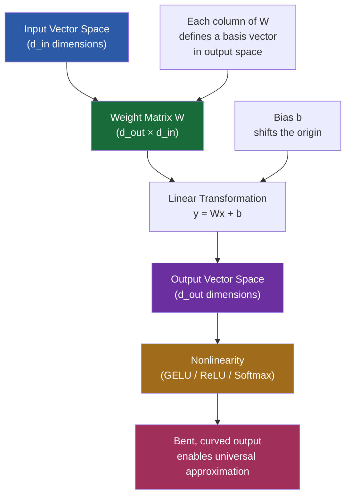

# 6. Linear Algebra for Deep Learning

Linear algebra is the mathematical language of neural networks. Every operation inside a deep learning model — from the first convolution to the final softmax — is a linear algebra operation. If you understand the geometry of vectors, matrices, and transformations, you can reason about what a neural network is actually doing, rather than treating it as a black box. This note covers the core concepts and connects them directly to the TAMER OCR model.

## Vectors and Vector Spaces

A **vector** is an ordered list of numbers. In deep learning, we work almost exclusively with high-dimensional vectors. When TAMER processes an image patch, it represents that patch as a 768-dimensional vector — a point in a 768-dimensional space. This is not merely a bookkeeping convenience; it is a geometric object. Each dimension captures some feature of the input, and the vector as a whole occupies a position in a high-dimensional space.

A **vector space** is the set of all possible vectors of a given dimension, together with the rules for adding them and scaling them. Neural networks operate in vector spaces because they need to represent rich, complex information. A 2-dimensional vector can only encode two features, but a 768-dimensional vector can encode 768 features simultaneously — enough to capture the subtle visual patterns in mathematical notation.

The key insight is that **the network learns to place similar inputs close together in this high-dimensional space**. After training, two images of integral signs will have vectors that are near each other, while an integral sign and a summation symbol will be farther apart. The entire learned representation is a geometric structure in a high-dimensional vector space.

## Matrix Multiplication: The Core Operation

Every linear layer in a neural network performs the same fundamental operation:

$$y = Wx + b$$

Here, $x$ is the input vector, $W$ is the weight matrix, $b$ is the bias vector, and $y$ is the output vector. This operation is **matrix-vector multiplication** followed by a translation (the bias).

When you write `nn.Linear(768, 768)` in PyTorch, you are creating a weight matrix $W$ of shape $(768, 768)$ — that is 589,824 learnable parameters. The bias adds another 768 parameters. Every feed-forward layer, every attention projection, every classification head is built on this operation.

Matrix multiplication is not just a computational trick. Geometrically, multiplying by $W$ performs a **linear transformation** on the input space: it can rotate, scale, shear, and project the input vector into a new coordinate system. The network stacks many such transformations, interleaved with nonlinearities, to learn increasingly complex mappings.

## Dot Product and Similarity

The **dot product** of two vectors $a$ and $b$ is defined as:

$$a \cdot b = \sum_{i=1}^{d} a_i b_i = \|a\| \|b\| \cos\theta$$

The geometric interpretation is crucial: the dot product measures how much two vectors point in the same direction, scaled by their magnitudes. When both vectors are unit-length (as they often are after normalization), the dot product equals $\cos\theta$, ranging from $-1$ (opposite directions) to $+1$ (same direction).

This is the basis of **attention**. In the Transformer, the attention score between a query and a key is computed as their dot product: $QK^T$. A high dot product means the query and key are "similar" — they point in similar directions in the representation space — and thus the model should pay more attention to that position. The entire attention mechanism is built on the geometric intuition that similarity can be measured by alignment in vector space.

## Dimensionality and d_model

When we say **d_model = 768**, we mean that every token in the model is represented as a 768-dimensional vector. This is the "width" of the model. The choice of dimensionality is a design decision that trades off representational power against computational cost:

- **Too small** (e.g., d_model = 64): the model cannot represent complex patterns. There are not enough degrees of freedom to capture the nuances of mathematical notation.
- **Too large** (e.g., d_model = 4096): the model becomes computationally expensive. Every weight matrix scales as $O(d_{\text{model}}^2)$, so 4096 would mean 16.7M parameters per linear layer.
- **768** is a sweet spot used by BERT-base and many vision-language models. It provides enough capacity to learn rich representations while remaining trainable on consumer hardware.

## Rank, Basis, and Projection

The **rank** of a matrix is the number of linearly independent rows (or columns). It tells you the effective dimensionality of the transformation. A rank-1 matrix collapses all inputs onto a single line; a full-rank matrix preserves all dimensions.

A **basis** is a minimal set of vectors that can express every vector in the space through linear combinations. In 768 dimensions, you need 768 basis vectors. The weight matrices in a neural network learn to express useful bases — the columns of $W$ form a new basis in which the input is re-expressed.

**Projection** means mapping a vector from a higher-dimensional space to a lower-dimensional one. In the feed-forward network of a Transformer, the input is projected from 768 dimensions to 3072 (expansion), then back to 768. The expansion creates a richer, overcomplete representation where computations are easier, and the projection back compresses the result.

## Eigenvalues and PCA

**Eigenvalues** and **eigenvectors** describe the principal directions and scaling factors of a linear transformation. If $Av = \lambda v$, then $v$ is a direction that is only scaled (not rotated) by $A$, and $\lambda$ is the scaling factor.

**Principal Component Analysis (PCA)** uses eigendecomposition of the covariance matrix to find the directions of maximum variance in the data. This is relevant to deep learning because:

1. Neural networks implicitly learn something like PCA in their early layers — they discover the most informative directions in the data.
2. Dimensionality reduction via PCA or similar techniques can be used to compress model representations for analysis or efficiency.
3. Understanding that most of the variance in high-dimensional data often lies in a lower-dimensional subspace motivates techniques like bottleneck layers and low-rank approximations.

## Broadcasting Rules

PyTorch follows **broadcasting rules** inspired by NumPy. When two tensors of different shapes are combined element-wise, PyTorch automatically "broadcasts" the smaller tensor to match the larger one:

- If tensors have different numbers of dimensions, prepend dimensions of size 1 to the smaller tensor.
- Dimensions of size 1 are expanded to match the corresponding dimension of the other tensor.
- Dimensions must either match or one of them must be 1.

For example, adding a bias vector of shape `(768,)` to a batch of activations of shape `(32, 128, 768)` works because the bias is broadcast across the batch and sequence dimensions. Understanding broadcasting is essential for writing efficient, bug-free PyTorch code, especially in attention mechanisms where shapes like `(B, H, L, L)` interact with `(B, H, 1, L)`.

## Linear Algebra and Neural Networks: The Deep Connection

Every layer in a neural network is a **linear transformation followed by a nonlinearity**. The linear part ($Wx + b$) can rotate, scale, and project the input. The nonlinearity (ReLU, GELU, softmax) introduces the bending and curving that allows the network to approximate any function. Without the nonlinearity, stacking multiple linear layers would be equivalent to a single linear layer (since the composition of linear transformations is linear). The nonlinearity is what gives depth its power.

In TAMER specifically:
- The **patch embedding** is a linear projection from patch pixels to d_model dimensions.
- The **self-attention** projections (W_Q, W_K, W_V) are linear transformations.
- The **feed-forward network** is two linear transformations with a GELU nonlinearity.
- The **output projection** is a linear transformation from d_model to vocabulary size.

## Why Matrix Operations Are Parallelizable on GPUs

GPUs are designed for **SIMD** (Single Instruction, Multiple Data) computation. A GPU core can perform the same operation on many data elements simultaneously. Matrix multiplication is embarrassingly parallel: each element of the output matrix depends on a dot product of a row and a column, and all these dot products are independent.

Modern GPUs achieve this through:
- **Tensor Cores**: dedicated hardware that performs 4×4 matrix multiplications in a single clock cycle.
- **Memory coalescing**: when threads access consecutive memory addresses, the GPU can load data efficiently.
- **Tiling**: large matrices are broken into tiles that fit in fast shared memory, reducing global memory access.

This is why GPUs can train models with billions of parameters — the core operation, matrix multiplication, maps perfectly to GPU hardware.

## Mermaid Diagram: How a Linear Layer Transforms Vector Space

The diagram above shows the full pipeline: the weight matrix defines a linear transformation from input space to output space, the bias shifts the origin, and the nonlinearity bends the output to enable the network to approximate arbitrary functions. In TAMER, this pattern repeats at every layer — projection, transformation, nonlinearity — building up increasingly abstract and useful representations of the input image and its LaTeX transcription.
