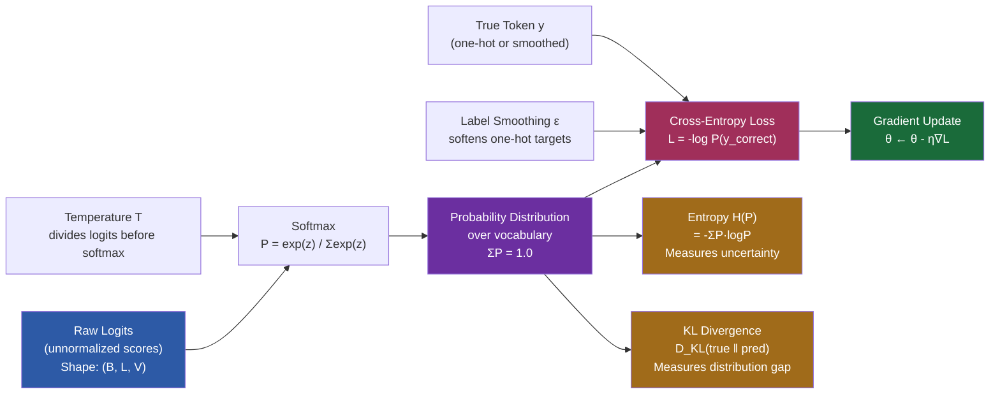

# 7. Probability and Information Theory for ML

Probability theory and information theory provide the theoretical foundations for how machine learning models learn and make predictions. Every neural network that classifies or generates is fundamentally a probabilistic model — it outputs probabilities, it is trained using probabilistic objectives, and its performance is evaluated using information-theoretic measures. This note connects these concepts directly to the TAMER OCR pipeline, showing why the model outputs what it does and how training shapes those outputs.

## Probability Distributions Over the Vocabulary

When TAMER predicts the next LaTeX token, it does not output a single token directly. Instead, it outputs a **probability distribution** over the entire vocabulary. If the vocabulary has 5,000 tokens, the model outputs 5,000 numbers, each representing the probability that the corresponding token is the correct next one. The sum of all these probabilities is exactly 1.0.

This is a **categorical distribution** — the discrete analog of a continuous distribution. Each token position in the output sequence is a sample from this distribution during inference, and during training, we optimize the model so that the correct token receives the highest probability.

The raw outputs of the model before conversion to probabilities are called **logits**. Logits can be any real number (positive, negative, large, small). The conversion from logits to probabilities is handled by the softmax function.

## Softmax: Converting Logits to Probabilities

The **softmax function** converts a vector of real numbers into a probability distribution:

$$\text{softmax}(z_i) = \frac{e^{z_i}}{\sum_{j=1}^{K} e^{z_j}}$$

The exponential ensures all values are positive, and the denominator ensures they sum to 1. Softmax has several important properties:

- **Monotonicity**: if $z_i > z_j$, then $\text{softmax}(z_i) > \text{softmax}(z_j)$. The ordering of logits is preserved.
- **Sensitivity to differences**: the exponential amplifies differences. A logit that is 2 units larger than another will receive about $e^2 \approx 7.4$ times more probability.
- **Temperature parameter**: by dividing logits by a temperature $T$ before softmax, we control the sharpness of the distribution:

$$\text{softmax}(z_i / T) = \frac{e^{z_i / T}}{\sum_j e^{z_j / T}}$$

  - **Low temperature** ($T < 1$): the distribution becomes sharper, concentrating probability on the highest logit. At $T \to 0$, softmax approaches a one-hot (greedy) distribution.
  - **High temperature** ($T > 1$): the distribution becomes flatter, spreading probability more evenly. At $T \to \infty$, softmax approaches a uniform distribution.

In TAMER, temperature is used during **beam search** or **sampling-based decoding** to control the diversity of generated LaTeX. A lower temperature produces more conservative, deterministic outputs; a higher temperature encourages exploration of less likely tokens.

## Cross-Entropy: Measuring Surprise

**Cross-entropy** is the loss function used to train nearly all classification and sequence models. For a true distribution $p$ and a predicted distribution $q$, cross-entropy is:

$$H(p, q) = -\sum_{i=1}^{K} p_i \log q_i$$

In practice, $p$ is a one-hot vector (the correct token gets probability 1.0, all others get 0.0), so the formula simplifies to:

$$H(p, q) = -\log q_{\text{correct}}$$

This is simply the negative log-probability assigned to the correct token. If the model assigns probability 1.0 to the correct token, the loss is 0. If it assigns probability 0.01, the loss is $-\log(0.01) \approx 4.6$. The loss increases rapidly as the model becomes more wrong — assigning low probability to the correct answer is heavily penalized.

Cross-entropy can be interpreted as a measure of **surprise**: how surprised was the model by the correct answer? If the model expected it (high probability), there is little surprise. If the model did not expect it (low probability), there is great surprise. Training minimizes surprise on the training data.

## Entropy: Measuring Uncertainty

**Entropy** is the expected surprise under a distribution:

$$H(p) = -\sum_{i=1}^{K} p_i \log p_i$$

Entropy measures the **uncertainty** inherent in a distribution. A uniform distribution over 5,000 tokens has maximum entropy ($\log 5000 \approx 8.5$ nats) — we have no idea which token comes next. A peaked distribution where one token has probability 0.99 has very low entropy — we are almost certain which token comes next.

During training, we can monitor the entropy of the model's predictions:
- **High entropy** early in training: the model is uncertain, assigning roughly equal probability to many tokens.
- **Low entropy** late in training: the model is confident, concentrating probability on few tokens.
- **Very low entropy** can indicate overfitting: the model is overconfident and may generalize poorly.

## KL Divergence: Measuring Distribution Difference

The **Kullback-Leibler (KL) divergence** measures how different one distribution is from another:

$$D_{\text{KL}}(p \| q) = \sum_{i=1}^{K} p_i \log \frac{p_i}{q_i}$$

KL divergence is always non-negative and equals zero only when $p = q$. It is not symmetric: $D_{\text{KL}}(p \| q) \neq D_{\text{KL}}(q \| p)$ in general.

The relationship between cross-entropy, entropy, and KL divergence is fundamental:

$$H(p, q) = H(p) + D_{\text{KL}}(p \| q)$$

Since $H(p)$ is constant for the training data, minimizing cross-entropy is equivalent to minimizing KL divergence between the true distribution and the model's predicted distribution. Training literally pushes the model's distribution closer to the data distribution.

## Maximum Likelihood Estimation

**Maximum likelihood estimation (MLE)** is the principle of choosing model parameters that maximize the probability of the observed data. For a dataset $\{(x_i, y_i)\}$:

$$\theta^* = \arg\max_\theta \prod_i P(y_i | x_i; \theta)$$

Taking the log (which preserves the argmax since log is monotonic):

$$\theta^* = \arg\max_\theta \sum_i \log P(y_i | x_i; \theta)$$

This is equivalent to minimizing the negative log-likelihood, which is exactly the cross-entropy loss. **Cross-entropy training is maximum likelihood estimation.** This provides the theoretical justification for why we use cross-entropy: it is the loss function that arises naturally from the principle of finding the most likely parameters given the data.

## Conditional Probability: The Model's Computation

The TAMER model computes a **conditional probability** at each decoding step:

$$P(\text{next\_token} \mid \text{image}, \text{previous\_tokens})$$

This is the probability of the next LaTeX token given the input image and all previously generated tokens. The chain rule of probability lets us decompose the joint probability of an entire sequence:

$$P(y_1, y_2, \ldots, y_T \mid x) = \prod_{t=1}^{T} P(y_t \mid x, y_1, \ldots, y_{t-1})$$

This factorization is exactly what autoregressive decoding exploits. The model generates one token at a time, each conditioned on all previous context. The product of all these conditional probabilities gives the probability of the entire output sequence, which is the quantity we maximize during training.

## Bayesian Thinking: Priors and Evidence

**Bayes' theorem** provides a framework for updating beliefs:

$$P(\theta \mid D) = \frac{P(D \mid \theta) P(\theta)}{P(D)}$$

In deep learning:
- **$P(\theta)$** is the **prior**: our belief about the parameters before seeing data. Pretrained weights (e.g., Swin-v2 pretrained on ImageNet-22k) serve as an informative prior — they encode knowledge from millions of images.
- **$P(D \mid \theta)$** is the **likelihood**: how well the parameters explain the training data. This is what we maximize during fine-tuning.
- **$P(\theta \mid D)$** is the **posterior**: our updated belief after seeing data. Fine-tuning moves the parameters from the prior toward a configuration that better explains the OCR data.

The Bayesian perspective explains why **pretraining + fine-tuning** is so effective: the pretrained weights provide a strong prior that restricts the search space to reasonable configurations, and the fine-tuning data provides the evidence that adjusts this prior for the specific task.

## Label Smoothing as a Bayesian Idea

**Label smoothing** replaces hard one-hot targets with a mixture:

$$y_i^{\text{smooth}} = (1 - \epsilon) \cdot y_i^{\text{one-hot}} + \frac{\epsilon}{K}$$

where $\epsilon$ is typically 0.1 and $K$ is the vocabulary size. This is deeply Bayesian: it encodes the prior belief that **the labels are not 100% certain**. There is always some chance that the label is wrong, or that alternative tokens are also acceptable (e.g., `\frac` vs `\dfrac` in LaTeX).

Without label smoothing, the model is pushed to assign probability 1.0 to the target token, which is impossible under softmax (the maximum achievable probability is 1.0, but only in the limit of infinite logits). Label smoothing gives the model a realistic target and prevents it from becoming overconfident.

## Mermaid Diagram: Probability Flow in the Model

The diagram illustrates the complete probability flow in TAMER: raw logits are converted to probabilities via softmax (optionally temperature-scaled), the probabilities are compared against the target (optionally label-smoothed) via cross-entropy, and the resulting loss drives gradient updates. Entropy and KL divergence provide diagnostic views into the model's confidence and distributional accuracy. Understanding this flow is essential for debugging training issues, interpreting model behavior, and making informed decisions about hyperparameters like temperature and label smoothing.
