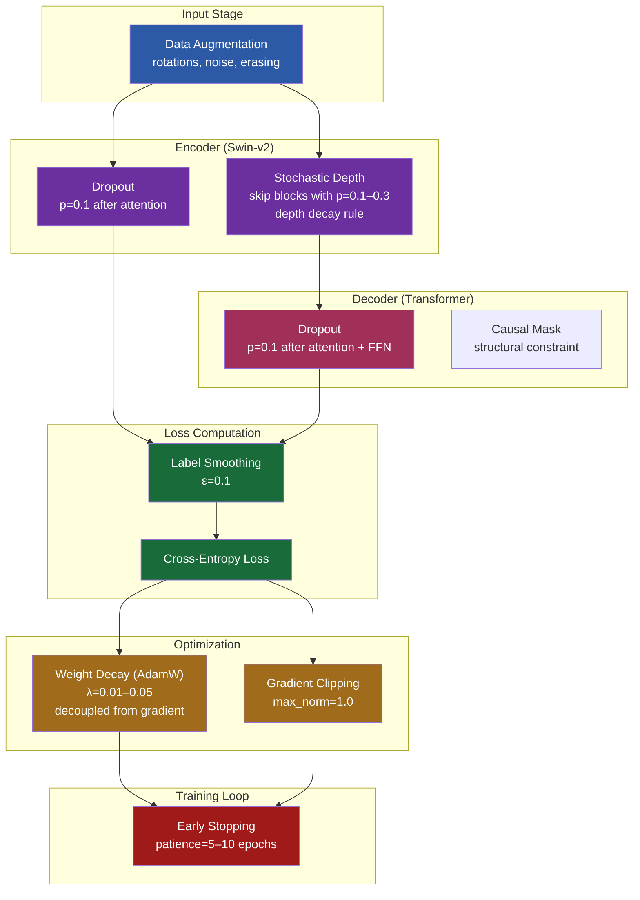

# 8. Regularization Techniques

Regularization is the art of preventing a model from memorizing the training data while preserving its ability to learn useful patterns. Without regularization, a sufficiently large neural network can achieve near-zero training loss by simply storing the training examples — but it will fail catastrophically on new data. This note covers every major regularization technique and explains how they work together in the TAMER OCR model.

## Why Regularization Matters

The fundamental tension in machine learning is the **bias-variance tradeoff**. A model with too little capacity (high bias) cannot fit the training data — it underfits. A model with too much capacity (high variance) fits the training data perfectly but fails to generalize — it overfits. Regularization is the set of techniques that allow us to use high-capacity models (which can learn complex patterns) while keeping variance in check.

In the context of TAMER, the model has roughly 200 million parameters. This is far more than strictly necessary to represent the mapping from math images to LaTeX. The excess capacity is what allows the model to learn nuanced visual features, but it is also what makes the model prone to overfitting — especially when the training dataset is limited in size.

## Weight Decay (L2 Regularization)

**Weight decay** adds a penalty proportional to the squared magnitude of the weights to the loss function:

$$L_{\text{total}} = L_{\text{task}} + \lambda \sum_i w_i^2$$

The gradient of the penalty term with respect to each weight is $2\lambda w_i$, which acts as a force pulling every weight toward zero. This discourages the model from relying on any single weight too heavily and encourages it to distribute information across many weights.

The distinction between **L2 regularization** and **weight decay** is subtle but important in the context of the Adam optimizer. Standard L2 regularization adds the penalty to the loss before computing gradients, which means the Adam optimizer's adaptive learning rates interact with the regularization term in unexpected ways. **AdamW** (used in TAMER) implements weight decay correctly by decoupling it from the gradient computation: the weight decay term is applied directly to the weights, not through the gradient. This leads to more consistent regularization behavior regardless of the adaptive learning rate.

In practice, weight decay values for Transformer models typically range from 0.01 to 0.1. TAMER uses a value in this range, which is enough to prevent weights from growing unbounded without overly constraining the model's capacity.

## Dropout

**Dropout** randomly sets a fraction of neuron activations to zero during each training step. With dropout probability $p$, each activation is independently zeroed with probability $p$ and scaled by $1/(1-p)$ otherwise (inverted dropout).

The effect is profound: dropout creates an **implicit ensemble** of $2^n$ sub-networks (where $n$ is the number of neurons), each missing a different random subset. At training time, we sample one sub-network per step. At inference time, we use the full network with scaled weights, which approximates the geometric mean of all sub-networks' predictions.

Dropout forces the network to be **redundant**: no single neuron can be critical for any computation, because it might be dropped at any time. This redundancy makes the model more robust and less dependent on specific features.

In TAMER, dropout is applied in several places:
- After the attention weights (before multiplying by V)
- After the output of each sub-layer (attention and FFN)
- In the feed-forward network between the two linear layers

A typical dropout rate is 0.1 for Transformer models — enough to provide regularization without removing too much information.

## DropConnect and Stochastic Depth

**DropConnect** is a generalization of dropout that randomly zeros individual **weights** rather than activations. While less common than dropout, it provides stronger regularization because it removes connections rather than neurons.

**Stochastic depth** takes this idea further by randomly **dropping entire layers** during training. Instead of zeroing individual activations or weights, stochastic depth skips entire residual blocks with some probability. This is the technique used in the Swin Transformer v2 encoder.

## Stochastic Depth in Swin Transformer

The Swin Transformer v2 uses stochastic depth (also called **layer dropout**) to randomly bypass transformer blocks during training. For a block with survival probability $p_l$, the output is:

$$\text{output} = \begin{cases} \text{block}(x) + x & \text{with probability } p_l \\ x & \text{with probability } 1 - p_l \end{cases}$$

During inference, the block is always executed, but its output is scaled by $p_l$ to maintain the expected value.

### The Depth Decay Rule

Not all blocks are skipped with equal probability. Swin uses a **linear depth decay rule**: deeper blocks have higher probability of being skipped. For a model with $N$ blocks:

$$p_l = 1 - \frac{l}{N} \cdot (1 - p_{\text{survive}})$$

where $l$ is the block index (starting from 1) and $p_{\text{survive}}$ is the base survival probability for the last block (typically 0.5–0.9). The intuition is that **early blocks learn fundamental features** (edges, textures) that later blocks depend on, so they should almost always be present. Later blocks learn more abstract features that can sometimes be skipped without catastrophic information loss.

### Why Stochastic Depth Helps

Stochastic depth provides three key benefits:

1. **Implicit ensemble**: Each training step effectively uses a different sub-network depth. The model learns features that are useful at various depths, not just at the full depth.
2. **Reduced training time**: When blocks are skipped, their computations are not performed. On average, the training time per step is reduced proportionally to the skip rate.
3. **Better gradient flow**: Skipping blocks creates shorter paths for gradients to flow through, which mitigates vanishing gradients in very deep networks.

## Data Augmentation as Regularization

Every augmented training sample is essentially a new data point that the model has never seen before. By creating variations of existing images — rotations, scaling, noise injection, contrast changes, elastic deformations — we implicitly tell the model: "the exact pixel values do not matter; the underlying mathematical structure does."

For OCR specifically, relevant augmentations include:
- **Random affine transformations**: slight rotations and scaling simulate camera variation
- **Gaussian noise**: simulates sensor noise and compression artifacts
- **Random erasing**: simulates occlusions and forces the model to be robust to missing regions
- **Color jitter**: changes brightness, contrast, and saturation

The more diverse the augmented data, the harder it is for the model to memorize specific training examples, and the more it must learn general features.

## Label Smoothing as Regularization

**Label smoothing** prevents the model from becoming overconfident by replacing hard one-hot targets with softer targets:

$$y_i^{\text{smooth}} = (1 - \epsilon) \cdot \mathbb{1}[i = y] + \frac{\epsilon}{K}$$

This is a form of regularization because it prevents the logits from growing to extreme values. Without label smoothing, the model is incentivized to push the logit of the correct class to $+\infty$ and all others to $-\infty$, which leads to brittle, overconfident predictions. Label smoothing provides a finite target that the model can actually achieve, resulting in better-calibrated probabilities and improved generalization.

## Early Stopping as Regularization

**Early stopping** monitors the model's performance on a validation set and stops training when validation performance stops improving. This is one of the simplest and most effective forms of regularization.

The principle is that training loss will continue to decrease indefinitely (the model is memorizing the training data), but validation loss will eventually start increasing (the model is overfitting). Early stopping catches the point where the model transitions from learning general patterns to memorizing noise.

In practice, we use **patience**: training continues for a specified number of epochs after the best validation score before stopping, to avoid stopping prematurely due to noise in the validation metric.

## Gradient Clipping as Implicit Regularization

**Gradient clipping** limits the magnitude of gradients before applying them:

$$g' = \begin{cases} g & \text{if } \|g\| \leq c \\ \frac{c}{\|g\|} g & \text{if } \|g\| > c \end{cases}$$

While primarily a stability technique (preventing training explosions), gradient clipping also acts as implicit regularization. By limiting the step size in parameter space, it prevents the model from making sharp jumps to narrow minima that correspond to overfitting. The model is steered toward flatter, wider minima that generalize better.

## How All These Interact in TAMER

In the TAMER OCR model, multiple regularization techniques work simultaneously:

| Technique | Where Applied | Typical Value |
|---|---|---|
| Weight Decay (AdamW) | All learnable parameters | 0.01–0.05 |
| Dropout | After attention, after FFN sub-layers | 0.1 |
| Stochastic Depth | Swin Transformer blocks | 0.1–0.3 (linear decay) |
| Label Smoothing | Loss computation | 0.1 |
| Data Augmentation | Input pipeline | Various |
| Early Stopping | Training loop | Patience 5–10 epochs |
| Gradient Clipping | Optimizer step | Max norm 1.0 |

These techniques are **complementary**, not redundant. Each addresses a different aspect of overfitting: weight decay prevents large weights, dropout prevents co-adaptation of neurons, stochastic depth prevents over-reliance on specific layers, label smoothing prevents overconfident outputs, augmentation prevents memorization of specific inputs, early stopping prevents over-training, and gradient clipping prevents sharp optimization steps.

## Mermaid Diagram: Regularization Techniques and Where They Apply

The diagram shows how regularization permeates every stage of the TAMER pipeline. No single technique is sufficient on its own — it is the combination that produces a model that generalizes well. Understanding how these techniques interact is crucial for debugging training issues: if the model underfits, consider reducing regularization; if it overfits, consider increasing it. The key is finding the right balance for your specific dataset and model size.
