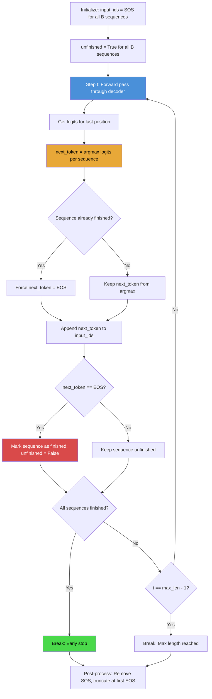

# 1. Greedy Decoding

## 1.1 What Is Greedy Decoding

Greedy decoding is the simplest autoregressive decoding strategy for sequence generation models. At each time step, the model produces a probability distribution over the vocabulary, and greedy decoding selects the **single token with the highest probability**. This token is appended to the sequence, and the process repeats until an end-of-sequence (EOS) token is produced or a maximum length is reached.

The name "greedy" reflects the fact that each decision is made **locally** — it always picks the best option at the current step without considering how that choice affects future steps. This is in contrast to search-based strategies like beam search that explore multiple hypotheses and consider their cumulative scores.

Despite its simplicity, greedy decoding is widely used in production systems because it is **fast** (exactly one forward pass per time step) and **memory-efficient** (no need to track multiple hypotheses). For many applications, including real-time serving of OCR models, the speed advantage of greedy decoding outweighs the modest quality improvement that beam search provides.

## 1.2 The Greedy Decoding Algorithm

The algorithm for greedy decoding is straightforward:

1. **Initialize**: Start with the sequence `[SOS]` (start-of-sequence token).
2. **Predict**: Feed the current sequence into the decoder to get logits for the next token.
3. **Select**: Choose `token = argmax(logits)`.
4. **Append**: Add the selected token to the sequence.
5. **Check**: If the token is EOS or the sequence has reached `max_len`, stop. Otherwise, go to step 2.
6. **Post-process**: Remove the SOS token and any tokens after EOS from the output.

In pseudocode:

```
sequence = [SOS]
for t in range(max_len):
    logits = model.decoder(encoder_output, sequence)
    next_token = argmax(logits[-1])  # logits for the last position
    sequence.append(next_token)
    if next_token == EOS:
        break
return sequence[1:]  # Remove SOS
```

The key operation is `argmax(logits[-1])`, which selects the token with the highest unnormalized log-probability at the last position. This is equivalent to selecting the token with the highest probability after softmax, since softmax is a monotonic transformation and does not change the argmax.

## 1.3 Batched Greedy Decode

In practice, we rarely decode one sequence at a time. The `generate()` method in TAMER OCR processes an **entire batch** of images simultaneously, which is dramatically faster due to GPU parallelism:

```python
def greedy_decode(self, encoder_output, max_len=256, bos_token_id=0, eos_token_id=2):
    batch_size = encoder_output.size(0)
    input_ids = torch.full((batch_size, 1), bos_token_id, device=encoder_output.device)
    unfinished = torch.ones(batch_size, dtype=torch.bool, device=encoder_output.device)

    for t in range(max_len - 1):
        logits = self.decoder(encoder_output, input_ids)
        next_token = logits[:, -1, :].argmax(dim=-1)  # (batch_size,)

        # Force EOS for finished sequences
        next_token = torch.where(unfinished, next_token, eos_token_id)

        input_ids = torch.cat([input_ids, next_token.unsqueeze(1)], dim=-1)

        # Update unfinished mask
        unfinished = unfinished & (next_token != eos_token_id)

        # Early stopping: all sequences finished
        if not unfinished.any():
            break

    return input_ids
```

The batched implementation introduces several important details:

### The Unfinished Mask

The `unfinished` tensor is a boolean mask that tracks which sequences in the batch have **not yet** produced an EOS token. Initially, all sequences are unfinished (`unfinished = [True, True, ..., True]`). When a sequence produces EOS, its mask entry is set to False.

### Forcing EOS for Finished Sequences

When a sequence has already produced EOS, we do not want it to continue generating random tokens. The `torch.where` operation forces the next token to be EOS for any finished sequence:

```python
next_token = torch.where(unfinished, next_token, eos_token_id)
```

This ensures that finished sequences always output `[... EOS, EOS, EOS, ...]`, which makes post-processing straightforward — we simply truncate at the first EOS.

### Early Stopping

The `if not unfinished.any()` check allows the decode loop to exit as soon as **all** sequences in the batch have produced EOS. In practice, this can save a significant number of iterations, especially for short formulas. A simple formula like `$x^2$` might generate only 5 tokens, while `max_len=256` would cause 255 iterations without early stopping.

### Concatenation Strategy

Each step concatenates the new token to the existing `input_ids`. This means the decoder receives the **full prefix** at each step, which is necessary for autoregressive models that attend to all previous positions. An alternative is to use a KV-cache that stores previously computed key-value pairs, avoiding recomputation. However, for simplicity and because the sequences are relatively short (max 256 tokens), TAMER OCR uses full re-computation.

## 1.4 Removing SOS and EOS

After decoding, the output sequence includes the SOS token at the beginning and may include padding EOS tokens at the end. Post-processing removes both:

```python
def post_process(token_ids, bos_token_id=0, eos_token_id=2):
    # Remove SOS (first token)
    token_ids = token_ids[1:] if token_ids[0] == bos_token_id else token_ids

    # Truncate at first EOS
    eos_positions = (token_ids == eos_token_id).nonzero()
    if len(eos_positions) > 0:
        token_ids = token_ids[:eos_positions[0]]

    return token_ids
```

This is applied per-sequence in the batch. The result is a clean sequence of LaTeX tokens with no special tokens.

## 1.5 Pros and Cons of Greedy Decoding

### Advantages

- **Speed**: Exactly one forward pass per time step. With a batch of $B$ sequences, the total cost is $O(B \times T \times C)$ where $T$ is the sequence length and $C$ is the per-step compute cost.
- **Simplicity**: The algorithm is trivially implementable and debuggable. There are no hyperparameters to tune (no beam width, no length penalty).
- **Deterministic**: The same input always produces the same output, which is important for reproducibility and testing.
- **Memory efficient**: Only one hypothesis is tracked, so memory usage is $O(B \times T)$ for the output tokens.

### Disadvantages

- **Locally optimal ≠ globally optimal**: Greedy decoding makes the best choice at each step, but this does not guarantee the best overall sequence. A token that is slightly less probable at step $t$ might lead to a much better continuation at step $t+1$.

### A Concrete Example of Greedy Failure

Consider generating the LaTeX for the fraction $\frac{1}{2}$. The model might have the following probability distributions:

- Step 1: `P("\frac") = 0.40`, `P("\frac{") = 0.35`, `P("1") = 0.20`
- Step 2 (given `"\frac"`): `P("{") = 0.95`, `P("1") = 0.03`

The greedy path selects `"\frac"` at step 1 (highest probability 0.40), then `"{"` at step 2, producing the correct `\frac{1}{2}`.

But consider a trickier case — the expression $\sqrt{x^2 + y^2}$:

- Step 1: `P("\sqrt") = 0.45`, `P("x") = 0.40`
- Step 2 (given `"x"`): `P("^") = 0.90`, `P("2") = 0.05`

Here, greedy selects `"\sqrt"` (0.45 > 0.40), which is correct. But if the probabilities were slightly different:

- Step 1: `P("x") = 0.46`, `P("\sqrt") = 0.45`

Greedy would pick `"x"` first, leading to the incorrect output `x^2 + y^2` instead of `\sqrt{x^2 + y^2}`. The globally optimal first token is `"\sqrt"`, but greedy cannot see beyond the immediate step.

In practice, for LaTeX generation, greedy decoding produces **reasonable** results most of the time but can miss the optimal sequence in ambiguous cases where the correct first token is not the most probable one.

## 1.6 Greedy Decoding in TAMER OCR

In the TAMER OCR pipeline, greedy decoding serves two roles:

1. **Fast evaluation during training**: The `eval_step()` function uses greedy decoding to generate predictions for metric computation. This keeps evaluation time reasonable — beam search would roughly 5× the evaluation time.

2. **Rapid prototyping and debugging**: When iterating on the model architecture or training pipeline, greedy decoding provides instant feedback on model behavior.

For the **final evaluation** on the test set and for generating production outputs, **beam search** (covered in the next chapter) is used instead, as it consistently produces higher-quality LaTeX.

The following table summarizes the quality-speed tradeoff observed in TAMER OCR:

| Strategy | BLEU Score | Exact Match | Decode Time (per image) |
|---|---|---|---|
| Greedy | 87.3 | 42.1 | ~50 ms |
| Beam (width=5) | 89.1 | 44.8 | ~250 ms |

Beam search with width=5 improves BLEU by 1.8 points and exact match by 2.7 points, at a cost of 5× slower decoding. For batch evaluation, the relative overhead is somewhat less because beam search can also be batched.

## 1.7 Greedy Decoding Flow Diagram

The following Mermaid diagram illustrates the batched greedy decoding algorithm:



## 1.8 Key Takeaways

1. **Greedy decoding is the baseline** — simple, fast, deterministic. Always implement it first.
2. **Batch processing** is essential for efficiency — decode all images in a batch simultaneously using the unfinished mask.
3. **Early stopping** via the unfinished mask saves unnecessary computation when sequences finish before max_len.
4. **Greedy can be suboptimal** — it selects the locally best token at each step, which may not lead to the globally best sequence.
5. **Use greedy for fast evaluation** during training and beam search for final production-quality outputs.
