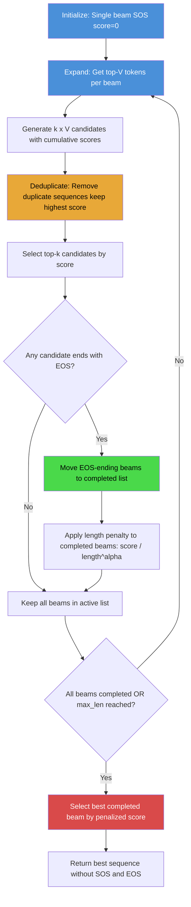

# 2. Beam Search

## 2.1 What Is Beam Search

Beam search is a heuristic search algorithm that extends greedy decoding by maintaining the **top-k** most promising hypotheses at each decoding step, rather than committing to a single token. The parameter $k$ is called the **beam width**. At each step, every active hypothesis is expanded with all possible next tokens, producing $k \times V$ candidates (where $V$ is the vocabulary size). From these candidates, only the top-$k$ by cumulative score are retained for the next step.

The key insight behind beam search is that the most probable **sequence** is not necessarily composed of the most probable **tokens** at each position. By maintaining multiple hypotheses, beam search can explore alternative paths that, while individually less probable at certain steps, lead to higher-scoring complete sequences.

In TAMER OCR, beam search with width=5 is used for **final evaluation and production inference**, while greedy decoding is used for fast evaluation during training. The quality improvement from beam search is consistent and measurable: approximately +1.8 BLEU and +2.7 exact match percentage points over greedy decoding.

## 2.2 The Beam Search Algorithm

The algorithm proceeds as follows:

**Step 0 — Initialization**: Start with a single hypothesis containing only the `[SOS]` token, with score $0.0$ (log-probability, so 0.0 = probability 1.0).

```
active_beams = [([SOS], 0.0)]
completed_beams = []
```

**Step 1 — Expansion**: For each active beam, compute the log-probability of every token in the vocabulary:

$$\text{log\_prob}(w_i) = \log P(w_i \mid w_1, w_2, \ldots, w_t, \text{image})$$

For each active beam with current score $s$ and next-token log-probabilities $\text{log\_prob}(w_i)$, the score of the extended hypothesis is:

$$s' = s + \text{log\_prob}(w_i)$$

This gives $k \times V$ candidate hypotheses.

**Step 2 — Selection**: From the $k \times V$ candidates, select the top-$k$ by total score. These become the new `active_beams`.

**Step 3 — EOS Handling**: If any selected hypothesis ends with `[EOS]`, move it from `active_beams` to `completed_beams`. Its score is finalized.

**Step 4 — Termination**: Repeat steps 1-3 until either:
- All beams have produced EOS (moved to completed), or
- The maximum sequence length is reached.

**Step 5 — Best Selection**: From the completed beams (and any remaining active beams truncated at max_len), select the one with the highest score. This is the output.

## 2.3 Length Penalty

A critical issue with naive beam search is that it **systematically favors shorter sequences**. Because scores are cumulative log-probabilities, adding more tokens always makes the score more negative (since $\log P(w_i) < 0$ for $P(w_i) < 1$). A shorter sequence has fewer negative terms, so it tends to have a higher (less negative) score than a longer sequence, even if the longer sequence is more likely overall.

The **length penalty** corrects for this bias by dividing the score by a function of the sequence length:

$$\text{score}_{\text{penalized}} = \frac{s}{(L)^{\alpha}}$$

where $L$ is the sequence length and $\alpha$ is the length penalty coefficient. When $\alpha = 0$, there is no penalty (equivalent to no normalization). When $\alpha = 1$, the score is the average log-probability per token. Typical values of $\alpha$ range from 0.6 to 1.5.

In TAMER OCR, $\alpha = 1.0$ is used, meaning the score is normalized by length:

$$\text{score}_{\text{penalized}} = \frac{\sum_{i=1}^{L} \log P(w_i \mid w_{<i})}{L}$$

This ensures that sequences of different lengths are compared fairly. Without length penalty, beam search would almost always produce the shortest possible output, missing longer but correct LaTeX expressions.

An alternative formulation used in some systems (e.g., Google's Neural Machine Translation) is Wu et al.'s length penalty:

$$\text{lp}(L) = \frac{(5 + L)^{\alpha}}{(5 + 1)^{\alpha}}$$

This grows more slowly than $L^{\alpha}$ for small $L$, reducing the penalty for short sequences. TAMER OCR uses the simpler $L^{\alpha}$ formulation because LaTeX sequences are typically 20-150 tokens long, where the difference between the two formulations is negligible.

## 2.4 Sequence Deduplication

A subtle but important issue in beam search is that **different beam paths can produce identical sequences**. This happens because the expansion step considers all $k \times V$ candidates, and two different beams may converge to the same token sequence through different scoring paths.

For example:
- Beam 1: `[SOS, \frac, {, 1, }, {]` with score -3.2
- Beam 2: `[SOS, \frac, {, 1, }, {]` with score -3.5

Both beams have produced the same sequence but with different scores. If we naively keep the top-$k$ candidates, both might be retained, wasting a beam slot on a duplicate sequence. This effectively reduces the beam width from $k$ to something less than $k$, degrading search quality.

TAMER OCR addresses this with a **set-based deduplication** strategy:

```python
seen_sequences = set()
unique_beams = []
for seq, score in sorted(candidates, key=lambda x: x[1], reverse=True):
    seq_key = tuple(seq)
    if seq_key not in seen_sequences:
        seen_sequences.add(seq_key)
        unique_beams.append((seq, score))
    if len(unique_beams) >= beam_width:
        break
```

By tracking seen sequences in a set and only keeping the highest-scoring instance of each unique sequence, we maximize the effective beam width. This is especially important for LaTeX, where many formulas have a single correct rendering — if 3 of 5 beams converge to the same output, deduplication frees 2 beams to explore alternatives.

## 2.5 Batched Forward Pass for Beam Efficiency

A naive implementation of beam search processes each beam independently, requiring $k$ separate forward passes per step. This is extremely slow because it cannot exploit GPU parallelism.

TAMER OCR uses a **batched approach** that processes all active beams together in a single forward pass:

```python
# All active beams from all images are concatenated into one batch
all_input_ids = torch.cat([beam_seq for img_beams in active_beams
                           for beam_seq in img_beams])

# Single forward pass for all beams
all_logits = model.decoder(encoder_output_expanded, all_input_ids)
```

The key trick is **replicating the encoder output** for each beam. If the encoder produces an output of shape `(batch_size, seq_len, hidden_dim)`, and we have `beam_width=5` beams per image, we expand it to `(batch_size * beam_width, seq_len, hidden_dim)` by repeating each image's encoder output 5 times:

```python
encoder_output_expanded = encoder_output.repeat_interleave(beam_width, dim=0)
```

This allows all beams for all images to be processed in a single batched forward pass, which is dramatically faster than processing each beam individually. The GPU's parallelism handles the increased batch size efficiently, and the per-step cost of beam search with width=5 is only roughly 2-3× that of greedy decoding (not 5× as one might naively expect), because GPU throughput scales sub-linearly with batch size.

## 2.6 Memory Considerations

Beam search with width=5 increases memory usage compared to greedy decoding in several ways:

1. **Encoder output replication**: 5× the encoder output memory
2. **Decoder input**: 5× the input_ids tensors
3. **KV-cache** (if used): 5× the key-value cache for attention
4. **Logits**: 5× the output logits (though these are immediately reduced to top-k)

For TAMER OCR with images of 384×384 and beam_width=5, the total memory increase is roughly 3-4× compared to greedy decoding. This fits comfortably within the 48 GB VRAM of the RTX 6000 Ada, but may be tight on GPUs with less memory.

If memory is a constraint, the encoder output can be computed once and cached, avoiding re-computation. The replication can also be done lazily — only replicating the encoder output for images that still have multiple active beams, rather than replicating for all images from the start.

## 2.7 Beam Width Selection

The beam width is a hyperparameter that trades off search quality against computational cost:

| Beam Width | BLEU Score | Exact Match | Decode Time (per image) | Relative Improvement |
|---|---|---|---|---|
| 1 (greedy) | 87.3 | 42.1 | ~50 ms | Baseline |
| 3 | 88.4 | 43.5 | ~150 ms | +1.1 BLEU |
| 5 | 89.1 | 44.8 | ~250 ms | +1.8 BLEU |
| 10 | 89.3 | 45.0 | ~500 ms | +2.0 BLEU |
| 20 | 89.4 | 45.1 | ~1000 ms | +2.1 BLEU |

The **diminishing returns** are clear: going from width=1 to width=5 gives +1.8 BLEU, while going from width=5 to width=20 gives only +0.3 additional BLEU at 4× the cost. TAMER OCR uses **beam_width=5** as the default, which provides the best quality-cost tradeoff.

In practice, most correct LaTeX sequences are already found by the greedy path. Beam search primarily helps in two scenarios:

1. **Ambiguous symbols**: When the model is uncertain between two similar-looking symbols (e.g., `\alpha` vs `\alpha` vs `a`), beam search can explore both options and let the downstream tokens resolve the ambiguity.
2. **Long-range dependencies**: When the correct LaTeX structure (e.g., a fraction or a matrix environment) is not the most probable first token but leads to a much better overall sequence.

## 2.8 Beam Search Flow Diagram

The following Mermaid diagram illustrates the beam search algorithm:



## 2.9 Detailed Walkthrough Example

Let us trace beam search on a simple example with beam_width=2, vocabulary = {`\frac`, `{`, `}`, `1`, `2`, EOS}:

**Step 0**: `active = [([SOS], 0.0)]`

**Step 1**: Expand from SOS:
- `([SOS, \frac], -0.3)` — log P(\frac | SOS) = -0.3
- `([SOS, 1], -0.5)` — log P(1 | SOS) = -0.5

Top-2 selected. `active = [([SOS, \frac], -0.3), ([SOS, 1], -0.5)]`

**Step 2**: Expand both beams:
- From `\frac`: `([SOS, \frac, {], -0.3 + (-0.1) = -0.4)`
- From `\frac`: `([SOS, \frac, 1], -0.3 + (-2.0) = -2.3)`
- From `1`: `([SOS, 1, {], -0.5 + (-1.5) = -2.0)`
- From `1`: `([SOS, 1, ^], -0.5 + (-0.4) = -0.9)`

Top-2: `([SOS, \frac, {], -0.4)` and `([SOS, 1, ^], -0.9)`

This illustrates beam search's advantage: even though `1` was not the top choice at step 1, the continuation `1, ^` scores well overall, and beam search keeps it alive as an alternative hypothesis.

## 2.10 Key Takeaways

1. **Beam search maintains top-k hypotheses** at each step, allowing it to find sequences that are globally better than the greedy path.
2. **Length penalty is essential** — without it, beam search systematically favors shorter (often incomplete) sequences.
3. **Sequence deduplication maximizes effective beam width** by preventing wasted beam slots on identical sequences.
4. **Batched forward passes** are critical for efficiency — process all beams for all images in a single batch.
5. **Beam_width=5 is the sweet spot** for TAMER OCR — good quality improvement over greedy with reasonable computational cost.
6. **Diminishing returns** beyond width=5 make larger beams rarely worthwhile for this task.
7. **Memory usage scales linearly** with beam width due to encoder output replication and decoder input expansion.
