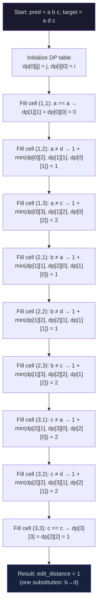

# 1. Exact Match Rate and Edit Distance

Evaluating a math OCR system is fundamentally different from evaluating general-purpose image classification or even standard text OCR. Mathematical formulas encoded in LaTeX are rigidly structured: a single misplaced token — a missing subscript, a swapped bracket, or a forgotten backslash — can render the entire expression semantically meaningless. This chapter covers the two foundational metrics that form the backbone of TAMER OCR evaluation: **Exact Match Rate** (also called ExpRate) and **Edit Distance** (Levenshtein distance). Together, they provide both a strict and a forgiving lens through which to measure model performance.

---

## 1.1 Exact Match Rate (ExpRate)

**Exact Match Rate**, conventionally abbreviated as **ExpRate** in the math OCR literature, measures the percentage of predictions that match the ground-truth LaTeX string *character-for-character* (or token-for-token, depending on the comparison granularity). The formula is straightforward:

```
ExpRate = (number of exact matches) / (total number of samples) × 100%
```

An "exact match" means that after any standard post-processing (whitespace normalization, token decoding), the predicted LaTeX string and the ground-truth string are **identical**. There is no partial credit. A prediction that differs by even a single character from the ground truth receives a score of 0 under this metric.

### Why Exact Match Matters

The all-or-nothing nature of ExpRate is not arbitrary — it reflects a core truth about mathematical notation:

- **LaTeX is unforgiving**: In standard text OCR, swapping "their" for "thier" still yields a recognizable (if misspelled) word. In LaTeX, swapping `\frac` for `\frca` produces a compilation error or nonsense rendering.
- **Downstream tooling demands correctness**: If the predicted LaTeX is fed into a renderer, a CAS (Computer Algebra System), or a search index, even a one-token error breaks the pipeline.
- **Academic benchmarking**: The CROHME competition and Im2LaTeX benchmarks report ExpRate as the primary metric, so it is essential for comparing against published results.

### The Harshness of ExpRate

Consider a formula with 100 tokens where the model gets 95 correct and mispredicts 5. Under ExpRate, this sample scores **0** — the same as a prediction that gets every token wrong. This binary nature makes ExpRate extremely harsh:

- A model with 95% per-token accuracy might achieve an ExpRate of only 60–70%, because the probability that *all* tokens in a sequence are correct decays exponentially with sequence length.
- For a formula of length 50 tokens at 99% per-token accuracy, the probability of a perfect prediction is 0.99^50 ≈ 60.5%. At 98%, it drops to 0.98^50 ≈ 36.4%.
- This means **ExpRate disproportionately penalizes long formulas**, which is why it must be complemented by other metrics.

---

## 1.2 Edit Distance (Levenshtein Distance)

**Edit distance**, specifically the **Levenshtein distance**, measures the minimum number of single-token edit operations — **insertions**, **deletions**, and **substitutions** — required to transform the predicted string into the ground-truth string. Unlike ExpRate, edit distance is **granular**: it tells you *how wrong* a prediction is, not just *whether it is wrong*.

### Formal Definition

Given two strings A (prediction) and B (ground truth), the Levenshtein distance `d(A, B)` is defined recursively:

- `d("", B) = |B|` (all insertions)
- `d(A, "") = |A|` (all deletions)
- `d(A, B) = d(A[:-1], B[:-1])` if `A[-1] == B[-1]` (last characters match, no cost)
- `d(A, B) = 1 + min(d(A[:-1], B), d(A, B[:-1]), d(A[:-1], B[:-1]))` otherwise (insertion, deletion, or substitution)

### Dynamic Programming Implementation

The standard implementation uses a `(len(A)+1) × (len(B)+1)` DP table. Here is the canonical algorithm:

```python
def levenshtein_distance(pred: str, target: str) -> int:
    m, n = len(pred), len(target)
    dp = [[0] * (n + 1) for _ in range(m + 1)]

    for i in range(m + 1):
        dp[i][0] = i
    for j in range(n + 1):
        dp[0][j] = j

    for i in range(1, m + 1):
        for j in range(1, n + 1):
            if pred[i - 1] == target[j - 1]:
                dp[i][j] = dp[i - 1][j - 1]
            else:
                dp[i][j] = 1 + min(
                    dp[i - 1][j],      # deletion
                    dp[i][j - 1],      # insertion
                    dp[i - 1][j - 1]   # substitution
                )

    return dp[m][n]
```

The time complexity is **O(m × n)** and space complexity is **O(m × n)**, though a rolling-array optimization can reduce space to **O(min(m, n))**.

### Edit Distance Computation Diagram



---

## 1.3 Why Edit Distance Complements ExpRate

Edit distance and ExpRate answer fundamentally different questions:

| Question | Metric |
|----------|--------|
| Is the prediction perfect? | ExpRate |
| How far from perfect is it? | Edit Distance |

Consider two models on the same test set:

- **Model A**: 50 exact matches out of 100, average edit distance 3.2
- **Model B**: 50 exact matches out of 100, average edit distance 8.7

Both have the same ExpRate of 50%, but **Model A is clearly superior** — its errors are smaller and closer to correct. Edit distance reveals this distinction; ExpRate alone cannot.

### The Relationship Between the Metrics

There is a general (though not perfect) correlation: **improving edit distance tends to improve ExpRate over time**. As the model makes fewer and smaller errors, the probability of occasionally producing a completely correct prediction increases. During training, you will typically observe:

1. Early training: edit distance drops rapidly, ExpRate remains near 0 (most predictions are far from correct).
2. Mid training: edit distance continues decreasing, ExpRate starts climbing (some predictions become perfect).
3. Late training: edit distance plateaus at a low value, ExpRate gradually converges (marginal improvements in edit distance yield fewer new exact matches).

This is why tracking **both metrics** during training is essential. If you only monitor ExpRate, early training appears completely unproductive, which can be misleading.

---

## 1.4 Normalizing Edit Distance

Raw edit distance is not comparable across samples of different lengths. A prediction with edit distance 3 on a 10-token formula is much worse than edit distance 3 on a 100-token formula. To make the metric comparable, TAMER normalizes edit distance by the **target length**:

```
normalized_edit_distance = edit_distance / len(target_tokens)
```

This yields a value between 0 (perfect match) and roughly 1 (completely wrong, depending on the alignment). Normalized edit distance is what gets reported in the training logs and is used for model selection.

### The SER (Symbol Error Rate) Connection

A closely related normalized metric is **Symbol Error Rate (SER)**, which is essentially the same as normalized edit distance but sometimes computed at the character level rather than the token level. In TAMER, SER is reported alongside edit distance in the full evaluation suite. The distinction is subtle: when using a BPE or WordPiece tokenizer, token-level edit distance and character-level SER can diverge, because a single token-level substitution may correspond to multiple character-level edits.

---

## 1.5 The compute_batch_metrics Function

In the TAMER codebase, batch-level metric computation is handled by `compute_batch_metrics`. This function takes a batch of predicted token sequences and a batch of target token sequences and returns a dictionary of aggregated metrics:

```python
def compute_batch_metrics(preds: list[str], targets: list[str]) -> dict:
    exact_matches = 0
    total_edit_dist = 0
    total_target_len = 0

    for pred, target in zip(preds, targets):
        if pred == target:
            exact_matches += 1
        ed = levenshtein_distance(pred, target)
        total_edit_dist += ed
        total_target_len += len(target)

    n = len(preds)
    return {
        "exact_match": exact_matches / n,
        "edit_dist": total_edit_dist / n,
        "edit_dist_normalized": total_edit_dist / max(total_target_len, 1),
    }
```

Key implementation details:

- **Tokenization consistency**: Both `pred` and `target` must be decoded to strings using the *same* tokenizer and post-processing pipeline. Any inconsistency (e.g., different whitespace normalization) will inflate the edit distance.
- **Empty prediction handling**: If the model produces an empty prediction (e.g., all EOS tokens immediately), the edit distance equals the target length. The `max(total_target_len, 1)` guard prevents division by zero.
- **Efficiency**: For large validation sets, computing pairwise edit distances is O(n × m × k²) where n is the number of samples, and m and k are the average prediction and target lengths. This is the primary bottleneck in evaluation, which is why the final beam-search evaluation is limited to 500 samples.

---

## 1.6 Practical Tips

1. **Monitor both metrics from epoch 1**: Even when ExpRate is 0, a decreasing edit distance confirms the model is learning.
2. **Use edit distance for model selection**: Choose the checkpoint with the lowest validation edit distance, not the highest ExpRate. Edit distance is more stable and less noisy.
3. **Watch for tokenization mismatches**: A common bug is computing metrics on raw token IDs instead of decoded strings. Always decode before comparing.
4. **Batch size affects metric stability**: Smaller validation batches produce noisier metric estimates. Use the full validation set for final reporting.
5. **ExpRate is the publication metric**: Despite its harshness, ExpRate is what the community uses for comparisons. Always report it, even if edit distance tells a more nuanced story.
