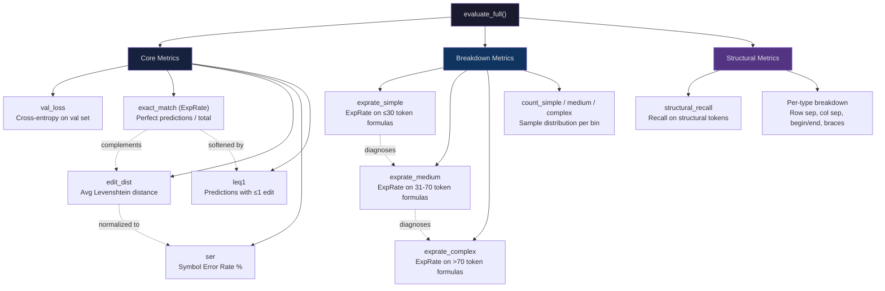

# 2. Structural Accuracy and Token-Level Metrics

While Exact Match Rate and Edit Distance provide a broad-strokes view of model performance, they obscure critical details about *what kinds of errors* the model is making. A model that consistently mispredicts subscripts is very different from one that occasionally drops an entire row of a matrix — yet both might have the same overall ExpRate and edit distance. This chapter covers the finer-grained metrics that TAMER uses to diagnose *where* and *how* the model fails: **Structural Token Recall**, **Complexity-Breakdown ExpRate**, **Symbol Error Rate (SER)**, and **Leq1**.

---

## 2.1 Structural Token Recall

### What Are Structural Tokens?

In LaTeX, certain tokens serve as **structural scaffolding** rather than content. These include:

| Token | Role |
|-------|------|
| `\\` | Row separator in matrices and aligned environments |
| `&` | Column separator (alignment point) |
| `\begin{...}` | Environment opening |
| `\end{...}` | Environment closing |
| `\left` / `\right` | Delimiter pairing |
| `{` / `}` | Grouping |

These tokens are *structural* because they define the **layout and organization** of the formula, not the mathematical content itself. A model that correctly predicts all the content tokens but misplaces a single `\\` will produce a formula that is syntactically broken — a matrix with the wrong number of rows, or an aligned equation that renders as a jumbled mess.

### Why Structural Accuracy Matters

Consider this ground-truth LaTeX for a 2×2 matrix:

```latex
\begin{pmatrix} a & b \\ c & d \end{pmatrix}
```

Now suppose the model predicts:

```latex
\begin{pmatrix} a & b & c & d \end{pmatrix}
```

The model has only missed one `\\` token, but the rendered output is completely different — a 1×4 matrix instead of a 2×2 matrix. Under raw ExpRate, this counts as a complete failure (ExpRate contribution = 0). Under edit distance, it counts as just 1 error (tiny impact). **Neither metric captures the severity of the structural failure.**

Structural token recall specifically measures how often these critical structural tokens are correctly predicted:

```
structural_recall = (correctly predicted structural tokens) / (total structural tokens in ground truth)
```

This metric helps answer the question: *Is the model getting the skeleton right, even when it misses content?*

### Implementation

The `evaluate_structural_accuracy` function in TAMER works as follows:

1. **Identify structural tokens**: A predefined set of tokens (`\\`, `&`, `\begin`, `\end`, `\left`, `\right`, `{`, `}`) is used to classify each token in both the prediction and target.
2. **Align sequences**: For each sample, align the predicted and target tokens to determine which structural tokens match.
3. **Compute recall**: For each structural token type, compute the fraction of ground-truth occurrences that were correctly predicted.
4. **Aggregate**: Report both per-token-type recall and an overall structural recall weighted by frequency.

---

## 2.2 Complexity-Breakdown ExpRate

Not all formulas are equally hard. A simple variable like `x` is trivial; a multi-line aligned equation with nested fractions is extremely challenging. Aggregating ExpRate across all complexity levels obscures whether the model struggles with easy or hard examples.

TAMER breaks down ExpRate by **formula complexity**, using the token length of the ground truth as a proxy:

| Complexity | Token Count | Examples |
|------------|-------------|----------|
| **Simple** | ≤ 30 tokens | `x^2 + 1`, `\frac{a}{b}` |
| **Medium** | 31–70 tokens | `\int_0^1 f(x) \, dx`, simple matrices |
| **Complex** | > 70 tokens | Multi-line aligned equations, large matrices, nested fractions |

For each complexity level, TAMER reports:

- **`exprate_simple`**: ExpRate computed only on simple formulas
- **`exprate_medium`**: ExpRate computed only on medium formulas
- **`exprate_complex`**: ExpRate computed only on complex formulas
- **`count_simple`**, **`count_medium`**, **`count_complex`**: The number of samples in each bin

### Diagnostic Value

The complexity breakdown is extremely valuable for debugging training issues:

- **Low `exprate_simple`**: The model is failing on basics. Possible causes: insufficient training data, learning rate too high, data augmentation destroying simple formulas.
- **High `exprate_simple`, low `exprate_complex`**: The model has learned simple patterns but cannot handle long-range dependencies. Possible causes: insufficient model capacity, attention heads not learning to attend across long sequences, curriculum not advancing to hard examples.
- **Low `exprate_medium` but decent `exprate_complex`**: Unusual — may indicate a data quality issue in the medium bin, or overfitting to specific complex patterns.

This breakdown also informs **curriculum learning** decisions: if `exprate_simple` is already very high, the curriculum should quickly advance to harder examples rather than wasting capacity on easy ones.

---

## 2.3 Symbol Error Rate (SER)

**Symbol Error Rate (SER)** is closely related to normalized edit distance, but with a specific normalization convention borrowed from speech recognition:

```
SER = edit_distance / len(target) × 100%
```

While this looks identical to normalized edit distance, the practical difference is:

- **SER** is typically computed at the **token level** using the tokenizer's vocabulary
- **Normalized edit distance** may be computed at the **character level**
- SER is expressed as a **percentage**, while normalized edit distance is a **ratio**

### When SER and Edit Distance Diverge

With subword tokenization (BPE, WordPiece), a single token-level substitution might correspond to multiple character-level changes. For example:

- Target: `\frac`
- Prediction: `\frak`
- Token-level: 1 substitution → SER contribution = 1/1 = 100%
- Character-level: edit distance = 2 (replace 'c' with 'k', delete 'a' or similar) → character-level normalized edit distance = 2/5 = 40%

This divergence matters when comparing across papers that use different tokenization schemes. **Always check whether a reported metric is token-level or character-level.**

---

## 2.4 Leq1: Nearly Correct Predictions

**Leq1** measures the percentage of predictions whose edit distance from the ground truth is **≤ 1**. In other words, predictions that are either perfect (edit distance 0) or off by exactly one token.

```
Leq1 = (count of predictions with edit_dist ≤ 1) / (total predictions) × 100%
```

### Why Leq1 Is Useful

Leq1 captures the **almost-right** predictions that ExpRate completely ignores. Consider a model with these results on 100 samples:

- 60 exact matches (ExpRate = 60%)
- 25 predictions with edit distance = 1
- 15 predictions with edit distance > 1

The Leq1 score would be **85%** — revealing that the model is *very close* to correct on 85% of samples. This is far more informative than the 60% ExpRate alone.

Leq1 is particularly useful for:

1. **Tracking training progress**: Leq1 rises earlier and more smoothly than ExpRate, making it a better early indicator of learning.
2. **Estimating ceiling with post-processing**: If Leq1 is high, simple heuristic corrections (fixing common one-token confusions) could significantly boost effective ExpRate.
3. **Comparing models**: Two models with the same ExpRate may have very different Leq1 scores, indicating different error distributions.

### Common Single-Token Errors

The "1" in Leq1 often comes from these frequent confusions:

- Missing or extra `{` / `}` grouping braces
- `\,` (thin space) vs. no space
- `^` vs. `_` (superscript vs. subscript)
- `\left` / `\right` omitted or inserted
- `\cdot` vs. `\times` vs. `\ast`

Many of these are **cosmetic** — the mathematical meaning is unchanged. This further motivates tracking Leq1 as a practically meaningful metric.

---

## 2.5 The Full Metrics Dictionary

The `evaluate_full` function in TAMER returns a comprehensive metrics dictionary that is logged during validation and used for model selection:

```python
metrics = {
    "val_loss": float,           # Cross-entropy loss on validation set
    "exact_match": float,        # ExpRate (0.0 to 1.0)
    "edit_dist": float,          # Average raw edit distance
    "ser": float,                # Symbol Error Rate (percentage)
    "leq1": float,              # Fraction with edit_dist ≤ 1
    "exprate_simple": float,    # ExpRate on simple formulas
    "exprate_medium": float,    # ExpRate on medium formulas
    "exprate_complex": float,   # ExpRate on complex formulas
    "count_simple": int,        # Number of simple samples
    "count_medium": int,        # Number of medium samples
    "count_complex": int,       # Number of complex samples
    "structural_recall": float,  # Overall structural token recall
}
```

### How These Metrics Interact



---

## 2.6 Using Metrics for Model Selection

The recommended model selection strategy in TAMER is:

1. **Primary criterion**: Lowest `edit_dist` on the validation set. This is the most stable and informative single metric.
2. **Secondary criterion**: Highest `leq1`. This captures near-correct predictions and correlates with practical usefulness.
3. **Sanity check**: `exact_match` (ExpRate) should be within a reasonable range of published benchmarks. If edit distance is low but ExpRate is anomalously low, investigate tokenization or decoding issues.
4. **Diagnostic check**: If `exprate_simple` drops while `exprate_complex` rises, the model may be overfitting to hard examples at the expense of easy ones — adjust the curriculum.

### Common Pitfalls

- **Over-optimizing for ExpRate**: Because ExpRate is binary, it can be noisy between epochs. A model with ExpRate 48.2% is not necessarily worse than one with 48.5% — check edit distance and Leq1 for the real story.
- **Ignoring structural recall**: Low structural recall with high overall ExpRate means the model is getting simple (non-structural) formulas right but failing on matrices and aligned environments. This is a common failure mode that aggregate metrics hide.
- **Comparing SER across tokenizers**: If you change the tokenizer (e.g., from BPE to character-level), SER numbers are not directly comparable. Always recompute on the same tokenizer for fair comparisons.
- **Leq1 on short formulas**: For very short formulas (1–3 tokens), edit distance ≤ 1 is almost trivially achieved. Weight Leq1 by formula length or filter out trivial formulas for a more meaningful metric.
