# 1. End-to-End Pipeline Walkthrough

The TAMER OCR training pipeline is orchestrated by a single entry point: **`Trainer.run()`**. This method sequences six distinct phases — from raw data ingestion to final beam-search evaluation — into a reproducible, checkpoint-resilient workflow. Understanding each phase and its dependencies is critical for debugging training failures, optimizing performance, and modifying the pipeline for new datasets or model architectures. This chapter walks through every phase in execution order, explains the design rationale, and maps each phase to its corresponding Kaggle notebook cell.

---

## 1.1 The Trainer.run() Orchestrator

At its core, `Trainer.run()` is a straightforward sequential method:

```python
def run(self):
    self.preprocess_data()       # Phase 1
    self.create_dataloaders()    # Phase 2
    self.build_model()           # Phase 3
    self._auto_resume()          # Phase 4
    self.train()                 # Phase 5
    self._final_beam_eval()      # Phase 6
```

Each phase builds on the state established by the previous one. If any phase fails, the entire run aborts with a descriptive error message. The design is intentionally **imperative and linear** — no complex dependency injection, no event-driven architecture. This makes the pipeline easy to understand, debug, and modify.

### Why This Order Matters

The ordering is not arbitrary:

- **Preprocess before dataloaders**: Tokenizer must be built and data split before datasets can be constructed.
- **Dataloaders before model**: Model initialization needs to know the vocabulary size (from the tokenizer) and potentially the data statistics.
- **Model before resume**: The model architecture must exist before checkpoint weights can be loaded into it.
- **Resume before train**: If a checkpoint exists, training resumes from the saved epoch and optimizer state.
- **Train before final eval**: The final beam-search evaluation only makes sense after training completes.

---

## 1.2 Phase 1: preprocess_data()

**Purpose**: Transform raw, sanitized JSONL files into a tokenized, split dataset ready for training.

### What Happens

1. **Load sanitized JSONL**: The sanitizer (Kaggle Cell 3) has already filtered out samples with extreme pixel counts or token lengths. `preprocess_data()` reads these clean JSONL files from the cache directory.
2. **Build tokenizer**: A BPE or WordPiece tokenizer is trained on the combined LaTeX strings from all datasets. The tokenizer vocabulary becomes the fixed mapping between tokens and integer IDs for the rest of training.
3. **Split data**: The combined dataset is split into train/validation sets. The split is deterministic (fixed random seed) to ensure reproducibility across runs.
4. **Compute statistics**: Mean and standard deviation of image dimensions, token length distributions, and dataset sizes are computed and logged.

### Key Design Decisions

- **Tokenizer is trained from scratch** on the training data, not loaded from a pre-trained vocabulary. This ensures the vocabulary is perfectly tailored to the mathematical symbols in the dataset.
- **The split is done at the sample level**, not the dataset level. This means the validation set contains a proportional mix from all source datasets (CROHME, HME100K, Im2LaTeX), ensuring representative evaluation.
- **Preprocessed data is cached** as manifest files. On subsequent runs, if the cache is valid (checked via hash of input JSONL), the expensive tokenization step is skipped.

---

## 1.3 Phase 2: create_dataloaders()

**Purpose**: Wrap the preprocessed data into PyTorch Dataset and DataLoader objects with all performance optimizations enabled.

### What Happens

1. **Dataset construction**: A custom `OCRDataset` class is instantiated for both train and validation splits. Each sample consists of an image path, a tokenized LaTeX sequence, and metadata.
2. **DataLoader configuration**:
   - **Batch size**: Determined by the hardware stress test (Cell 0). The maximum safe batch size, rounded down to the nearest multiple of 32 for alignment efficiency.
   - **Number of workers**: Calculated from available RAM and shared memory. Each worker pre-loads and augments images in parallel.
   - **Pin memory**: Enabled for faster GPU transfer via page-locked memory.
   - **Persistent workers**: Workers stay alive between epochs to avoid re-spawning overhead.
   - **Prefetch factor**: Each worker prefetches 2–4 batches ahead to keep the GPU fed.
3. **Augmentation pipeline**: The training DataLoader applies random affine transforms, perspective warps, and noise injection. The validation DataLoader applies only deterministic resizing and normalization.

### Why DataLoader Optimization Matters

On Kaggle P100 GPUs, the **data loading bottleneck** is often the limiting factor, not the GPU compute. If the GPU is idle waiting for batches, you are wasting expensive compute time. The combination of multiple workers, pinned memory, and prefetching can double or triple effective throughput.

---

## 1.4 Phase 3: build_model()

**Purpose**: Initialize the TAMER model, wrap it for multi-GPU training, and set up the optimizer and scheduler.

### What Happens

1. **Model instantiation**: `TAMERModel` is created with the configuration's hyperparameters (encoder depth, decoder depth, attention heads, embedding dimension, dropout).
2. **DataParallel wrapping**: If multiple GPUs are available, the model is wrapped in `nn.DataParallel`. This shards each batch across GPUs for parallel forward/backward passes.
3. **torch.compile**: If PyTorch 2.0+ is available, the model is compiled with `torch.compile(model, mode="reduce-overhead")`. This fuses operations and reduces Python overhead, typically yielding a 10–30% speedup.
4. **Optimizer**: AdamW with weight decay. The learning rate is set by the config, and a warmup schedule is applied for the first N steps.
5. **Scheduler**: A cosine annealing scheduler with warm restarts. The warmup period stabilizes early training, and the cosine decay provides gradual convergence.

### The compile Decision

`torch.compile` is applied **after** DataParallel wrapping, which is the correct order — compiling first and then wrapping can cause issues with the compilation cache. The `reduce-overhead` mode is chosen because it uses CUDA graphs for maximal throughput on repetitive model architectures.

---

## 1.5 Phase 4: auto_resume()

**Purpose**: Detect and load the most recent checkpoint to resume interrupted training.

### What Happens

1. **Scan checkpoint directory**: The method lists all files matching the pattern `checkpoint_epoch_*.pt` in the output directory.
2. **Find the latest**: Checkpoints are sorted by epoch number, and the highest epoch is selected.
3. **Load state**: The checkpoint contains:
   - Model state dict (`model.state_dict()`)
   - Optimizer state dict (`optimizer.state_dict()`)
   - Scheduler state dict (`scheduler.state_dict()`)
   - Current epoch number
   - Best validation metrics so far
   - Random number generator states (Python, NumPy, PyTorch CPU, PyTorch CUDA)
4. **Apply state**: All components are restored to their checkpointed state, and the epoch counter is advanced to the next epoch.

### Why RNG States Are Saved

Resuming training with a different RNG state would produce different data augmentation, different dropout patterns, and different batch ordering. Saving and restoring RNG states ensures that resumed training is **bit-for-bit identical** to uninterrupted training, which is essential for reproducibility and debugging.

---

## 1.6 Phase 5: train()

**Purpose**: Execute the main training loop over all epochs, with curriculum learning, periodic evaluation, and checkpointing.

### What Happens Per Epoch

1. **Curriculum update**: The curriculum scheduler may advance the difficulty level, changing the data sampling distribution or augmentation intensity.
2. **Training pass**: Iterate over the training DataLoader. For each batch:
   - Forward pass through the model
   - Compute cross-entropy loss (with label smoothing)
   - Backward pass and optimizer step
   - Gradient clipping (max norm = 1.0)
   - Log training metrics (loss, learning rate, throughput)
3. **Validation**: Every N epochs (configurable), run a full validation pass:
   - Greedy decode on the validation set
   - Compute all metrics (ExpRate, edit distance, SER, Leq1)
   - Log metrics to the console and any experiment tracker
4. **Checkpointing**: Save a checkpoint if:
   - This is the best validation edit distance so far
   - This is a periodic checkpoint (every K epochs)
   - This is the final epoch
5. **Learning rate scheduling**: Step the scheduler after each epoch.

### Key Training Details

- **Mixed precision (BFloat16)**: All forward/backward passes use BFloat16 for speed and memory efficiency. The master optimizer weights are kept in Float32 for numerical stability.
- **Gradient accumulation**: If the effective batch size is larger than the physical batch size, gradients are accumulated over multiple steps before the optimizer step.
- **Label smoothing**: A smoothing factor of 0.1 is applied to the cross-entropy loss to prevent overconfidence and improve generalization.

---

## 1.7 Phase 6: Final Beam-Search Evaluation

**Purpose**: After training completes, run a high-quality beam-search decoding on a subset of the validation set for final reporting.

### What Happens

1. **Select 500 samples**: A representative subset of 500 validation samples is selected (stratified by complexity to ensure coverage of simple, medium, and complex formulas).
2. **Beam search decoding**: Instead of greedy decoding (which picks the highest-probability token at each step), beam search maintains the top-K (typically K=5 or K=10) candidate sequences and returns the highest-scoring one.
3. **Compute all metrics**: The same `evaluate_full` function is used, but with beam-decoded predictions instead of greedy predictions.
4. **Log final results**: The beam-search ExpRate, edit distance, and all breakdown metrics are logged as the definitive model performance.

### Why Only 500 Samples?

Beam search is **computationally expensive** — each sample requires K forward passes through the decoder instead of 1. For a validation set of 10,000+ samples, a full beam evaluation would take hours. The 500-sample subset provides a statistically meaningful estimate while keeping evaluation time under 30 minutes.

### Why Beam Search Improves Results

Greedy decoding can get "stuck" in local optima — choosing a high-probability token early that leads to a globally suboptimal sequence. Beam search explores multiple paths and often finds sequences that are globally more probable, even if individual tokens have slightly lower probability. Typical improvements: **2–5% higher ExpRate** compared to greedy decoding.

---

## 1.8 Comprehensive Pipeline Diagram

```mermaid
flowchart TD
    START(["Trainer.run()"]) --> P1["Phase 1: preprocess_data()"]
    P1 --> P1A["Load sanitized JSONL"]
    P1A --> P1B["Build BPE tokenizer"]
    P1B --> P1C["Split train/val"]
    P1C --> P1D["Cache manifests"]

    P1D --> P2["Phase 2: create_dataloaders()"]
    P2 --> P2A["Build OCRDataset"]
    P2A --> P2B["Configure DataLoader<br/>workers, pin_memory, prefetch"]
    P2B --> P2C["Setup augmentation pipeline"]

    P2C --> P3["Phase 3: build_model()"]
    P3 --> P3A["Init TAMERModel"]
    P3A --> P3B["Wrap DataParallel"]
    P3B --> P3C["torch.compile"]
    P3C --> P3D["Init AdamW + cosine scheduler"]

    P3D --> P4["Phase 4: _auto_resume()"]
    P4 --> P4A{"Checkpoint<br/>exists?"}
    P4A -->|"Yes"| P4B["Load model, optimizer,<br/>scheduler, RNG states"]
    P4A -->|"No"| P4C["Continue from scratch"]
    P4B --> P5
    P4C --> P5

    P5["Phase 5: train()"] --> P5A["For each epoch:"]
    P5A --> P5B["Update curriculum"]
    P5B --> P5C["Training pass<br/>BFloat16 + grad clip"]
    P5C --> P5D{"Val epoch?"}
    P5D -->|"Yes"| P5E["Greedy decode + metrics"]
    P5D -->|"No"| P5F["Skip"]
    P5E --> P5G["Checkpoint if best"]
    P5F --> P5G
    P5G --> P5H{"More<br/>epochs?"}
    P5H -->|"Yes"| P5A
    P5H -->|"No"| P6

    P6["Phase 6: _final_beam_eval()"] --> P6A["Select 500 val samples"]
    P6A --> P6B["Beam search decode<br/>K=5 or K=10"]
    P6B --> P6C["Compute full metrics"]
    P6C --> P6D["Log final results"]
    P6D --> DONE(["Training Complete"])

    style START fill:#1a1a2e,color:#e0e0e0
    style DONE fill:#0f3460,color:#e0e0e0
    style P1 fill:#16213e,color:#e0e0e0
    style P2 fill:#16213e,color:#e0e0e0
    style P3 fill:#16213e,color:#e0e0e0
    style P4 fill:#16213e,color:#e0e0e0
    style P5 fill:#533483,color:#e0e0e0
    style P6 fill:#533483,color:#e0e0e0
```



---

## 1.9 Mapping to Kaggle Notebook Cells

The Kaggle notebook that runs the full pipeline is organized into 9 cells. Here is how each cell maps to the pipeline phases:

| Cell | Name | Pipeline Phase |
|------|------|---------------|
| Cell 0 | Hardware stress test | Pre-pipeline: determines batch size and workers |
| Cell 1 | Setup workspace | Pre-pipeline: extracts code, verifies files |
| Cell 2 | Directory validation | Pre-pipeline: checks data directories |
| Cell 3 | Sanitizer | Pre-pipeline: filters bad samples → JSONL cache |
| Cell 4 | Beast Mode Config | Pre-pipeline: wires all hyperparameters |
| Cell 5 | Smoke tests | Pre-pipeline: verifies BFloat16, DataParallel, shared mem |
| Cell 6 | Launch training | **Phase 1–6**: `trainer.run()` |
| Cell 7 | VRAM report | Post-pipeline: memory diagnostics |
| Cell 8 | Checkpoint ZIP | Post-pipeline: archives best checkpoint |

The critical insight is that **Cells 0–5 are preparation**, and **Cell 6 is the entire `Trainer.run()` pipeline**. The preparation cells ensure that by the time `run()` is called, all the prerequisites — correct batch size, valid data, working GPU features — are guaranteed. This separation of concerns makes the pipeline robust: if any smoke test fails, training is never launched, saving hours of GPU time.

---

## 1.10 Failure Recovery and Debugging

The pipeline is designed to be resilient to interruptions:

- **Kaggle session timeout**: If the session expires mid-training, the auto_resume mechanism allows continuing from the last checkpoint by simply re-running Cell 6.
- **OOM during training**: If an out-of-memory error occurs, the batch size can be manually reduced in the config, and training resumed from the last checkpoint. The model state is independent of batch size.
- **Data corruption**: If the preprocessed cache is corrupted, deleting the manifest files forces `preprocess_data()` to rebuild from the source JSONL.

### Common Issues and Fixes

| Issue | Cause | Fix |
|-------|-------|-----|
| `preprocess_data()` fails | Missing JSONL cache | Re-run Cell 3 (sanitizer) |
| DataLoader workers crash | Insufficient shared memory | Reduce `num_workers` in config |
| `torch.compile` errors | PyTorch version mismatch | Remove compile or update PyTorch |
| Checkpoint load error | Architecture mismatch | Ensure config matches saved checkpoint |
| Beam eval too slow | Large validation set | Reduce beam eval samples or beam width |
