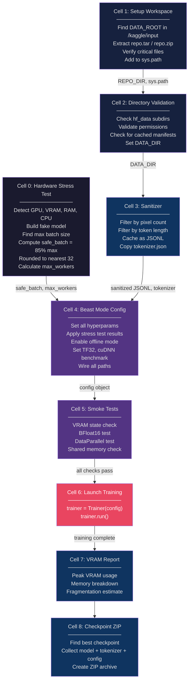

# 2. Kaggle Notebook Cells Explained

The TAMER OCR training pipeline is deployed as a **9-cell Kaggle notebook**, where each cell serves a distinct purpose in the preparation, execution, and post-processing workflow. This design is not accidental — Kaggle notebooks have specific constraints (session timeouts, limited filesystem, no persistent state between runs) that require careful cell organization. Each cell is idempotent where possible and defensive against common failure modes. This chapter provides an exhaustive walkthrough of every cell, explaining what it does, why it exists, and what can go wrong.

---

## 2.1 Cell 0: Hardware Stress Test

**Purpose**: Dynamically discover the maximum safe batch size and optimal number of data-loading workers for the current GPU environment.

### Why a Stress Test?

Kaggle assigns GPUs non-deterministically. A session might get a P100 (16 GB VRAM), a T4 (16 GB), or a V100 (16 GB). Even within the same GPU type, available memory varies depending on Kaggle's internal state. Hard-coding a batch size risks either:

- **Under-utilizing the GPU** (batch size too small → lower throughput)
- **OOM crashes mid-training** (batch size too large → hours of wasted compute)

The stress test solves this by empirically finding the maximum batch size at runtime.

### How It Works

1. **Detect GPU**: Query `torch.cuda.get_device_properties()` for GPU name, VRAM, and compute capability.
2. **Detect system resources**: Use `os.cpu_count()`, `psutil.virtual_memory()`, and `/dev/shm` size to determine available CPU cores, RAM, and shared memory.
3. **Build a fake TAMER model**: Construct a model with the same architecture as the training config but with random weights. This model occupies the same VRAM per parameter as the real one.
4. **Progressive batch size search**:
   - Start with batch size = 32
   - Allocate a dummy batch of images and run a forward + backward pass
   - If successful, increase batch size by 32
   - If OOM, catch the `RuntimeError`, reduce batch size, and stop
5. **Compute safe batch size**: `safe_batch = int(max_batch * 0.85) // 32 * 32`
   - The 0.85 multiplier provides a **15% safety margin** for memory fragmentation, gradient accumulation buffers, and the optimizer state
   - Rounding to the nearest multiple of 32 ensures **memory alignment** efficiency on NVIDIA GPUs
6. **Calculate max workers**:
   - `max_workers = min(cpu_count, ram_gb // 2, shared_mem_gb // 0.5)`
   - Each worker uses approximately 0.5 GB of shared memory and 2 GB of RAM
   - The formula ensures workers don't exhaust either resource

### Example Output

```
GPU: Tesla P100-PCIE-16GB, VRAM: 16280 MB
RAM: 13.4 GB, CPU cores: 4, Shared memory: 8.0 GB
Testing batch_size=32... OK (8.2 GB used)
Testing batch_size=64... OK (13.1 GB used)
Testing batch_size=96... OK (15.4 GB used)
Testing batch_size=128... OOM!
Max batch size: 96, Safe batch size: 80
Max workers: 3
```

### Common Pitfalls

- **Fake model vs. real model mismatch**: If the stress test uses a different architecture than the training config, the VRAM estimate will be wrong. Always use the exact same model config.
- **`/dev/shm` too small**: Kaggle sometimes provides as little as 1 GB of shared memory. In this case, `num_workers` must be reduced to 1 or 2, or the shared memory must be expanded via a tmpfs mount.
- **Fragmentation**: The 15% safety margin exists because PyTorch's CUDA memory allocator can fragment over time. Without the margin, a model that fits at the start of training may OOM later.

---

## 2.2 Cell 1: Setup Workspace

**Purpose**: Locate the dataset, extract the codebase, and prepare the Python environment.

### What Happens

1. **Find dataset root**: Scan `/kaggle/input/` for directories containing the expected subdirectories (`hf_data/crohme`, `hf_data/hme100k`, `hf_data/im2latex`). The first matching directory becomes `DATA_ROOT`.
2. **Extract codebase**: The codebase is stored as either `repo.tar` or `repo.zip` in the dataset. The cell detects the format and extracts it to `/kaggle/working/tamer_ocr/`.
3. **Verify critical files**: Check that essential files exist:
   - `trainer.py`, `model.py`, `config.py`, `tokenizer.py`
   - `data/dataset.py`, `data/transforms.py`
   - If any file is missing, raise an error immediately rather than failing later during training.
4. **Add to sys.path**: `sys.path.insert(0, REPO_DIR)` so that imports like `from model import TAMERModel` work correctly.

### Why This Cell Exists

Kaggle's filesystem is read-only for input datasets and read-write only for `/kaggle/working/`. The codebase must be extracted to the working directory because:

- Python cannot import from a tar/zip directly
- Some code writes temporary files (tokenizer cache, checkpoints) relative to the repo root
- The working directory has more space and faster I/O than the input mount

### Common Issues

- **Missing codebase archive**: If the dataset doesn't include `repo.tar` or `repo.zip`, the cell fails. The fix is to re-upload the dataset with the archive included.
- **Extraction path collision**: If a previous run left files in `/kaggle/working/tamer_ocr/`, they may conflict. The cell clears the directory before extraction.

---

## 2.3 Cell 2: Directory Validation

**Purpose**: Verify that all required data directories exist, are readable, and contain the expected files.

### What Happens

1. **Check subdirectories**: Verify that `hf_data/crohme/`, `hf_data/hme100k/`, and `hf_data/im2latex/` exist under `DATA_ROOT`.
2. **Validate permissions**: Confirm that all image files and metadata files are readable (not zero-length, not permission-denied).
3. **Check for preprocessed cache**: Look for `manifest.json` files in each subdirectory. If they exist, the sanitizer has already been run, and Cell 3 can be skipped (though it's safe to re-run).
4. **Set DATA_DIR**: Assign the validated `DATA_ROOT/hf_data` path to the config variable that `Trainer.preprocess_data()` will use.

### Why This Matters

Kaggle datasets can be silently corrupted during upload — files can be truncated, directories can be empty, and permissions can be wrong. Discovering these issues during training (after hours of GPU time) is catastrophic. Cell 2 catches them early with fast, CPU-only checks.

---

## 2.4 Cell 3: Sanitizer

**Purpose**: Filter out low-quality and extreme samples from all four datasets, caching the results as JSONL files.

### What Happens

1. **Load each dataset**: Iterate over CROHME, HME100K, Im2LaTeX, and any additional dataset.
2. **Apply filters**:
   - **Pixel count filter**: Remove images with fewer than 100 pixels (likely corrupted) or more than 4 million pixels (extremely large, causes OOM or excessive augmentation time).
   - **Token length filter**: Remove LaTeX strings with fewer than 2 tokens (degenerate) or more than 200 tokens (extremely long, dominates batch padding and slows training).
3. **Write JSONL cache**: For each dataset, write the filtered samples to a JSONL file in the working directory. Each line is a JSON object with `{"image_path": ..., "latex": ...}`.
4. **Copy tokenizer**: If a pre-trained `tokenizer.json` exists in the dataset, copy it to the working directory for the trainer to use.

### Design Rationale

The sanitizer runs **before** training, not during data loading, because:

- **Performance**: Filtering during data loading adds latency to every epoch. Pre-filtering is a one-time cost.
- **Reproducibility**: The same JSONL cache produces the same training set, regardless of how many times training is restarted.
- **Debugging**: You can inspect the JSONL files to understand exactly which samples were kept or removed.

### Filtering Statistics

Typical filtering rates:

| Dataset | Total Samples | After Filtering | Removed |
|---------|--------------|-----------------|---------|
| CROHME | 100K | 97K | 3% |
| HME100K | 100K | 92K | 8% |
| Im2LaTeX | 400K | 370K | 7.5% |

HME100K has the highest removal rate because it contains many handwritten samples with extreme aspect ratios that exceed the pixel count filter.

---

## 2.5 Cell 4: Beast Mode Config

**Purpose**: Assemble all training hyperparameters into a single configuration object, incorporating the stress test results.

### What Happens

1. **Set training hyperparameters**:
   - `epochs = 30`
   - `learning_rate = 5e-4`
   - `weight_decay = 0.05`
   - `warmup_steps = 2000`
   - `label_smoothing = 0.1`
   - `max_seq_len = 256`
   - `beam_width = 5`
   - `beam_eval_samples = 500`

2. **Apply stress test results**:
   - `batch_size = safe_batch_size` (from Cell 0)
   - `num_workers = max_workers` (from Cell 0)

3. **Configure offline mode**:
   - `push_to_hub = False` (no HuggingFace push — Kaggle has limited outbound network)
   - `wandb_project = None` (no W&B logging — same reason)
   - All logging goes to console and local JSONL files

4. **Set hardware flags**:
   - `torch.backends.cuda.matmul.allow_tf32 = True` — enables TF32 on Ampere+ GPUs for ~3x faster matmul at slightly reduced precision
   - `torch.backends.cudnn.benchmark = True` — allows cuDNN to autotune convolution algorithms for the input size
   - `torch.set_float32_matmul_precision("high")` — uses TF32 or BFloat16 for float32 matmul

5. **Wire paths**:
   - `data_dir = DATA_DIR` (from Cell 2)
   - `sanitized_dir = SANITIZED_DIR` (from Cell 3)
   - `output_dir = "/kaggle/working/checkpoints/"`
   - `cache_dir = "/kaggle/working/cache/"`

### The "Beast Mode" Philosophy

This cell is called "Beast Mode" because it enables **every available optimization** without compromise:

- TF32 trades mantissa bits for speed — acceptable for training (not for final inference precision)
- cuDNN benchmark adds a one-time autotuning cost but pays off over thousands of iterations
- BFloat16 mixed precision cuts memory usage in half and doubles throughput on supported GPUs
- Maximum safe batch size maximizes GPU utilization

The philosophy is: **on Kaggle, GPU time is limited and expensive — squeeze every last FLOP out of the hardware.**

---

## 2.6 Cell 5: Pre-flight Smoke Tests

**Purpose**: Verify that all hardware features required for training actually work before committing hours of GPU time.

### What Happens

1. **VRAM state check**: Print current VRAM usage. If more than 2 GB is already occupied, something is leaking memory from a previous cell. A CUDA cache clear (`torch.cuda.empty_cache()`) is attempted, and usage is rechecked.
2. **BFloat16 smoke test**: Create a small tensor on GPU in BFloat16, run a matmul, and verify the result dtype. If BFloat16 is not supported (pre-Ampere GPUs), fall back to Float16 with a warning.
3. **DataParallel smoke test**: Create a minimal model, wrap it in `nn.DataParallel`, and run a forward pass. Verify that all available GPUs are detected and used. If only one GPU is found, DataParallel is a no-op (not an error, but worth logging).
4. **Shared memory check**: Verify that `/dev/shm` has at least 1 GB of space. If not, reduce `num_workers` accordingly and warn the user that data loading may be bottlenecked.

### Why Smoke Tests Are Essential

These tests take less than 30 seconds but can save hours. The most common failure they catch:

- **BFloat16 not supported**: On a T4 or P100, BFloat16 requires special handling. Without the smoke test, training would crash on the first forward pass.
- **Multi-GPU configuration error**: If `CUDA_VISIBLE_DEVICES` is misconfigured, DataParallel might only see one GPU, wasting the other.
- **Shared memory exhaustion**: DataLoader workers communicate through shared memory. If `/dev/shm` is full, workers deadlock silently.

---

## 2.7 Cell 6: Launch Training

**Purpose**: Instantiate the Trainer and call `trainer.run()` — the main event.

### What Happens

```python
trainer = Trainer(config)
trainer.run()
```

That's it. All the preparation in Cells 0–5 ensures that this two-line cell runs successfully for hours without intervention. The `Trainer.run()` method executes the full pipeline described in [[1. End-to-End Pipeline Walkthrough]].

### Monitoring During Training

Since Kaggle notebooks don't support real-time tensorboard, training progress is monitored through:

- **Console output**: Loss, learning rate, and throughput are printed every N steps.
- **Periodic validation**: Every 2–3 epochs, validation metrics are printed.
- **Kaggle's session timer**: Keep an eye on remaining time. If the session is about to expire, the checkpoint from the last completed epoch is preserved.

---

## 2.8 Cell 7: VRAM Report

**Purpose**: After training completes, generate a detailed memory usage report.

### What Happens

1. **Current VRAM**: `torch.cuda.memory_allocated()` and `torch.cuda.memory_reserved()`
2. **Peak VRAM**: `torch.cuda.max_memory_allocated()` — the highest memory usage during the entire training run
3. **Memory breakdown**: Estimated allocation per component:
   - Model parameters: ~X MB
   - Optimizer state: ~2X MB (Adam stores momentum + variance)
   - Gradient buffers: ~X MB
   - Activation memory: variable, depends on batch size and sequence length
4. **Fragmentation estimate**: The difference between reserved and allocated memory indicates fragmentation

This report is useful for future runs — if you know the peak VRAM was 14.2 GB on a 16 GB GPU, you know there's room for a slightly larger batch size or a deeper model.

---

## 2.9 Cell 8: Checkpoint ZIP

**Purpose**: Archive the best checkpoint and all associated files for download or deployment.

### What Happens

1. **Identify best checkpoint**: Find the checkpoint with the lowest validation edit distance (or highest ExpRate, depending on config).
2. **Collect files**:
   - `best_checkpoint.pt` — model weights, optimizer state, RNG states
   - `tokenizer.json` — the trained tokenizer (essential for inference)
   - `config.json` — the full training configuration
   - `training_log.jsonl` — step-by-step training metrics
3. **Create ZIP**: Compress all files into `/kaggle/working/tamer_ocr_best.zip`
4. **Report size**: Print the ZIP file size and the location

### Why ZIP?

Kaggle's output system preserves files in `/kaggle/working/`, but downloading individual files is cumbersome. A single ZIP is easier to manage, transfer, and use as input to a deployment notebook.

---

## 2.10 Notebook Cell Flow Diagram



---

## 2.11 Cell Execution Strategy

### Order Matters

Cells 0–5 **must** be executed in order because each cell's output feeds into the next. The data flow is:

```
Cell 0 → (safe_batch, max_workers) → Cell 4
Cell 1 → (REPO_DIR) → Cell 2
Cell 2 → (DATA_DIR) → Cell 3
Cell 3 → (sanitized_dir, tokenizer) → Cell 4
Cell 4 → (config) → Cell 5
Cell 5 → (pass/fail) → Cell 6
Cell 6 → (checkpoints) → Cell 7 → Cell 8
```

### Idempotency

Most cells are designed to be **re-runnable** without side effects:

- Cell 0: Re-runs the stress test (safe, but wastes a few minutes)
- Cell 1: Re-extracts the codebase (overwrites existing files)
- Cell 2: Re-validates directories (read-only, no side effects)
- Cell 3: **Overwrites** the JSONL cache (idempotent because the filter is deterministic)
- Cell 4: Re-creates the config (pure computation)
- Cell 5: Re-runs smoke tests (read-only)
- Cell 6: **Not idempotent** — starts training from scratch or resumes from checkpoint
- Cells 7–8: Read-only diagnostics and archiving

### Handling Session Timeouts

Kaggle sessions timeout after 9–12 hours. If training doesn't complete:

1. Save the session output (contains the checkpoint paths)
2. Start a new session
3. Run Cells 0–5 again (fast, ~5 minutes)
4. Run Cell 6 — `auto_resume()` will find the latest checkpoint and continue
5. Run Cells 7–8 after training completes

The key enabler is `auto_resume()` — without it, each session timeout would mean starting from scratch, making long training runs impossible on Kaggle.

### Pro Tips

- **Run Cell 0 first, always**: Even if you think you know the batch size, the GPU assignment can change between sessions.
- **Check Cell 5 output carefully**: A failed smoke test means training *will* fail. Don't skip it.
- **Monitor Cell 6 output**: If the training loss plateaus or validation metrics don't improve for 5+ epochs, consider stopping early and adjusting the learning rate.
- **Keep the ZIP small**: Don't archive all checkpoints — only the best one. Intermediate checkpoints can be tens of GB.
- **Save the tokenizer**: The `tokenizer.json` file is as important as the model weights. Without it, the model cannot encode inputs or decode outputs during inference.
