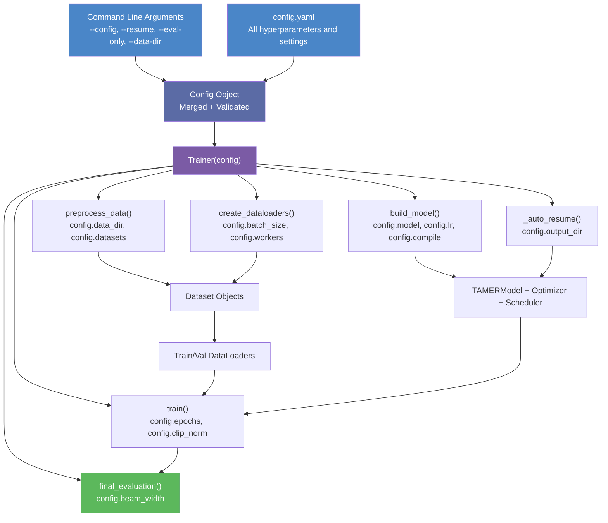

# 3. The train.py Entry Point

## Overview

The `train.py` file is the **command-line entry point** for the entire TAMER OCR training pipeline. It is the file you execute to start training, resume from a checkpoint, or run evaluation. Despite its central role, `train.py` is deliberately kept thin — it handles argument parsing, configuration loading, and orchestrates the Trainer, but delegates all substantive logic to the Trainer class and its associated engine functions. This separation of concerns keeps the entry point clean and maintainable while allowing the training logic to be tested and extended independently.

## Argument Parsing

The `train.py` file uses Python's `argparse` module to define a clean command-line interface. The following arguments are supported:

```python
parser = argparse.ArgumentParser(description="TAMER OCR Training")
parser.add_argument("--config", type=str, default="config.yaml",
                    help="Path to configuration file")
parser.add_argument("--resume", type=str, default=None,
                    help="Path to checkpoint to resume from")
parser.add_argument("--eval-only", action="store_true",
                    help="Run evaluation only, no training")
parser.add_argument("--data-dir", type=str, default=None,
                    help="Override data directory from config")
args = parser.parse_args()
```

### --config

The `--config` argument specifies the path to a YAML configuration file that defines all training hyperparameters, model architecture settings, data paths, and training options. If not provided, it defaults to `config.yaml` in the current directory. The configuration file is the **single source of truth** for all settings, ensuring reproducibility.

### --resume

The `--resume` argument allows resuming training from a specific checkpoint. If provided, the Trainer loads the checkpoint (including model weights, optimizer state, scheduler state, and the epoch counter) and continues training from where it left off. If not provided, the `_auto_resume()` method will attempt to find the latest checkpoint in the output directory automatically.

### --eval-only

The `--eval-only` flag skips training entirely. The Trainer loads the best checkpoint, runs the beam-search evaluation on the validation set, reports metrics, and exits. This is useful for evaluating a trained model without risking any modification to its weights.

### --data-dir

The `--data-dir` argument overrides the data directory specified in the configuration file. This is useful when running on different machines where the data is stored at different paths, or when switching between local and network storage.

## Creating the Config Object

After parsing arguments, `train.py` creates a `Config` object that merges the YAML configuration file with any command-line overrides:

```python
config = Config.from_yaml(args.config)
if args.data_dir:
    config.data_dir = args.data_dir
```

The `Config` class is a structured configuration container (typically a dataclass or a dictionary-based class) that provides typed access to all settings. It validates the configuration at load time, catching common errors like invalid batch sizes or missing required fields. The config object flows through the entire pipeline — from `train.py` to the `Trainer` to the engine functions — ensuring that every component has consistent access to the same settings.

Key configuration sections include:

- **Model**: encoder type, decoder layers, hidden dimension, attention heads, vocabulary size
- **Training**: batch size, learning rate, scheduler type, number of epochs, gradient clipping
- **Data**: dataset paths, image size, augmentation settings, curriculum schedule
- **Hardware**: number of workers, pin_memory, precision mode, compile settings
- **Output**: checkpoint directory, logging frequency, HuggingFace push settings

## Instantiating the Trainer

With the configuration loaded, `train.py` creates the `Trainer` instance:

```python
trainer = Trainer(config)
```

The `Trainer` constructor does not start training immediately. It stores the configuration and initializes internal state (step counters, logging buffers, etc.). The actual training is triggered by calling `trainer.run()`. This design allows the caller to inspect or modify the trainer before starting the training loop, which is useful for debugging or custom workflows.

## The run() Method

The `run()` method is the **heart of the training pipeline**. It executes the complete training workflow in a specific order, with each step building on the results of the previous one:

```python
def run(self):
    """Execute the complete training pipeline."""
    self.preprocess_data()      # 1. Load and prepare datasets
    self.create_dataloaders()   # 2. Build DataLoader objects
    self.build_model()          # 3. Initialize model, optimizer, scheduler
    self._auto_resume()         # 4. Load latest checkpoint if available
    self.train()                # 5. Main epoch loop
    self.final_evaluation()     # 6. Beam-search evaluation
```

### Step 1: preprocess_data()

This method loads raw data from all configured datasets (CROHME, Im2LaTeX, HME100K, MathWriting), applies sanitization and filtering, and creates the unified dataset objects. It handles downloading datasets if they are not available locally, parsing various file formats (.inkml, images, HDF5), and splitting the data into training and validation sets.

The preprocessing step also applies the **curriculum learning** ordering: the datasets are organized into three stages (printed → clean handwritten → messy handwritten), and the training data is structured accordingly.

### Step 2: create_dataloaders()

This method wraps the preprocessed datasets in PyTorch DataLoader objects with the appropriate settings:

- `batch_size` from the config (after the stress test adjustment)
- `num_workers` set to maximize parallel loading
- `pin_memory=True` for efficient GPU transfers
- `persistent_workers=True` to avoid respawn overhead
- `prefetch_factor=4` for deep buffering
- Custom `collate_fn` that pads sequences to equal length within each batch

Separate DataLoaders are created for training, validation, and (optionally) testing, each with appropriate settings (e.g., no shuffling for validation).

### Step 3: build_model()

This method initializes the complete model stack:

1. **TAMERModel**: The encoder-decoder model (Swin-v2 encoder + Transformer decoder)
2. **Optimizer**: AdamW with the configured learning rate and weight decay
3. **Scheduler**: Cosine annealing with warmup (or the configured scheduler type)
4. **GradScaler**: For mixed precision training stability
5. **torch.compile**: Applied to the model if enabled in the config
6. **DataParallel**: Wrapping for multi-GPU training if multiple GPUs are available

The build_model step also handles the **encoder freeze** decision: based on the current training phase (controlled by the curriculum schedule), the encoder parameters may be frozen to train the decoder first.

### Step 4: _auto_resume()

The auto-resume mechanism checks the output directory for existing checkpoints. If a checkpoint is found (and `--resume` was not explicitly specified), it loads the latest one automatically. This is critical for **Kaggle notebook** execution, where the notebook may be restarted and should continue from the last saved state without manual intervention.

```python
def _auto_resume(self):
    """Automatically find and load the latest checkpoint."""
    ckpt_dir = Path(self.config.output_dir) / "checkpoints"
    if ckpt_dir.exists():
        checkpoints = sorted(ckpt_dir.glob("epoch_*.pt"))
        if checkpoints:
            latest = checkpoints[-1]
            self._load_checkpoint(latest)
            print(f"Auto-resumed from {latest}")
```

If `--resume` is specified with a specific path, that checkpoint is loaded instead of the auto-detected one.

### Step 5: train()

The main training loop iterates over the configured number of epochs. Within each epoch, it processes all batches in the training DataLoader, computes the forward pass, backward pass, and optimizer step. It handles gradient clipping, learning rate scheduling, step-level and epoch-level logging, and periodic checkpoint saving.

The train() method also implements the **curriculum transitions**: at the appropriate epoch boundaries, it unfreezes the encoder, adjusts the learning rate, and switches the training data to the next curriculum stage.

### Step 6: Final Beam-Search Evaluation

After all training epochs complete, a final evaluation is performed using **beam search** decoding (typically with beam width 5). This produces higher-quality predictions than greedy decoding and gives a more accurate assessment of the model's LaTeX generation capability. The evaluation computes exact match rate, edit distance, and token-level accuracy metrics.

## Eval-Only Mode

When the `--eval-only` flag is set, the `run()` method takes a different path:

```python
def run(self):
    if self.config.eval_only:
        self.build_model()
        self._load_best_checkpoint()
        self.final_evaluation()
        return
    # ... normal training path
```

In eval-only mode, the model is built and the best checkpoint is loaded, but no training occurs. The beam-search evaluation runs on the validation set, and the results are reported. This is useful for:

- Evaluating a model after training completes
- Comparing different checkpoints
- Generating predictions for submission or analysis
- Debugging the evaluation pipeline without the overhead of training

## Resume from Checkpoint

Resume functionality is essential for long training runs that may be interrupted (by GPU preemption on Kaggle, for example). When resuming, the following state is restored:

- **Model weights**: All encoder and decoder parameters
- **Optimizer state**: Adam's momentum and variance buffers
- **Scheduler state**: The current learning rate and step count
- **Epoch counter**: Training continues from the correct epoch
- **Best metric**: The best validation score seen so far (for checkpoint selection)

The resume path can be specified explicitly via `--resume /path/to/checkpoint.pt` or detected automatically by `_auto_resume()`.

## Offline Mode

The configuration supports an **offline mode** by setting `config.hf_token = ""`. When the HuggingFace token is empty, the training pipeline skips all HuggingFace Hub operations — no model pushing, no dataset downloading from HuggingFace, and no metric logging to the Hub. This is essential for:

- **Air-gapped environments**: Machines without internet access
- **Kaggle notebooks**: Where internet may be disabled for competition compliance
- **Local development**: Where you want to iterate quickly without network overhead

The offline mode is detected and handled gracefully throughout the pipeline. Dataset downloads fall back to local caches, and all Hub operations are silently skipped.

## Configuration Flow

The configuration object flows through the entire pipeline in a **top-down** manner:



This diagram illustrates how the single Config object, created from the merge of the YAML file and command-line arguments, is passed to the Trainer and then flows down to every engine function. Each function extracts the settings it needs from the config, ensuring consistency across the pipeline. The `--data-dir` override, for example, modifies the config before it reaches `preprocess_data()`, so the data loading automatically uses the correct path.

## Error Handling and Validation

The `train.py` entry point includes several validation checks before training begins:

- **Config validation**: Required fields are checked, and invalid values raise informative errors
- **GPU availability**: If CUDA is not available, a clear error message is printed
- **Data existence**: If the data directory does not exist, the download mechanism is triggered
- **Checkpoint validity**: If a specified checkpoint does not exist or is corrupted, an error is raised

These checks prevent silent failures that would waste GPU time. It is far better to fail fast with a clear error message than to start training and encounter a cryptic error 30 minutes in.

## Summary

The `train.py` entry point is the orchestrator of the TAMER training pipeline. It parses command-line arguments, loads and merges configuration, creates the Trainer, and triggers the complete training workflow through `run()`. The six-step pipeline — preprocess, dataloaders, build model, auto-resume, train, evaluate — provides a clean, reproducible training process. Eval-only mode and checkpoint resuming support the practical needs of long training runs on shared infrastructure, while offline mode ensures the pipeline works in air-gapped environments. The configuration flows consistently from command-line to every engine function, making the pipeline both flexible and maintainable.
