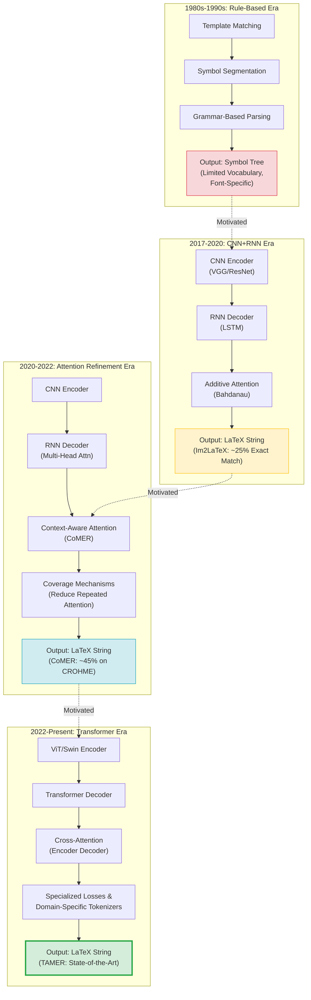

# 4. The OCR Landscape - How TAMER Compares

The TAMER OCR system does not exist in a vacuum. It is the latest entry in a line of research stretching back decades, each generation of systems building on the insights and limitations of its predecessors. Understanding this lineage is essential for appreciating why TAMER makes the architectural choices it does, why it uses Swin Transformer v2 instead of a vanilla Vision Transformer, why it employs a custom LaTeX tokenizer instead of a generic subword model, and why its structure-aware loss and curriculum learning strategies matter. This chapter surveys the evolution of math OCR systems, examines key related work, and explains how TAMER differs from and improves upon previous approaches.

## The Evolution of Math OCR Systems

### Early Approaches: Rule-Based Systems and Template Matching

The earliest math OCR systems, developed in the 1980s and 1990s, were entirely **rule-based**. They relied on hand-crafted heuristics to segment symbols, classify them using template matching (comparing pixel patterns against a library of known glyphs), and then apply grammar rules to determine the spatial structure. Systems like the Rogers-Kuth theorem prover OCR module and early versions of the INFTY system worked as follows:

1. **Symbol segmentation**: Connected component analysis would isolate individual ink strokes or printed glyphs. The system would use heuristics like aspect ratio, size, and position relative to the baseline to decide whether a group of pixels constituted a single symbol or multiple symbols merged together.

2. **Symbol classification**: Each segmented component was compared against a fixed library of symbol templates using correlation or feature matching. The system would output the best-matching symbol class along with a confidence score.

3. **Structure parsing**: A handwritten grammar — typically a context-free grammar encoding the rules of mathematical notation — would parse the sequence of classified symbols into a tree structure representing the expression's semantics. Rules like "a symbol above a horizontal line above another symbol is a fraction" would be encoded explicitly.

These systems were brittle. They worked only on specific fonts, failed on handwritten input, required extensive manual tuning for each new symbol set, and could not handle the full complexity of mathematical notation. Adding support for a new symbol meant manually creating a template and writing new grammar rules. The systems were also fundamentally limited by the quality of the segmentation step — if two symbols touched (a common occurrence in printed math and ubiquitous in handwriting), the entire pipeline failed.

### CNN + RNN: The Deep Learning Revolution

The breakthrough came with the application of **encoder-decoder architectures** from neural machine translation to the image-to-LaTeX problem. The key insight was to treat math OCR as a **sequence-to-sequence translation** problem: the input "language" is an image, and the output "language" is LaTeX. The seminal paper in this direction was **Im2LaTeX** (Deng et al., 2017), which used:

- A **CNN encoder** (based on the VGG architecture) to extract a grid of feature vectors from the input image. The CNN processes the image through a series of convolutional and pooling layers, producing a 2D feature map that captures local visual patterns.
- An **attention-based RNN decoder** (specifically, a two-layer LSTM) to generate the LaTeX sequence token by token. At each decoding step, the LSTM produces a query vector that is used to compute attention weights over the CNN's feature map, allowing the decoder to "look at" the most relevant part of the image for the current token.

Im2LaTeX demonstrated that end-to-end deep learning could significantly outperform rule-based systems, achieving about 25% exact match accuracy on the Im2LaTeX dataset — a then-state-of-the-art result. However, the system had clear limitations:

- The CNN's limited receptive field meant it struggled with long-range spatial relationships (e.g., matching opening and closing delimiters far apart in the image).
- The LSTM's sequential processing created a bottleneck: information from the last encoder position had to be "carried through" the entire hidden state to influence early decoding steps.
- The system used a generic character-level tokenizer, which was inefficient for LaTeX (common commands like `\frac` were decomposed into six separate tokens: `\`, `f`, `r`, `a`, `c`, `{`).

### Attention-Based Improvements

After Im2LaTeX, a wave of papers improved the attention mechanism itself. The standard additive attention (Bahdanau-style) was replaced with multiplicative attention (Luong-style), and various attention coverage mechanisms were introduced to prevent the decoder from attending to the same image region repeatedly while ignoring others. The **CoMER** system (Context-aware Math Equation Recognition, Zhao et al., 2022) introduced a particularly noteworthy improvement: a **context-aware** attention mechanism that explicitly models the geometric relationships between attention positions at consecutive time steps. If the model just attended to the numerator of a fraction, the context module biases the next attention step toward the denominator region directly below. This inductive bias — that math notation has strong geometric regularity — significantly improved performance on expressions with complex spatial layouts.

Other attention improvements included multi-head attention (borrowing from the Transformer literature) applied to CNN+RNN systems, and hierarchical attention that first selects a coarse region of the image and then attends to fine details within that region.

### Transformer-Based: The Current Paradigm

The most recent generation of math OCR systems replaces both the CNN encoder and the RNN decoder with **Transformers**. The Transformer architecture, introduced by Vaswani et al. in 2017 for natural language processing, has several advantages for math OCR:

- **Global receptive field**: Self-attention connects every position to every other position in a single layer, eliminating the limited receptive field problem of CNNs.
- **No sequential bottleneck**: Unlike LSTMs, Transformers process all positions in parallel, and the attention mechanism can directly access any position in the encoder's output without information having to "flow through" intermediate time steps.
- **Scalability**: Transformers scale gracefully with model size, data size, and compute, following predictable scaling laws.

**TAMER belongs to this generation.** It uses a Swin Transformer v2 encoder (a hierarchical variant of the Vision Transformer) and a standard Transformer decoder, connected by cross-attention layers. The following sections explain how TAMER's specific design choices differentiate it from other Transformer-based systems.

## Key Related Systems and Papers

### Im2LaTeX (2017)

As discussed above, Im2LaTeX was the pioneering work in neural image-to-LaTeX. Its contributions include: formalizing the problem as image-to-sequence generation, creating the first large-scale dataset of rendered LaTeX formulas paired with their source code, and demonstrating that attention-based models could learn to parse mathematical notation without hand-coded rules. Its limitations (CNN receptive field, LSTM bottleneck, character-level tokenization) motivated all subsequent work.

### TrOCR (2021)

**TrOCR** (Transformer-based Optical Character Recognition), developed by Microsoft Research, is a general-purpose OCR system that uses a **ViT (Vision Transformer) encoder** and a **RoBERTa decoder**. The ViT encoder splits the image into fixed-size patches (typically 16x16 pixels), linearly projects each patch, and processes the resulting sequence through standard Transformer encoder layers. The RoBERTa decoder is initialized with pre-trained weights from the RoBERTa language model, giving it a strong prior over text structure.

TrOCR achieves excellent results on standard text OCR benchmarks. However, it has several limitations for math OCR:

1. **Fixed patch size**: ViT uses a single patch resolution (16x16), which may be too coarse for small mathematical symbols (subscripts, dots, accents) and too fine for large structural elements (integral signs, fraction bars). Swin Transformer's hierarchical multi-scale features address this.
2. **Generic language model decoder**: RoBERTa's pre-training on English text gives it a strong prior for natural language, but this prior can be counterproductive for LaTeX, which has very different structural patterns. TAMER uses a custom LaTeX tokenizer and trains the decoder from scratch on math data.
3. **No structure-aware loss**: TrOCR uses standard cross-entropy loss, treating all tokens equally. In math OCR, structural tokens (braces, delimiters, environment markers) carry disproportionate importance.

### Pix2Struct (2023)

**Pix2Struct**, developed by Google Research, is a screenshot-to-structured-data model. It takes webpage screenshots as input and generates structured representations (HTML, tables, charts) as output. Pix2Struct uses a ViT encoder with a novel **variable-resolution patch extraction** strategy: instead of dividing the image into a fixed grid of patches, it extracts patches at variable scales based on the image's aspect ratio, preserving the layout structure.

Pix2Struct's variable-resolution approach is relevant to math OCR because mathematical expression images also vary widely in aspect ratio (from a wide inline expression to a tall multi-line derivation). However, Pix2Struct was designed for a broader set of tasks and was not specifically optimized for LaTeX generation. Its pre-training on webpage data does not transfer well to mathematical notation.

### Nougat (2023)

**Nougat** (Network for Understanding and Generating Academic Text), developed by Meta AI, is a model for understanding academic PDFs. It takes a PDF page image as input and generates a Markdown representation that includes both text and LaTeX math. Nougat uses a Swin Transformer encoder (similar to TAMER) and an mBART decoder.

Nougat is the most architecturally similar system to TAMER. Both use Swin Transformer encoders and both target mathematical content. The key differences are:

1. **Scope**: Nougat processes entire PDF pages (mixed text, math, figures), while TAMER focuses on individual mathematical expressions. TAMER's narrower scope allows it to specialize and achieve higher accuracy on pure math.
2. **Decoder pre-training**: Nougat uses an mBART decoder pre-trained on multilingual text. TAMER trains its decoder from scratch with a custom LaTeX vocabulary, avoiding the mismatch between natural language pre-training and LaTeX structure.
3. **Loss function**: Nougat uses standard cross-entropy loss, while TAMER employs structure-aware loss that upweights critical structural tokens.

### CoMER (2022)

**CoMER** (Context-aware Math Equation Recognition) represents the pinnacle of the CNN+RNN+attention paradigm. Its context-aware attention mechanism, which models geometric relationships between consecutive attention positions, is a clever inductive bias for math OCR. However, CoMER is still fundamentally limited by its CNN encoder and LSTM decoder. The CNN cannot capture global relationships as effectively as a Transformer, and the LSTM's sequential processing is slower and less parallelizable.

TAMER incorporates the geometric intuition behind CoMER's context-aware attention in a different way: the Swin Transformer's hierarchical windowing naturally creates a multi-scale representation where local geometric relationships are captured at early layers and global structure emerges at deeper layers. This achieves a similar effect without requiring an explicit context module.

## How TAMER Differs: A Detailed Comparison

### Swin-v2 Instead of ViT

The choice of **Swin Transformer v2** as the encoder is one of TAMER's most consequential design decisions. Standard Vision Transformers (ViT) process images at a single resolution: the image is divided into fixed-size patches, and all self-attention operations happen at this single scale. Swin Transformer, by contrast, uses a **hierarchical architecture** that processes the image at progressively lower spatial resolutions and higher channel dimensions:

- **Stage 1**: High-resolution patches (e.g., 4x4 pixels per patch), capturing fine details like small symbols and thin lines.
- **Stage 2**: Patches are merged, halving the spatial resolution and doubling the channels. This captures mid-level features like symbol combinations and local spatial relationships.
- **Stage 3 and 4**: Further merging produces low-resolution, high-dimensional feature maps that capture global structure like the overall layout of a matrix or the spanning relationship between opening and closing delimiters.

This hierarchical structure is **naturally suited for mathematical expressions**, where information exists at multiple scales simultaneously. A small subscript must be recognized at fine resolution, while the overall two-dimensional layout must be understood at coarse resolution. The Swin-v2 variant (Liu et al., 2022) further improves upon the original Swin Transformer with better normalization, rescaling strategies, and more stable training — making it the ideal encoder for variable-size mathematical images.

### Custom LaTeX Tokenizer

TAMER's **custom LaTeX tokenizer** treats LaTeX commands as atomic tokens. Instead of decomposing `\frac` into six characters, the tokenizer has a single token `\frac`. Similarly, `\alpha`, `\begin{matrix}`, and `\\` are each single tokens. This design has several advantages:

1. **Shorter sequences**: The token sequence is much shorter than character-level tokenization, which means the decoder has fewer steps to generate and fewer opportunities to make errors.
2. **Semantically meaningful units**: Each token corresponds to a meaningful LaTeX construct, making the model's job easier (it predicts whole commands rather than individual characters).
3. **Structure-aware vocabulary**: Structural tokens like `\\`, `&`, `\begin`, and `\end` are explicitly represented in the vocabulary, enabling the structure-aware loss to target them directly.

### Structure-Aware Loss

The **structure-aware loss** is TAMER's most novel contribution. It modifies the standard cross-entropy loss by applying higher weights to tokens that define the structure of the LaTeX output:

- **Row separators** (`\\`): weight 3.0
- **Column separators** (`&`): weight 3.0
- **Environment delimiters** (`\begin`, `\end`): weight 2.5
- **Braces** (`{`, `}`): weight 2.0
- **All other tokens**: weight 1.0

The intuition is that a missing or incorrect content token (e.g., `\alpha` vs `\beta`) affects only one part of the rendered expression, while a missing structural token (e.g., a missing `\\` in a matrix) corrupts the entire layout. By upweighting structural tokens, the loss function teaches the model to prioritize getting the structure right, even at the cost of occasional content errors.

### Curriculum Learning

TAMER uses a **curriculum learning** strategy that starts training on simple expressions (short, inline, no nesting) and progressively introduces more complex ones (long, multi-line, deep nesting, matrices). This mirrors the way humans learn mathematical notation and has been shown to improve both final accuracy and training stability. The curriculum is implemented by sorting the training data by a complexity metric (expression length, nesting depth, number of structural tokens) and gradually increasing the maximum complexity threshold during training.

### 4-Dataset Training

TAMER is trained on **four diverse datasets**: CROHME (handwritten), Im2LaTeX (rendered from arXiv), 100k formulas (mixed complexity), and a custom dataset (filling structural gaps). This diversity is critical for generalization. A model trained only on CROHME would struggle with rendered (printed) expressions, and vice versa. The multi-dataset strategy ensures the model sees the full range of visual variation it will encounter at test time.

### Multi-GPU + BFloat16

TAMER is designed to scale. The training pipeline supports **multi-GPU training via DataParallel**, distributing the batch across multiple GPUs and synchronizing gradients. Combined with **BFloat16 mixed precision** (which uses 16-bit brain floating point for forward/backward passes while maintaining 32-bit master weights), TAMER can train with large batch sizes (e.g., 256 images) on modern GPU hardware without running out of memory. This is not merely an engineering convenience — large batch sizes are known to improve Transformer training stability and final performance.

## Why Encoder-Decoder Beats Decoder-Only for This Task

An alternative to the encoder-decoder architecture is the **decoder-only** approach used by language models like GPT. In this paradigm, the image would be converted to a sequence of patch embeddings and prepended to the output token sequence, and a single Transformer with causal masking would process the entire concatenation.

While decoder-only models work well for language generation (where the input is also a sequence of tokens), they are suboptimal for image-to-sequence tasks because:

1. **Bidirectional encoding is important for images**: Understanding a mathematical expression requires looking at the whole image simultaneously — the relationship between a fraction bar and its numerator is bidirectional, not causal. An encoder with bidirectional attention captures these relationships more naturally than a decoder with causal masking.

2. **Separation of concerns**: In an encoder-decoder model, the encoder specializes in visual understanding and the decoder specializes in sequence generation. This division of labor leads to better representations in each component. In a decoder-only model, the same parameters must handle both visual understanding and text generation, which is a harder optimization problem.

3. **Training efficiency**: Encoder-decoder models can use teacher forcing efficiently during training (the entire target sequence is available to the decoder via causal masking), while the encoder processes the image in a single forward pass. Decoder-only models require more careful handling of the image prefix during training.

## OCR System Evolution Timeline

The diagram above shows the four eras of math OCR, each building on the limitations of the previous one. TAMER sits at the culmination of the Transformer era, combining the best ideas from each generation: the **sequence generation** paradigm from Im2LaTeX, the **geometric awareness** from CoMER, the **hierarchical visual features** from Swin Transformer (as used in Nougat), and adding its own innovations in the form of **structure-aware loss**, **curriculum learning**, and **domain-specific tokenization**.

Understanding this landscape is not just historical context — it directly informs how you should think about the model's failure modes. When TAMER makes errors, they often fall into categories that correspond to the challenges each previous generation struggled with: spatial structure errors (the rule-based era's problem), long-range dependency errors (the CNN+RNN era's problem), and attention misalignment errors (the attention refinement era's problem). By knowing what each generation found difficult, you can more quickly diagnose and understand TAMER's limitations.
