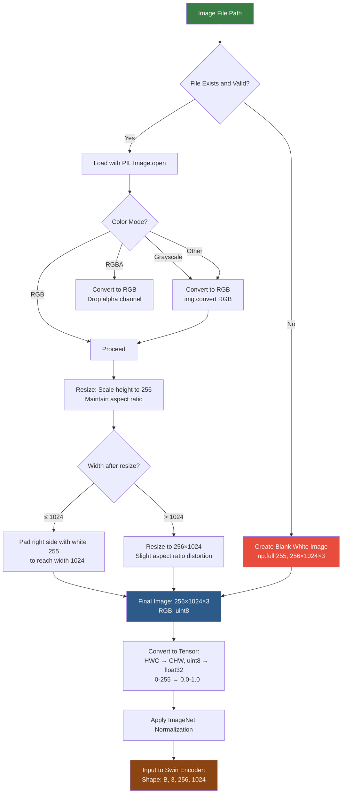

# 1. Digital Images and Representation

## 1.1 Pixels as Numbers: Grayscale and RGB

At the most fundamental level, a digital image is just a grid of numbers. Each cell in the grid is called a **pixel** (picture element), and its numerical value represents the intensity of light at that position.

### Grayscale Images: H × W
A grayscale image has a single channel — each pixel is one number representing brightness:
- **0** = black (no light)
- **255** = white (maximum light) for 8-bit images
- Values in between represent shades of gray

A 100×150 grayscale image is a matrix of shape `(100, 150)` — 100 rows (height) and 150 columns (width), with each entry being an integer from 0 to 255.

### RGB Images: H × W × 3
A color image uses three channels — Red, Green, and Blue — that combine additively to produce any visible color:

- **Red channel**: How much red light at each pixel
- **Green channel**: How much green light at each pixel
- **Blue channel**: How much blue light at each pixel

A 100×150 RGB image has shape `(100, 150, 3)` — height × width × 3 channels. Each pixel is a triplet $(r, g, b)$ where each component ranges from 0 to 255.

**Why RGB?** The human eye has three types of cone cells, each sensitive to different wavelengths of light (roughly red, green, and blue). By mixing these three primary colors, we can approximate any color the human eye can perceive. This is the additive color model — different from the subtractive model used in painting (CMYK).

**For TAMER OCR**, all input images are RGB (3 channels), even if the original image is grayscale. The Swin Transformer v2 expects 3-channel input because it was pretrained on ImageNet (which is entirely RGB). A grayscale image is converted to RGB by simply repeating the single channel three times: `(H, W) → (H, W, 3)` where all three channels are identical.

## 1.2 Image File Formats: PNG, JPEG, and Their Tradeoffs

### PNG (Portable Network Graphics)
- **Lossless compression**: Every pixel is preserved exactly
- **Supports transparency** (alpha channel)
- **Larger file sizes** than JPEG for photographic content
- **Ideal for**: Synthetic images, text, line art, mathematical formulas
- **Why it matters for OCR**: Mathematical formulas have sharp edges and fine details (think of the serif on an integral sign or the thin horizontal bar in a fraction). Lossy compression would blur these details.

### JPEG (Joint Photographic Experts Group)
- **Lossy compression**: Some image information is discarded to reduce file size
- **Compression artifacts**: Blockiness near edges, "ringing" around sharp transitions
- **Smaller file sizes** than PNG (often 10× smaller)
- **Not suitable for**: Text, line art, or any content where pixel-perfect detail matters
- **Why it's problematic for OCR**: The compression artifacts can blur thin strokes, merge closely spaced symbols, and introduce false edges. A $\partial$ (partial derivative) symbol with compression artifacts might look like a $d$ to the model.

### Practical Implications for TAMER OCR

The CROHME dataset provides images in PNG format (lossless), which is ideal. HME100K and Im2LaTeX may include JPEG images. When working with JPEG inputs, the compression artifacts are an additional source of noise that the model must learn to be robust against.

**Tip**: If you have control over the image format, always use PNG for math OCR. If you must work with JPEG, consider the quality setting — quality 90+ preserves most details, while quality < 70 introduces significant artifacts.

## 1.3 How PIL and OpenCV Read Images

### PIL (Python Imaging Library / Pillow)
```python
from PIL import Image

img = Image.open("formula.png")  # Returns PIL.Image object
img_array = np.array(img)        # Shape: (H, W, 3) for RGB, dtype: uint8

# PIL opens images in RGB format by default
# Values are integers from 0 to 255
```

PIL is the standard library for image I/O in PyTorch workflows. `torchvision.datasets` and most data loaders use PIL under the hood. Key behaviors:
- Opens images in **RGB** format (not BGR)
- Returns a PIL Image object (not an array — you must call `np.array()` to convert)
- Handles format conversion automatically (e.g., opening a grayscale PNG as RGB)
- Lazy loading — the image data isn't read from disk until actually needed

### OpenCV (cv2)
```python
import cv2

img = cv2.imread("formula.png")  # Returns numpy array, shape: (H, W, 3), dtype: uint8
img_rgb = cv2.cvtColor(img, cv2.COLOR_BGR2RGB)  # Convert BGR to RGB!

# OpenCV opens images in BGR format — this is a common source of bugs
```

OpenCV is faster than PIL for many operations and provides more image processing functions, but it has two pitfalls:
1. **BGR format**: OpenCV reads images in Blue-Green-Red order, not RGB. If you feed a BGR image to a model trained on RGB data, the colors will be wrong. For math OCR, this might not matter much (math images are mostly black-on-white), but it's still best practice to convert.
2. **Returns numpy arrays directly**: No need for `np.array()` conversion, but the interface is less Pythonic than PIL.

**In TAMER OCR**, PIL is used for image loading because it integrates naturally with `torchvision.transforms` and the Albumentations library. The pipeline is: PIL → numpy → Albumentations → tensor.

## 1.4 Color Channels and Why We Convert to RGB for Swin

The Swin Transformer v2 was pretrained on ImageNet-1K or ImageNet-22K, which consists entirely of RGB images. The first layer of the model — the **patch embedding** — is a convolutional layer with 3 input channels:

```python
# Inside Swin Transformer
self.patch_embed = PatchEmbed(
    img_size=img_size,
    patch_size=4,
    in_chans=3,  # Expects 3 input channels!
    embed_dim=96
)
```

If we feed a single-channel grayscale image, the patch embedding would fail because the weight tensor has shape `(96, 3, 4, 4)` — it expects 3 input channels. The solution is simple: convert grayscale to RGB by repeating the channel:

```python
if img.mode != 'RGB':
    img = img.convert('RGB')
```

This is a no-op visually — the "RGB" image looks identical to the grayscale original because all three channels have the same values. But it satisfies the model's input requirement.

**Why not modify the model to accept 1 channel?** You could replace the patch embedding with `in_chans=1`, but then you couldn't use the pretrained weights. The pretrained patch embedding has learned useful edge and color detectors in its 3-channel weights. By converting to 3 channels, we can load the pretrained weights directly and benefit from transfer learning.

## 1.5 Image Resolution and Its Impact on OCR Quality

Resolution — the number of pixels in the image — directly determines how much detail is available to the model. Consider a small integral sign $\int$ rendered at different resolutions:

- **10×30 pixels**: Just a blurry S-curve. Hard to distinguish from an $f$ or $S$.
- **30×90 pixels**: The distinctive serifs and curvature are visible. Could be $\int$ or $\oint$.
- **100×300 pixels**: All details are clear — the serifs, the curvature, the stroke width. Easily distinguished from similar symbols.

**The resolution-accuracy relationship is not linear.** Below a certain threshold, accuracy drops sharply because critical features (thin strokes, small dots, close spacing) are lost. Above the threshold, additional resolution provides diminishing returns while increasing computational cost.

For mathematical formulas, the critical features that require adequate resolution include:
- Thin strokes (fraction bars, overlines, underlines)
- Small details (dots on $i$ and $j$, accents like $\hat{x}$, $\ddot{x}$)
- Close spacing (superscripts and subscripts like $x^2$ where the "2" is very close to the "x")
- Fine distinctions ($\partial$ vs $d$, $\in$ vs $\epsilon$, $O$ vs $0$)

## 1.6 The 256×1024 Resolution Choice in TAMER

TAMER OCR uses a fixed input resolution of **256 height × 1024 width**. This is a deliberate choice with several rationales:

### Why 256 Height
- Math formulas are typically not very tall — even complex nested fractions and matrices rarely exceed 256 pixels in height at a reasonable DPI
- 256 is a power of 2, which is efficient for the Swin Transformer's hierarchical downsampling (256 → 128 → 64 → 32 → 16 through 4 stages with 2× downsampling each)
- Preserving the aspect ratio by scaling to height=256 and adjusting width maintains symbol proportions

### Why 1024 Width
- Math formulas are often **much wider than they are tall** — think of long equations, multi-term expressions, or series
- $\sum_{i=1}^{n} \frac{(-1)^i}{i!} x^i$ rendered at 256 pixels tall might be 800+ pixels wide
- 1024 provides enough room for most formulas without excessive cropping or shrinking
- 1024 is also a power of 2, facilitating the patch-based processing in Swin

### Why Not Square (e.g., 512×512)?
A square resolution would either:
- Waste computation on empty space (padding the width for tall-but-narrow formulas)
- Or compress wide formulas, losing horizontal detail

The 256×1024 aspect ratio (1:4) is optimized for the typical aspect ratio of mathematical expressions, which are roughly 3–5× wider than they are tall on average.

## 1.7 Aspect Ratio Preservation: Scaling Height Then Padding Width

When an input image doesn't match the 256×1024 target, TAMER OCR uses a **resize-then-pad** strategy:

1. **Scale the image so that height = 256**, maintaining the aspect ratio
2. **If the resulting width ≤ 1024**: Pad the right side with white pixels to reach width = 1024
3. **If the resulting width > 1024**: Resize to fit within 1024 width (slight distortion acceptable)

```python
def resize_with_aspect_ratio(img, target_h=256, target_w=1024):
    h, w = img.shape[:2]
    scale = target_h / h
    new_w = int(w * scale)

    if new_w <= target_w:
        # Resize height to 256, pad width to 1024
        img = cv2.resize(img, (new_w, target_h))
        pad_width = target_w - new_w
        img = np.pad(img, ((0, 0), (0, pad_width), (0, 0)), constant_values=255)
    else:
        # Both dimensions exceed target — resize both
        img = cv2.resize(img, (target_w, target_h))
    return img
```

**Why pad with white (255)?** Mathematical formulas are almost always black ink on white paper (or white pixels on screen). Padding with white is visually consistent — the model doesn't waste capacity trying to interpret dark padding regions. White padding is equivalent to "blank space" in the formula, which is a natural concept.

**Why not crop instead of pad?** Cropping would discard parts of the formula. Even if the rightmost portion seems like whitespace, it might contain important context (e.g., a closing brace or a limit on an integral). Padding preserves all formula content.

## 1.8 The Blank Image Fallback

TAMER OCR includes a fallback for cases where image loading fails:

```python
# If the image file is corrupted or missing, use a blank white image
blank_image = np.full((256, 1024, 3), 255, dtype=np.uint8)
```

The value 255 produces a pure white image. This is important because:
- **Consistent tensor shape**: Even if an image fails to load, the batch still has the correct shape `(B, 3, 256, 1024)`. Without the fallback, a single corrupted image would crash the entire training batch.
- **Harmless loss contribution**: The model will try to decode a LaTeX string from a blank white image. This is essentially impossible — the loss will be high, and the gradients will be noisy but not destructive. It's better than crashing or skipping the batch.
- **Debugging signal**: If you see very high loss values for specific samples, it may indicate corrupted images that fell back to the blank image.

**Best practice**: In production, log a warning whenever the blank fallback is triggered. In training, you might want to filter out corrupted images entirely to avoid wasting gradient updates on meaningless blank images.

## 1.9 Image Loading Pipeline — Mermaid Diagram



This diagram traces the complete journey from a file path on disk to the tensor that enters the Swin Transformer. Every decision point (color mode, aspect ratio, file validity) is handled explicitly to ensure consistent, well-formed input.

**Key Takeaways for TAMER OCR:**
- All images are converted to RGB regardless of original format
- The 256×1024 resolution is optimized for the typical aspect ratio of math formulas
- Aspect ratio preservation prevents distortion of mathematical symbols
- White padding creates natural "blank space" without confusing the model
- The blank image fallback ensures training never crashes on corrupted files
