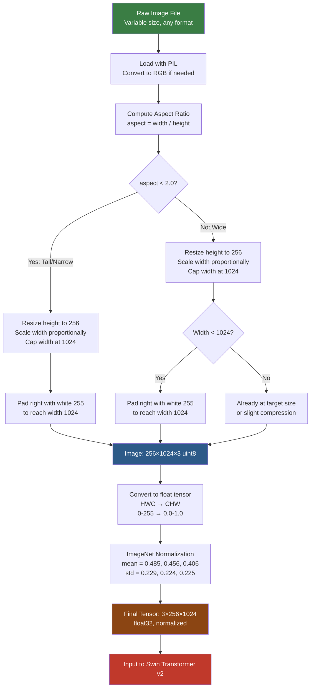

# 2. Image Preprocessing and Normalization

## 2.1 Why We Resize Images: Computational Efficiency and Consistent Input Size

Neural networks require **fixed-size inputs**. Unlike traditional algorithms that can process images of any size, a neural network's first layer (the patch embedding in Swin Transformer) has weights with fixed dimensions. An image of shape `(3, 256, 1024)` produces a deterministic number of patch tokens; an image of shape `(3, 512, 2048)` would produce 4× as many tokens, changing all downstream tensor shapes and crashing the model.

Beyond this mechanical constraint, resizing serves two important purposes:

1. **Computational efficiency**: The Swin Transformer's computation scales with the number of patches. An image of size `(3, 512, 2048)` produces 32,768 patches (with patch size 4), while `(3, 256, 1024)` produces 16,384 patches — half the computation. For training across millions of images, this difference compounds dramatically.

2. **Consistent feature scale**: If some images are 100px tall and others 1000px tall, the same stroke width would appear as 2px in one and 20px in the other. The model would need to learn scale-invariant features, which is harder. Resizing to a fixed height ensures that features (strokes, symbols, spacing) have a consistent scale across all inputs.

**The tradeoff**: Resizing inevitably loses information. A 2000px-wide formula resized to 1024px loses half its horizontal resolution. We accept this tradeoff because the computational savings are enormous and the model can learn to work with the reduced resolution.

## 2.2 Interpolation Methods: Bilinear vs Bicubic

When resizing an image, we need to compute pixel values at positions that don't exist in the original image. This is **interpolation** — estimating unknown values from known neighbors.

### Bilinear Interpolation
Uses the 4 nearest neighbors (2×2 grid) to compute each new pixel:

$$\hat{f}(x, y) = f(x_0, y_0)(1-\alpha)(1-\beta) + f(x_1, y_0)\alpha(1-\beta) + f(x_0, y_1)(1-\alpha)\beta + f(x_1, y_1)\alpha\beta$$

where $\alpha$ and $\beta$ are the fractional distances within the 2×2 grid.

- **Fast**: Only 4 multiplications per pixel
- **Smooth**: Produces continuous results
- **Blurry**: Tends to smooth out sharp edges slightly

### Bicubic Interpolation
Uses the 16 nearest neighbors (4×4 grid) with a cubic polynomial:

- **Slower**: 16 multiplications per pixel
- **Sharper**: Better preserves edges and fine details
- **Ringing**: Can introduce slight oscillations near sharp edges (Gibbs phenomenon)

### Which to Use for Math OCR?

**Bicubic is preferred** for mathematical formula images because:
- Fine details (thin fraction bars, small superscripts) are better preserved
- The ringing artifact is minimal for the type of content in math images (mostly sharp black-white transitions)
- The slight extra computation is negligible compared to the Transformer's cost

In PyTorch:
```python
# Using torchvision
transforms.Resize((256, 1024), interpolation=transforms.InterpolationMode.BICUBIC)

# Using Albumentations
A.Resize(height=256, width=1024, interpolation=cv2.INTER_CUBIC)
```

**In TAMER OCR**, bicubic interpolation is used for all resizing operations.

## 2.3 ImageNet Normalization: Mean and Standard Deviation

After converting an image to a float tensor (0.0–1.0), we apply channel-wise normalization using the ImageNet statistics:

```python
normalize = transforms.Normalize(
    mean=[0.485, 0.456, 0.406],
    std=[0.229, 0.224, 0.225]
)

# For each channel c:
# normalized[c] = (tensor[c] - mean[c]) / std[c]
```

This normalization transforms each channel to have approximately zero mean and unit variance, as computed from the ImageNet dataset (1.28 million images).

**What does this do mathematically?**

For the Red channel:
- Original range: approximately [0.0, 1.0]
- After normalization: $x_{norm} = \frac{x - 0.485}{0.229}$
- Normalized range: approximately $\frac{0 - 0.485}{0.229} = -2.12$ to $\frac{1 - 0.485}{0.229} = 2.25$

The mean and std values differ slightly per channel because ImageNet images have slightly different statistics for R, G, and B channels (due to the spectral sensitivity of cameras and the distribution of colors in natural images).

## 2.4 Why ImageNet Normalization Is Used Even for Math Images

This is a question that comes up frequently: **math images look nothing like ImageNet photos — why use ImageNet statistics?**

The answer lies in **transfer learning**. The Swin Transformer v2 was pretrained on ImageNet with these exact normalization statistics. Every weight in the model — from the patch embedding through the deepest attention layers — was optimized assuming inputs normalized with `mean=[0.485, 0.456, 0.406]` and `std=[0.229, 0.224, 0.225]`.

If we use different normalization:
1. **The patch embedding output shifts**: The first convolutional layer has learned filters that expect a specific input distribution. Changing the normalization changes the distribution, making the pretrained filters less effective.
2. **Feature magnitudes change**: Later layers expect activations in a specific range (determined by the pretrained weights). Shifting the input distribution propagates through the network, potentially causing activations to be too large or too small.
3. **Training instability**: The model would need to "re-learn" the input distribution before fine-tuning can make progress on the OCR task. This wastes training time and may lead to suboptimal solutions.

**Think of it this way**: If you trained a model to recognize faces in photos taken under daylight, and then tested it on photos taken under UV light, it would perform poorly — not because the faces are different, but because the input distribution has shifted. Normalization ensures the input distribution matches what the model was trained on.

**Are math images really that different from ImageNet?** Visually, yes — math images are mostly black-on-white with very specific structure. But statistically, after normalization, the values fall within a reasonable range. White pixels (1.0) normalize to ~2.2, and black pixels (0.0) normalize to ~-2.1. These are well within the range that the model's ReLU/GELU activations can handle.

## 2.5 The Concept of Transfer Learning

Transfer learning is the practice of using knowledge gained from one task (pretraining) to improve performance on a different task (fine-tuning). In TAMER OCR:

- **Pretraining task**: Image classification on ImageNet (1000 classes of natural images)
- **Fine-tuning task**: Math formula OCR (image → LaTeX sequence)

**Why does this work?** Early layers of vision models learn general features that are useful across many tasks:
- **Layer 1–2**: Edge detectors (horizontal, vertical, diagonal edges)
- **Layer 3–4**: Texture and pattern detectors (corners, junctions, simple shapes)
- **Layer 5+**: Object-part detectors (more specific, task-dependent)

For math OCR, edges and simple shapes are exactly what we need — the strokes that make up mathematical symbols are composed of edges, curves, and junctions. Even though the pretraining task (classifying cats, dogs, cars) seems unrelated to math OCR, the low-level features are highly transferable.

**Evidence of transfer learning effectiveness**: Training a Swin Transformer from scratch on the CROHME dataset (~100K images) would likely underfit because the dataset is too small to learn good features from scratch. Starting from ImageNet-pretrained weights and fine-tuning gives dramatically better results — the model already knows how to detect edges and shapes; it just needs to learn how to combine them into mathematical symbols and map them to LaTeX tokens.

**The differential learning rate** (5e-5 for encoder, 5e-4 for decoder) is a direct consequence of transfer learning philosophy: the encoder already has good features (from pretraining) and needs only gentle adjustment, while the decoder starts from scratch and needs aggressive learning.

## 2.6 Converting to Tensor: HWC to CHW, 0-255 to 0.0-1.0

The image pipeline involves two critical format conversions:

### 1. Channel Order: HWC → CHW
Images are naturally Height × Width × Channels (HWC) — you index a pixel as `image[y, x, c]`. But PyTorch uses Channels × Height × Width (CHW) — `tensor[c, y, x]`. This conversion is done by `permute`:

```python
# numpy HWC → torch CHW
img_hwc = np.array(pil_image)           # shape: (H, W, 3)
tensor_chw = torch.from_numpy(img_hwc).permute(2, 0, 1)  # shape: (3, H, W)
```

Or using torchvision:
```python
tensor_chw = torchvision.transforms.functional.to_tensor(pil_image)  # Automatically HWC → CHW
```

**Why does PyTorch use CHW?** Performance. On GPUs, convolution operations are optimized for CHW layout because it ensures that channel values for a single pixel are stored contiguously in memory, enabling efficient memory access patterns. NHWC (batch-last) is also supported on some GPU architectures but CHW remains the PyTorch default.

### 2. Value Range: 0-255 → 0.0-1.0
PIL and OpenCV load images as `uint8` arrays with values 0–255. Neural networks work with `float32` tensors, typically in the range 0.0–1.0:

```python
# Division by 255
tensor = tensor.float() / 255.0
```

`torchvision.transforms.functional.to_tensor()` does this automatically. After this conversion, the values are in [0.0, 1.0], and then ImageNet normalization shifts them to approximately [-2.1, 2.2].

**Why 0–1 instead of 0–255?** Normalizing to [0, 1] keeps the numerical scale reasonable. If we used 0–255, the gradients would be 255× larger, requiring a proportionally smaller learning rate. The [0, 1] convention is a standard that simplifies hyperparameter tuning.

## 2.7 Aspect Ratio Handling: Tall vs Wide Images

Mathematical formulas come in dramatically different aspect ratios:

- **Wide formulas**: Single-line expressions like $E = mc^2$ or $\sum_{i=1}^{n} a_i x^i$
  - Aspect ratio: 4:1 to 10:1 (very wide, not tall)
  - These fit naturally in the 256×1024 canvas

- **Tall formulas**: Matrices, aligned equations, or deeply nested fractions
  - Aspect ratio: 1:1 to 1:2 (roughly square or taller than wide)
  - These waste most of the 1024-pixel width

- **Extreme aspect ratios**: A single variable "$x$" might be 30×50 pixels (taller than wide), while a long integral expression might be 4000×200 pixels (20:1 aspect ratio)

### The Problem with One-Size-Fits-All

If we naively resize everything to 256×1024:
- **Wide formulas**: Good — the aspect ratio is preserved or slightly compressed
- **Tall formulas**: Bad — the formula is stretched to fill the width, distorting symbol proportions
- **Tiny formulas**: Bad — upscaling from 30×50 to 256×1024 creates enormous blur

## 2.8 The Adaptive Resize Strategy in TAMER

TAMER OCR uses an adaptive strategy based on the image's aspect ratio:

```python
def adaptive_resize(img, target_h=256, target_w=1024):
    h, w = img.shape[:2]
    aspect = w / h

    if aspect < 2.0:
        # Tall-ish image (matrix, aligned equations)
        # Scale to height=target_h, then pad width
        scale = target_h / h
        new_w = min(int(w * scale), target_w)
        img = cv2.resize(img, (new_w, target_h), interpolation=cv2.INTER_CUBIC)
        # Pad right side with white
        pad = np.full((target_h, target_w - new_w, 3), 255, dtype=np.uint8)
        img = np.concatenate([img, pad], axis=1)
    else:
        # Wide image (typical single-line formula)
        # Scale to height=target_h, maintaining aspect ratio
        scale = target_h / h
        new_w = int(w * scale)
        if new_w > target_w:
            new_w = target_w  # Cap at max width
        img = cv2.resize(img, (new_w, target_h), interpolation=cv2.INTER_CUBIC)
        # Pad if needed
        if new_w < target_w:
            pad = np.full((target_h, target_w - new_w, 3), 255, dtype=np.uint8)
            img = np.concatenate([img, pad], axis=1)

    return img
```

**The `aspect < 2.0` threshold** is the key design choice:
- Images with aspect ratio < 2.0 (roughly square or tall) get padded but not stretched
- Images with aspect ratio ≥ 2.0 (wide) get scaled to height 256 with width adjusted proportionally

This threshold was chosen empirically — most single-line math formulas have aspect ratios between 3:1 and 8:1, while matrices and aligned environments are typically between 1:1 and 2:1.

**Why not just pad everything without any conditional logic?** Pure padding (resize height to 256, pad width to 1024) works but can waste a lot of the canvas on empty white space for narrow formulas. The model then needs to attend over many blank patches, wasting computation. The adaptive strategy ensures the formula occupies a reasonable fraction of the canvas.

## 2.9 Image Preprocessing Pipeline — Mermaid Diagram



This diagram shows the complete preprocessing pipeline from raw file to model input. Notice how the adaptive resize handles both tall and wide formulas, ensuring consistent output dimensions while preserving as much information as possible.

**Key Takeaways for TAMER OCR:**
- ImageNet normalization is mandatory because the Swin encoder was pretrained with these exact statistics
- The HWC → CHW conversion and uint8 → float32 conversion are handled by `torchvision.transforms.functional.to_tensor()`
- The adaptive resize strategy handles the wide variety of aspect ratios in mathematical formulas
- Bicubic interpolation preserves fine details better than bilinear
- White padding is consistent with the black-on-white convention of math images
