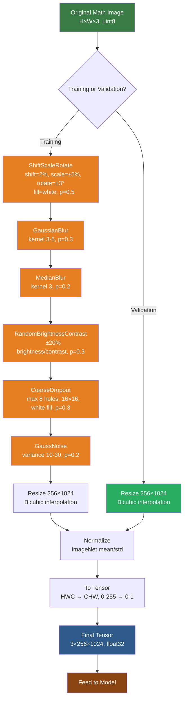
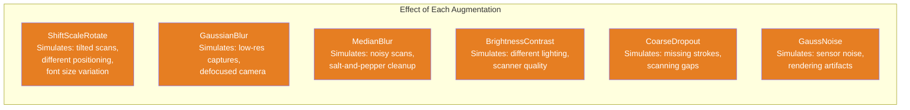

# 3. Data Augmentation for OCR

## 3.1 Why Augment: Increasing Effective Dataset Size and Robustness

Data augmentation is the practice of creating modified versions of training examples to artificially expand the dataset. The core motivation is simple: **more diverse training data leads to better generalization.**

Consider the CROHME dataset, which contains roughly 100K formula images. This is modest by modern deep learning standards. Without augmentation, the model sees each image only once per epoch. After 50 epochs, it has seen each image 50 times — and may start to memorize specific pixel patterns rather than learning the abstract concept of "what a fraction looks like" or "what an integral sign means."

Augmentation creates variations of each image that preserve the **semantic meaning** (the LaTeX is unchanged) while altering the **appearance** (the pixels change). The model learns that the same formula can look different — slightly rotated, slightly blurred, slightly shifted — and still mean the same thing. This is **invariance**: the model becomes robust to transformations that don't change the label.

**The augmentation-regularization connection**: Augmentation acts as a regularizer. Each augmented version is essentially a "new" training example that the model hasn't memorized. This reduces overfitting, especially on small datasets like CROHME. The effect is similar to dropout or weight decay, but it regularizes by expanding the data distribution rather than by constraining the model.

**Quantitative impact**: In TAMER OCR experiments, training with augmentation improves validation exact match by 2–5 percentage points compared to training without. This is a substantial gain for a technique that costs almost nothing in terms of implementation or training time.

## 3.2 Augmentation Philosophy for Math OCR: Gentle Transforms That Don't Break Meaning

This is the critical guiding principle: **the augmentation must not change the meaning of the formula.**

For natural images (cats, dogs, cars), aggressive augmentation is fine — a horizontally flipped cat is still a cat, a heavily rotated car is still a car (just harder to recognize). But for math:

- **Horizontal flip**: $\int_a^b f(x) dx$ flipped becomes $xda(x)f {b\above{1pt} a} \ni$ — complete nonsense
- **Large rotation**: A 90° rotated integral sign looks like an "f" — it means something entirely different
- **Elastic distortion**: A distorted $\sum$ might look like a completely different symbol
- **Color jittering**: A red integral sign on a blue background is fine (meaning is preserved), but extreme changes might make symbols invisible

The safe augmentations for math OCR are the **gentle ones** — small perturbations that simulate real-world variation in how formulas might be captured or rendered:

| Augmentation | Safe? | Rationale |
|---|---|---|
| Small rotation (≤3°) |  | Simulates slightly tilted scans |
| Small shift (≤2%) |  | Simulates off-center placement |
| Small scale (±5%) |  | Simulates different font sizes |
| Blur (light) |  | Simulates low-resolution capture |
| Brightness/contrast |  | Simulates different lighting/scanning |
| Dropout (white holes) |  | Simulates missing strokes |
| Horizontal flip |  | Reverses formula order |
| Large rotation |  | Changes symbol identity |
| Elastic distortion |  | Warps symbol shapes |
| Vertical flip |  | Makes symbols unreadable |

## 3.3 ShiftScaleRotate / Affine: Small Geometric Transformations

The `ShiftScaleRotate` augmentation (from Albumentations) applies a combined translation, scaling, and rotation — all with small parameters:

```python
A.ShiftScaleRotate(
    shift_limit=0.02,    # Shift by at most 2% of image size
    scale_limit=0.05,    # Scale by at most ±5%
    rotate_limit=3,      # Rotate by at most ±3 degrees
    border_mode=cv2.BORDER_CONSTANT,
    value=255,           # Fill new areas with white
    p=0.5                # 50% chance of applying
)
```

### Shift (2%)
A 2% shift on a 256-tall image moves the formula by at most 5 pixels. This is barely noticeable to a human but forces the model to not be overly dependent on the formula's exact position within the frame. In real-world scenarios, formulas are rarely perfectly centered — they might be offset due to scanning alignment or rendering differences.

### Scale (5%)
A ±5% scale change means the formula is rendered slightly larger or smaller. This teaches the model that the same symbol at slightly different sizes is still the same symbol. A 5% change is subtle — the stroke width might go from 3px to 3.15px — but it adds variation.

### Rotation (3°)
A 3° rotation is the most aggressive of these three transforms, and the limit is chosen carefully. At 3°, an integral sign is still clearly an integral sign — it's tilted but recognizable. At 10°, it starts to look ambiguous. At 30°, it's unrecognizable.

**Why 3° specifically?** Empirically, this is the sweet spot where:
- The rotation is large enough to add useful variation
- Symbol identity is preserved (no symbol becomes another symbol)
- Human annotators would still agree on the LaTeX

The `border_mode=cv2.BORDER_CONSTANT` and `value=255` ensure that any new pixels created by the rotation (the "empty" corners) are filled with white, matching the formula's background.

## 3.4 Why Large Rotations Would Destroy Math: A Rotated Integral Sign Means Nothing

This deserves special emphasis because it's a common mistake when applying general-purpose augmentation recipes to math OCR.

Consider the symbol $\int$ (integral). It has a distinctive S-curve shape. When rotated:
- **3°**: Still clearly $\int$
- **15°**: Looks like a leaning $\int$, but could be confused with $f$ or a stylized $S$
- **45°**: Looks like a weird curve — no standard math symbol
- **90°**: Looks like a sideways bracket — completely different meaning

Now consider the symbol $+$ (plus). When rotated:
- **45°**: It becomes $\times$ (multiplication)! The semantic meaning has completely changed.

Or the symbol $-$ (minus). When rotated:
- **90°**: It becomes $|$ (vertical bar), which in LaTeX is `|` or `\vert` — a completely different token.

These examples show why rotation augmentation for math OCR must be extremely conservative. The visual similarity between symbols is already a challenge ($O$ vs $0$, $l$ vs $1$ vs $|$), and rotation only increases this ambiguity.

**The same reasoning applies to elastic distortions and aggressive affine transformations.** Any augmentation that warps the shape of symbols risks turning one symbol into another, creating incorrect (image, label) pairs that harm training.

## 3.5 GaussianBlur and MedianBlur: Simulating Low-Resolution Scans

### GaussianBlur
```python
A.GaussianBlur(
    blur_limit=(3, 5),  # Kernel size 3×3 or 5×5
    p=0.3               # 30% chance of applying
)
```

Gaussian blur applies a weighted average to each pixel using a Gaussian kernel. The weights follow a bell curve — the center pixel gets the most weight, and nearby pixels contribute proportionally to their distance.

**Why blur helps**: Real-world math images are not always crisp. They might be:
- Scanned from printed documents at low resolution
- Photographed from a whiteboard with a phone camera
- Rendered at low DPI and then enlarged
- Compressed with lossy JPEG, introducing blocky artifacts

Blur augmentation teaches the model to recognize symbols even when edges are soft and details are fuzzy. This is critical for robustness — the model should not require pixel-perfect input to function.

### MedianBlur
```python
A.MedianBlur(
    blur_limit=3,  # Kernel size 3×3
    p=0.2          # 20% chance of applying
)
```

Median blur replaces each pixel with the median value of its neighborhood. Unlike Gaussian blur (which averages), median blur is **edge-preserving** — it smooths noise while maintaining sharp edges.

**Why include both Gaussian and Median blur?** They simulate different types of degradation:
- Gaussian blur simulates optical defocus or low-resolution rendering
- Median blur simulates salt-and-pepper noise removal or low-quality scanning

By training with both, the model becomes robust to a wider range of image quality issues.

**Why small kernel sizes (3–5)?** Large kernels (7×7 or more) would make symbols unrecognizable. A 3×3 kernel provides subtle softening; a 5×5 kernel provides moderate blur. Anything beyond 5×5 risks making $\partial$ look like $d$ or blurring $\hat{x}$ into $\bar{x}$.

## 3.6 RandomBrightnessContrast: Simulating Different Scanning and Lighting Conditions

```python
A.RandomBrightnessContrast(
    brightness_limit=0.2,   # ±20% brightness change
    contrast_limit=0.2,     # ±20% contrast change
    p=0.3                   # 30% chance of applying
)
```

### Brightness
Multiplying all pixel values by a factor. A +20% brightness increase on a white background makes the white slightly brighter (clipped to 255) and the black strokes slightly lighter (grayish). This simulates overexposure or bright scanning conditions.

### Contrast
Adjusting the range of pixel values. A +20% contrast increase makes dark pixels darker and light pixels lighter, sharpening the appearance. A -20% contrast decrease compresses the range toward gray, making the image look washed out. This simulates different scanner quality or display conditions.

**Why these matter for math OCR**: In practice, math images come from diverse sources:
- High-quality digital renderings (Im2LaTeX): crisp, high contrast
- Scanned exam papers (CROHME): variable contrast, slight grayness
- Whiteboard photos (HME100K): bright, possibly overexposed
- Handwritten tablets (MathWriting): variable stroke darkness

The model must handle all of these. Brightness and contrast augmentation simulates this diversity, ensuring the model doesn't become overly dependent on one specific appearance profile.

## 3.7 CoarseDropout: Simulating Missing Strokes with White Holes

```python
A.CoarseDropout(
    max_holes=8,          # Up to 8 holes
    max_height=16,        # Each hole up to 16px tall
    max_width=16,         # Each hole up to 16px wide
    min_holes=1,          # At least 1 hole
    fill_value=255,       # Fill holes with white
    p=0.3                 # 30% chance of applying
)
```

CoarseDropout randomly places rectangular "holes" in the image, replacing the pixels with a fill value. In TAMER OCR, the fill value is **255 (white)**.

**Why white instead of black (0)?** This is a critical design choice:
- Math images have **white backgrounds** with **dark strokes**
- A white hole simulates a **missing stroke** — as if part of the ink was erased or the scanner missed it
- A black hole would look like an **added stroke** — an unexpected blob of ink that doesn't correspond to any mathematical symbol

**Simulating missing strokes is realistic** because:
- Scanning artifacts can drop thin strokes
- Handwritten formulas may have gaps in strokes (pen lifted too soon)
- Low-resolution rendering can make thin lines disappear
- JPEG compression at edges can erase thin fraction bars

**Size considerations (16×16 max)**: A 16×16 hole at 256px height covers about 6% of the image height. This is large enough to erase a significant portion of a stroke or a small symbol (like a dot on an $i$ or $\hat{}$ accent), but not so large that it destroys the entire formula. The model must learn to recognize formulas even when parts are occluded — a form of robustness that is very valuable in real-world deployment.

**Why `max_holes=8`?** Multiple small holes are more realistic than one large hole. In practice, scanning artifacts tend to affect multiple locations (e.g., a dusty scanner affects multiple parts of the page). Eight holes of size 16×16 cover at most 2048 pixels out of 262,144 (256×1024) — less than 1% of the image. This provides meaningful perturbation without destroying the formula.

## 3.8 GaussNoise: Simulating Sensor Noise

```python
A.GaussNoise(
    var_limit=(10.0, 30.0),  # Variance of Gaussian noise
    p=0.2                     # 20% chance of applying
)
```

Gaussian noise adds random values drawn from a normal distribution to each pixel. With variance 10–30, the noise is subtle — each pixel changes by at most ~±10–15 intensity values on a 0–255 scale.

**What does GaussNoise simulate?**
- **Camera sensor noise**: Digital cameras add noise to images, especially in low-light conditions. Whiteboard photos taken with phone cameras often exhibit this.
- **Scanner noise**: Even high-quality scanners introduce small amounts of noise in the digitization process.
- **Rendering artifacts**: When math formulas are rendered to images (as in the Im2LaTeX dataset), anti-aliasing and rendering engines can introduce subtle pixel-level variations.

**Why small variance?** Large variance would make symbols hard to read. The goal is to simulate realistic noise, not to make the image unrecognizable. A variance of 10–30 is comparable to the noise level in a typical phone photo of a whiteboard.

**The relationship between noise and augmentation strategy**: GaussNoise is the "gentlest" augmentation — it changes pixel values but not structure. It primarily helps the model's first layer (patch embedding) become robust to input variations, rather than testing higher-level symbol recognition.

## 3.9 Albumentations Library: Why It's Faster Than Torchvision Transforms

TAMER OCR uses the **Albumentations** library for all augmentations instead of `torchvision.transforms`. This is a deliberate choice with several advantages:

### Speed
Albumentations operates on **numpy arrays** and uses OpenCV under the hood, which is implemented in optimized C++. Torchvision transforms operate on **PIL Images**, which involves Python-level overhead. For complex augmentation pipelines (like TAMER's 6+ transforms), Albumentations can be 2–5× faster.

### Composability
Albumentations provides a clean `Compose` interface:

```python
transform = A.Compose([
    A.ShiftScaleRotate(shift_limit=0.02, scale_limit=0.05, rotate_limit=3, value=255, p=0.5),
    A.GaussianBlur(blur_limit=(3, 5), p=0.3),
    A.MedianBlur(blur_limit=3, p=0.2),
    A.RandomBrightnessContrast(brightness_limit=0.2, contrast_limit=0.2, p=0.3),
    A.CoarseDropout(max_holes=8, max_height=16, max_width=16, fill_value=255, p=0.3),
    A.GaussNoise(var_limit=(10.0, 30.0), p=0.2),
    A.Resize(256, 1024, interpolation=cv2.INTER_CUBIC),
    A.Normalize(mean=[0.485, 0.456, 0.406], std=[0.229, 0.224, 0.225]),
])

# Apply all transforms in one call
result = transform(image=img)
augmented_image = result['image']  # Already a tensor-ready numpy array
```

This single-call interface is both cleaner and faster than chaining multiple torchvision transforms.

### Reproducibility
Albumentations supports deterministic augmentation via a `seed` parameter, which is useful for debugging and reproducibility. You can replay the exact same augmentation sequence for a given image.

### Additional Transforms
Albumentations provides many transforms that torchvision lacks, including CoarseDropout, GaussNoise, and advanced geometric transforms. These are essential for math OCR augmentation.

## 3.10 Validation Augmentation: Empty for Consistent Metrics

During validation and testing, **no augmentation is applied**. The validation transform includes only:

```python
val_transform = A.Compose([
    A.Resize(256, 1024, interpolation=cv2.INTER_CUBIC),
    A.Normalize(mean=[0.485, 0.456, 0.406], std=[0.229, 0.224, 0.225]),
])
```

**Why no augmentation during validation?**

1. **Consistent metrics**: Validation metrics should be reproducible and comparable across experiments. If we augmented validation data, the metrics would vary depending on the random augmentation, making it impossible to compare different runs.

2. **True performance estimate**: Validation metrics estimate real-world performance. In production, each image is processed once — we want to know how the model performs on the actual images, not on augmented versions.

3. **Early stopping decisions**: We use validation loss to decide when to stop training. Noisy validation metrics (from augmentation) would make this decision unreliable.

**The only preprocessing that remains**: Resize (to ensure consistent input size) and Normalize (to match the model's expected input distribution). These are deterministic and do not introduce randomness.

## 3.11 Why White Fill (255) Instead of Black (0): Math Images Have White Backgrounds

This design choice appears in multiple augmentations (`ShiftScaleRotate`, `CoarseDropout`) and is worth understanding deeply.

### The Distribution of Pixel Values in Math Images

A typical math image has a **bimodal** pixel distribution:
- **Peak at 255 (white)**: The background — typically 80–95% of all pixels
- **Peak at 0 (black)**: The strokes — typically 5–20% of all pixels
- **Small intermediate values**: Anti-aliased edges — typically 1–5% of pixels

### What Happens with Different Fill Values

| Fill Value | ShiftScaleRotate Effect | CoarseDropout Effect |
|---|---|---|
| **255 (white)** | New border pixels blend with background — natural | Holes look like erased strokes — realistic |
| **0 (black)** | New border creates a dark frame — looks like a border | Holes look like added ink blobs — unrealistic |
| **128 (gray)** | New border creates a gray frame — unusual | Holes look like gray patches — unusual |

### Why White Is Correct

1. **Geometric transforms create empty regions**: When you rotate an image by 3°, the corners of the new image have no source pixels. These corners should be white (empty background), not black (ink).

2. **CoarseDropout simulates missing strokes**: A white hole in a black stroke looks like part of the stroke was erased — this is realistic. A black hole would look like an extra blob of ink that doesn't correspond to any symbol.

3. **Consistency with padding**: The image is already padded with white (255) during preprocessing (see Chapter 2, Section 2). Using the same fill value for augmentation ensures consistency.

4. **Model interpretation**: The model learns that white regions are "background" and dark regions are "content." Adding black regions would violate this convention and could confuse the model into interpreting augmentation artifacts as content.

## 3.12 Augmentation Pipeline — Mermaid Diagram





The first diagram shows the complete augmentation pipeline with the training/validation split. Notice how the training path applies 6 stochastic augmentations before resizing and normalization, while the validation path skips directly to resize and normalize. The second diagram summarizes what each augmentation simulates in the real world.

**Key Takeaways for TAMER OCR:**
- Augmentation is essential for preventing overfitting, especially on smaller datasets like CROHME
- All augmentations are **gentle** — they must preserve the semantic meaning of the formula
- White fill (255) is used consistently because math images have white backgrounds
- Albumentations is preferred over torchvision for speed and functionality
- No augmentation during validation ensures consistent, comparable metrics
- The augmentation pipeline simulates real-world variations: scanning quality, lighting, resolution, and stroke integrity
