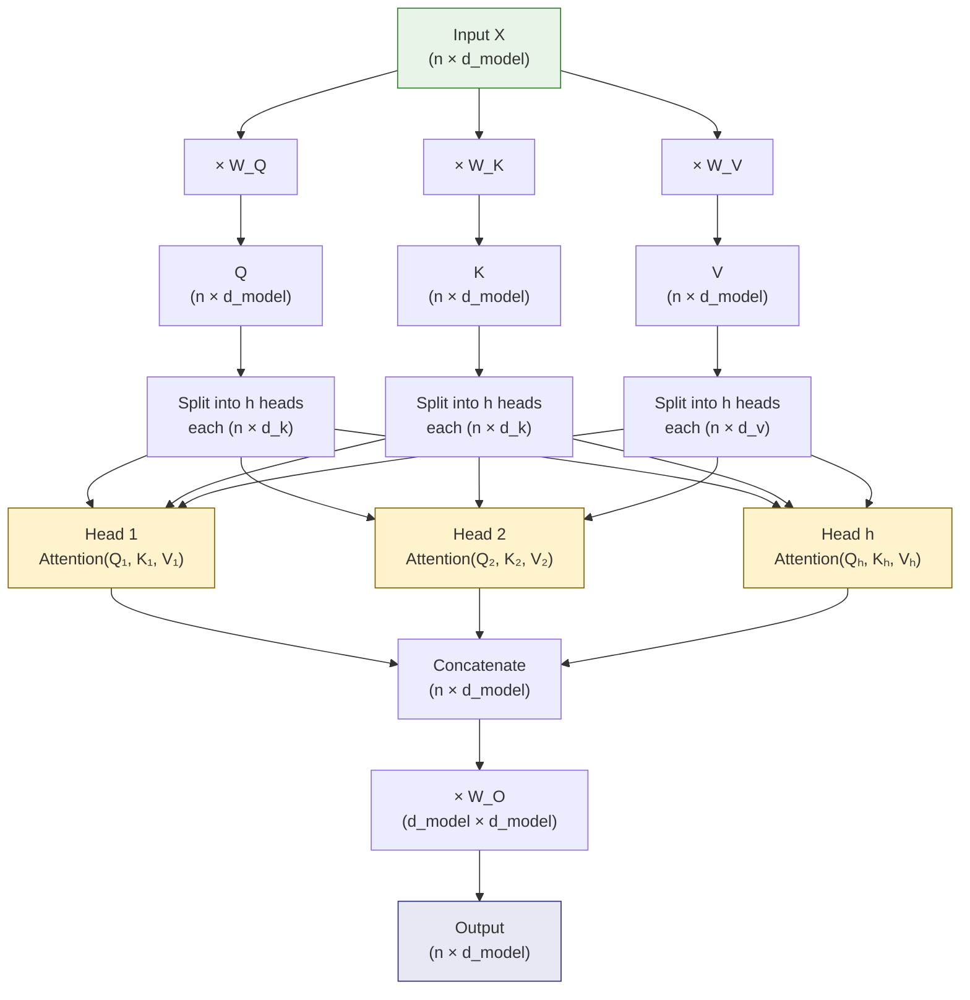

# 1. Attention Mechanism

## 1.1 Why RNNs Fall Short

Before Transformers, recurrent neural networks (RNNs) and their variants (LSTM, GRU) were the dominant architecture for sequence modeling. However, they suffer from three fundamental limitations that make them unsuitable for the kind of long-sequence, high-dimensional processing that math OCR demands:

1. **Sequential processing**: RNNs process tokens one at a time, with each hidden state depending on the previous one. This means you cannot parallelize across time steps. For a sequence of length $n$, you must perform $n$ sequential operations. On a modern GPU that thrives on parallelism, this is a catastrophic bottleneck.

2. **Vanishing and exploding gradients**: During backpropagation through time (BPTT), gradients are multiplied at each time step. Over long sequences, these products either shrink to zero (vanishing) or grow without bound (exploding). Even with LSTM's gating mechanisms, information from 100+ steps ago is typically degraded beyond usefulness. In OCR, a symbol at the beginning of a formula may need to inform the generation of a closing bracket 200 tokens later.

3. **Fixed-size bottleneck**: The encoder-decoder RNN compresses the entire input sequence into a single fixed-length vector (the final hidden state). This single vector must carry all information about the input — an unreasonable demand for complex mathematical expressions spanning hundreds of symbols.

Attention was introduced to address this bottleneck directly: instead of compressing everything into one vector, why not let the decoder "look back" at all encoder states and decide which ones are relevant at each generation step?

## 1.2 Attention as a Soft Lookup

The core intuition behind attention is **soft retrieval**. Imagine a dictionary lookup where:

- You have a **query** (what you are searching for)
- You compare it against a set of **keys** (what each entry is "about")
- You retrieve a weighted combination of **values** (the actual content)

In a standard dictionary, the lookup is **hard**: the query exactly matches one key, and you get that key's value. Attention is **soft**: the query is compared to all keys simultaneously, producing a probability distribution over them, and the output is a weighted sum of all values. This is differentiable — you can backpropagate through it — which makes it a powerful building block for neural networks.

```
# Pseudocode for attention
scores = query @ keys.T          # How much does each key match the query?
weights = softmax(scores)        # Normalize to probabilities
output  = weights @ values       # Weighted combination of values
```

## 1.3 Self-Attention

In **self-attention**, the queries, keys, and values all derive from the **same input sequence**. This is the mechanism that powers the Transformer encoder. Each position in the sequence attends to every other position, computing a representation that integrates information from the entire context.

Self-attention is powerful because:

- Every position can directly attend to every other position in **one layer** (no need to pass information through many recurrent steps)
- It is fully parallelizable: all attention weights can be computed simultaneously
- The receptive field is the entire sequence from the very first layer

## 1.4 The QKV Projection

The raw input vectors are not directly used as queries, keys, and values. Instead, they are projected through learned weight matrices:

$$Q = X \cdot W_Q, \quad K = X \cdot W_K, \quad V = X \cdot W_V$$

Where:
- $X \in \mathbb{R}^{n \times d_{\text{model}}}$ is the input matrix ($n$ tokens, each of dimension $d_{\text{model}}$)
- $W_Q, W_K \in \mathbb{R}^{d_{\text{model}} \times d_k}$ are the query and key projection matrices
- $W_V \in \mathbb{R}^{d_{\text{model}} \times d_v}$ is the value projection matrix
- Typically $d_k = d_v = d_{\text{model}} / h$ where $h$ is the number of attention heads

These projections allow the model to learn **different aspects** of the input for querying, matching, and carrying information. Without them, every input vector would play all three roles simultaneously, severely limiting expressiveness.

## 1.5 Scaled Dot-Product Attention

The fundamental attention computation is:

$$\text{Attention}(Q, K, V) = \text{softmax}\left(\frac{QK^T}{\sqrt{d_k}}\right) V$$

Step by step:

1. **Compute similarity**: $QK^T$ produces an $n \times n$ matrix where entry $(i, j)$ measures how much token $i$ "wants to attend to" token $j$. This is the raw dot product between the query of position $i$ and the key of position $j$.

2. **Scale by $\sqrt{d_k}$**: We divide each score by $\sqrt{d_k}$. This is critical — without it, for large $d_k$, the dot products grow in magnitude, pushing the softmax into regions with extremely steep gradients (essentially becoming a hard max). The scaling keeps the variance of the scores approximately 1 regardless of dimension.

3. **Apply softmax**: Normalizes each row to sum to 1, producing attention weights.

4. **Weight values**: Multiply the attention weights by $V$ to get the output.

### Why Divide by $\sqrt{d_k}$?

If $q$ and $k$ are independent random vectors with zero mean and unit variance, their dot product $q \cdot k = \sum_{i=1}^{d_k} q_i k_i$ has mean 0 and variance $d_k$. When $d_k$ is large (e.g., 64), the dot products can have magnitudes far from 0, pushing the softmax into saturation regions where gradients are vanishingly small. Dividing by $\sqrt{d_k}$ restores the variance to approximately 1, keeping the softmax in a well-behaved regime.

```python
# PyTorch implementation
attn_scores = torch.matmul(Q, K.transpose(-2, -1)) / math.sqrt(d_k)
attn_weights = torch.softmax(attn_scores, dim=-1)
output = torch.matmul(attn_weights, V)
```

## 1.6 Multi-Head Attention

Instead of performing a single attention function with $d_{\text{model}}$-dimensional keys, values, and queries, it is beneficial to **split** the representation into multiple heads. Multi-head attention allows the model to jointly attend to information from different representation subspaces at different positions.

$$\text{MultiHead}(Q, K, V) = \text{Concat}(\text{head}_1, \ldots, \text{head}_h) W_O$$

Where each head is:

$$\text{head}_i = \text{Attention}(QW_Q^i, KW_K^i, VW_V^i)$$

With $h=8$ heads and $d_{\text{model}}=512$, each head operates on $d_k = d_v = 64$ dimensions. After computing all heads, they are concatenated (back to 512 dimensions) and projected through $W_O$.

**Why multiple heads?** A single attention head might learn to focus on one type of relationship (e.g., syntactic adjacency). Multiple heads allow the model to simultaneously capture different types of relationships — some heads might focus on local structure, others on long-range dependencies, others on specific token types. Empirically, multi-head attention consistently outperforms single-head attention with the same total dimensionality.

## 1.7 Complexity: O(n²) and Its Implications

The attention matrix $QK^T$ is $n \times n$, where $n$ is the sequence length. This means:

- **Memory**: $O(n^2)$ to store the attention matrix
- **Compute**: $O(n^2 d_k)$ for the matrix multiplications

For TAMER, the encoder deals with up to 16,384 patches at the first Swin stage. Global attention over this many tokens would require a $16384 \times 16384$ attention matrix — roughly 268 million entries per head, per layer. This is computationally infeasible, which is precisely why Swin Transformer uses **local window attention** instead (covered in Chapter 4).

The decoder, however, generates sequences that are typically 200–500 tokens long, making global attention feasible ($500^2 = 250{,}000$ entries is manageable).

## 1.8 Cross-Attention: The Bridge Between Vision and Language

Cross-attention is the mechanism that connects the encoder and decoder. The key insight: **the queries come from one source, while the keys and values come from another**.

- **Q**: comes from the decoder (the LaTeX tokens generated so far)
- **K, V**: come from the encoder (the visual features extracted from the image)

At each decoder step, the current hidden state (query) "asks" the encoder features (keys) which parts of the image are relevant, and retrieves weighted visual information (values). This is how the decoder "looks at" the right part of the formula image when deciding what symbol to generate next.

In TAMER, cross-attention is what makes the architecture an effective OCR system: the decoder doesn't just memorize LaTeX patterns — it actively grounds its generation in the visual features of the input image.

## 1.9 Causal (Masked) Attention

During training, we feed the entire target sequence to the decoder simultaneously for efficiency. But at each position, the model should only attend to **previous** positions — otherwise, it could simply copy the answer from future tokens.

The causal mask prevents this by setting the attention scores for future positions to $-\infty$ before applying softmax:

```python
# Create causal mask
mask = torch.triu(torch.ones(n, n), diagonal=1).bool()  # Upper triangle = True
attn_scores = attn_scores.masked_fill(mask, float('-inf'))
attn_weights = torch.softmax(attn_scores, dim=-1)
```

After softmax, $e^{-\infty} = 0$, so future positions receive zero attention weight. The resulting attention matrix is **lower triangular**, ensuring that each position only sees itself and earlier positions.

This is called "causal" because it enforces a causal ordering: the output at time $t$ can only depend on inputs at times $\leq t$.

## 1.10 How TAMER Uses Attention

TAMER employs all three attention variants:

| Attention Type | Where | Q Source | K,V Source | Purpose |
|---|---|---|---|---|
| Self-attention | Swin Encoder | Patches | Patches | Capture spatial relationships within the image |
| Masked self-attention | Decoder | Tokens | Tokens | Capture sequential dependencies in LaTeX |
| Cross-attention | Decoder | Tokens | Encoder features | Ground LaTeX generation in visual features |

The cross-attention layers are the most critical for OCR performance — they are the only mechanism by which the decoder can access the visual input. If cross-attention is poorly trained, the decoder is essentially "blind" and can only produce generic LaTeX patterns.

## 1.11 Mermaid Diagram: Multi-Head Attention



> **Key Takeaway**: Attention is the fundamental operation that makes Transformers work. Self-attention enables each position to gather information from the entire sequence, cross-attention bridges different modalities, and causal masking enforces autoregressive generation. Understanding these three variants is essential for understanding every component of TAMER.
