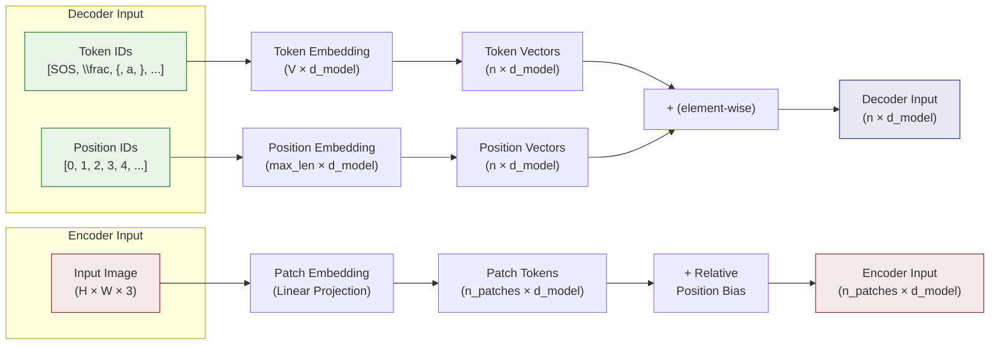

# 2. Positional Encoding and Embeddings

## 2.1 Why Transformers Need Position Information

The attention mechanism, as defined in the previous note, is **permutation-equivariant**. This means that if you shuffle the input tokens, the output is correspondingly shuffled — the model has no inherent sense of which token came first, second, or last. Mathematically, for any permutation $\pi$:

$$\text{Attention}(\pi(X)) = \pi(\text{Attention}(X))$$

This is a critical problem. In language, "the cat sat on the mat" and "mat the on sat cat the" have completely different meanings. In math OCR, $\frac{a}{b}$ and $\frac{b}{a}$ produce visually similar patches but represent fundamentally different expressions. Without position information, the model cannot distinguish between orderings.

RNNs naturally encode position through their sequential processing — each hidden state implicitly carries information about how far through the sequence the model has progressed. Transformers must **explicitly** inject positional information.

## 2.2 Sinusoidal Positional Encoding (Original Transformer)

The original "Attention Is All You Need" paper proposed sinusoidal positional encodings:

$$PE_{(pos, 2i)} = \sin\left(\frac{pos}{10000^{2i/d_{\text{model}}}}\right)$$

$$PE_{(pos, 2i+1)} = \cos\left(\frac{pos}{10000^{2i/d_{\text{model}}}}\right)$$

Where $pos$ is the position index and $i$ is the dimension index. This produces a unique encoding for each position that varies smoothly across positions.

**Key properties:**

- Each dimension of the encoding oscillates at a different frequency. Lower dimensions oscillate quickly (capturing fine-grained position differences), while higher dimensions oscillate slowly (capturing coarse position).
- For any fixed offset $k$, $PE_{pos+k}$ can be expressed as a linear function of $PE_{pos}$. This means the model can learn to attend to relative positions through linear transformations.
- The encoding is deterministic and requires no learned parameters.
- It can in principle extrapolate to sequence lengths longer than those seen during training (though in practice, this extrapolation is often poor).

**Limitation for TAMER**: Sinusoidal encodings are designed for 1D sequences. While they could theoretically be applied to 2D image patches by treating the sequence as a flattened raster scan, this loses the inherent 2D spatial structure. TAMER's encoder (Swin Transformer) handles position differently — through the patch grid structure and relative position biases within windows.

## 2.3 Learned Positional Embeddings

An alternative to sinusoidal encodings is to **learn** a position embedding for each position, stored in a parameter matrix $P \in \mathbb{R}^{max\_len \times d_{\text{model}}}$.

$$\text{output} = X + P[:n]$$

Where $n$ is the sequence length and $P[:n]$ selects the first $n$ rows.

**Advantages:**
- More flexible — the model can learn position representations optimized for the specific task
- No assumptions about sinusoidal structure
- Empirically often outperforms sinusoidal encodings

**Disadvantages:**
- Cannot extrapolate beyond `max_len` — you must predefine a maximum sequence length
- Requires more parameters (though typically negligible compared to the rest of the model)
- No inherent structure that the model can exploit for relative position reasoning

**TAMER uses learned positional embeddings in its decoder.** The LaTeX token sequence is typically 200–500 tokens, and a maximum length of ~1024 is sufficient. The learned embeddings capture the sequential structure of LaTeX: that the opening `\frac{` comes before `{numerator}` and `{denominator}`, that `\left(` pairs with `\right)`, etc.

## 2.4 Token Embeddings: From Discrete to Continuous

Neural networks operate on continuous vectors, but tokens are discrete symbols. **Token embeddings** bridge this gap by mapping each token in the vocabulary to a dense vector.

The embedding is a lookup table — a matrix $E \in \mathbb{R}^{V \times d_{\text{model}}}$ where $V$ is the vocabulary size. To embed a token with index $i$, you simply index into row $i$ of the matrix:

```python
# PyTorch embedding
self.embedding = nn.Embedding(vocab_size, d_model)
token_vector = self.embedding(token_id)  # Shape: (d_model,)
```

**The embedding matrix is learned during training.** Initially, similar tokens (e.g., `\alpha` and `\beta`) may have dissimilar embeddings, but as training progresses, tokens that appear in similar contexts tend to develop similar representations.

In TAMER, the vocabulary consists of LaTeX tokens: individual characters (`a`, `b`, `+`, `=`), commands (`\frac`, `\sqrt`, `\int`), structural tokens (`{`, `}`, `_`, `^`), and special tokens (SOS, EOS, PAD).

## 2.5 The Embedding Matrix: Vocabulary × Model Dimension

The embedding matrix $E \in \mathbb{R}^{V \times d_{\text{model}}}$ is one of the largest parameter matrices in the model. For TAMER:

- **Vocabulary size**: ~1,000–5,000 LaTeX tokens (depending on tokenizer configuration)
- **Model dimension**: $d_{\text{model}} = 256$ (decoder)
- **Parameter count**: $V \times 256 \approx 256\text{K}–1.28\text{M}$ parameters

An important implementation detail: in many Transformer implementations, the embedding weights are tied with the final output projection layer (the "language model head"). This means the same matrix is used for both converting token IDs to vectors (input) and converting output vectors to token probabilities (output). This reduces parameters and has been shown to improve performance in some settings.

## 2.6 Embedding + Positional Encoding: "What" and "Where"

The final input to the Transformer is the sum of the token embedding and the positional encoding:

$$\text{input} = \text{TokenEmbed}(x) + \text{PosEmbed}(x)$$

This is elegant because the two components carry complementary information:

| Component | Encodes | Analogy |
|---|---|---|
| Token embedding | **What** the token is | The identity of the word |
| Positional encoding | **Where** the token is | The position in the sentence |

Both are vectors in the same space ($\mathbb{R}^{d_{\text{model}}}$), and their sum allows downstream attention layers to use both types of information simultaneously. The self-attention mechanism can attend based on content similarity (via the token component), positional relationships (via the position component), or any combination.

**Why addition instead of concatenation?** Addition is parameter-free and maintains the same dimensionality. Concatenation would double the dimensionality and require an additional projection. Empirically, addition works well and is the standard approach.

## 2.7 Position in the Swin Encoder: 2D Patch Structure

TAMER's encoder (Swin Transformer v2) does **not** use sinusoidal or learned 1D positional encodings. Instead, position information is encoded through:

1. **2D patch grid structure**: The image is split into a regular grid of patches. The spatial arrangement of patches in the grid inherently encodes their 2D position. When flattened into a sequence, this 2D structure is preserved through the patch merging and window partitioning operations.

2. **Relative position bias (RPB)**: Within each attention window, Swin adds a learned bias to the attention scores based on the **relative** position between the query and key patches. This is a 2D bias that encodes offsets like "one patch to the right" or "two patches down."

3. **Log-CPB (in Swin v2)**: An improvement over fixed RPB that uses a small MLP to generate continuous position biases, enabling better generalization across resolutions.

This 2D-aware position encoding is crucial for math OCR, where the spatial layout of symbols carries essential semantic information. The fraction bar in $\frac{a}{b}$, the positioning of superscripts and subscripts, and the alignment of matrix rows all depend on 2D spatial relationships that cannot be captured by 1D positional encodings.

## 2.8 Position in the Decoder: Learned Token Sequence Embeddings

In TAMER's decoder, position is encoded through **learned positional embeddings** applied to the 1D token sequence. This makes sense because:

- The output is a 1D sequence of LaTeX tokens
- The ordering of tokens is sequential and absolute
- The maximum sequence length is bounded and known

The decoder receives:

$$\text{decoder\_input}_t = \text{TokenEmbed}(\text{token}_t) + \text{PosEmbed}(t)$$

At each time step $t$, the model knows both **what** token it has generated and **where** it is in the sequence.

## 2.9 The Special Role of SOS and EOS Tokens

Two special tokens frame the decoder's generation:

- **SOS (Start of Sequence)**: Always the first token fed to the decoder. It signals "generation begins here" and carries no content information — only positional information from the positional embedding. During training, the target sequence is prepended with SOS.

- **EOS (End of Sequence)**: Marks the end of the LaTeX sequence. During inference, generation stops when EOS is produced (or when the maximum length is reached). During training, the target sequence is appended with EOS.

These tokens are essential because:
- Without SOS, the decoder has no starting point for generation
- Without EOS, the decoder would not know when to stop, potentially generating infinite sequences
- Both tokens must have their own learned embeddings in the embedding matrix

```python
# Typical token sequence during training
# SOS \frac { a } { b } + c EOS
# Input:  SOS \frac { a } { b } + c
# Target: \frac { a } { b } + c EOS
```

## 2.10 Padding Tokens and Position

Not all sequences in a batch have the same length. Shorter sequences are **padded** with a special PAD token to match the longest sequence in the batch. A critical detail: **padding tokens should not carry meaningful position information.**

Why? If position 10 sometimes contains a real token and sometimes a padding token, the learned positional embedding for position 10 would be contaminated. In practice, padding tokens are typically assigned zero position embeddings or are masked out in attention so they don't affect the computation.

In TAMER, a padding mask is passed alongside the input to ensure:

1. **Attention**: Padding tokens are not attended to (their attention scores are set to $-\infty$)
2. **Loss**: The loss function ignores predictions at padding positions
3. **Position**: The positional embedding at padded positions is irrelevant because the attention mask already excludes them

```python
# Creating a padding mask
padding_mask = (token_ids != PAD_ID)  # True for real tokens, False for padding
# In attention: set padded positions to -inf
attn_scores = attn_scores.masked_fill(~padding_mask, float('-inf'))
```

## 2.11 Mermaid Diagram: Embedding Flow



> **Key Takeaway**: Positional encodings and token embeddings together provide the Transformer with both *content* ("what") and *position* ("where") information. TAMER's encoder uses 2D-aware relative position biases suited for images, while the decoder uses learned 1D positional embeddings suited for sequential LaTeX generation. The SOS and EOS tokens provide essential sequence boundaries, and proper handling of padding ensures that variable-length batches are processed correctly.
