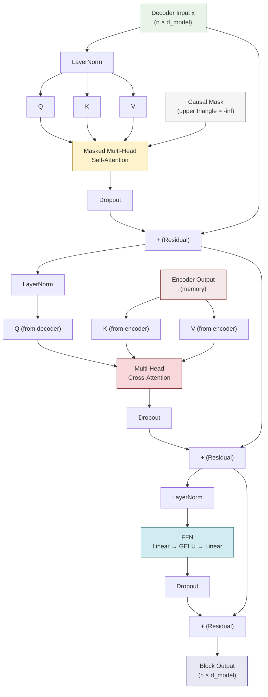

# 3. The Transformer Block

## 3.1 The Transformer Encoder Block

The encoder block is the fundamental building block of the Transformer encoder. Each block performs two operations: **self-attention** (to mix information across positions) and a **feed-forward network** (to transform the representation at each position). Both are wrapped with residual connections and layer normalization.

The computation flow of a single encoder block is:

1. **Multi-Head Self-Attention**: Each position attends to all other positions
2. **Add & Norm (Residual + LayerNorm)**: Add the input to the attention output, then normalize
3. **Feed-Forward Network (FFN)**: Apply a two-layer MLP independently to each position
4. **Add & Norm (Residual + LayerNorm)**: Add the pre-FFN input to the FFN output, then normalize

In the original Transformer (post-norm):

$$\text{output} = \text{LayerNorm}(x + \text{SelfAttention}(x))$$
$$\text{output} = \text{LayerNorm}(\text{output} + \text{FFN}(\text{output}))$$

This block is repeated $N$ times (6 in the original Transformer, more in larger models). Each repetition allows the model to build increasingly abstract representations: early blocks capture local patterns, while deeper blocks capture global relationships.

## 3.2 The Transformer Decoder Block

The decoder block is more complex because it must perform **two types of attention** and prevent information leakage from future tokens:

1. **Masked Multi-Head Self-Attention**: The decoder attends to its own previous outputs, but with a causal mask preventing it from seeing future positions.
2. **Add & Norm**: Residual connection and layer normalization.
3. **Multi-Head Cross-Attention**: The decoder attends to the encoder's output. Queries come from the decoder, keys and values come from the encoder.
4. **Add & Norm**: Residual connection and layer normalization.
5. **Feed-Forward Network**: Same structure as the encoder's FFN.
6. **Add & Norm**: Residual connection and layer normalization.

This three-sublayer structure (masked self-attention → cross-attention → FFN) is the defining characteristic of the decoder block. The cross-attention layer is what differentiates a decoder from an encoder — it is the only layer that connects the two halves of the model.

## 3.3 Layer Normalization: Why It Stabilizes Training

Layer normalization computes the mean and variance **across the feature dimension** for each token independently:

$$\text{LayerNorm}(x) = \frac{x - \mu}{\sigma + \epsilon} \cdot \gamma + \beta$$

Where $\mu$ and $\sigma$ are the mean and standard deviation computed over the $d_{\text{model}}$ features, $\epsilon$ is a small constant for numerical stability, and $\gamma, \beta$ are learnable scale and shift parameters.

**Why is this important?**

- **Gradient stability**: Without normalization, the scale of activations can grow or shrink exponentially through deep networks (the "internal covariate shift" problem). LayerNorm re-centers and re-scales activations at each layer, keeping them in a stable range.
- **Faster convergence**: Normalized activations lead to smoother loss landscapes and better-conditioned gradients, allowing the use of higher learning rates.
- **Independence from batch size**: Unlike BatchNorm, LayerNorm does not depend on batch statistics, making it work well with small batches and variable-length sequences (both common in OCR).

In TAMER, LayerNorm is particularly important because:
- BFloat16 AMP reduces numerical precision, making stable normalization even more critical
- The encoder processes very long sequences (thousands of patches), where activation magnitudes can vary enormously
- The decoder generates autoregressively, and unstable activations early in the sequence can compound errors

## 3.4 Pre-Norm vs Post-Norm

There are two ways to arrange the residual connection and layer normalization:

**Post-norm** (original Transformer):
$$\text{output} = \text{LayerNorm}(x + \text{Sublayer}(x))$$

**Pre-norm** (used in most modern Transformers, including TAMER):
$$\text{output} = x + \text{Sublayer}(\text{LayerNorm}(x))$$

The difference is subtle but consequential:

| Property | Post-Norm | Pre-Norm |
|---|---|---|
| Training stability | Less stable, requires learning rate warmup | More stable, less sensitive to initialization |
| Gradient flow | Must pass through LayerNorm | Direct residual path, gradient flows unimpeded |
| Performance (with tuning) | Can be slightly better | Comparable, easier to train |
| Need for warmup | Yes, critical | Less critical |

**Why TAMER uses pre-norm**: Training a vision-language model with BFloat16 mixed precision is already challenging. Pre-norm provides the extra stability margin needed to avoid training collapse. The direct residual path ensures that gradients can flow through many layers without being attenuated by repeated normalization.

```python
# Pre-norm implementation in PyTorch
class TransformerDecoderBlock(nn.Module):
    def __init__(self, d_model, n_heads, d_ff, dropout):
        super().__init__()
        self.norm1 = nn.LayerNorm(d_model)
        self.norm2 = nn.LayerNorm(d_model)
        self.norm3 = nn.LayerNorm(d_model)
        self.self_attn = nn.MultiheadAttention(d_model, n_heads, dropout=dropout)
        self.cross_attn = nn.MultiheadAttention(d_model, n_heads, dropout=dropout)
        self.ffn = nn.Sequential(
            nn.Linear(d_model, d_ff),
            nn.GELU(),
            nn.Dropout(dropout),
            nn.Linear(d_ff, d_model),
            nn.Dropout(dropout),
        )

    def forward(self, x, enc_output, tgt_mask, src_mask):
        # Pre-norm masked self-attention
        x2 = self.norm1(x)
        x = x + self.self_attn(x2, x2, x2, attn_mask=tgt_mask)[0]
        # Pre-norm cross-attention
        x2 = self.norm2(x)
        x = x + self.cross_attn(x2, enc_output, enc_output, key_padding_mask=src_mask)[0]
        # Pre-norm FFN
        x2 = self.norm3(x)
        x = x + self.ffn(x2)
        return x
```

## 3.5 The Feed-Forward Network (FFN)

The FFN is a position-wise two-layer MLP applied independently to each token:

$$\text{FFN}(x) = W_2 \cdot \text{GELU}(W_1 x + b_1) + b_2$$

Where:
- $W_1 \in \mathbb{R}^{d_{\text{model}} \times d_{ff}}$ expands the representation
- $W_2 \in \mathbb{R}^{d_{ff} \times d_{\text{model}}}$ projects back to the model dimension
- GELU is the activation function (more on this below)

**Why is the FFN needed if we already have attention?**

This is a crucial distinction: **attention and FFN serve fundamentally different roles.**

- **Attention** mixes information **across positions**. It determines *which* positions should contribute to the representation at each position. It is a routing mechanism.
- **FFN** transforms information **within each position**. It processes the mixed representation at each position independently, applying a nonlinear transformation. It is a computation mechanism.

You can think of attention as "where to look" and FFN as "what to compute with what you found." Without the FFN, the model could only re-weight existing features — it could never create genuinely new feature combinations. The FFN's expansion to $4 \times d_{\text{model}}$ provides the capacity for rich nonlinear transformations.

Recent research has interpreted the FFN as a **key-value memory**: $W_1$'s rows act as "keys" that detect input patterns, and $W_2$'s columns act as "values" that produce the corresponding output patterns. In this view, the FFN is a form of differentiable associative memory.

## 3.6 FFN Expansion Ratio

The standard expansion ratio is $4\times$: $d_{ff} = 4 \times d_{\text{model}}$. This means:

- For $d_{\text{model}} = 256$ (TAMER decoder): $d_{ff} = 1024$
- The FFN parameters per layer: $256 \times 1024 + 1024 \times 256 = 524{,}288$

The $4\times$ ratio was established empirically in the original Transformer paper and has become the de facto standard. Some variants use different ratios:
- **GLaMP**: Uses a gating mechanism with a $2\times$ expansion
- **Mixture of Experts (MoE)**: Uses a much larger effective expansion but only activates a subset per token

The expansion ratio represents a tradeoff: larger ratios provide more capacity but increase computation and memory. For TAMER, the $4\times$ ratio provides sufficient capacity for LaTeX generation while keeping the decoder lightweight enough for efficient training and inference.

## 3.7 GELU Activation

The FFN uses **GELU** (Gaussian Error Linear Unit) rather than ReLU:

$$\text{GELU}(x) = x \cdot \Phi(x) = x \cdot \frac{1}{2}\left[1 + \text{erf}\left(\frac{x}{\sqrt{2}}\right)\right]$$

GELU can be approximated as:

$$\text{GELU}(x) \approx 0.5x\left(1 + \tanh\left[\sqrt{2/\pi}(x + 0.044715x^3)\right]\right)$$

**Why GELU over ReLU?**

- **Smooth**: GELU is differentiable everywhere (unlike ReLU, which has a kink at 0). This leads to smoother gradients and better optimization.
- **Non-monotonic for negative inputs**: GELU slightly dips below zero for small negative values before rising, providing a soft "gate" effect. ReLU simply clips to zero.
- **Probabilistic interpretation**: GELU can be interpreted as multiplying the input by the probability that it is greater than zero under a Gaussian distribution — a form of soft gating.
- **Empirical superiority**: GELU consistently outperforms ReLU in Transformer models, particularly when combined with pre-norm architectures.

## 3.8 Residual Connections: Critical for Deep Networks

Each sublayer in the Transformer block is wrapped with a residual connection:

$$\text{output} = x + \text{Sublayer}(x)$$

This seemingly simple addition has profound implications:

1. **Gradient flow**: During backpropagation, the gradient can flow directly through the residual path ($\frac{\partial \text{output}}{\partial x} = I + \frac{\partial \text{Sublayer}}{\partial x}$). Even if $\frac{\partial \text{Sublayer}}{\partial x}$ is near zero (due to saturated activations or normalization), the identity term ensures the gradient is never zero. This prevents vanishing gradients in deep networks.

2. **Implicit ensembling**: A network with $L$ residual blocks can be viewed as an ensemble of $2^L$ paths (each block either uses the residual or the sublayer). This implicit ensemble makes the model more robust.

3. **Iterative refinement**: Rather than transforming representations from scratch, residual blocks incrementally refine them. Each block adds a small adjustment to the input, which is easier to learn than a complete transformation.

4. **Identity initialization**: If all sublayer parameters are initialized to near-zero, the entire block approximates the identity function. This means a 10-layer network starts like a 1-layer network and gradually "learns" to use its depth as training progresses.

For TAMER's 10-layer decoder, residual connections are essential. Without them, gradients from the output layer would need to pass through 30+ nonlinear operations (3 per block: self-attention, cross-attention, FFN) to reach the input embeddings. The residual shortcuts ensure that learning signals propagate effectively through the entire depth.

## 3.9 Stacking Multiple Blocks: Depth and Abstraction

Why use many blocks instead of one very wide block? The answer lies in **compositional representation**:

- **Layer 1**: Captures basic patterns — individual token identities, adjacent relationships
- **Layer 3–4**: Captures local structures — common bigrams and trigrams, simple LaTeX patterns like `x^2`
- **Layer 6–7**: Captures medium-range structures — `\frac{...}{...}`, `\sqrt{...}`
- **Layer 9–10**: Captures global structures — entire formula composition, matching delimiters

Each layer builds on the representations from previous layers, creating a hierarchy of abstraction. This is analogous to how humans read math: first recognizing individual symbols, then parsing subexpressions, then understanding the overall structure.

## 3.10 The Number of Decoder Layers in TAMER

TAMER uses **10 decoder layers**. This number was chosen to balance:

- **Capacity**: Enough layers to model the complex, nested structure of LaTeX expressions
- **Efficiency**: Each additional layer increases inference latency linearly, and autoregressive generation is already sequential
- **Training stability**: Deeper networks are harder to train, especially with mixed precision

The decoder layers are all identical in architecture (masked self-attention → cross-attention → FFN) but have independent parameters. This means the model can learn different "strategies" at each layer: early layers might focus on local token-to-token transitions, middle layers on structural patterns, and late layers on global consistency.

The 10-layer design is more than the original Transformer's 6 layers but less than some large language models (32–96 layers). For OCR, the output sequences are shorter than natural language, so 10 layers provide sufficient depth without excessive overhead.

## 3.11 Dropout in the Transformer Block

TAMER applies dropout at several points within each block:

- **After attention weights**: Prevents over-reliance on specific positions
- **After the FFN**: Regularizes the nonlinear transformations
- **Residual dropout**: Applied to the sublayer output before adding to the residual

Typical dropout rates: 0.1–0.3 during training, 0 during inference. In BFloat16 AMP training, dropout rates may be slightly higher to compensate for the reduced precision.

## 3.12 Mermaid Diagram: Full Transformer Decoder Block



> **Key Takeaway**: The Transformer decoder block combines three essential operations — masked self-attention (to understand the generated sequence so far), cross-attention (to ground generation in the encoder's visual features), and FFN (to compute transformations at each position). Pre-norm residual connections ensure stable gradient flow through the 10-layer decoder, and LayerNorm provides the normalization needed for BFloat16 mixed-precision training.
