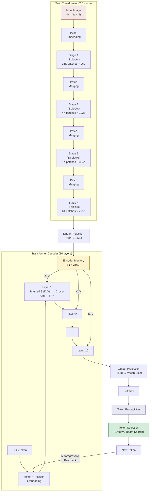

# 4. Encoder-Decoder Architecture

## 4.1 The Encoder-Decoder Paradigm

The encoder-decoder architecture is a foundational design pattern in deep learning for **sequence-to-sequence** tasks: given an input from one domain, produce an output in another domain. The key insight is to split the work into two specialized networks:

- **Encoder**: "Reads" and **compresses** the input into a rich internal representation (often called "memory" or "context")
- **Decoder**: "Writes" the output by **generating** tokens one at a time, using both its own growing sequence and the encoder's memory

This separation of concerns is elegant because:

1. The encoder can be optimized for **understanding** the input (e.g., extracting visual features from an image)
2. The decoder can be optimized for **generating** the output (e.g., producing valid LaTeX)
3. The cross-attention mechanism provides a flexible, learnable bridge between the two

The encoder-decoder paradigm was first popularized by Sutskever et al. (2014) for machine translation and was later refined by the Transformer (Vaswani et al., 2017). TAMER adapts it for the OCR domain: the encoder "reads" a math formula image, and the decoder "writes" the corresponding LaTeX string.

## 4.2 Encoder: Processing Input into Memory

The encoder's job is to transform the raw input into a set of feature vectors that the decoder can query. In TAMER:

- **Input**: A math formula image of size $H \times W \times 3$ (e.g., $256 \times 1024 \times 3$)
- **Process**: Swin Transformer v2 processes the image through 4 hierarchical stages
- **Output**: A sequence of feature vectors, each representing a spatial region of the image

The encoder output is not a single compressed vector — it is a **set** of vectors, one for each spatial position in the final feature map. This is crucial because:

- Different parts of the image contain different information (e.g., the numerator vs. the denominator in a fraction)
- The decoder needs to selectively attend to specific regions when generating each token
- A single compressed vector would create an information bottleneck (the very problem attention was designed to solve)

In TAMER, after the Swin Transformer's 4 stages, the encoder output has shape $(N, d_{\text{encoder}})$, where $N$ is the number of patches in the final stage (e.g., 64 for a $256 \times 1024$ image with 4 stages of downsampling) and $d_{\text{encoder}}$ is the encoder's hidden dimension (768 for Swin-Base).

Before being passed to the decoder, the encoder output may go through a **projection layer** that maps from the encoder's dimension to the decoder's dimension (e.g., $768 \rightarrow 256$). This projection allows the encoder and decoder to have different model sizes.

## 4.3 Decoder: Generating Output Step by Step

The decoder generates the output sequence **autoregressively**: at each step, it produces one token conditioned on all previously generated tokens and the encoder's memory.

At step $t$:

1. **Input**: The tokens generated so far ($y_1, y_2, \ldots, y_{t-1}$), plus the encoder output
2. **Self-attention**: The decoder attends to its own previous outputs (with causal masking)
3. **Cross-attention**: The decoder attends to the encoder's feature vectors, finding the image regions most relevant to the current generation step
4. **FFN**: Transforms the cross-attention output through a nonlinear mapping
5. **Output projection**: A linear layer maps the decoder's output to vocabulary-size logits
6. **Token selection**: The token with the highest probability (or a beam search candidate) is selected as $y_t$

This process repeats until the EOS token is generated or the maximum sequence length is reached.

## 4.4 The Information Flow: Image to LaTeX

Let's trace the complete information flow in TAMER from input to output:

```
Image (256×1024×3)
    ↓ Patch Embedding (4×4 patches)
Patches (64×256 = 16,384 patches, 96 channels)
    ↓ Swin Stage 1 (2 blocks, window attention)
Features (16,384 × 96)
    ↓ Patch Merging (2×2 → 1)
Features (4,096 × 192)
    ↓ Swin Stage 2 (2 blocks)
Features (4,096 × 192)
    ↓ Patch Merging
Features (1,024 × 384)
    ↓ Swin Stage 3 (18 blocks)
Features (1,024 × 384)
    ↓ Patch Merging
Features (64 × 768)
    ↓ Swin Stage 4 (2 blocks)
Encoder Output (64 × 768)
    ↓ Linear Projection
Encoder Memory (64 × 256)
    ↓ Cross-Attention (K, V from here)
Decoder generates LaTeX tokens one at a time
```

The critical transition happens at the cross-attention layer: the 64 encoder feature vectors become the keys and values that the decoder queries. Each encoder feature vector represents an $8 \times 8$ pixel region of the original image (after 4 stages of $2\times$ downsampling, each starting from $4\times 4$ patches: $4 \times 2^3 = 32$ pixels initially, but the spatial resolution at stage 4 corresponds to $256/8 \times 1024/8 = 32 \times 128$... actually, let me recalculate: starting with $4\times4$ patches, after 3 patch merging stages ($2\times$ each), each final patch represents $4 \times 2^3 = 32$ pixels in each dimension. For a $256 \times 1024$ image: $(256/32) \times (1024/32) = 8 \times 32 = 256$ patches... The exact number depends on the specific configuration, but the principle remains: the encoder compresses the image into a manageable number of feature vectors that preserve spatial information.

## 4.5 How the Encoder Output Becomes K and V

In the cross-attention layer:

$$\text{CrossAttention}(Q_d, K_e, V_e) = \text{softmax}\left(\frac{Q_d K_e^T}{\sqrt{d_k}}\right) V_e$$

- $Q_d = \text{DecoderHidden} \cdot W_Q$: The decoder's current state asks "what should I generate next?"
- $K_e = \text{EncoderOutput} \cdot W_K$: The encoder's features say "this is what each region looks like"
- $V_e = \text{EncoderOutput} \cdot W_V$: The encoder's features provide "this is the information from each region"

The attention weights $\text{softmax}(Q_d K_e^T / \sqrt{d_k})$ produce a probability distribution over the encoder's spatial positions. If the decoder is about to generate `\frac`, it will attend strongly to the fraction bar region. If it is about to generate `^{2}`, it will attend to the superscript region.

This mechanism is **dynamic**: at each generation step, the attention pattern shifts to focus on the currently relevant part of the image. This is fundamentally more powerful than a static encoding, because different tokens require information from different image regions.

## 4.6 Teacher Forcing During Training vs Autoregressive During Inference

There is a critical difference between how the decoder operates during training and inference:

### Training: Teacher Forcing

During training, the decoder receives the **ground truth** target sequence as input (shifted right by one position). This is called "teacher forcing" because the "teacher" (ground truth) forces the model to condition on correct previous tokens, regardless of what the model actually predicted.

```
Input to decoder:  SOS \frac { a } { b } + c
Target output:     \frac { a } { b } + c EOS
```

**Advantages:**
- **Parallel training**: All positions are computed simultaneously in one forward pass
- **Stable gradients**: The model always conditions on correct context, preventing error accumulation
- **Fast**: No sequential token-by-token generation needed

**Disadvantages:**
- **Exposure bias**: During inference, the model conditions on its own predictions, which may contain errors. The model has never been exposed to its own mistakes during training, so errors can compound.

### Inference: Autoregressive Generation

During inference, no ground truth is available. The decoder generates one token at a time, feeding each prediction back as input for the next step:

```
Step 1: Input [SOS]              → Predict \frac
Step 2: Input [SOS, \frac]       → Predict {
Step 3: Input [SOS, \frac, {]    → Predict a
...
Step N: Input [..., +, c]        → Predict EOS
```

This sequential process is slower (cannot be parallelized) but is the only way to generate novel outputs.

### Scheduled Sampling

Some techniques bridge the gap between teacher forcing and autoregressive generation:

- **Scheduled sampling**: Gradually replace some ground truth tokens with the model's own predictions during training
- **Label smoothing**: Softens the target distribution, making the model less overconfident and more robust to its own errors

## 4.7 The Causal Mask: generate_square_subsequent_mask

During training, the entire target sequence is processed in parallel, but we must prevent each position from attending to future positions. This is enforced by the **causal mask** (also called the "subsequent mask"):

```python
def generate_square_subsequent_mask(sz):
    """Generate a causal mask for the decoder."""
    mask = torch.triu(torch.ones(sz, sz), diagonal=1)
    mask = mask.masked_fill(mask == 1, float('-inf'))
    return mask
```

For a sequence of length 5, the mask looks like:

```
[[  0, -inf, -inf, -inf, -inf],
 [  0,    0, -inf, -inf, -inf],
 [  0,    0,    0, -inf, -inf],
 [  0,    0,    0,    0, -inf],
 [  0,    0,    0,    0,    0]]
```

After adding this to the attention scores and applying softmax:
- Position 0 only attends to position 0
- Position 1 attends to positions 0 and 1
- Position $t$ attends to positions $0, 1, \ldots, t$

The $-\infty$ values become exactly 0 after softmax, effectively erasing future information. This is mathematically equivalent to running the decoder autoregressively but allows parallel computation during training.

**Note on mask shape**: The mask is $n \times n$ (not $n \times m$ where $m$ is the encoder sequence length). The causal mask only applies to the decoder's self-attention, not to cross-attention. In cross-attention, the decoder can attend to all encoder positions — there is no concept of "future" in the encoder output.

## 4.8 Why Encoder-Decoder Is Better Than Encoder-Only for Generation

You might ask: why not use an encoder-only model (like BERT or GPT) for this task?

**Encoder-only models** (like GPT) can generate text by predicting the next token, but they have no dedicated mechanism for processing a separate input modality. To use GPT for OCR, you would need to:

1. Encode the image somehow (e.g., using a separate vision encoder)
2. Prepend the image features to the text sequence
3. Treat the combined sequence as a single input

This approach has several drawbacks:

- **Fixed attention pattern**: All tokens attend to all other tokens with the same self-attention mechanism. There is no dedicated cross-modal attention.
- **Inefficient**: The image features and text tokens compete for the same attention capacity.
- **No modality specialization**: The same layers must learn to process both image features and text, which are fundamentally different types of information.

**Encoder-decoder models** solve these problems by:

- **Dedicated processing**: The encoder specializes in visual features, the decoder specializes in LaTeX generation
- **Clean separation**: Cross-attention provides a dedicated, efficient mechanism for accessing encoder information
- **No contamination**: The decoder's self-attention only sees text tokens, not image features, preventing cross-modal interference
- **Proven effectiveness**: Encoder-decoder models consistently outperform encoder-only models on conditional generation tasks like translation, summarization, and OCR

For TAMER, the encoder-decoder architecture is the natural choice: the input (image) and output (LaTeX) are different modalities with different structural properties, and they require specialized processing.

## 4.9 The Full Generation Pipeline

Putting it all together, the complete generation pipeline in TAMER is:

1. **Preprocess**: Resize and normalize the input image
2. **Encode**: Pass the image through the Swin Transformer v2 encoder → obtain feature vectors
3. **Project**: Map encoder features from $d_{\text{encoder}}$ to $d_{\text{decoder}}$
4. **Initialize**: Start the decoder with the SOS token
5. **Decode (repeat)**:
   a. Embed the current token sequence (token + position embeddings)
   b. Pass through 10 decoder blocks (masked self-attention → cross-attention → FFN)
   c. Project to vocabulary logits
   d. Select next token (greedy or beam search)
   e. Append the selected token to the sequence
   f. If EOS or max length, stop; otherwise, go to step 5a
6. **Post-process**: Convert token IDs back to LaTeX string

## 4.10 Mermaid Diagram: Full Encoder-Decoder Architecture



> **Key Takeaway**: The encoder-decoder architecture is the backbone of TAMER. The Swin Transformer encoder compresses the input image into spatially-organized feature vectors, and the Transformer decoder generates LaTeX tokens autoregressively while attending to the encoder's features via cross-attention. This clean separation of "reading" and "writing" — connected by a learnable attention mechanism — is what makes the architecture so effective for math OCR.
