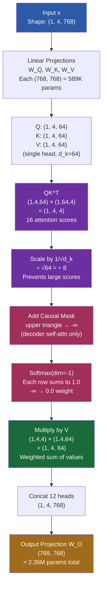

# 5. The Mathematics of Attention in Detail

Attention is the mechanism that gives the Transformer its power. While the high-level idea — "query the most relevant information" — is intuitive, the actual computation involves precise linear algebra operations with specific shapes and numerical considerations. This note walks through the attention computation step by step with concrete numbers, then extends to multi-head attention, cross-attention, and causal masking.

## Step-by-Step Computation with Concrete Numbers

Let us trace the attention computation for a single head with a small sequence. Assume we have:

- **Sequence length**: $L = 4$ tokens
- **Head dimension**: $d_k = 64$
- **Batch size**: $B = 1$

The three inputs to attention are:

| Tensor | Shape | Meaning |
|--------|-------|---------|
| Q (Queries) | (1, 4, 64) | "What am I looking for?" |
| K (Keys) | (1, 4, 64) | "What do I contain?" |
| V (Values) | (1, 4, 64) | "What information do I provide?" |

### Step 1: Compute Attention Scores — $QK^T$

The attention scores measure how relevant each key is to each query. We compute:

$$\text{scores} = QK^T$$

The matrix multiplication works as follows:
- $Q$ has shape $(1, 4, 64)$
- $K^T$ (transpose of the last two dimensions) has shape $(1, 64, 4)$
- Result: $(1, 4, 64) \times (1, 64, 4) = (1, 4, 4)$

Each element $\text{scores}[i][j]$ is the dot product of query $i$ with key $j$ — a scalar measuring how much query $i$ "attends to" key $j$. The resulting $4 \times 4$ matrix has 16 scores, one for every (query, key) pair.

### Step 2: Scale by $\sqrt{d_k}$

$$\text{scaled\_scores} = \frac{\text{scores}}{\sqrt{d_k}} = \frac{\text{scores}}{\sqrt{64}} = \frac{\text{scores}}{8}$$

**Why divide by $\sqrt{d_k}$?** When $d_k$ is large, the dot products grow in magnitude. If the components of $Q$ and $K$ are independently distributed with mean 0 and variance 1, then the dot product $Q \cdot K$ has variance $d_k$. Dividing by $\sqrt{d_k}$ brings the variance back to 1, which keeps the softmax in a region where it produces meaningful gradients.

Without scaling, for $d_k = 64$, the dot products would typically have values around $\pm 8$ (standard deviation $\sqrt{64} = 8$). The softmax of values like $[8, -8, 3, -5]$ is extremely peaked — close to one-hot — which means the gradient of the loss with respect to the scores is tiny. Scaling prevents this **vanishing gradient** problem in the attention mechanism itself.

### Step 3: Apply Softmax Along the Key Dimension

$$\text{weights} = \text{softmax}(\text{scaled\_scores}, \text{dim}=-1)$$

Softmax is applied **row-wise** (along the key dimension), so each row of the $4 \times 4$ matrix sums to 1.0. Row $i$ represents the attention distribution for query $i$: how much it attends to each of the 4 keys.

After softmax, all weights are in $[0, 1]$ and each row sums to exactly 1.0. This makes the weights interpretable as a probability distribution over key positions.

### Step 4: Multiply by Values

$$\text{output} = \text{weights} \times V$$

- Weights have shape $(1, 4, 4)$
- $V$ has shape $(1, 4, 64)$
- Result: $(1, 4, 4) \times (1, 4, 64) = (1, 4, 64)$

Each output position is a **weighted sum of all value vectors**, where the weights come from the attention distribution. Output $i$ is:

$$\text{output}_i = \sum_{j=1}^{4} \text{weights}_{i,j} \cdot V_j$$

This is the key insight: each output position gathers information from all input positions, weighted by relevance. If query $i$ strongly attends to key $j$ (high weight), then value $j$ contributes heavily to output $i$.

## Multi-Head Attention

A single attention head can only learn one pattern of relevance. **Multi-head attention** splits the computation into multiple heads, each operating in a different subspace, allowing the model to attend to different types of relationships simultaneously.

For TAMER with $d_{\text{model}} = 768$ and $h = 12$ heads:

1. **Split**: the 768-dimensional Q, K, V are each split into 12 heads of 64 dimensions each. Shape: $(B, 12, L, 64)$.
2. **Attend**: each head independently computes attention as described above. Shape per head: $(B, L, 64)$.
3. **Concatenate**: the 12 head outputs are concatenated along the feature dimension. Shape: $(B, L, 768)$.
4. **Project**: a final linear transformation $W_O$ mixes information across heads. Shape: $(B, L, 768)$.

The multi-head computation in code:

```python
# Q, K, V each (B, L, 768)
Q = Q.view(B, L, 12, 64).transpose(1, 2)  # (B, 12, L, 64)
K = K.view(B, L, 12, 64).transpose(1, 2)  # (B, 12, L, 64)
V = V.view(B, L, 12, 64).transpose(1, 2)  # (B, 12, L, 64)

scores = Q @ K.transpose(-2, -1) / (64 ** 0.5)  # (B, 12, L, L)
weights = softmax(scores, dim=-1)               # (B, 12, L, L)
attn_out = weights @ V                          # (B, 12, L, 64)

attn_out = attn_out.transpose(1, 2).reshape(B, L, 768)  # (B, L, 768)
output = attn_out @ W_O                                 # (B, L, 768)
```

## The QKV Weight Matrices

The Q, K, V are not given directly — they are computed from the input by learnable linear projections:

$$Q = xW_Q, \quad K = xW_K, \quad V = xW_V$$

where $x$ is the input of shape $(B, L, 768)$ and each weight matrix $W_Q, W_K, W_V$ has shape $(768, 768)$.

The parameter count per attention layer:

| Parameter | Shape | Count |
|-----------|-------|-------|
| $W_Q$ | (768, 768) | 589,824 |
| $W_K$ | (768, 768) | 589,824 |
| $W_V$ | (768, 768) | 589,824 |
| $W_O$ | (768, 768) | 589,824 |
| Biases | (768,) × 4 | 3,072 |
| **Total** | | **2,362,368** |

That is approximately **2.36 million parameters per attention layer**. With 6 decoder layers in TAMER, the attention parameters alone account for roughly 14 million parameters — a significant fraction of the total model.

## Cross-Attention: Bridging Encoder and Decoder

In the decoder's cross-attention layers, the queries come from the decoder while the keys and values come from the encoder's memory:

- **Q** = decoder hidden state, shape $(B, L_{\text{dec}}, 768)$
- **K** = encoder output, shape $(B, L_{\text{enc}}, 768)$
- **V** = encoder output, shape $(B, L_{\text{enc}}, 768)$

The attention scores have shape $(B, L_{\text{dec}}, L_{\text{enc}})$ — each decoder position attends to all encoder positions. This is how the model "looks at" the image features while generating LaTeX. When the decoder is producing `\frac`, it might attend strongly to the region of the encoder output that represents the fraction bar in the image.

Cross-attention is the critical bridge that connects visual understanding (encoder) to language generation (decoder). Without it, the decoder would have no information about the input image.

## The Causal Mask

In the decoder's **self-attention** layers, we must prevent each position from attending to future positions — this is the **causal mask**. The mask is a lower-triangular matrix:

$$M = \begin{pmatrix} 0 & -\infty & -\infty & -\infty \\ 0 & 0 & -\infty & -\infty \\ 0 & 0 & 0 & -\infty \\ 0 & 0 & 0 & 0 \end{pmatrix}$$

The mask is **added** to the attention scores before softmax:

$$\text{masked\_scores} = \text{scores} + M$$

**Why add rather than multiply?** Adding $-\infty$ before softmax is **numerically stable**. After adding $-\infty$ and then applying softmax:

$$\text{softmax}(z)_{\text{masked}} = \frac{e^{z_{\text{masked}}}}{\sum e^{z}} = \frac{e^{-\infty}}{\sum e^{z}} = \frac{0}{\sum e^{z}} = 0$$

If we instead multiplied the weights by 0 after softmax, we would need to compute softmax first (including the contributions from future positions), then zero them out. This is less efficient and can cause numerical issues. The additive mask approach ensures that future positions contribute zero to both the numerator and denominator of softmax.

After softmax, each row of the attention matrix sums to 1.0, and positions corresponding to $-\infty$ in the mask receive exactly 0.0 weight. Position $i$ can only attend to positions $1, 2, \ldots, i$ — it cannot "see the future."

## The Memory Cost of Attention

For a sequence of length $L$, the attention matrix has shape $(L, L)$, requiring $L^2$ memory. The computation also scales as $O(L^2)$ since each of the $L$ query positions computes a dot product with $L$ key positions.

For TAMER decoding a LaTeX sequence of length 256:
- Attention matrix: $256 \times 256 = 65,536$ elements per head
- With 12 heads and batch size 32: $65,536 \times 12 \times 32 \approx 25$ million elements
- At 4 bytes each (float32): ~100 MB just for attention weights

For longer sequences (e.g., 1024 tokens), the cost quadruples to ~1.6 GB. This **quadratic scaling** is the primary limitation of the standard attention mechanism and motivates research into efficient attention variants (sparse attention, linear attention, flash attention).

## Mermaid Diagram: Attention Computation with Concrete Numbers



This diagram traces the complete attention computation with concrete shapes at each step. The key takeaway is that attention is a series of well-defined linear algebra operations: project, score, scale, mask, normalize, and aggregate. Every step has a clear purpose — projection creates the query/key/value spaces, scoring measures relevance, scaling maintains gradient flow, masking enforces causality, normalization creates valid weights, and aggregation produces the output. Understanding these steps with concrete numbers demystifies the attention mechanism and makes it possible to debug shape errors, memory issues, and numerical problems in practice.
