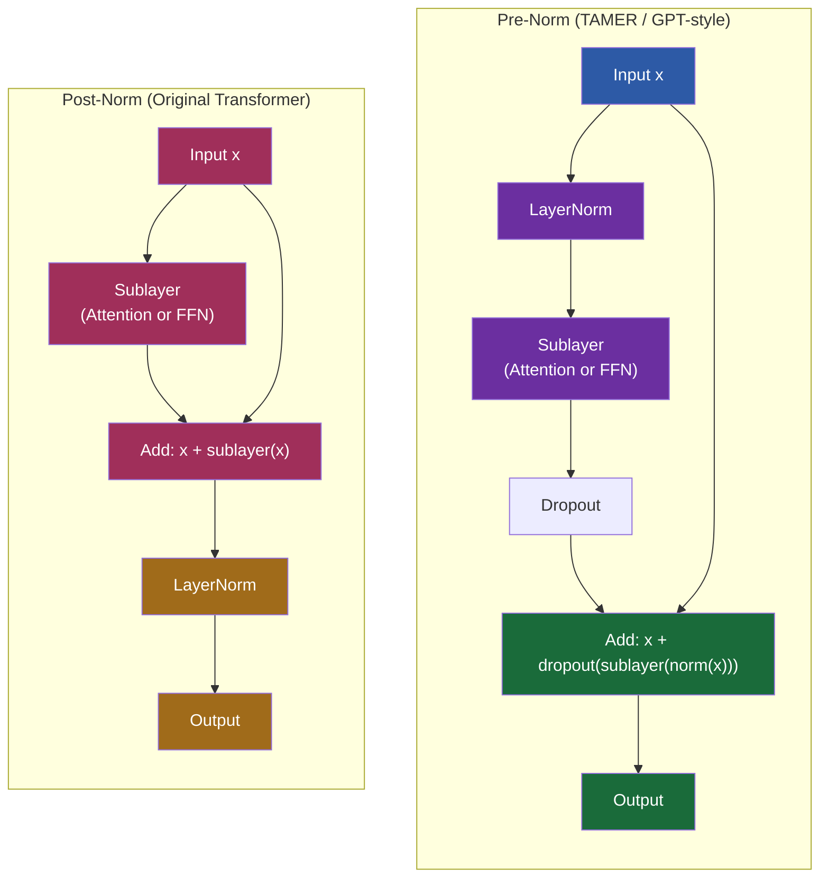

# 6. Layer Normalization and Residual Connections

Two architectural features make deep Transformers trainable: **layer normalization** and **residual connections**. Without normalization, the distribution of activations shifts unpredictably as training progresses, destabilizing learning. Without residual connections, gradients vanish as they propagate through many layers, making deep networks impossible to train. Together, they create the stable, trainable infrastructure that allows models like TAMER to stack 10+ Transformer blocks and still converge reliably.

## Why Normalization Matters: Internal Covariate Shift

During training, each layer receives inputs whose distribution changes as the parameters of all previous layers are updated. This phenomenon, called **internal covariate shift**, creates several problems:

- **Unstable gradients**: if the input distribution to a layer shifts dramatically, the gradients computed for that layer may be too large or too small, leading to oscillation or stagnation.
- **Slow convergence**: each layer must continuously adapt to the changing distribution of its inputs, which slows down learning.
- **Sensitivity to initialization**: without normalization, the initial distribution of activations depends heavily on the weight initialization scheme, making training brittle.

Normalization addresses these problems by stabilizing the distribution of activations at each layer, regardless of what the layers before and after are doing.

## Batch Normalization vs Layer Normalization

**Batch Normalization (BN)** normalizes each feature across the batch dimension:

$$\hat{x}_i = \frac{x_i - \mu_{\text{batch}}}{\sqrt{\sigma_{\text{batch}}^2 + \epsilon}}$$

where $\mu_{\text{batch}}$ and $\sigma_{\text{batch}}^2$ are the mean and variance computed over the batch for each feature. BN was the first widely used normalization technique, but it has critical limitations for Transformers:

1. **Depends on batch size**: BN requires a sufficiently large batch (typically 32+) to compute reliable statistics. With small batches (common in large model training), the statistics are noisy and BN performs poorly.
2. **Behavior differs between training and inference**: during training, BN uses batch statistics; during inference, it uses running averages computed during training. This discrepancy can cause problems.
3. **Problematic for variable-length sequences**: in sequence models, different positions in the sequence may have different distributions, and padding tokens distort batch statistics.

**Layer Normalization (LN)** normalizes each position independently across the feature dimension:

$$\hat{x}_i = \frac{x_i - \mu_{\text{features}}}{\sqrt{\sigma_{\text{features}}^2 + \epsilon}}$$

where $\mu_{\text{features}}$ and $\sigma_{\text{features}}^2$ are computed over all features for a single position. LN has none of BN's limitations:

- It is **independent of batch size**: statistics are computed per-position, not per-batch.
- It behaves **identically at training and inference**: no running averages needed.
- It handles **variable-length sequences** naturally: each position is normalized independently.

This is why all Transformer models, including TAMER, use Layer Normalization.

## The LayerNorm Formula in Detail

Given an input vector $x$ of dimension $d$, Layer Normalization computes:

$$\mu = \frac{1}{d} \sum_{i=1}^{d} x_i$$

$$\sigma^2 = \frac{1}{d} \sum_{i=1}^{d} (x_i - \mu)^2$$

$$\hat{x}_i = \frac{x_i - \mu}{\sqrt{\sigma^2 + \epsilon}}$$

$$y_i = \gamma_i \hat{x}_i + \beta_i$$

The key components:

- **$\epsilon$** (typically $10^{-5}$): a small constant added to the variance to prevent division by zero when all features are identical.
- **$\gamma$** (gain): a learnable parameter of shape $(d,)$ that rescales each feature. Initialized to 1.
- **$\beta$** (bias): a learnable parameter of shape $(d,)$ that shifts each feature. Initialized to 0.

### Why Learnable Parameters Matter

Without $\gamma$ and $\beta$, LayerNorm would force the output to always have zero mean and unit variance. This is too restrictive — some layers might need their activations in a different range. The learnable parameters $\gamma$ and $\beta$ allow the model to **undo the normalization if needed**: by setting $\gamma_i = \sigma$ and $\beta_i = \mu$, the layer can recover the original distribution. This gives the model the freedom to choose whether normalization is helpful (keep $\gamma \approx 1$, $\beta \approx 0$) or harmful (set $\gamma$ and $\beta$ to recover the original distribution).

In practice, $\gamma$ and $\beta$ typically learn values that are close to, but not exactly, the identity transformation. They fine-tune the normalized distribution to be optimal for the downstream computation.

## Pre-Norm vs Post-Norm

The placement of LayerNorm relative to the attention and FFN sub-layers is a critical architectural decision that significantly affects training stability.

### Post-Norm (Original Transformer)

In the original Transformer paper, LayerNorm is applied **after** the sub-layer and residual connection:

$$\text{output} = \text{LayerNorm}(x + \text{Sublayer}(x))$$

Post-norm can be unstable for deep models because the residual path is not clean — the LayerNorm at the end of each block modifies the signal before it is passed to the next block. As the network gets deeper, the accumulated effect of these modifications can destabilize training.

### Pre-Norm (Used in TAMER / GPT-style Models)

In pre-norm, LayerNorm is applied **before** the sub-layer:

$$\text{output} = x + \text{Sublayer}(\text{LayerNorm}(x))$$

Pre-norm creates a **clean residual path**: the input $x$ passes through to the next block unchanged. The sub-layer only modifies the signal through the addition path. This has several important consequences:

1. **Better gradient flow**: the gradient from the loss can flow through the residual path without passing through any normalization or sub-layer operations. This is like a highway that bypasses all the complexity of the layer.
2. **More stable training**: the main signal path is unaffected by normalization, so the network is less sensitive to initialization and hyperparameters.
3. **No warm-up needed**: post-norm Transformers typically require a learning rate warm-up phase to stabilize early training. Pre-norm models can often be trained without warm-up.
4. **Predictable at initialization**: at the start of training, when sub-layer weights are near zero, the pre-norm output is approximately $x + 0 = x$. The network initially behaves like an identity function, which is a safe starting point.

The tradeoff is that pre-norm models may achieve slightly lower final performance than well-tuned post-norm models, because the LayerNorm before the sub-layer slightly reduces the expressive power of each layer. However, the training stability benefits far outweigh this minor drawback for deep models.

## Residual Connections: The Gradient Highway

A **residual connection** adds the input of a layer to its output:

$$\text{output} = \text{Sublayer}(x) + x$$

This seemingly simple addition has profound implications for deep network training.

### Why Residual Connections Work

Without residual connections, a deep network with $N$ layers computes:

$$y = f_N(f_{N-1}(\cdots f_2(f_1(x))\cdots))$$

The gradient of the loss $L$ with respect to the input of layer $k$ involves the product of Jacobians of all layers from $k$ to $N$:

$$\frac{\partial L}{\partial x_k} = \frac{\partial L}{\partial y} \prod_{i=k}^{N} \frac{\partial f_i}{\partial x_i}$$

If any layer's Jacobian has singular values less than 1, this product shrinks exponentially with depth — the **vanishing gradient** problem. If any has singular values greater than 1, it grows exponentially — the **exploding gradient** problem.

With residual connections, the gradient has an alternative path:

$$\frac{\partial L}{\partial x_k} = \frac{\partial L}{\partial y} \left(\prod_{i=k}^{N} \frac{\partial f_i}{\partial x_i} + I\right)$$

The identity term $I$ ensures that the gradient is at least $\frac{\partial L}{\partial y}$, regardless of what the sub-layers do. The gradient can never vanish completely because there is always a direct path from the loss to every layer.

### Residual Connections in Very Deep Networks

In TAMER's decoder with 6 Transformer blocks, each block has two residual connections (one for attention, one for FFN). The effective depth is 12 sub-layers. Without residuals, the gradient would need to pass through 12 successive transformations, each of which can attenuate it. With residuals, the gradient flows through 12 "highways" that bypass each sub-layer.

In even deeper models (e.g., Swin-v2 with 24+ blocks), residual connections are absolutely essential. Empirically, attempting to train a 24-layer Transformer without residual connections results in complete failure — the gradients vanish before reaching the early layers, and those layers never learn.

### The Skip Connection in Code

In PyTorch, the pre-norm residual block looks like:

```python
class TransformerBlock(nn.Module):
    def __init__(self, d_model, nhead, dropout=0.1):
        super().__init__()
        self.norm1 = nn.LayerNorm(d_model)
        self.attn = nn.MultiheadAttention(d_model, nhead, dropout=dropout)
        self.norm2 = nn.LayerNorm(d_model)
        self.ffn = nn.Sequential(
            nn.Linear(d_model, d_model * 4),
            nn.GELU(),
            nn.Dropout(dropout),
            nn.Linear(d_model * 4, d_model),
            nn.Dropout(dropout),
        )
        self.dropout = nn.Dropout(dropout)

    def forward(self, x, mask=None):
        # Pre-norm attention with residual
        normed = self.norm1(x)
        attn_out, _ = self.attn(normed, normed, normed, attn_mask=mask)
        x = x + self.dropout(attn_out)

        # Pre-norm FFN with residual
        normed = self.norm2(x)
        ffn_out = self.ffn(normed)
        x = x + self.dropout(ffn_out)

        return x
```

Notice the pattern: **normalize → sub-layer → dropout → add residual**. The dropout is applied to the sub-layer output before adding the residual, which means the residual path is always clean and unaffected by dropout.

## Mermaid Diagram: Pre-Norm vs Post-Norm Comparison



The critical difference is the **residual path**: in pre-norm, the input $x$ flows directly to the output without passing through LayerNorm or the sub-layer. In post-norm, the input must pass through LayerNorm before becoming the output. The pre-norm architecture ensures that the gradient highway is always open, while the post-norm architecture forces the gradient through the normalization at every layer. For deep models like TAMER, this difference is what makes training stable and reliable.

In summary, Layer Normalization and residual connections are not optional embellishments — they are the structural pillars that make deep Transformer training possible. LayerNorm stabilizes the distribution of activations at each layer, and residual connections ensure that gradients can flow backward through the network without vanishing. The pre-norm architecture used in TAMER combines both in the most stable configuration, providing a clean residual path while still benefiting from normalization of the sub-layer inputs.
