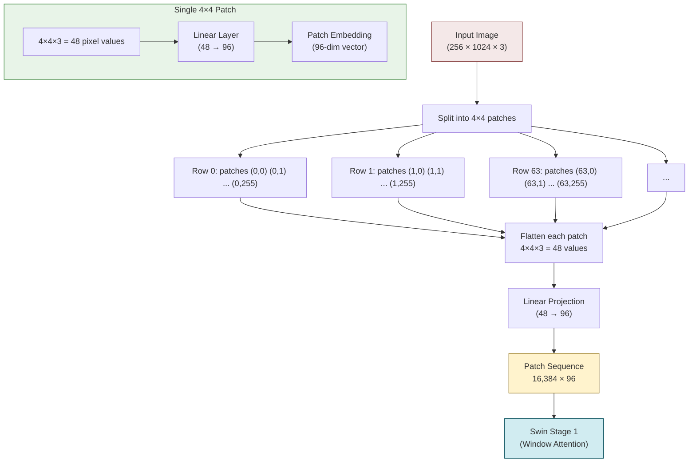

# 1. Vision Transformers and the Patch Approach

## 1.1 From CNNs to Vision Transformers

For nearly a decade, convolutional neural networks (CNNs) dominated computer vision. Their inductive biases — **locality** (nearby pixels are correlated), **translation equivariance** (the same pattern can appear anywhere), and **hierarchical feature learning** (edges → textures → parts → objects) — made them remarkably effective. But CNNs have limitations:

- **Fixed receptive field**: Each convolution layer only sees a small neighborhood. Capturing long-range dependencies requires many layers or dilation.
- **Hand-designed inductive biases**: CNNs assume local correlations are the primary structure. This is not always true — in math formulas, the relationship between a `\frac` and its closing `}` may span the entire image.
- **Global pooling at the end**: Many CNN architectures compress spatial information through global average pooling, losing precise spatial relationships.

The **Vision Transformer (ViT)**, introduced by Dosovitskiy et al. (2020), took a radically different approach: treat the image as a sequence of tokens, just like words in a sentence, and apply a standard Transformer encoder. With sufficient data, ViT can match or exceed CNN performance by learning its own inductive biases from data.

## 1.2 ViT: Treating an Image as a Sequence of Patches

The core idea of ViT is beautifully simple:

1. **Split** the image into fixed-size, non-overlapping patches (e.g., $16 \times 16$ or $4 \times 4$ pixels)
2. **Flatten** each patch into a vector
3. **Linearly project** each flattened patch into a $d_{\text{model}}$-dimensional embedding
4. **Add positional embeddings** to retain spatial information
5. **Feed the resulting sequence** into a standard Transformer encoder

The patch embedding step is analogous to token embedding in NLP: just as each word is mapped to a vector, each patch is mapped to a vector. The Transformer then processes these "visual tokens" using self-attention, allowing every patch to communicate with every other patch.

Mathematically, for an image $I \in \mathbb{R}^{H \times W \times C}$ with patch size $P$:

- Number of patches: $N = \frac{H}{P} \times \frac{W}{P}$
- Each patch: $\mathbf{p}_i \in \mathbb{R}^{P \times P \times C} = \mathbb{R}^{P^2 C}$
- After flattening: $\mathbf{p}_i \in \mathbb{R}^{P^2 C}$
- After linear projection: $\mathbf{z}_i = \mathbf{p}_i \cdot E \in \mathbb{R}^{d_{\text{model}}}$

The patch embedding is implemented as a convolution with kernel size and stride equal to the patch size:

```python
# Equivalent implementations
# Option 1: Conv2d (efficient, standard)
self.patch_embed = nn.Conv2d(3, d_model, kernel_size=patch_size, stride=patch_size)

# Option 2: Manual reshape + linear (conceptually clearer)
patches = image.unfold(2, patch_size, patch_size).unfold(3, patch_size, patch_size)
patches = patches.reshape(N, patch_size * patch_size * 3)
embeddings = self.linear(patches)
```

The convolution implementation is preferred because it is highly optimized on GPUs and naturally handles the spatial-to-sequence conversion.

## 1.3 Why 4×4 Patch Size in TAMER

TAMER uses a patch size of **$4 \times 4$ pixels**. This is smaller than ViT's typical $16 \times 16$, and the choice has important implications:

**Advantages of small patches (4×4):**
- **Fine-grained features**: Math formula images contain thin strokes, small symbols, and precise spatial relationships. A $4 \times 4$ patch captures individual strokes and symbol parts, while a $16 \times 16$ patch would blur multiple symbols together.
- **Better spatial resolution**: More patches means more precise spatial localization, which is critical for cross-attention — the decoder needs to know exactly where each symbol is.
- **Preserved detail**: In $\frac{a+b}{c-d}$, the fraction bar, the operators, and the letters are all small features that would be lost with larger patches.

**Disadvantages of small patches:**
- **More patches**: For a $256 \times 1024$ image with $4 \times 4$ patches: $(256/4) \times (1024/4) = 64 \times 256 = 16{,}384$ patches. This is an extremely long sequence for a Transformer.
- **Higher computation**: More patches means more computation for self-attention (which is $O(n^2)$ in the number of patches).
- **This is exactly why TAMER uses Swin Transformer** instead of vanilla ViT — Swin's local window attention makes 16K patches tractable.

The patch size choice reflects a fundamental tradeoff: **smaller patches give better spatial resolution but increase computational cost**. TAMER chooses 4×4 for maximum resolution and relies on Swin's efficient attention mechanism to handle the resulting long sequence.

## 1.4 The Problem with Vanilla ViT: O(n²) Attention

The critical limitation of vanilla ViT becomes apparent when we calculate the number of patches for high-resolution math formula images:

For a $256 \times 1024$ image with $4 \times 4$ patches:
$$N = \frac{256}{4} \times \frac{1024}{4} = 64 \times 256 = 16{,}384 \text{ patches}$$

Self-attention over 16,384 patches requires computing an attention matrix of size $16{,}384 \times 16{,}384 = 268{,}435{,}456$ entries **per head, per layer**. With 12 heads and 24 layers (Swin-Base configuration), that's:

$$268{,}435{,}456 \times 12 \times 24 \approx 77 \text{ billion entries}$$

Even with BFloat16 (2 bytes per entry), this would require approximately **154 GB of memory** just for the attention matrices — far beyond the capacity of any modern GPU. And this is just the attention matrices; the actual computation (softmax, matrix multiplications) would be even more expensive.

This is why vanilla ViT typically uses larger patches ($16 \times 16$ or $32 \times 32$) and processes images at lower resolutions ($224 \times 224$ or $384 \times 384$). For math OCR, neither of these compromises is acceptable — we need both high resolution (to capture fine details) and fine-grained patches (to preserve spatial precision).

## 1.5 For a 256×1024 Image: The Numbers

Let's look at the exact numbers for TAMER's input resolution:

| Property | Value |
|---|---|
| Input image size | $256 \times 1024 \times 3$ |
| Patch size | $4 \times 4$ |
| Patches along height | $256 / 4 = 64$ |
| Patches along width | $1024 / 4 = 256$ |
| Total patches | $64 \times 256 = 16{,}384$ |
| Vanilla attention matrix size | $16{,}384^2 = 268{,}435{,}456$ |
| Memory for attention (BF16) | ~512 MB per head per layer |
| **This is infeasible** | ✗ |

With Swin Transformer's local window attention (window size $M=7$):
- Each window contains $7 \times 7 = 49$ patches
- Number of windows: $(64/7) \times (256/7) \approx 9 \times 37 = 333$ windows
- Attention matrix per window: $49 \times 49 = 2{,}401$ entries
- Total attention entries: $333 \times 2{,}401 = 799{,}533$ — **336× reduction!**

This massive reduction is what makes high-resolution math OCR feasible with Transformer architectures.

## 1.6 Patch Resolution Through the Stages

TAMER's Swin Transformer processes patches through 4 hierarchical stages, progressively reducing spatial resolution while increasing channel dimension:

```
Input Image: 256 × 1024 × 3

Stage 1 (Patch Embedding):
  - 64 × 256 patches, 96 channels
  - Total: 16,384 patch tokens

Patch Merging (2×2 → 1):
  - 32 × 128 patches, 192 channels
  - Total: 4,096 patch tokens

Stage 2:
  - 32 × 128 patches, 192 channels
  - Total: 4,096 patch tokens

Patch Merging (2×2 → 1):
  - 16 × 64 patches, 384 channels
  - Total: 1,024 patch tokens

Stage 3:
  - 16 × 64 patches, 384 channels
  - Total: 1,024 patch tokens

Patch Merging (2×2 → 1):
  - 8 × 32 patches, 768 channels
  - Total: 256 patch tokens

Stage 4:
  - 8 × 32 patches, 768 channels
  - Total: 256 patch tokens
```

This progressive merging follows the CNN principle of **increasing receptive field and channel depth while decreasing spatial resolution**. By the final stage:

- Each of the 256 patch tokens represents a large receptive field covering a significant portion of the image
- The 768-dimensional feature vectors carry rich semantic information
- The decoder only needs to cross-attend to 256 (or 64, depending on configuration) encoder features instead of 16,384

The reduction from 16,384 → 4,096 → 1,024 → 256 patch tokens through 3 stages of patch merging represents a $64\times$ spatial compression, making the decoder's cross-attention feasible and efficient.

## 1.7 The Analogy: Patches as Visual Words

Just as NLP Transformers tokenize text into subword units (WordPiece, BPE), ViT tokenizes images into patches. This analogy runs deep:

| NLP Concept | Vision Equivalent |
|---|---|
| Word / Subword | Image patch |
| Token embedding | Patch embedding (Conv2d projection) |
| Positional encoding | Patch position (2D grid structure) |
| Vocabulary | All possible patch appearances |
| Sequence length | Number of patches |

However, there are key differences:
- **Vocabulary size**: NLP has a finite vocabulary (~30K subwords). The "vocabulary" of patches is effectively infinite — a $4 \times 4$ RGB patch has $256^{48}$ possible appearances. This is why patch embedding uses a linear projection rather than a lookup table.
- **2D structure**: Text is inherently 1D, but images are 2D. The 2D grid structure of patches carries important spatial information that must be preserved (through relative position biases or learned 2D position embeddings).
- **Variable resolution**: Text sequences have variable length, but all patches within an image have the same size. The number of patches varies with image resolution, not with "content."

## 1.8 Patch Embedding Implementation Details

The patch embedding layer in TAMER (Swin Transformer) has specific implementation details worth noting:

```python
class PatchEmbed(nn.Module):
    def __init__(self, img_size=224, patch_size=4, in_chans=3, embed_dim=96):
        super().__init__()
        self.patch_size = patch_size
        self.proj = nn.Conv2d(in_chans, embed_dim, kernel_size=patch_size, stride=patch_size)
        self.norm = nn.LayerNorm(embed_dim)  # Swin v2 adds norm after projection

    def forward(self, x):
        x = self.proj(x)           # (B, embed_dim, H/P, W/P)
        x = x.flatten(2)           # (B, embed_dim, N)
        x = x.transpose(1, 2)      # (B, N, embed_dim)
        x = self.norm(x)           # LayerNorm
        return x
```

Key details:
- **Conv2d with stride = kernel_size**: This creates non-overlapping patches, which is more efficient than overlapping patches and provides a clean spatial partitioning.
- **LayerNorm after projection**: Swin v2 adds normalization after the linear projection, which helps stabilize the input to the first Transformer block.
- **No overlapping**: Unlike some vision models that use overlapping patches for smoother feature maps, Swin uses non-overlapping patches for computational efficiency and clean hierarchical merging.

## 1.9 Why Not CNNs for TAMER's Encoder?

You might wonder: why not use a CNN (like ResNet) as the encoder instead of a Vision Transformer? Several reasons favor the Swin Transformer:

1. **Global context**: Even with large kernels or dilation, CNNs have limited receptive fields. Self-attention (even within local windows) can capture longer-range dependencies more effectively.

2. **Dynamic attention**: CNN filters are static — the same weights are applied everywhere. Self-attention weights are input-dependent, allowing the model to focus on the most relevant features for each patch.

3. **Scalability**: Swin Transformer scales more gracefully to high resolutions. Adding more patches increases compute linearly (with local windows) rather than quadratically (with global attention).

4. **Pretrained weights**: Swin v2 models pretrained on ImageNet-22K provide excellent initializations for the encoder, giving TAMER a strong starting point even though the pretraining domain (natural images) differs from the target domain (math formula images).

5. **Hierarchical features**: The 4-stage hierarchical structure naturally produces multi-scale features, which are essential for recognizing math symbols at different sizes and resolutions.

## 1.10 Mermaid Diagram: Patch Splitting



> **Key Takeaway**: The patch approach converts an image into a sequence of tokens that a Transformer can process. TAMER's choice of $4 \times 4$ patches preserves fine-grained spatial details essential for math OCR but produces 16,384 patches — far too many for vanilla ViT's global attention. This computational challenge directly motivates the Swin Transformer's local window attention mechanism, which we explore in the next notes.
