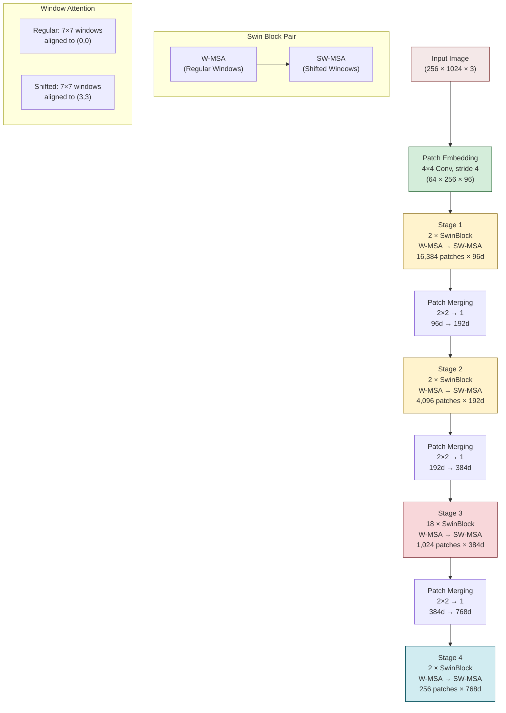

# 2. Swin Transformer Architecture

## 2.1 Swin = Shifted Window Transformer

The **Swin Transformer** (Liu et al., 2021) was designed to solve the fundamental scalability problem of Vision Transformers: global self-attention is $O(n^2)$ in the number of tokens, making it infeasible for high-resolution images. Swin's solution is elegantly simple yet powerful: **compute attention within local windows**, and **shift the windows** between layers to enable cross-window communication.

"Swin" stands for **S**hifted **Win**dow, and this dual mechanism — local windows + shifting — is the key innovation that makes hierarchical Vision Transformers practical for high-resolution inputs like math formula images.

The name also references the "shifted window" approach being analogous to how a swan glides across water — smooth, efficient, and covering the full surface through overlapping passes.

## 2.2 Local Window Attention

Instead of computing attention over all $n$ tokens (which costs $O(n^2)$), Swin computes attention within non-overlapping windows of size $M \times M$ (default $M=7$).

For a feature map of size $H \times W$ with $M \times M$ windows:

- Number of windows: $\frac{H}{M} \times \frac{W}{M}$
- Tokens per window: $M \times M = M^2$
- Attention cost per window: $O(M^4)$ (since each of $M^2$ tokens attends to $M^2$ others)
- **Total attention cost**: $O\left(\frac{HW}{M^2} \times M^4\right) = O(HW \times M^2)$

This is **linear** in the image size ($HW$), compared to the quadratic $O((HW)^2)$ of global attention! For TAMER's 16,384 patches:

| Method | Complexity | Relative Cost |
|---|---|---|
| Global attention | $O(16{,}384^2) = O(2.68 \times 10^8)$ | 336× |
| Window attention (M=7) | $O(16{,}384 \times 49) = O(8.03 \times 10^5)$ | 1× |

This **336× reduction** is what makes it feasible to process math formula images at full resolution.

## 2.3 Window Partitioning

The process of dividing a feature map into windows is straightforward:

1. Start with a feature map of shape $(B, H, W, C)$ where $B$ is batch size, $H \times W$ is the spatial dimensions, and $C$ is the channel dimension.
2. Reshape to $(B, H/M, M, W/M, M, C)$ — splitting height and width into grid cells of size $M$.
3. Permute and reshape to $(B \times H/M \times W/M, M^2, C)$ — each window is now a separate "sequence" of $M^2$ tokens.
4. Apply self-attention independently to each window.
5. Reverse the reshaping to restore the original spatial layout.

```python
def window_partition(x, window_size):
    """Partition feature map into non-overlapping windows."""
    B, H, W, C = x.shape
    x = x.view(B, H // window_size, window_size, W // window_size, window_size, C)
    windows = x.permute(0, 1, 3, 2, 4, 5).contiguous().view(-1, window_size**2, C)
    return windows  # (num_windows * B, window_size**2, C)

def window_reverse(windows, window_size, H, W):
    """Reverse window partitioning."""
    B = int(windows.shape[0] / (H * W / window_size / window_size))
    x = windows.view(B, H // window_size, W // window_size, window_size, window_size, -1)
    x = x.permute(0, 1, 3, 2, 4, 5).contiguous().view(B, H, W, -1)
    return x
```

**Important constraint**: The feature map dimensions ($H$ and $W$) must be divisible by the window size $M$. If they are not, the image must be padded to the nearest multiple of $M$.

## 2.4 The Shifted Window: Enabling Cross-Window Communication

Local window attention has a critical limitation: **tokens in different windows cannot communicate**. If window attention is applied repeatedly without any mechanism for cross-window information flow, each window would develop an isolated representation, and the model would behave like a set of independent small Transformers.

The **shifted window** solves this elegantly. In alternating layers:

- **Regular (W-MSA)**: Windows are partitioned starting from position $(0, 0)$
- **Shifted (SW-MSA)**: Windows are partitioned starting from position $(M/2, M/2)$, i.e., the grid is shifted by half a window size

By shifting the window partition, tokens that were in different windows in the regular layer are now in the same window in the shifted layer. Over two consecutive layers (regular + shifted), every token can communicate with every neighboring token — and through stacking many such pairs, information propagates across the entire feature map.

Think of it like a checkerboard: in the first layer, you process the black squares; in the next layer, you process a shifted checkerboard where the white squares are now grouped together with their black neighbors.

### How Much Information Propagates?

In one regular+shifted pair, each token can reach its $M \times M$ neighborhood (regular) plus the shifted neighborhood. After $k$ pairs, information can propagate across approximately $k \times M$ patches in each direction. For $M=7$ and 4 stages of [2, 2, 18, 2] blocks (24 total, 12 pairs), information can propagate across roughly $12 \times 7 = 84$ patches — covering the entire feature map at the lower-resolution stages.

## 2.5 Cyclic Shifting: Efficient Implementation

A naive implementation of the shifted window would require padding to handle the boundary windows (which are smaller than $M \times M$ after shifting). Instead, Swin uses **cyclic shifting**:

1. **Shift the feature map** circularly by $(M/2, M/2)$ positions
2. **Partition into regular windows** (all windows are now full $M \times M$)
3. **Compute attention** within each window
4. **Reverse the partitioning** and **shift back** circularly

The cyclic shift moves tokens from the right edge to the left edge and from the bottom edge to the top edge. This creates some "boundary windows" that contain tokens from non-adjacent regions of the image. To prevent these unrelated tokens from attending to each other, an **attention mask** is applied that zeros out cross-boundary attention scores.

```python
# Cyclic shift
shifted_x = torch.roll(x, shifts=(-shift_size, -shift_size), dims=(1, 2))

# Partition into windows
windows = window_partition(shifted_x, window_size)

# Compute attention with mask
attn_windows = self.attn(windows, mask=attn_mask)

# Reverse partitioning and shift back
shifted_x = window_reverse(attn_windows, window_size, H, W)
x = torch.roll(shifted_x, shifts=(shift_size, shift_size), dims=(1, 2))
```

The attention mask is precomputed and cached, so there is no runtime overhead for creating it. This implementation is significantly more efficient than padding-based approaches because it avoids variable-size windows and the associated memory fragmentation.

## 2.6 The Hierarchical Structure: 4 Stages

Swin Transformer follows a **hierarchical** design inspired by CNNs like ResNet. The network consists of 4 stages, each operating at a different spatial resolution and channel dimension:

| Stage | Spatial Resolution | Channels | Blocks | Patch Count (256×1024) |
|---|---|---|---|---|
| 1 | $\frac{H}{4} \times \frac{W}{4}$ | 96 | 2 | $64 \times 256 = 16{,}384$ |
| 2 | $\frac{H}{8} \times \frac{W}{8}$ | 192 | 2 | $32 \times 128 = 4{,}096$ |
| 3 | $\frac{H}{16} \times \frac{W}{16}$ | 384 | 18 | $16 \times 64 = 1{,}024$ |
| 4 | $\frac{H}{32} \times \frac{W}{32}$ | 768 | 2 | $8 \times 32 = 256$ |

The first stage starts with high spatial resolution and low channel count (fine details, simple features). Each subsequent stage halves the spatial resolution and doubles the channels (coarser spatial, more abstract features). This is analogous to how CNNs build hierarchical representations.

**Why stage 3 has 18 blocks**: Stage 3 operates at the "sweet spot" of resolution and channel depth — $16 \times 64$ patches with 384 channels. This resolution is coarse enough for efficient window attention but still fine enough to capture important spatial relationships. The 18 blocks give the model ample capacity to learn complex mid-level features. This is also the most computationally expensive stage.

## 2.7 Patch Merging: Downsampling Between Stages

Between stages, Swin uses **patch merging** to reduce the spatial resolution and increase the channel dimension. This operation is analogous to strided convolution or pooling in CNNs.

Patch merging works as follows:

1. Take each group of $2 \times 2$ neighboring patches
2. Concatenate their features along the channel dimension: $4C \rightarrow 4C$
3. Apply a linear layer to reduce channels: $4C \rightarrow 2C$
4. The result has half the spatial resolution and twice the channels

```python
class PatchMerging(nn.Module):
    def __init__(self, dim):
        super().__init__()
        self.norm = nn.LayerNorm(4 * dim)
        self.reduction = nn.Linear(4 * dim, 2 * dim, bias=False)

    def forward(self, x, H, W):
        # x: (B, H*W, C)
        x0 = x[:, 0::2, 0::2, :]  # Top-left
        x1 = x[:, 1::2, 0::2, :]  # Bottom-left
        x2 = x[:, 0::2, 1::2, :]  # Top-right
        x3 = x[:, 1::2, 1::2, :]  # Bottom-right

        x = torch.cat([x0, x1, x2, x3], dim=-1)  # (B, H/2, W/2, 4C)
        x = x.view(B, -1, 4 * C)

        x = self.norm(x)
        x = self.reduction(x)  # (B, H/2 * W/2, 2C)
        return x
```

**Why not strided convolution?** Patch merging preserves all information from the $2 \times 2$ group by concatenation before reduction. Strided convolution would discard some information through the stride operation. Patch merging is a lossless combination followed by a learned, lossy compression — giving the model more control over what to preserve.

## 2.8 Swin-Base Configuration

TAMER uses the **Swin-Base** variant of Swin Transformer v2, with the following specifications:

| Parameter | Value |
|---|---|
| Model variant | Swin-Base |
| Embedding dimension ($d_{\text{model}}$) | 96 (initial), expanding to 768 at stage 4 |
| Number of attention heads | [3, 6, 12, 24] across stages (ratio: dim/head = 32) |
| Window size ($M$) | 7 |
| Depths (blocks per stage) | [2, 2, 18, 2] = 24 total blocks |
| Drop path rate | 0.1–0.3 (stochastic depth) |
| Total parameters | ~88M |

The head dimension is consistently 32 across all stages (96/3 = 192/6 = 384/12 = 768/24 = 32). This is a design choice that keeps the per-head computation constant while scaling the number of heads with the channel dimension.

**Why Swin-Base and not Swin-Small or Swin-Large?**
- **Swin-Tiny** (28M params): Too few parameters for the complexity of math formulas
- **Swin-Small** (50M params): Adequate but less capacity for fine-grained recognition
- **Swin-Base** (88M params): Good balance of capacity and efficiency
- **Swin-Large** (197M params): More capacity but significantly slower, with diminishing returns for OCR

## 2.9 Relative Position Bias

Within each window, Swin Transformer uses **relative position bias (RPB)** instead of absolute positional embeddings. The bias is added to the attention scores before softmax:

$$\text{Attention}(Q, K, V) = \text{softmax}\left(\frac{QK^T}{\sqrt{d_k}} + B\right) V$$

Where $B \in \mathbb{R}^{M^2 \times M^2}$ is the relative position bias matrix. Each entry $B_{ij}$ corresponds to the relative position between token $i$ and token $j$ within the window.

**Why relative instead of absolute?**

- **Translation equivariance**: A symbol's identity depends on its relative position to other symbols, not its absolute position. The fraction bar's meaning doesn't change whether it's in the top-left or center of the image.
- **Parameter efficiency**: The number of unique relative positions is $(2M-1) \times (2M-1) = 169$ for $M=7$, which is far fewer than $M^2 \times M^2 = 2401$ absolute position pairs. The bias table has only 169 learnable parameters.
- **Generalization**: Relative positions generalize to different image sizes — the same bias table works regardless of how many windows there are.

The relative position bias is indexed by computing the 2D offset $(\Delta x, \Delta y)$ between each pair of positions within a window and looking up the corresponding bias value from a learnable table.

## 2.10 Stochastic Depth (Drop Path)

Swin Transformer uses **stochastic depth** (also called DropPath) as a regularization technique. During training, each residual block has a probability $p$ of being "dropped" (bypassed), which means only the residual connection is active:

$$\text{output} = x + \text{DropPath}(\text{Sublayer}(x))$$

When dropped, the output is simply $x$ (identity). When not dropped, it is $x + \text{Sublayer}(x)$ as usual.

The drop rate increases linearly with depth: earlier blocks have lower drop rates, later blocks have higher rates. This makes sense because:
- Early blocks capture fundamental features that later blocks depend on
- Later blocks are more redundant (deeper networks have more capacity than needed)
- Dropping later blocks provides regularization without destabilizing the network

For Swin-Base with 24 blocks and a maximum drop rate of 0.3:
- Block 1 drop rate: ~0.01
- Block 12 drop rate: ~0.15
- Block 24 drop rate: ~0.30

## 2.11 Mermaid Diagram: Swin Hierarchy



> **Key Takeaway**: The Swin Transformer's genius lies in combining local window attention (for efficiency) with shifted windows (for cross-window communication). The hierarchical 4-stage structure progressively trades spatial resolution for channel depth, reducing 16,384 patches to 256 while building increasingly abstract representations. Relative position bias within windows provides translation-equivariant spatial awareness, and patch merging enables clean spatial downsampling between stages.
