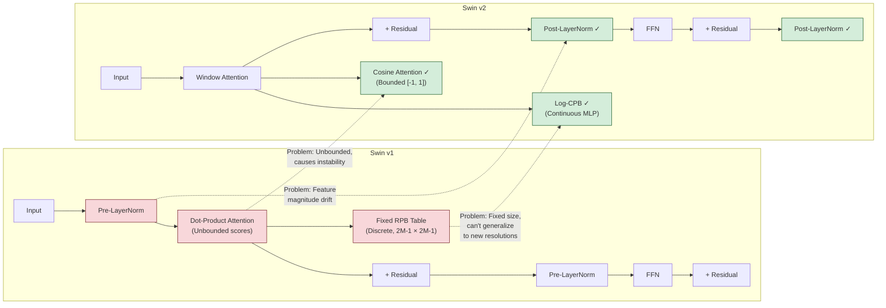

# 3. Swin Transformer v2 Improvements

## 3.1 Problems with Swin v1

While the original Swin Transformer was groundbreaking, it had several significant limitations that became apparent when scaling to larger models and higher resolutions:

### Training Instability at Large Scales

When scaling Swin v1 to larger models (Swin-Large, Swin-Huge) or training at higher resolutions, the training process frequently became unstable. The attention scores could grow unboundedly, causing the softmax to saturate and gradients to vanish or explode. This was particularly problematic when:

- Using larger window sizes ($M > 7$)
- Training at resolutions much higher than the pretraining resolution
- Scaling to more attention heads or deeper networks

The root cause was that the raw dot-product attention scores ($QK^T$) are unbounded. In Swin v1, these scores could take arbitrarily large values, especially at scale, leading to numerical instability.

### Resolution Gap Between Pretraining and Fine-tuning

Swin v1 models were pretrained on ImageNet at $224 \times 224$ or $384 \times 384$ resolution, but downstream tasks often required much higher resolutions (e.g., $256 \times 1024$ for TAMER). The relative position bias table in Swin v1 had a fixed size determined by the pretraining resolution. When fine-tuning at a different resolution, the model had to interpolate the position biases, which led to suboptimal performance.

Specifically, the relative position bias table covers offsets from $-(M-1)$ to $M-1$ in each dimension. When the resolution changes significantly, the distribution of relative positions shifts, and the interpolated biases may not accurately represent the new spatial relationships.

### Feature Magnitude Inconsistency

In deep Swin v1 models, the magnitude of features could vary significantly across layers, particularly in the deeper stages. This made it difficult to use consistent learning rates and led to uneven gradient magnitudes during backpropagation.

## 3.2 Post-Normalization: Stabilizing Deep Networks

The most impactful change in Swin v2 is switching from **pre-normalization** to **post-normalization** for the residual blocks.

**Swin v1 (pre-norm):**
$$\text{output} = x + \text{Sublayer}(\text{LayerNorm}(x))$$

**Swin v2 (post-norm):**
$$\text{output} = \text{LayerNorm}(x + \text{Sublayer}(x))$$

Wait — isn't this the opposite of what we discussed in Chapter 3, where pre-norm was preferred for stability? Yes, but there's a nuance. Swin v2 introduces a **hybrid** approach:

1. Within each Swin block, sublayers use **post-normalization** (LayerNorm after the residual addition)
2. An additional LayerNorm is added **between stages** (after patch merging) to stabilize the feature magnitudes
3. A final LayerNorm is added after the last stage

The key insight is that post-norm helps control feature magnitudes **within each block** (preventing them from growing), while the inter-stage norms handle the **distribution shift** between stages. The combination is more stable than either approach alone for very deep vision Transformers.

In practice, this means Swin v2's feature magnitudes remain much more consistent across layers compared to Swin v1, which allows for:
- More stable training with BFloat16 mixed precision
- Larger learning rates without divergence
- Better convergence at depth (24+ blocks)

```python
# Swin v2 block with post-norm
class SwinTransformerBlockV2(nn.Module):
    def forward(self, x):
        # Post-norm: LayerNorm AFTER residual addition
        shortcut = x
        x = self.attn(x)  # Window attention
        x = shortcut + x
        x = self.norm1(x)  # Post-norm!

        shortcut = x
        x = self.mlp(x)
        x = shortcut + x
        x = self.norm2(x)  # Post-norm!

        return x
```

## 3.3 Cosine Attention: Bounding Attention Scores

Swin v2 replaces the standard dot-product attention with **cosine attention**, which naturally bounds the attention scores between -1 and 1:

$$\text{CosAttn}(Q, K, V) = \text{softmax}\left(\frac{\cos(Q, K)}{\tau}\right) V$$

Where $\cos(Q, K) = \frac{q_i \cdot k_j}{\|q_i\| \cdot \|k_j\|}$ is the cosine similarity, and $\tau$ is a learnable temperature parameter (initialized to $\log(10)$).

**Why is this better?**

1. **Bounded scores**: Cosine similarity is always in $[-1, 1]$, regardless of the magnitude of $Q$ and $K$. This eliminates the unbounded score problem that plagued Swin v1.

2. **No scaling needed**: The original Transformer scales by $1/\sqrt{d_k}$ to prevent large dot products. Cosine attention doesn't need this because the scores are inherently bounded.

3. **Magnitude invariance**: Cosine similarity only depends on the direction of the vectors, not their magnitude. This means features with different magnitudes (common in deep networks) are compared fairly.

4. **Numerical stability**: Bounded scores prevent the softmax from entering saturation regions, maintaining healthy gradients throughout training.

The learnable temperature $\tau$ controls the "sharpness" of the attention distribution. When $\tau$ is small, the attention is more peaked (focusing on the most similar key); when $\tau$ is large, the attention is more uniform (spreading attention across multiple keys).

```python
# Cosine attention implementation
q = F.normalize(q, dim=-1)  # L2 normalize
k = F.normalize(k, dim=-1)  # L2 normalize
attn = q @ k.transpose(-2, -1) / self.tau  # Cosine similarity / temperature
attn = attn + relative_position_bias
attn = F.softmax(attn, dim=-1)
```

## 3.4 Log-Spaced Continuous Position Bias (Log-CPB)

Swin v2 replaces the fixed relative position bias table with **Log-spaced Continuous Position Bias (Log-CPB)**. This is a small MLP that generates position biases on-the-fly from continuous relative position coordinates:

$$B(\Delta x, \Delta y) = \text{MLP}(\log(1 + |\Delta x|), \text{sign}(\Delta x), \log(1 + |\Delta y|), \text{sign}(\Delta y))$$

**Why log-spaced?**

- **Better spatial granularity for nearby positions**: The log spacing means that positions close together (small offsets) are given more "resolution" in the bias space than positions far apart. This matches the intuition that nearby spatial relationships are more important and require more precise encoding.
- **Smooth extrapolation**: Unlike the fixed bias table (which must be interpolated for new resolutions), the MLP naturally generalizes to unseen relative positions through its smooth activation functions.

**Why continuous?**

- The MLP takes **continuous** relative position coordinates as input, not discrete indices. This means the same bias function works at any resolution without interpolation.
- When fine-tuning at a higher resolution, the relative position offsets may be different from those seen during pretraining. The MLP can smoothly extrapolate to these new offsets.

**Implementation details:**
- The MLP has 2 hidden layers with ReLU activation
- Input dimension: 4 (log-absolute-x, sign-x, log-absolute-y, sign-y)
- Hidden dimension: 512
- Output dimension: number of attention heads
- The MLP is shared across all windows and all layers within a stage

This is particularly important for TAMER, which trains at $256 \times 1024$ resolution — very different from the ImageNet pretraining resolution. Log-CPB ensures that the position biases adapt smoothly to this new resolution without manual interpolation.

## 3.5 Scaling to Larger Resolutions

One of Swin v2's headline achievements is the ability to **train at one resolution and infer at another**. This is made possible by the combination of:

1. **Log-CPB**: The continuous position bias generalizes to new resolutions
2. **Cosine attention**: Bounded attention scores prevent instability at larger scales
3. **Post-normalization**: Consistent feature magnitudes across resolutions

For TAMER, this means:
- The Swin v2 backbone can be pretrained on ImageNet-22K at $256 \times 256$ (or $192 \times 192$) resolution
- Then fine-tuned for math OCR at $256 \times 1024$ resolution
- And potentially applied to even higher-resolution formula images at inference time

The resolution scaling works because the **window structure** is resolution-independent: the same $7 \times 7$ window attention applies regardless of how many windows there are. The number of windows simply increases with resolution, but the computation within each window remains the same.

## 3.6 Pretrained Weights: Swin-v2-Base on ImageNet-22K

TAMER's encoder starts from **Swin v2-Base weights pretrained on ImageNet-22K** (the full ImageNet dataset with ~14 million images and ~22,000 categories). This pretraining provides:

1. **Low-level visual features**: Edge detectors, texture patterns, color processing — these are universal across visual tasks and transfer well from natural images to math formula images.

2. **Spatial reasoning**: The ability to recognize spatial relationships (above, below, adjacent) is learned from ImageNet and applies directly to understanding the 2D layout of math formulas.

3. **Stable initialization**: The pretrained weights provide a good starting point in the loss landscape, avoiding poor local minima that random initialization might lead to.

4. **Faster convergence**: Starting from pretrained weights typically reduces the number of training epochs needed by 2-5× compared to training from scratch.

**Why ImageNet-22K and not ImageNet-1K?** The 22K variant has 14× more images and 22× more categories. This richer pretraining provides:
- More diverse visual features (important for the wide variety of math symbol appearances)
- Better generalization (the model has seen a broader distribution of visual patterns)
- More robust representations (less overfitting to the pretraining dataset)

## 3.7 Transfer Learning: From Natural Images to Math OCR

You might wonder: **why does pretraining on natural images help for math OCR, when the domains look so different?**

The answer lies in the **hierarchy of visual features**:

| Level | Natural Image Features | Math Formula Equivalent |
|---|---|---|
| Low-level | Edges, corners, textures | Strokes, curves, junctions |
| Mid-level | Parts (eyes, wheels, leaves) | Symbol components (fraction bars, brackets, operators) |
| High-level | Objects (faces, cars, trees) | Mathematical structures (fractions, integrals, matrices) |

The **low-level features** transfer almost perfectly — edges are edges regardless of whether they form a cat's whisker or a fraction bar. The **mid-level features** transfer partially — the concept of "a horizontal line with content above and below" is useful both for recognizing tables (natural images) and fractions (math OCR). The **high-level features** are more domain-specific but still provide useful spatial reasoning priors.

During fine-tuning, the low-level features remain mostly unchanged (they're already good), while the mid-level and high-level features adapt to the math OCR domain. This is much faster than learning all features from scratch.

## 3.8 The local_backbone_path in TAMER Config

TAMER's configuration file specifies the pretrained Swin v2 backbone path:

```yaml
# In the TAMER config
encoder:
  type: "swinv2_base"
  local_backbone_path: "weights/swinv2_base_patch4_window12_192_22k.safetensors"
  freeze_epochs: 3
  window_size: 7
  pretrained: true
```

The `local_backbone_path` points to a `.safetensors` file containing the pretrained weights. The `freeze_epochs` parameter controls how many epochs the encoder is frozen before fine-tuning begins (discussed below).

When loading the backbone, TAMER:

1. Creates a Swin v2-Base model with the specified configuration
2. Loads the `.safetensors` file and maps the pretrained weights to the model's parameters
3. Handles any mismatches in naming or shape (e.g., the classification head from ImageNet is discarded)
4. Applies any resolution-specific adaptations (e.g., Log-CPB adjustments for the new window size)

## 3.9 SafeTensors Format: Why Not Pickle?

TAMER uses the **SafeTensors** format for storing model weights instead of PyTorch's default `.pt` / `.pth` format. This choice has important security and performance implications:

**The pickle problem**: PyTorch's default serialization uses Python's `pickle` module, which can execute arbitrary Python code during deserialization. A maliciously crafted `.pt` file could contain code that:
- Reads sensitive files from your system
- Installs malware
- Corrupts your filesystem
- Exfiltrates data

This is a **real** security risk when downloading model weights from untrusted sources (Hugging Face, third-party repos, etc.). There have been documented cases of malicious model files exploiting pickle deserialization.

**SafeTensors advantages:**
- **No code execution**: SafeTensors stores only raw tensor data with metadata. There is no code path that executes during loading — it is purely a data format.
- **Faster loading**: SafeTensors uses memory-mapped I/O (mmap), which can be 2-10× faster than pickle-based loading for large models.
- **Lazy loading**: Individual tensors can be loaded without reading the entire file, enabling efficient multi-process loading.
- **Cross-framework**: SafeTensors is supported by PyTorch, TensorFlow, JAX, and Flax — making it a universal weight format.
- **Deterministic**: The format is fully specified and produces identical results across platforms.

```python
# Loading weights from SafeTensors
from safetensors.torch import load_file

state_dict = load_file("weights/swinv2_base_patch4_window12_192_22k.safetensors")
model.load_state_dict(state_dict, strict=False)  # strict=False to allow mismatches
```

## 3.10 How TAMER Loads and Fine-tunes the Backbone

The process of loading and fine-tuning the Swin v2 backbone in TAMER follows a carefully designed protocol:

### Step 1: Create Model Architecture
```python
encoder = SwinTransformerV2(
    img_size=1024,  # Note: max dimension
    patch_size=4,
    in_chans=3,
    embed_dim=96,
    depths=[2, 2, 18, 2],
    num_heads=[3, 6, 12, 24],
    window_size=7,
    drop_path_rate=0.1,
)
```

### Step 2: Load Pretrained Weights
```python
if config.encoder.pretrained:
    state_dict = load_file(config.encoder.local_backbone_path)
    # Filter out mismatched keys (e.g., classification head)
    model_dict = encoder.state_dict()
    pretrained_dict = {k: v for k, v in state_dict.items()
                       if k in model_dict and v.shape == model_dict[k].shape}
    model_dict.update(pretrained_dict)
    encoder.load_state_dict(model_dict)
```

### Step 3: Freeze the Encoder
```python
for param in encoder.parameters():
    param.requires_grad = False
```

### Step 4: Train the Decoder (First 3 Epochs)
With the encoder frozen, only the decoder is trained. This allows the decoder to learn to interpret the encoder's features without the encoder's representations shifting unpredictably.

### Step 5: Unfreeze and Fine-tune (After 3 Epochs)
```python
for param in encoder.parameters():
    param.requires_grad = True
```

Now both encoder and decoder are trained together, with a **lower learning rate** for the encoder (typically 10× lower) to prevent catastrophic forgetting of the pretrained features.

## 3.11 Encoder Freezing: Why 3 Epochs?

The practice of freezing the encoder for the first few epochs serves several purposes:

1. **Stable decoder initialization**: The decoder starts with random weights. If the encoder were also being updated, the decoder would be chasing a moving target — the features it learned to interpret in step $t$ would be different in step $t+1$. Freezing the encoder gives the decoder a stable "visual vocabulary" to learn from.

2. **Avoiding catastrophic forgetting**: The pretrained Swin v2 backbone has excellent visual features. Early in training, when the decoder's gradients are noisy and large, these gradients could corrupt the encoder's pretrained representations. Freezing protects the encoder until the decoder's gradients become more informative.

3. **Faster early training**: With the encoder frozen, forward passes through the encoder don't need to store intermediate activations for backpropagation, reducing memory usage and speeding up training.

4. **Curriculum learning alignment**: The 3-epoch freeze aligns with TAMER's curriculum learning strategy. During the first phase (easy samples + frozen encoder), the model learns the basics of the mapping. In the second phase (harder samples + unfrozen encoder), the model refines both the visual features and the generation strategy.

**Why 3 epochs specifically?** This is an empirical choice. Too few epochs (1) might not give the decoder enough time to stabilize. Too many epochs (10+) might cause the decoder to overfit to the frozen encoder's features, making it difficult to adapt when the encoder is unfrozen. Three epochs is a common sweet spot found through experimentation.

## 3.12 Layer-wise Learning Rate Decay

When the encoder is unfrozen, TAMER applies **layer-wise learning rate decay**: earlier layers use smaller learning rates, and later layers use larger ones. This is based on the observation that:

- **Early layers** capture universal low-level features (edges, textures) that are already well-learned from pretraining and need little adjustment.
- **Later layers** capture task-specific high-level features that need more significant adaptation to the math OCR domain.

A typical decay schedule might use:
- Stage 1: $\text{lr} \times 0.1$
- Stage 2: $\text{lr} \times 0.3$
- Stage 3: $\text{lr} \times 0.6$
- Stage 4: $\text{lr} \times 1.0$

This ensures that the pretrained features are preserved where they're most useful while allowing the task-specific layers to adapt freely.

## 3.13 Mermaid Diagram: Swin v1 vs v2 Differences



> **Key Takeaway**: Swin Transformer v2 addresses three critical problems of v1 through post-normalization (stable feature magnitudes), cosine attention (bounded attention scores), and Log-CPB (resolution-adaptive position biases). These improvements make the architecture robust enough for high-resolution math OCR at $256 \times 1024$ and beyond. Combined with ImageNet-22K pretraining, SafeTensors weight loading, and a carefully designed freezing schedule, TAMER's encoder builds on a solid foundation that balances pretrained knowledge with task-specific adaptation.
