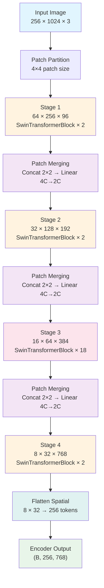

# 4. Patch Merging and Spatial Resolution

## The Core Idea: Progressive Downsampling

Patch merging is the Swin Transformer's mechanism for progressively reducing spatial resolution while increasing channel dimensionality across its four stages. It serves the same fundamental purpose as pooling layers in a convolutional neural network — aggregating spatial information into increasingly abstract representations — but it does so in a way that is fully learnable and compatible with the transformer's attention mechanism.

In a traditional CNN, max pooling or strided convolutions reduce the spatial resolution of feature maps. Patch merging achieves the same downsampling effect but through a structured concatenation-and-projection strategy that doubles the channel dimension at every step. This design ensures that no spatial information is simply discarded; instead, it is redistributed into the channel dimension where subsequent self-attention layers can reason over it.

## How Patch Merging Works

The patch merging operation takes a 2×2 neighborhood of patches and combines them into a single patch. Concretely, for an input feature map of shape `(B, H, W, C)`, the operation proceeds as follows:

1. **Select neighbors**: From the spatial grid, take four groups of features — the top-left, top-right, bottom-left, and bottom-right elements of every 2×2 block. This produces four tensors, each of shape `(B, H/2, W/2, C)`.
2. **Concatenate**: Concatenate these four tensors along the channel dimension, producing a tensor of shape `(B, H/2, W/2, 4C)`.
3. **Linear projection**: Apply a linear layer that projects from `4C` down to `2C`, yielding the final output shape `(B, H/2, W/2, 2C)`.

The net effect is that the spatial resolution is halved (both height and width are divided by 2) and the channel dimension is doubled. The linear projection layer is learnable, which means the model can learn the optimal way to combine information from the four neighboring patches rather than relying on a fixed operation like averaging or max-pooling.

```python
# Simplified patch merging logic
class PatchMerging(nn.Module):
    def __init__(self, input_resolution, dim):
        super().__init__()
        self.reduction = nn.Linear(4 * dim, 2 * dim, bias=False)
        self.norm = nn.LayerNorm(4 * dim)

    def forward(self, x, H, W):
        # x: (B, H*W, C)
        B, L, C = x.shape
        x = x.view(B, H, W, C)

        # Take 2x2 neighbors with stride 2
        x0 = x[:, 0::2, 0::2, :]  # top-left
        x1 = x[:, 1::2, 0::2, :]  # bottom-left
        x2 = x[:, 0::2, 1::2, :]  # top-right
        x3 = x[:, 1::2, 1::2, :]  # bottom-right

        # Concatenate along channel dim
        x = torch.cat([x0, x1, x2, x3], dim=-1)  # (B, H/2, W/2, 4C)
        x = self.norm(x)
        x = self.reduction(x)  # (B, H/2, W/2, 2C)

        x = x.view(B, -1, 2 * C)
        return x
```

## The Four-Stage Resolution Progression

For TAMER's Swin-Base encoder operating on input images of size `256×1024`, the patch partition creates an initial patch embedding of resolution `64×256` with 96 channels. The four stages then progressively halve the spatial resolution and double the channels:

| Stage | Input Shape | Output Shape | Channels |
|-------|------------|-------------|----------|
| 1 | (B, 64, 256, 96) | (B, 64, 256, 96) | 96 |
| 2 | (B, 64, 256, 96) → merge | (B, 32, 128, 192) | 192 |
| 3 | (B, 32, 128, 192) → merge | (B, 16, 64, 384) | 384 |
| 4 | (B, 16, 64, 384) → merge | (B, 8, 32, 768) | 768 |

Note that Stage 1 does **not** apply patch merging — it is the initial patch embedding stage. Patch merging occurs at the **transition** between stages, so the first merge happens at the boundary from Stage 1 to Stage 2.

The channel doubling pattern follows: **96 → 192 → 384 → 768**. This is a geometric progression with ratio 2, which is the standard configuration for Swin-Base. The spatial halving follows: **64×256 → 32×128 → 16×64 → 8×32**. The height dimension goes from 64 down to 8 (three halvings), and the width dimension goes from 256 down to 32 (also three halvings).

## From Spatial Grid to Token Sequence

The final output of the Swin encoder at Stage 4 has shape `(B, 8, 32, 768)`. Before this tensor is passed to the Transformer decoder, it must be **flattened** from a 2D spatial grid into a 1D sequence. The flattening operation reshapes the tensor:

```
(B, 8, 32, 768) → (B, 8 × 32, 768) → (B, 256, 768)
```

This produces **256 visual tokens**, each of dimension 768. The number 256 comes from the spatial grid: 8 rows × 32 columns = 256 positions. Each token encodes the visual information from a particular region of the input image, at the coarsest spatial resolution.

This sequence of 256 tokens serves as the **memory** that the decoder attends to via cross-attention. Every time the decoder generates a new LaTeX token, it computes attention over these 256 visual tokens to determine which regions of the image are most relevant for predicting the next output symbol. The flattening is necessary because the Transformer decoder treats its inputs as a 1D sequence — it has no built-in notion of 2D spatial structure at this point.

## Comparison to CNN Pooling

The analogy to CNN pooling is instructive. In a ResNet or VGG, successive pooling layers reduce the spatial resolution from, say, `64×256` to `32×128` to `16×64` to `8×32`, while the number of channels increases from 64 to 128 to 256 to 512. The key difference is that CNN pooling uses a fixed, non-learnable operation (max or average), whereas patch merging uses a learnable linear projection. This means the model can learn to preserve the most useful information during downsampling rather than relying on a heuristic.

Another important distinction is that patch merging is a purely spatial operation — it does not mix information across channels except through the linear projection. In a strided convolution, the downsampling and channel mixing happen simultaneously through the convolution kernel. Patch merging separates these concerns: the spatial grouping is fixed (2×2 blocks), and the channel mixing is learned.

## Why 256 Tokens Matters

The number 256 is a critical design choice. Too many tokens (e.g., 4096 from a higher-resolution feature map) would make cross-attention in the decoder prohibitively expensive, since the attention computation scales as O(L × N) where L is the decoder sequence length and N is the number of encoder tokens. Too few tokens (e.g., 16 from an overly aggressive downsampling) would lose too much spatial detail, making it impossible to distinguish fine-grained mathematical symbols.

At 256 tokens, the model retains enough spatial resolution to represent individual characters and their positions (each token covers roughly a 32×32 pixel region of the input), while keeping the cross-attention computation tractable. This balance is especially important for mathematical formulas, where a single misplaced symbol can completely change the meaning.

## Mermaid Diagram: Four-Stage Resolution Progression



## Summary

Patch merging is the backbone of the Swin Transformer's hierarchical feature extraction. By systematically halving spatial resolution and doubling channel depth across four stages, it transforms a dense, high-resolution patch embedding into a compact sequence of 256 high-dimensional tokens. These tokens serve as the visual memory for the Transformer decoder, encoding both local fine-grained detail (through early-stage attention) and global structural context (through later-stage attention). The learnable nature of the merge operation — as opposed to fixed pooling — allows the model to optimize how spatial information is compressed into the channel dimension, which is particularly important for mathematical OCR where symbol-level precision matters.
