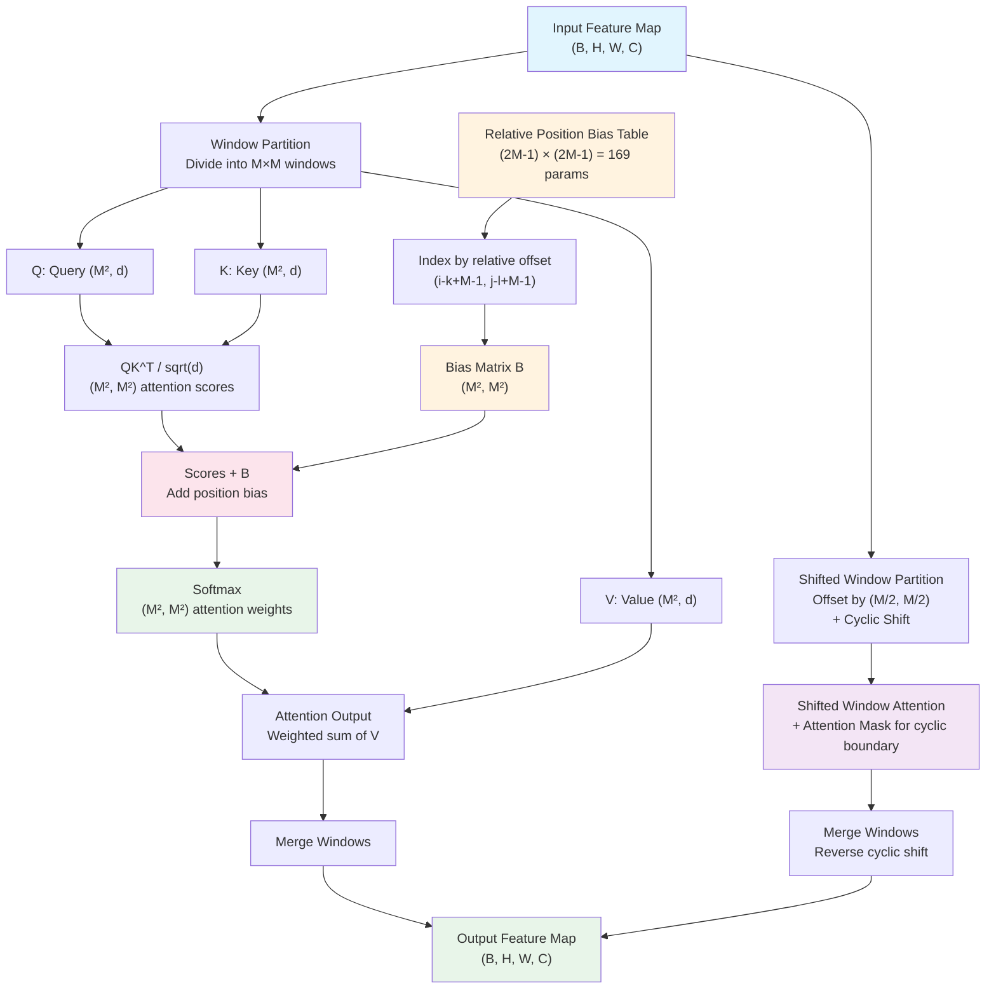

# 5. Relative Position Bias and Window Attention

## The Problem with Absolute Positioning in Windows

The Swin Transformer computes self-attention within local windows of size M×M (typically M=7), which means that each patch only attends to the other 48 patches within its window (7×7 = 49 patches total, including itself). This local attention is what gives Swin its linear complexity with respect to image size, but it introduces a subtle problem: **absolute positional encodings are meaningless across windows**.

Consider a patch located at position (3, 4) within one window and a patch at position (3, 4) within a different window. These patches occupy the same relative position within their respective windows, but they correspond to entirely different locations in the original image. If the model used absolute position encodings, these two patches would receive identical positional information, which would prevent the model from distinguishing between them based on their global position. Moreover, within a single window, the relationship between two patches is better captured by their **relative offset** than by their absolute coordinates — what matters for local attention is whether one patch is "two to the right and one above" another, not that one is at (3,4) and the other is at (5,3).

This is why the Swin Transformer uses **relative position bias** instead of absolute position encodings. The bias encodes the relative spatial relationship between any two patches within a window, and it is shared across all windows in the same layer. This sharing is possible (and desirable) because the relative geometry within a window is the same regardless of where the window is positioned in the image.

## The Relative Position Bias Table

For a window of size M×M, there are M² patches, so the attention matrix has shape (M², M²). For each pair of patches, we need a bias term that depends on their relative position. The relative offset in the row direction ranges from -(M-1) to +(M-1), and similarly for the column direction. This gives (2M-1) possible values for each direction, and therefore a bias table of size (2M-1) × (2M-1).

For the standard window size M=7, the bias table has dimensions **13 × 13 = 169 entries**. Each entry is a learnable scalar that is added to the corresponding attention score.

### Indexing the Bias Table

Given two patches at positions (i, j) and (k, l) within a window, the relative offset is (i-k, j-l). To convert this offset into an index into the bias table, we add (M-1) to each component:

```
row_index = i - k + M - 1
col_index = j - l + M - 1
```

This shifts the range from [-(M-1), +(M-1)] to [0, 2(M-1)], making it a valid 0-based index. The bias value for this pair of patches is then `bias_table[row_index, col_index]`.

### Constructing the Full Bias Matrix

For all M² × M² pairs of patches in a window, we precompute the relative position indices and look up the corresponding bias values. This produces a bias matrix **B** of shape (M², M²), which is added to the attention logits before the softmax:

$$\text{Attention}(Q, K, V) = \text{softmax}\left(\frac{QK^T}{\sqrt{d}} + B\right) V$$

The bias matrix B is the same for all windows in the same layer and the same batch, so it adds negligible computational overhead. The 169 learnable parameters of the bias table are a tiny fraction of the total model parameters, yet they provide a significant improvement in performance because they allow the model to learn position-dependent attention patterns.

## Window Partitioning and Shifted Windows

The Swin Transformer divides the patch grid into non-overlapping M×M windows. For a feature map of size (H, W), this produces (H/M) × (W/M) windows. Within each window, standard self-attention is computed with the relative position bias.

However, confining attention to fixed windows would limit the model's ability to capture cross-window dependencies. To address this, Swin uses **shifted window partitioning** in alternating transformer blocks:

- **Regular window partition** (W-MSA): Windows start at (0, 0), dividing the grid into M×M blocks aligned with the top-left corner.
- **Shifted window partition** (SW-MSA): Windows are offset by (M/2, M/2), i.e., shifted by half the window size. This causes the new window boundaries to cross the old ones, allowing patches that were in different windows to now attend to each other.

For M=7, the shift is (3, 3) in both the row and column directions. This alternating scheme means that every other layer provides cross-window connectivity, effectively creating connections between all patches over two consecutive layers.

## Cyclic Shift: Efficient Implementation

A naive implementation of shifted windows would require padding and masking at the boundaries, since the shifted windows may not align neatly with the feature map edges. The Swin Transformer solves this elegantly with **cyclic shift**:

1. **Shift the feature map** by (M/2, M/2) using `torch.roll`, which cyclically wraps pixels from one edge to the opposite edge.
2. **Partition into regular M×M windows** (same as the non-shifted case).
3. **Apply an attention mask** to prevent patches from the original top/left edge from attending to patches from the original bottom/right edge (which are now in the same window due to the cyclic wrap, but should not interact).
4. **Reverse the cyclic shift** after attention is computed.

This approach is much more efficient than padding because it avoids creating partial windows that would need special handling. The attention mask is precomputed and applied as an additive mask to the attention logits (with large negative values for masked positions), which is computationally inexpensive.

## Swin-v2 Improvement: Continuous Position Bias (CPB)

The original Swin Transformer uses a discrete bias table with (2M-1)² entries. This works well when the training and inference resolutions are the same, but it becomes problematic when the model needs to generalize to different resolutions or window sizes. A discrete table cannot be indexed at non-integer positions, so it cannot interpolate between entries.

Swin-v2 replaces the discrete bias table with **Continuous Position Bias (CPB)**, which uses a small MLP to generate the bias value for any given relative offset:

```
bias = MLP(relative_coordinate)
```

The MLP takes a 2D relative coordinate (Δx, Δy) as input and outputs a scalar bias value. Because the MLP is a continuous function, it can interpolate smoothly between training positions and generalize to unseen resolutions.

### Log-Spaced CPB

Swin-v2 further improves CPB by using **logarithmic coordinates** for the relative offset. Instead of feeding (Δx, Δy) directly to the MLP, it feeds (sign(Δx) · log(1 + |Δx|), sign(Δy) · log(1 + |Δy|)). This log-spacing has several advantages:

- **Better interpolation at different resolutions**: When the image is scaled up, the relative offsets scale proportionally. In linear coordinates, a large offset might fall far outside the training range, but in log coordinates, the same offset maps to a value that is closer to the training distribution.
- **More parameter density near zero**: Small relative offsets (which are the most common and most important for local attention) get more representational capacity, while large offsets (which are less frequent) are compressed.
- **Smooth extrapolation**: The logarithmic function grows slowly, so even very large offsets produce reasonable MLP inputs rather than extreme out-of-distribution values.

This is particularly important for TAMER because the model is trained at 256×1024 resolution but may need to handle images at slightly different resolutions during inference. The log-spaced CPB ensures that the position bias remains meaningful even at unseen scales.

## Why This Matters for TAMER

Mathematical formulas have strong spatial regularities — superscripts are always above and to the right, subscripts below and to the right, fractions have numerators above and denominators below. The relative position bias allows the model to learn these spatial priors: when a patch is attending to a patch that is "above and to the right," the bias can encode that this is likely a superscript relationship. This kind of spatial reasoning is essential for accurate LaTeX generation, where the spatial arrangement of symbols directly determines the output structure.

Furthermore, the shifted window mechanism ensures that these spatial relationships can be captured across window boundaries, preventing the model from being "blind" to structures that happen to straddle a window edge. For a formula like `\frac{x+1}{y-2}`, the fraction bar, numerator, and denominator might span multiple windows, and the shifted attention in alternating layers ensures they can interact.

## Mermaid Diagram: Window Attention with Relative Position Bias



## Summary

Relative position bias is the key mechanism that enables the Swin Transformer to reason about spatial relationships within its local attention windows. By adding a learnable bias to each attention score based on the relative offset between two patches, the model can encode spatial priors such as "superscripts are above-right" or "fraction bars have content above and below." The Swin-v2 improvement to continuous position bias with log-spaced coordinates makes this mechanism resolution-agnostic, which is critical for TAMER's deployment flexibility. Combined with the shifted window strategy for cross-window connectivity, relative position bias provides the spatial awareness that mathematical OCR demands.
