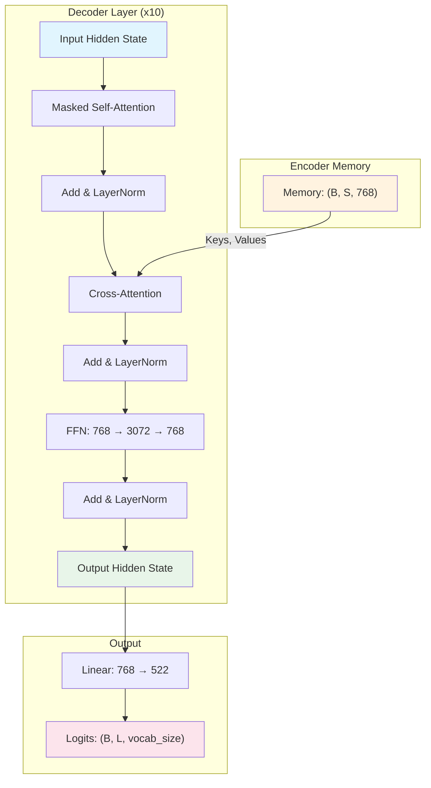

# 1. The Transformer Decoder in Detail

## Overview

The Transformer decoder is the generative engine of the TAMER system. While the Swin-v2 encoder is responsible for extracting rich visual features from the input image, the decoder's job is fundamentally different: it must **produce a sequence of LaTeX tokens, one at a time, conditioned on the visual representation of the image**. This is an autoregressive process — each token generated depends on all previously generated tokens and on the encoded image. The decoder bridges the gap between the visual domain (pixels and patches) and the symbolic domain (LaTeX markup), making it the most critical component for accurate formula recognition.

## The Decoder's Role in TAMER

In a standard image-to-sequence pipeline, the decoder receives two inputs:

1. **The encoder memory** — a tensor of shape `(B, S, 768)` where `B` is the batch size, `S` is the number of visual patches (spatial positions from the Swin encoder), and `768` is the feature dimension. This memory encodes everything the model "knows" about the image.
2. **The target token sequence** — during training, this is the ground-truth LaTeX sequence prefixed with an SOS (start-of-sequence) token; during inference, it is the sequence of tokens generated so far.

The decoder must learn the complex grammar and vocabulary of LaTeX, including nested structures like `\frac{...}{...}`, `\sqrt{...}`, superscripts, subscripts, and matrix environments. Each of these constructs requires the model to attend to specific regions of the image while simultaneously tracking the syntactic context established by previously emitted tokens.

## Decoder Input: SOS and the Token Sequence

Every decoding sequence begins with a special **SOS token**. This serves as the initial prompt that tells the decoder "begin generating." During training, the full input to the decoder is:

```
[SOS, token_1, token_2, ..., token_L]
```

The expected output (the prediction target) is:

```
[token_1, token_2, token_3, ..., EOS]
```

This one-position shift is the essence of autoregressive modeling: the model sees tokens up to position `t` and must predict the token at position `t+1`.

## Decoder Layer Architecture

Each of the 10 decoder layers in TAMER follows the same three-sublayer structure, with residual connections and layer normalization after each sublayer:

### Sublayer 1: Masked Self-Attention

The masked self-attention mechanism allows each position in the decoder to attend to all **previous** positions (including itself), but not to future positions. This is critical for maintaining the autoregressive property — if the model could see future tokens, it would essentially be "cheating" during training and would have no way to use that information during inference.

- **Queries, Keys, Values**: All derived from the decoder's hidden state at the current layer.
- **Causal mask**: An upper-triangular mask filled with `-inf` ensures that position `t` cannot attend to positions `t+1, t+2, ...`.
- **Output**: A contextualized representation that incorporates information from all preceding tokens.

### Sublayer 2: Cross-Attention

This is where the decoder "reads" the image. The cross-attention mechanism uses:

- **Queries** from the decoder hidden state (shape: `(B, L, 768)`)
- **Keys and Values** from the encoder memory (shape: `(B, S, 768)`)

Each decoder position computes attention weights over all `S` visual patches. This means the token being generated at position `t` can focus on the specific image regions that are most relevant for predicting the next LaTeX symbol. For example, when generating `\frac`, the model might attend to the horizontal line in the image; when generating a superscript, it might attend to a raised region.

The fact that `d_model = 768` is shared between the encoder output and the decoder means **no additional projection layer** is needed to align dimensions for cross-attention. This is a deliberate design choice that simplifies the architecture and reduces the number of learnable parameters.

### Sublayer 3: Feed-Forward Network (FFN)

After the two attention sublayers, each position passes through a position-wise feed-forward network:

```
FFN(x) = Linear_2(GELU(Linear_1(x)))
```

- `Linear_1`: projects from 768 to 3072 (a 4x expansion)
- `Linear_2`: projects from 3072 back to 768
- The GELU activation (or ReLU, depending on implementation) introduces non-linearity

The 4x expansion ratio (3072 / 768 = 4) is a standard Transformer design choice, originally from the "Attention Is All You Need" paper. This gives the FFN enough capacity to learn complex token-level transformations while keeping the residual dimension consistent at 768.

## The Output Projection

After the 10 decoder layers have processed the sequence, the final hidden state has shape `(B, L, 768)`. To convert this into a probability distribution over the vocabulary, a linear projection layer maps from 768 to the vocabulary size:

```
logits = Linear(hidden_state)  # (B, L, 768) -> (B, L, 522)
```

The `522` represents the number of tokens in the LaTeX vocabulary. These logits are then passed through a softmax function (implicitly, during cross-entropy loss computation) to produce the probability of each token at each position.

## Why 10 Layers?

The choice of 10 decoder layers balances depth with computational efficiency. Each additional layer allows the model to:

- Perform more sophisticated reasoning about LaTeX syntax
- Build deeper chains of cross-attention over the image
- Refine the hidden representations through multiple rounds of self- and cross-attention

Empirically, 10 layers provide enough capacity to model the complex, nested structure of mathematical formulas without making the model so deep that training becomes unstable or inference becomes too slow. Fewer layers (e.g., 6) might struggle with complex nested expressions; more layers (e.g., 12+) would increase training time and risk overfitting on smaller datasets.

## Multi-Head Attention: 12 Heads

With `d_model = 768` and `nhead = 12`, each attention head operates on a 64-dimensional subspace (`768 / 12 = 64`). This allows each head to specialize in different types of relationships:

- Some heads might focus on **local syntactic patterns** (e.g., matching opening and closing braces)
- Others might focus on **long-range dependencies** (e.g., connecting a `\begin{matrix}` with its `\end{matrix}`)
- In cross-attention, different heads might attend to different **spatial regions** of the image

The outputs of all 12 heads are concatenated and projected back to 768 dimensions, combining their diverse perspectives into a unified representation.

## Mermaid Diagram: Decoder Architecture



## Key Takeaways

- The decoder is a stack of 10 identical layers, each with masked self-attention, cross-attention, and FFN.
- Cross-attention is the bridge between the visual encoder and the symbolic decoder — it lets the model "look at" specific image regions while generating each token.
- The shared `d_model = 768` between encoder and decoder eliminates the need for a projection layer.
- 12 attention heads provide diverse perspectives on both the token sequence and the image.
- The output projection converts the 768-dim hidden state to a distribution over 522 LaTeX tokens.
