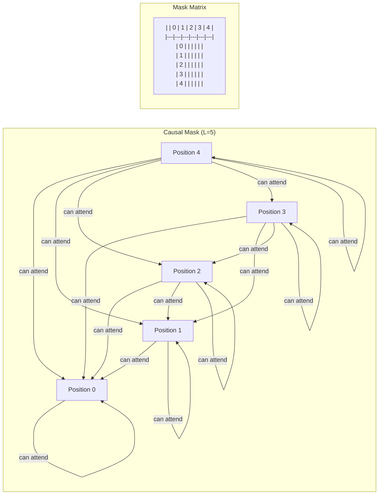
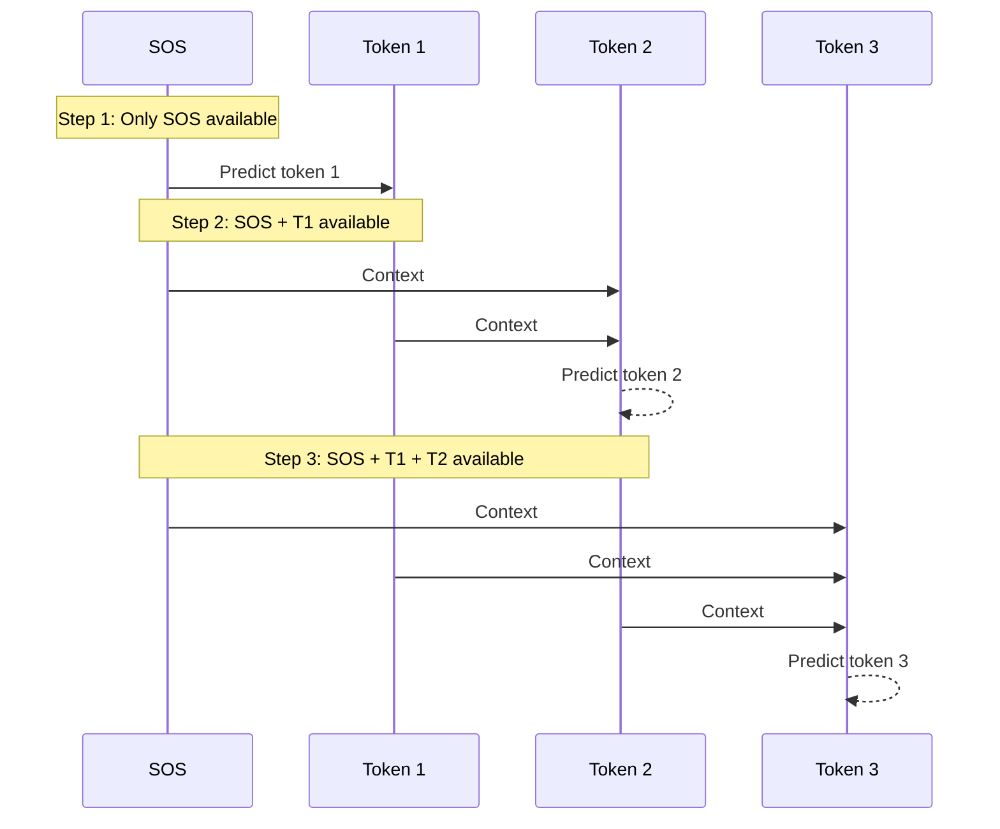

# 2. Causal Masking and Autoregressive Decoding

## Overview

Causal masking is one of the most important mechanisms in the TAMER decoder. It is the technique that enforces the autoregressive property — the guarantee that the model can only use information from the past and present when generating each token, never from the future. Without causal masking, the decoder would be able to "peek ahead" during training, learning dependencies it could never exploit during inference. This would lead to a catastrophic mismatch between training and deployment behavior, producing garbage output at test time.

## What Is Causal Masking?

In the self-attention mechanism, each position computes a weighted sum over all positions in the sequence. By default, attention is **bidirectional** — position `t` can attend to any position, including those that come after it. This is perfectly fine for the encoder, which processes the entire image in one pass, but it is fundamentally incompatible with autoregressive generation.

**Causal masking** modifies the attention computation by adding a mask to the attention score matrix before the softmax operation. The mask sets the attention scores for "future" positions to negative infinity (`-inf`), which causes the softmax to assign them a probability of exactly zero.

Formally, the attention computation becomes:

```
Attention(Q, K, V) = softmax((QK^T / sqrt(d_k)) + Mask) V
```

where `Mask` is a matrix with `0` for allowed positions and `-inf` for forbidden (future) positions.

## The Causal Mask: An Upper Triangular Matrix

For a sequence of length `L`, the causal mask is an `L × L` upper-triangular matrix. Consider a sequence of 5 tokens:

```
Position:   0    1    2    3    4

Mask:
       0     1    0    0    0    0
       1     1    1    0    0    0
       2     1    1    1    0    0
       3     1    1    1    1    0
       4     1    1    1    1    1
```

Where `1` indicates "allowed to attend" and `0` (conceptually `-inf` before softmax) indicates "forbidden." Position 0 can only attend to itself. Position 1 can attend to positions 0 and 1. Position 4 can attend to everything. This creates a strict left-to-right information flow.

After adding this mask to the raw attention scores, the softmax operation converts `-inf` entries to exactly `0.0`:

```
softmax(-inf) = exp(-inf) / sum(exp(all)) = 0 / sum = 0.0
```

This mathematical guarantee is crucial — it means there is **zero information leakage** from future tokens. The gradient through the softmax also correctly propagates zero for masked positions, ensuring the model never learns to rely on future information.

## The generate_causal_mask Function

In the TAMER codebase, the causal mask is generated dynamically by the `generate_causal_mask(L, device)` function. This function takes the current sequence length `L` and the target device, and returns a boolean or float mask of shape `(L, L)`.

```python
def generate_causal_mask(L, device):
    # Creates an upper-triangular matrix of -inf
    mask = torch.triu(torch.ones(L, L, device=device), diagonal=1)
    mask = mask.masked_fill(mask == 1, float('-inf'))
    return mask
```

The key detail is `diagonal=1` — this ensures that the main diagonal (self-attention, position `t` attending to itself) is **not** masked. Only positions strictly above the diagonal (future positions) are set to `-inf`.

The mask is generated dynamically rather than pre-computed because the sequence length can vary between batches and between training and inference.

## Causal Masking During Training

During training, we have the full target sequence available. The causal mask allows us to process the entire sequence in **parallel** — a major advantage of the Transformer architecture over RNNs. Here's how it works:

1. The decoder receives the full target sequence: `[SOS, t_1, t_2, ..., t_L]`
2. The causal mask ensures that position `i` only attends to positions `0` through `i`
3. The model produces logits for **all positions simultaneously** in a single forward pass
4. The loss is computed between the predicted tokens and the shifted targets

This parallel processing is extremely efficient on modern GPUs. An RNN would need `L` sequential steps to process the same sequence, while the Transformer does it in one step (with the mask handling the causality constraint).

**Important**: The causal mask is essential even though we have the full sequence during training. Without it, the model would learn to rely on future tokens and would fail completely during inference.

## Causal Masking During Inference

During inference, the causal mask takes on a different character because tokens are generated one at a time:

1. **Step 1**: The decoder receives `[SOS]`. The causal mask is trivially a `1×1` matrix (no masking needed). The model predicts token `t_1`.
2. **Step 2**: The decoder receives `[SOS, t_1]`. The causal mask is a `2×2` matrix. Position 0 attends to itself; position 1 attends to positions 0 and 1. The model predicts `t_2`.
3. **Step L**: The decoder receives `[SOS, t_1, ..., t_{L-1}]`. The causal mask is `L×L`. The model predicts `t_L`.

At each step, the causal mask grows by one row and one column. In a naive implementation, this means recomputing attention for all previous positions at each step, which is `O(L²)` total computation. Key-value caching (not used in the basic TAMER implementation) can optimize this by storing previously computed keys and values.

## The Unfinished Mask in Greedy Decoding

The `greedy_decode` function in TAMER includes an additional masking mechanism: the **unfinished mask**. This tracks which sequences in the batch have not yet produced an EOS (end-of-sequence) token.

```python
# Initialize: no sequence is finished
unfinished = torch.ones(B, dtype=torch.bool, device=device)

for step in range(max_len):
    # ... generate next token ...
    
    # Mark sequences as finished when EOS is produced
    unfinished = unfinished & (next_token != EOS_token)
    
    # If all sequences are finished, stop early
    if not unfinished.any():
        break
```

The unfinished mask serves two purposes:

1. **Efficiency**: Once a sequence produces EOS, we stop computing for that sequence, saving resources.
2. **Correctness**: After EOS is produced, we don't want to overwrite the EOS token with further generated tokens.

## Early Stopping

Early stopping is the mechanism that terminates the decoding loop when all sequences in the batch have produced their EOS tokens. This is important because:

- Different sequences have different lengths — a simple fraction might need 10 tokens while a matrix expression needs 150.
- Without early stopping, every sequence would be padded to `max_len = 200`, wasting computation.
- The `break` statement exits the loop as soon as `unfinished.any()` returns `False`.

## Why Training Is Parallel But Inference Is Sequential

This is a fundamental asymmetry in autoregressive models:

| Aspect | Training | Inference |
|--------|----------|-----------|
| Input | Full ground-truth sequence | Generated tokens (one at a time) |
| Causal mask | Applied to full sequence | Grows each step |
| Computation | Single forward pass | L forward passes |
| Speed | Fast (parallel) | Slow (sequential) |
| Masking purpose | Prevent "cheating" | Naturally satisfied |

During training, we know all the target tokens in advance, so we can feed them all at once and let the causal mask enforce the proper information flow. During inference, we don't know the future tokens — we have to generate them one at a time. This is why inference is inherently sequential and much slower than training.

## Mermaid Diagram: Causal Masking





## Key Takeaways

- Causal masking converts bidirectional attention into strictly left-to-right attention by setting future attention scores to `-inf`.
- The mask is an upper-triangular matrix; after softmax, masked positions receive exactly zero probability.
- During training, the causal mask enables parallel processing of the full sequence while maintaining the autoregressive property.
- During inference, tokens are generated sequentially, and the causal mask grows with each step.
- The unfinished mask and early stopping optimize inference by terminating completed sequences.
- The asymmetry between parallel training and sequential inference is inherent to autoregressive models.
