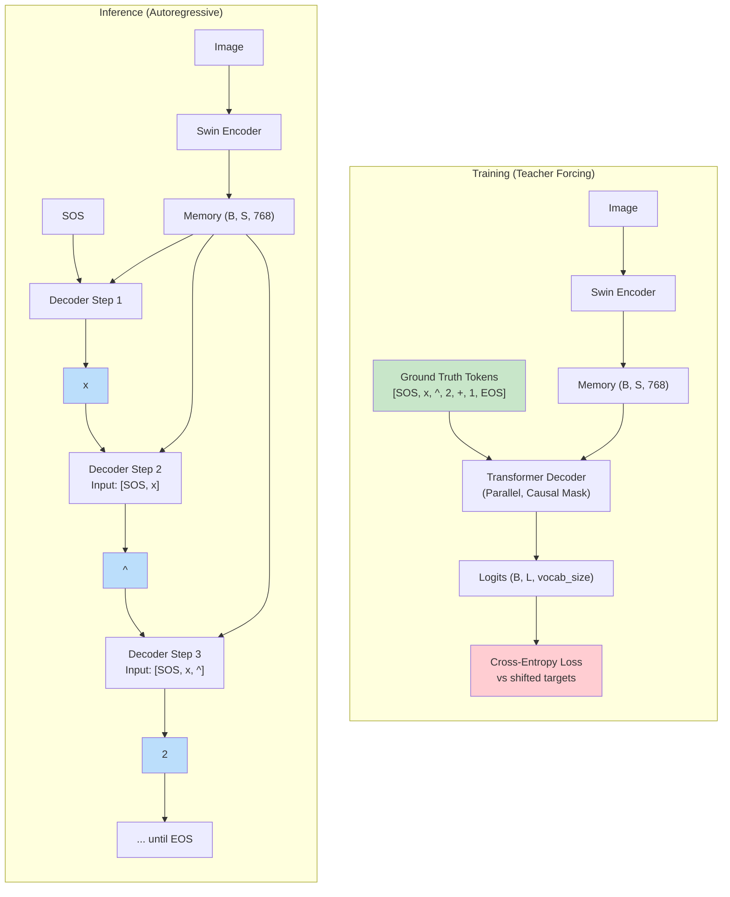

# 3. Teacher Forcing and Training vs Inference

## Overview

One of the most critical design decisions in training an autoregressive model like TAMER is how to provide the decoder with input tokens during training. **Teacher forcing** is the standard technique: instead of feeding the model's own predictions back as input (which would be slow and unstable early in training), we feed the **ground-truth tokens** from the training data. This dramatically accelerates convergence and provides a clean, stable training signal. However, it introduces a fundamental mismatch between training and inference — a problem known as **exposure bias** — which we will explore in depth.

## What Is Teacher Forcing?

Teacher forcing is a training strategy where the decoder always receives the correct (ground-truth) previous token as input, regardless of what the model itself would have predicted. The name comes from the analogy of a teacher "forcing" the correct answer at each step rather than letting the student (the model) learn from its own mistakes.

In the TAMER codebase, teacher forcing is implicit in the training loop:

```python
# During training:
logits = model(images, ids)  # ids is the ground-truth token sequence
loss = criterion(logits[:, :-1, :], targets[:, 1:])
```

The `ids` variable contains the full ground-truth LaTeX token sequence, prefixed with SOS. The model processes this sequence in parallel (with causal masking), and the loss is computed between the predicted logits and the shifted targets.

## The Autoregressive Shift

The autoregressive shift is the fundamental operation that makes teacher forcing work. Consider a target LaTeX sequence for the expression `x^2 + 1`:

```
Target:  [SOS,  x,    ^,    2,    +,    1,    EOS]
Index:    0     1     2     3     4     5     6
```

The decoder input and expected output are:

| Position | Decoder Input | Expected Output |
|----------|---------------|-----------------|
| 0 | SOS | x |
| 1 | x | ^ |
| 2 | ^ | 2 |
| 3 | 2 | + |
| 4 | + | 1 |
| 5 | 1 | EOS |

In code, this is implemented by slicing:

```python
# Decoder sees tokens 0..L-1, predicts tokens 1..L
logits = model(images, ids)           # ids = [SOS, x, ^, 2, +, 1, EOS]
predictions = logits[:, :-1, :]        # predictions for positions 0..L-1
targets_shifted = targets[:, 1:]       # ground truth for positions 1..L
loss = criterion(predictions, targets_shifted)
```

This shift ensures that at every training step, the model is asked: "Given the correct prefix so far, what comes next?"

## Why Teacher Forcing Works So Well

Teacher forcing provides several critical advantages:

### 1. Stable Gradient Signal

If we instead fed the model's own predictions as input during training, errors would compound rapidly. A single wrong prediction early in the sequence would cascade through all subsequent positions, producing an increasingly garbled input. The gradient signal would be noisy and inconsistent, making optimization extremely difficult.

With teacher forcing, every position receives the correct input regardless of the model's mistakes at other positions. This means the gradient at each position is clean and focused on the correct prediction task.

### 2. Parallel Training

Because teacher forcing provides the full input sequence upfront, the decoder can process all positions in parallel (with the causal mask enforcing the autoregressive constraint). This is vastly more efficient than generating one token at a time, which would require `L` sequential forward passes per training example.

### 3. Faster Convergence

Empirically, models trained with teacher forcing converge much faster than those trained with autoregressive feedback. This is because the model always trains on "clean" inputs, making the learning problem well-conditioned at every step.

## Exposure Bias: The Dark Side of Teacher Forcing

The fundamental problem with teacher forcing is that the model is never exposed to its own errors during training. At inference time, however, the model must use its own predictions as input. If the model makes a mistake — say, predicting `\frac` instead of `\sqrt` — all subsequent predictions are conditioned on this incorrect token, a situation the model has never encountered during training.

This mismatch is called **exposure bias**:

- **During training**: The model always sees correct prefixes → learns to predict well from correct contexts.
- **During inference**: The model sees its own (possibly incorrect) prefixes → may predict poorly from erroneous contexts.

The discrepancy can lead to error accumulation, where a single early mistake snowballs into a completely wrong output. This is particularly problematic for mathematical expressions, where a single misplaced symbol (e.g., `{` vs `}` or `^` vs `_`) can invalidate the entire formula.

## Scheduled Sampling: A Potential Remedy

**Scheduled sampling** (Bengio et al., 2015) is a technique designed to bridge the gap between teacher forcing and autoregressive inference. The idea is to gradually replace some ground-truth tokens with the model's own predictions during training:

- **Early in training**: Use 100% teacher forcing (all ground-truth tokens).
- **Later in training**: With probability `p` (which increases over time), replace the ground-truth token with the model's prediction at that position.
- **Late in training**: Use mostly the model's own predictions.

This exposes the model to its own errors gradually, allowing it to learn to recover from mistakes. However, scheduled sampling introduces its own challenges:

- It makes the training signal non-stationary (the input distribution changes over time).
- It can slow down convergence.
- The optimal schedule for `p` is task-dependent and hard to tune.

**TAMER does not use scheduled sampling.** The model relies entirely on teacher forcing during training, accepting the exposure bias as a trade-off for simplicity and training stability.

## Inference Without Teacher Forcing

At inference time, there is no ground truth available. The model must generate tokens autoregressively, using its own predictions as input:

### Greedy Decoding

The simplest inference strategy is **greedy decoding**: at each step, select the token with the highest probability:

```python
def greedy_decode(model, memory, max_len, SOS, EOS):
    ys = torch.tensor([[SOS]], device=device)
    for i in range(max_len):
        logits = model.decode(memory, ys)
        next_token = logits[:, -1, :].argmax(dim=-1)
        ys = torch.cat([ys, next_token.unsqueeze(1)], dim=1)
        if next_token == EOS:
            break
    return ys
```

Greedy decoding is fast but can produce suboptimal results because it always makes the locally optimal choice at each step. The globally best sequence might require choosing a lower-probability token at some position to enable better predictions later.

### Why Greedy Can Fail

Consider generating the LaTeX for `\frac{a}{b}`:

- **Step 1**: Model correctly predicts `\frac`
- **Step 2**: Model correctly predicts `{`
- **Step 3**: Model must predict `a` or `ab` — suppose it picks `a` (probability 0.4) over `a b` (probability 0.35 combined but split across two paths)
- **Step 4**: Model predicts `}` with high confidence
- **Step 5**: Model must predict `{` again — but it might predict `^` instead if the context is slightly off

The greedy strategy never explores alternative paths. If step 3 was wrong, the entire remainder of the sequence is corrupted, and there's no mechanism to backtrack.

This limitation motivates **beam search**, which maintains multiple candidate sequences and explores them in parallel. Beam search is covered in detail in Chapter 10, but the key insight is that it provides a middle ground between greedy decoding (fast but suboptimal) and exhaustive search (optimal but impossibly slow).

## Mermaid Diagram: Training vs Inference Comparison



## Key Takeaways

- Teacher forcing feeds ground-truth tokens as decoder input during training, providing a stable and efficient training signal.
- The autoregressive shift means the model sees tokens `0..t` and predicts token `t+1`.
- Exposure bias is the fundamental mismatch: the model never sees its own errors during training but must deal with them at inference.
- Scheduled sampling is a potential remedy but is not used in TAMER.
- Greedy decoding is the simplest inference strategy but can fail because locally optimal choices are not globally optimal.
- Beam search (Chapter 10) addresses the limitations of greedy decoding by maintaining multiple candidate sequences.
