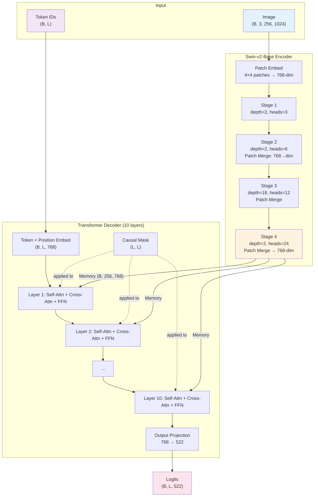

# 1. The TAMER Model Overview

## Overview

TAMER stands for **Transformer-based Architecture for Math Expression Recognition**. It is an end-to-end system that takes an image of a mathematical formula and produces the corresponding LaTeX markup string. The architecture follows a classic encoder-decoder paradigm, where a vision encoder extracts features from the image and a text decoder generates the LaTeX token sequence. What makes TAMER distinctive is its choice of encoder — the Swin Transformer v2 — and the tight integration between the encoder's output space and the decoder's input space, which eliminates the need for an adapter or projection layer between the two components.

## The Two-Component Design

TAMER is composed of exactly two major components:

1. **Swin-v2-Base Encoder**: A hierarchical vision transformer that processes the input image through four stages of window-based self-attention, producing a compact yet rich visual representation.
2. **Transformer Decoder**: A stack of 10 standard Transformer decoder layers that generate the LaTeX token sequence autoregressively, using cross-attention to "read" from the encoder's output.

This two-component design is intentionally minimal. There is no separate adapter network, no region proposal module, no attention bridge, and no multi-scale feature fusion beyond what Swin-v2 naturally provides. The simplicity reduces the number of hyperparameters to tune, makes the model easier to understand and debug, and ensures that the gradient flows cleanly from the loss function back through the decoder and into the encoder.

## Input and Output Shapes

The TAMER model has clearly defined input and output specifications:

### Inputs

| Input | Shape | Description |
|-------|-------|-------------|
| `images` | `(B, 3, 256, 1024)` | Batch of formula images, ImageNet-normalized |
| `ids` | `(B, L)` | Token ID sequences (training only), L ≤ 200 |

The image dimensions are fixed at 256×1024 pixels. This wide aspect ratio accommodates the typical shape of mathematical formulas, which are much wider than they are tall. The three channels correspond to RGB, normalized using ImageNet mean and standard deviation.

### Outputs

| Output | Shape | Description |
|--------|-------|-------------|
| `logits` | `(B, L, vocab_size)` | Unnormalized log-probabilities for each token at each position |

The `vocab_size` is approximately 522 tokens, determined by the tokenizer's vocabulary. The logits cover all positions in the input sequence, enabling the computation of the loss for the entire sequence in a single pass.

## The Encoder Output: Memory Tensor

After the Swin-v2-Base encoder processes the input image, it produces a **memory tensor** of shape `(B, S, 768)`. The value of `S` depends on the encoder's architecture:

- The input image is `(256, 1024)`, which gives `(64, 256)` initial 4×4 patches = 16,384 tokens.
- After 4 stages of Swin processing with patch merging at each stage:
  - Stage 1: Resolution reduced by factor 4 → `(64, 256)`, dim=96 → then patch merge
  - Stage 2: Resolution reduced by factor 8 → `(32, 128)`, dim=192 → then patch merge
  - Stage 3: Resolution reduced by factor 16 → `(16, 64)`, dim=384 → then patch merge
  - Stage 4: Resolution reduced by factor 32 → `(8, 32)`, dim=768

So the final memory has `S = 8 × 32 = 256` spatial positions, each represented by a 768-dimensional feature vector. These 256 vectors encode the visual content of the entire image at a resolution that balances spatial detail with computational efficiency.

## The encode() Method

The TAMER model provides a separate `encode()` method that runs only the encoder:

```python
def encode(self, images):
    memory = self.encoder(images)
    return memory  # (B, S, 768)
```

This method is useful during inference because it allows the encoder to be run once, and then the decoder can be called repeatedly as tokens are generated. This avoids recomputing the encoder output at every decoding step, which would be extremely wasteful since the image doesn't change.

## The Full Forward Pass

During training, the `forward()` method runs both the encoder and decoder in sequence:

```python
def forward(self, images, ids):
    memory = self.encode(images)           # (B, S, 768)
    logits = self.decode(memory, ids)      # (B, L, vocab_size)
    return logits
```

The `decode()` method handles:
1. Token embedding: converting integer IDs to 768-dim vectors
2. Positional embedding: adding positional information
3. Causal mask generation: creating the autoregressive mask
4. Transformer decoder layers: 10 layers of masked self-attention, cross-attention, and FFN
5. Output projection: linear layer from 768 to vocab_size

## DataParallel Integration

When training on multiple GPUs, TAMER is wrapped with `torch.nn.DataParallel`. This module:

1. **Scatters** the input across available GPUs (splitting the batch dimension)
2. **Replicates** the model on each GPU
3. **Runs forward** in parallel on each GPU
4. **Gathers** the output logits from all GPUs back to the main device

The key consideration is that the batch dimension must be divisible by the number of GPUs. With a batch size of 864 and, say, 4 GPUs, each GPU processes 216 images. The scattering and gathering are handled automatically by PyTorch's DataParallel implementation.

> **Note**: DataParallel is being superseded by `DistributedDataParallel` (DDP) in modern PyTorch. DDP offers better performance by avoiding the GIL bottleneck and using per-process model replicas. However, DataParallel requires minimal code changes and works well for moderate-scale training.

## Parameter Counts

The TAMER model has approximately 188M total parameters, distributed as follows:

| Component | Parameters | Percentage |
|-----------|-----------|------------|
| Swin-v2-Base Encoder | ~88M | ~47% |
| Transformer Decoder | ~100M | ~53% |

The decoder is actually larger than the encoder because:
- Each decoder layer has **two** attention mechanisms (self + cross) vs. the encoder's one
- The FFN layers (768 → 3072 → 768) are shared between both but the decoder has 10 layers vs. Swin's effective depth
- The token embedding and output projection add additional parameters

The output projection layer alone contributes `768 × 522 ≈ 400K` parameters, which is relatively small compared to the attention and FFN layers.

## Why the Model Outputs Logits for ALL Positions

A common question is: why does the model produce logits for every position in the sequence, not just the last one? There are two reasons:

1. **Training efficiency**: During training with teacher forcing, we need to compute the loss at every position. Having logits for all positions allows us to do this in a single forward pass, which is far more efficient than running `L` separate forward passes.

2. **Gradient quality**: Computing the loss at every position provides a richer gradient signal. Each position contributes its own gradient, which helps the model learn faster than if only the final position were used.

During inference with greedy or beam search, only the logits at the **last** position are used to select the next token. The logits at earlier positions are computed but discarded — they are a byproduct of the parallel processing that is essential for training.

## Mermaid Diagram: Full TAMER Model



## Key Takeaways

- TAMER is a two-component architecture: Swin-v2-Base encoder + 10-layer Transformer decoder.
- The encoder produces a memory tensor of shape `(B, 256, 768)` from a `(B, 3, 256, 1024)` input image.
- The shared `d_model = 768` between encoder and decoder eliminates the need for a projection layer.
- The `encode()` method is used for inference to avoid redundant computation.
- The full `forward()` runs both components and is used for training.
- DataParallel enables multi-GPU training by scattering inputs and gathering outputs.
- The model outputs logits for all positions (for training efficiency), even though only the last position's logits are needed during inference.
- Total parameter count is approximately 188M, split roughly evenly between encoder and decoder.
