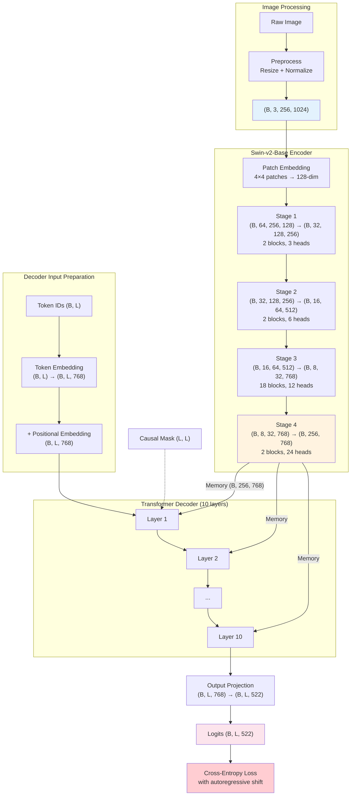

# 2. From Image to LaTeX - The Complete Data Flow

## Overview

Understanding the TAMER model requires tracing the complete data flow from the raw input image to the final LaTeX token predictions. Every tensor transformation along this path has a specific purpose, and the dimensions at each step are carefully designed to balance representational capacity with computational efficiency. In this note, we walk through all 10 steps of the TAMER data flow, tracking the exact shape of every tensor and explaining the purpose of each transformation.

## Step 1: Image Preprocessing

The journey begins with a raw formula image, which undergoes the following preprocessing:

1. **Resizing**: The image is resized to `(256, 1024)` pixels, preserving the wide aspect ratio typical of mathematical formulas.
2. **Conversion to tensor**: The pixel values are converted to a PyTorch tensor and scaled from `[0, 255]` to `[0.0, 1.0]`.
3. **ImageNet normalization**: Each channel is standardized using the ImageNet statistics:
   - Mean: `[0.485, 0.456, 0.406]`
   - Std: `[0.229, 0.224, 0.225]`

**Output shape**: `(3, 256, 1024)` → batched as `(B, 3, 256, 1024)`

The ImageNet normalization is critical because the Swin-v2 encoder was pretrained on ImageNet. Using the same normalization statistics ensures that the input distribution matches what the encoder was trained on, allowing it to leverage its pretrained features effectively.

## Step 2: Swin-v2 Patch Embedding

The first operation inside the Swin-v2 encoder is the **patch embedding** layer:

- The input image `(B, 3, 256, 1024)` is split into non-overlapping 4×4 patches.
- Each patch contains `4 × 4 × 3 = 48` pixel values.
- A linear projection maps these 48 values to a 768-dimensional embedding vector.
- The result has shape `(B, 64, 256, 768)`, which is reshaped to `(B, 64×256, 768) = (B, 16384, 768)`.

Wait — that's the initial token count. However, in practice, the Swin Transformer processes this as `(B, H, W, C)` where `H=64, W=256, C=96` (the initial embedding dimension for Swin-Base is actually 128 or 96 depending on configuration). For Swin-v2-Base with `embed_dim=128`, the initial feature dimension is 128, not 768. The dimension increases through patch merging in subsequent stages.

Let me correct the flow for Swin-v2-Base specifically:

- **Patch Embed**: `(B, 3, 256, 1024)` → `(B, 64, 256, 128)` (4×4 patches, embed_dim=128)
- **Linear projection + LayerNorm**: The patch embedding includes a linear layer and normalization.

**Output shape**: `(B, 16384, 128)` (or equivalently `(B, 64, 256, 128)` in spatial form)

## Step 3: Swin Stages 1–4 with Patch Merging

The Swin-v2 encoder processes the patch embeddings through four stages, each containing window-based multi-head self-attention blocks and a patch merging layer (except the last stage):

### Stage 1
- **Input**: `(B, 64, 256, 128)`, `num_heads=3`
- **Blocks**: 2 Swin Transformer blocks with window_size=7
- **Patch Merging**: Reduces spatial resolution by 2×, increases dimension from 128 to 256
- **Output**: `(B, 32, 128, 256)`

### Stage 2
- **Input**: `(B, 32, 128, 256)`, `num_heads=6`
- **Blocks**: 2 Swin Transformer blocks with window_size=7
- **Patch Merging**: Reduces resolution by 2×, increases dimension from 256 to 512
- **Output**: `(B, 16, 64, 512)`

### Stage 3
- **Input**: `(B, 16, 64, 512)`, `num_heads=12`
- **Blocks**: 18 Swin Transformer blocks with window_size=7 (the deepest stage)
- **Patch Merging**: Reduces resolution by 2×, increases dimension from 512 to 768
- **Output**: `(B, 8, 32, 768)`

### Stage 4
- **Input**: `(B, 8, 32, 768)`, `num_heads=24`
- **Blocks**: 2 Swin Transformer blocks with window_size=7
- **No Patch Merging** (this is the final stage)
- **Output**: `(B, 8, 32, 768)` → reshaped to `(B, 256, 768)`

The final encoder output — the **memory tensor** — has `S = 8 × 32 = 256` spatial positions, each described by a 768-dimensional feature vector. This tensor is the complete visual representation of the input image, encoding both local details (individual symbols, strokes) and global structure (layout, spatial relationships).

## Step 4: Decoder Token Embedding

The decoder receives the target token sequence as integer IDs of shape `(B, L)`. The first step is to convert these IDs to continuous vectors:

```python
token_embeddings = self.embedding(ids)  # (B, L) -> (B, L, 768)
```

The embedding layer is a `nn.Embedding(vocab_size, d_model)` lookup table with `522 × 768 ≈ 400K` parameters. Each of the 522 tokens in the vocabulary has a learned 768-dimensional vector representation.

During training, `ids` contains the ground-truth sequence `[SOS, t_1, t_2, ..., t_{L-1}]`. During inference, `ids` contains the tokens generated so far.

**Output shape**: `(B, L, 768)`

## Step 5: Positional Embedding

Since the Transformer architecture has no inherent notion of order, positional embeddings must be added to the token embeddings to inform the model about the position of each token in the sequence:

```python
positional_embeddings = self.pos_embedding(torch.arange(L, device=device))  # (L, 768)
decoder_input = token_embeddings + positional_embeddings  # (B, L, 768)
```

The positional embeddings are learned (not sinusoidal), meaning they are optimized during training alongside all other parameters. This allows the model to develop position representations that are specifically tuned for LaTeX sequences, which have very different positional patterns than natural language.

**Output shape**: `(B, L, 768)` (shape unchanged, just values modified)

## Step 6: Causal Mask Generation

Before entering the decoder layers, a causal mask is generated for the current sequence length `L`:

```python
causal_mask = generate_causal_mask(L, device)  # (L, L)
```

This mask is an upper-triangular matrix with `-inf` above the diagonal and `0` on and below the diagonal. It will be applied during the masked self-attention computation in each decoder layer.

**Mask shape**: `(L, L)`

## Step 7: Cross-Attention (Decoder Reads Image)

Within each decoder layer, the cross-attention mechanism allows the decoder tokens to attend to the encoder memory:

```
Q = decoder_hidden_state  # (B, L, 768)
K = encoder_memory        # (B, S, 768)
V = encoder_memory        # (B, S, 768)

attention_weights = softmax(Q @ K^T / sqrt(768))  # (B, L, S)
cross_attention_output = attention_weights @ V      # (B, L, 768)
```

Each of the `L` decoder positions computes a weighted average over all `S = 256` encoder positions. The attention weights determine which image patches are most relevant for generating the current token. For instance:

- When generating `\frac`, the model might attend to the horizontal fraction line
- When generating `x`, it attends to the specific glyph in the image
- When generating `^`, it attends to a superscript region above the baseline

**Output shape**: `(B, L, 768)` (the decoder sequence length is preserved, but each position now incorporates visual information)

## Step 8: 10 Decoder Layers

The decoder hidden state passes through all 10 decoder layers. Each layer refines the representation by:

1. **Masked self-attention**: Allows each token to incorporate context from all preceding tokens.
2. **Cross-attention**: Updates each token's representation with relevant visual information from the encoder memory.
3. **Feed-forward network**: Applies a non-linear transformation to each position independently.
4. **Residual connections and layer normalization**: Stabilize training and enable gradient flow.

The shape remains `(B, L, 768)` throughout — the decoder layers transform the values but not the shape.

**Output shape**: `(B, L, 768)`

## Step 9: Output Projection

The final decoder hidden state is projected from the model dimension to the vocabulary size:

```python
logits = self.output_projection(hidden_state)  # (B, L, 768) -> (B, L, 522)
```

This is a simple linear layer with `768 × 522 + 522 ≈ 401K` parameters (including bias). The logits are unnormalized log-probabilities; applying softmax would convert them to a proper probability distribution.

**Output shape**: `(B, L, 522)`

## Step 10: Loss Computation with Autoregressive Shift

During training, the loss is computed with the autoregressive shift:

```python
# predictions for positions 0 to L-2
predictions = logits[:, :-1, :]          # (B, L-1, 522)

# targets for positions 1 to L-1
targets_shifted = target_ids[:, 1:]      # (B, L-1)

loss = criterion(predictions.reshape(-1, vocab_size),
                 targets_shifted.reshape(-1))
```

This implements the autoregressive principle: the model's prediction at position `t` (based on tokens `0..t`) is compared against the ground-truth token at position `t+1`.

## Shape Transformation Summary

| Step | Operation | Input Shape | Output Shape |
|------|-----------|-------------|--------------|
| 1 | Preprocessing | Raw image | `(B, 3, 256, 1024)` |
| 2 | Patch Embed | `(B, 3, 256, 1024)` | `(B, 16384, 128)` |
| 3 | Swin Stages | `(B, 16384, 128)` | `(B, 256, 768)` |
| 4 | Token Embed | `(B, L)` | `(B, L, 768)` |
| 5 | Position Embed | `(B, L, 768)` | `(B, L, 768)` |
| 6 | Causal Mask | — | `(L, L)` |
| 7 | Cross-Attention | `(B, L, 768)` + `(B, 256, 768)` | `(B, L, 768)` |
| 8 | 10 Decoder Layers | `(B, L, 768)` | `(B, L, 768)` |
| 9 | Output Projection | `(B, L, 768)` | `(B, L, 522)` |
| 10 | Loss | `(B, L, 522)` + `(B, L)` | scalar |

## Mermaid Diagram: Complete Data Flow



## Key Takeaways

- The complete data flow involves 10 major steps from raw image to loss value.
- The encoder reduces the spatial resolution from 256×1024 to 8×32 (256 patches) while increasing the feature dimension from 3 to 768.
- The decoder maintains the sequence length `L` throughout its layers, with each position's representation being refined through self-attention and cross-attention.
- Cross-attention is the mechanism that injects visual information into the token representations, with each decoder position attending to all 256 encoder positions.
- The output projection converts from the 768-dim model space to the 522-dim vocabulary space.
- The autoregressive shift in the loss ensures that the model learns to predict the next token given all previous tokens.
