# 3. Model Configuration and Hyperparameters

## Overview

The TAMER model's behavior is governed by a centralized configuration system — the `Config` class — that specifies every architectural detail, training hyperparameter, and runtime option. Understanding this configuration is essential for reproducing results, debugging issues, and adapting the model to new datasets or hardware. In this note, we dissect every configuration parameter, explain the reasoning behind each choice, and explore the interactions between different settings.

## The Config Class

The `Config` class serves as a single source of truth for all model and training parameters. Rather than scattering magic numbers throughout the codebase, every value is defined once in the config and referenced everywhere else. This pattern has several benefits:

1. **Reproducibility**: Anyone can reproduce an experiment by using the same config.
2. **Auditability**: It's easy to see all hyperparameters at a glance.
3. **Modifiability**: Changing a single config value propagates correctly to all dependent code.
4. **Documentation**: The config itself serves as a specification of the model.

The config is typically defined as a Python dataclass or a simple class with class-level attributes:

```python
class Config:
    # Image dimensions
    img_height = 256
    img_width = 1024
    
    # Swin-v2 encoder
    encoder_name = "swinv2_base_window12_192_22k"
    window_size = 7
    depths = [2, 2, 18, 2]
    num_heads = [3, 6, 12, 24]
    
    # Transformer decoder
    num_layers = 10
    d_model = 768
    nhead = 12
    dim_feedforward = 3072
    
    # Training
    encoder_lr = 5e-5
    decoder_lr = 5e-4
    batch_size = 864
    accumulation_steps = 1
    weight_decay = 0.01
    label_smoothing = 0.1
    max_grad_norm = 1.0
    compile_model = True
    freeze_encoder_epochs = 3
    
    # Sequence
    max_seq_len = 200
```

## Image Dimensions

```
img_height = 256
img_width = 1024
```

The input image is resized to `256 × 1024` pixels before being fed to the model. This 1:4 aspect ratio is deliberately chosen to match the typical shape of mathematical formulas, which are significantly wider than they are tall. A square input (e.g., `512 × 512`) would either waste computation on empty space above and below the formula, or require aggressive downscaling that would destroy fine details.

The fixed resolution ensures that:
- The number of patches after Swin processing is always `256` (i.e., `8 × 32`), making batching straightforward.
- The positional encoding in the Swin encoder can be precomputed for this specific resolution.
- Memory usage is predictable and consistent across batches.

## Swin-v2-Base Configuration

```
encoder_name = "swinv2_base_window12_192_22k"
window_size = 7
depths = [2, 2, 18, 2]
num_heads = [3, 6, 12, 24]
```

### Window Size: 7

The window size determines the local receptive field within each Swin attention block. With `window_size = 7`, each window covers a `7 × 7` region of the current feature map. Tokens within a window attend to each other, while tokens in different windows do not interact directly (they interact indirectly through the shifted window mechanism in alternating blocks).

A window size of 7 is a good balance:
- Smaller windows (e.g., 4) would have limited local context but faster attention computation.
- Larger windows (e.g., 12) would capture more context but with quadratically increasing computation.

### Depths: [2, 2, 18, 2]

The `depths` parameter specifies the number of Swin Transformer blocks in each of the four stages:
- **Stage 1**: 2 blocks (shallow processing at high resolution)
- **Stage 2**: 2 blocks (still relatively shallow)
- **Stage 3**: 18 blocks (the main processing stage — deep, with the most representation capacity)
- **Stage 4**: 2 blocks (final refinement at the lowest resolution)

The heavy emphasis on Stage 3 (18 out of 24 total blocks) is intentional. At the Stage 3 resolution (16×64), the feature map is large enough to retain spatial detail but small enough for efficient attention. This is where most of the visual reasoning happens — identifying symbols, understanding spatial relationships, and building hierarchical representations.

### Number of Heads: [3, 6, 12, 24]

The attention heads increase with each stage, following the increase in feature dimension:
- Stage 1: dim=128, heads=3, head_dim=128/3≈43
- Stage 2: dim=256, heads=6, head_dim=256/6≈43
- Stage 3: dim=512, heads=12, head_dim=512/12≈43
- Stage 4: dim=768, heads=24, head_dim=768/24=32

Wait — in Swin-v2-Base, the embedding dimension starts at 128 and doubles at each patch merge. So the head dimensions are approximately consistent across stages, which is important for stable training.

## Decoder Configuration

```
num_layers = 10
d_model = 768
nhead = 12
dim_feedforward = 3072
```

### Number of Layers: 10

The 10-layer decoder provides sufficient depth for modeling the complex syntax of LaTeX expressions. Each layer adds one round of self-attention (for syntactic context), cross-attention (for visual grounding), and FFN processing (for non-linear transformations). The choice of 10 layers was validated empirically — fewer layers underfit on complex expressions, while more layers provide diminishing returns and increase training time.

### d_model: 768

The model dimension of 768 is **not arbitrary** — it is chosen to match the Swin-v2-Base encoder's output dimension. This eliminates the need for an adapter or projection layer between the encoder and decoder, which simplifies the architecture and reduces the parameter count. The cross-attention mechanism can directly use the encoder output as keys and values without any dimension mismatch.

### nhead: 12

With `d_model = 768` and `nhead = 12`, each attention head operates on a 64-dimensional subspace (`768 / 12 = 64`). This head dimension is consistent with best practices from the Transformer literature and provides enough capacity per head for meaningful attention patterns.

### dim_feedforward: 3072

The FFN expansion factor is `3072 / 768 = 4`, which is the standard ratio from the original Transformer paper. The FFN first expands the representation from 768 to 3072 (creating a richer, higher-dimensional space for non-linear transformations) and then projects it back to 768.

## Vocabulary Size and Sequence Length

```
vocab_size ≈ 522  (determined by tokenizer)
max_seq_len = 200
```

The vocabulary of approximately 522 tokens covers the LaTeX symbols, commands, and special tokens needed to represent mathematical formulas. This includes:

- **Digits**: 0-9
- **Letters**: a-z, A-Z
- **Operators**: +, -, =, <, >, ×, ÷, etc.
- **LaTeX commands**: \frac, \sqrt, \int, \sum, \prod, \begin, \end, etc.
- **Brackets and delimiters**: {, }, (, ), [, ], etc.
- **Special tokens**: SOS, EOS, PAD

The maximum sequence length of 200 tokens is sufficient for the vast majority of mathematical expressions in standard datasets. Very long expressions (e.g., multi-line equations or matrices) may be truncated, but this is rare in practice.

## Learning Rates: Differential Strategy

```
encoder_lr = 5e-5
decoder_lr = 5e-4
```

One of the most important training decisions is the **10× difference** between the encoder and decoder learning rates. This differential strategy reflects a fundamental principle of transfer learning:

### Why the Encoder Gets a Small LR

The Swin-v2-Base encoder is **pretrained** on ImageNet (specifically, the 22K-class variant). Its weights already encode powerful visual features — edge detectors, texture recognizers, shape processors — that are broadly useful for any vision task, including mathematical formula recognition. Using a small learning rate (`5e-5`) ensures that these pretrained features are **fine-tuned** rather than overwritten:

- Too large a learning rate would destroy the pretrained representations ("catastrophic forgetting")
- Too small a learning rate would prevent the encoder from adapting to the specifics of mathematical imagery (thin lines, precise spatial relationships, small symbols)

### Why the Decoder Gets a Large LR

The Transformer decoder, in contrast, starts from **random initialization**. It has no pretrained weights to preserve — every parameter must be learned from scratch. The larger learning rate (`5e-4`) enables the decoder to learn quickly, which is important because:

- The decoder must learn both the LaTeX language model (syntax, grammar) and the cross-attention mapping (visual features → LaTeX tokens)
- A small learning rate would make convergence prohibitively slow
- The 10× ratio ensures that the decoder's rapid learning doesn't destabilize the encoder's careful fine-tuning

## Batch Size and Accumulation

```
batch_size = 864
accumulation_steps = 1
```

The batch size of 864 is remarkably large, enabled by the RTX 6000 Ada GPU's 48GB of memory. Large batch sizes provide several benefits:

1. **Stable gradient estimates**: More samples per update means lower gradient variance.
2. **Efficient GPU utilization**: Larger batches keep the GPU's parallel processing units fully occupied.
3. **Faster training**: More samples per second means fewer total training hours.

With `accumulation_steps = 1`, no gradient accumulation is needed — the full batch fits in memory. On GPUs with less memory, one would reduce the batch size and increase accumulation steps proportionally (e.g., batch_size=216, accumulation_steps=4 for a 12GB GPU).

## Regularization and Optimization

### Weight Decay: 0.01

```
weight_decay = 0.01
```

Weight decay (L2 regularization) penalizes large weights, encouraging the model to find simpler solutions that generalize better. The value of 0.01 is standard for AdamW-based training and provides a moderate regularization effect. In the AdamW optimizer, weight decay is applied directly to the weights (not through the gradient), which is more effective than the traditional L2 approach.

### Label Smoothing: 0.1

```
label_smoothing = 0.1
```

Label smoothing replaces the hard one-hot target distribution with a softened version:

```
target[i] = (1 - ε) if i == correct_class
target[i] = ε / (V - 1) if i != correct_class
```

where `ε = 0.1` and `V = 522` (vocabulary size). This prevents the model from becoming overconfident and encourages it to distribute some probability mass to semantically similar tokens. For example, if the correct token is `{`, label smoothing allows the model to assign some probability to `(` without being penalized too harshly, which can improve generalization.

### Gradient Clipping: max_grad_norm = 1.0

```
max_grad_norm = 1.0
```

Gradient clipping limits the norm of the gradient vector to 1.0. This prevents gradient explosions — rare but catastrophic events where a single training example produces an enormous gradient that destabilizes the model. Gradient clipping is particularly important for Transformer models, which can experience large gradient norms during the early stages of training.

## Freeze Encoder Epochs: 3

```
freeze_encoder_epochs = 3
```

During the first 3 epochs of training, the Swin-v2 encoder's parameters are completely **frozen** (no gradients computed, no updates applied). Only the decoder is trained during this warmup period. This serves several purposes:

1. **Stable initialization**: The randomly initialized decoder can learn basic patterns without being disturbed by noisy encoder gradients.
2. **Cross-attention calibration**: The decoder's cross-attention layers learn to "read" the pretrained encoder features before those features start changing.
3. **Faster early training**: Skipping the encoder's backward pass reduces computation per step during the warmup.

After epoch 3, the encoder is unfrozen, and both components are trained jointly with their respective learning rates.

## Compile Model: True

```
compile_model = True
```

When `compile_model = True`, the model is wrapped with `torch.compile()`, which applies various optimizations including:

- **Operator fusion**: Combining multiple operations into a single kernel to reduce memory bandwidth usage.
- **Memory planning**: Optimizing the allocation and reuse of intermediate tensors.
- **Automatic mixed precision**: Using lower-precision arithmetic where safe.

The reported speedup is approximately **30%**, which is significant for a model that requires many training epochs on a large dataset. `torch.compile()` is available in PyTorch 2.0+ and requires minimal code changes — typically just wrapping the model before training.

## Mermaid Diagram: Config Hierarchy

```mermaid
flowchart TB
    CONFIG["Config Class"]

    CONFIG --> IMG["Image Config"]
    CONFIG --> ENC["Encoder Config"]
    CONFIG --> DEC["Decoder Config"]
    CONFIG --> TRAIN["Training Config"]
    CONFIG --> SEQ["Sequence Config"]

    IMG --> IH["img_height = 256"]
    IMG --> IW["img_width = 1024"]

    ENC --> EN["encoder_name = swinv2_base"]
    ENC --> WS["window_size = 7"]
    ENC --> DEP["depths = [2, 2, 18, 2]"]
    ENC --> NH["num_heads = [3, 6, 12, 24]"]

    DEC --> NL["num_layers = 10"]
    DEC --> DM["d_model = 768"]
    DEC --> HD["nhead = 12"]
    DEC --> FFN["dim_feedforward = 3072"]

    TRAIN --> ELR["encoder_lr = 5e-5"]
    TRAIN --> DLR["decoder_lr = 5e-4"]
    TRAIN --> BS["batch_size = 864"]
    TRAIN --> ACC["accumulation_steps = 1"]
    TRAIN --> WD["weight_decay = 0.01"]
    TRAIN --> LS["label_smoothing = 0.1"]
    TRAIN --> GC["max_grad_norm = 1.0"]
    TRAIN --> CMP["compile_model = True"]
    TRAIN --> FE["freeze_encoder_epochs = 3"]

    SEQ --> VS["vocab_size ≈ 522"]
    SEQ --> MSL["max_seq_len = 200"]

    style CONFIG fill:#e1f5fe
    style IMG fill:#e8f5e9
    style ENC fill:#fff3e0
    style DEC fill:#fce4ec
    style TRAIN fill:#f3e5f5
    style SEQ fill:#e0f2f1
```



## Key Takeaways

- The `Config` class centralizes all model and training parameters for reproducibility and clarity.
- Image dimensions (256×1024) match the typical aspect ratio of mathematical formulas.
- Swin-v2-Base uses a 4-stage architecture with depths `[2, 2, 18, 2]`, emphasizing Stage 3 for visual reasoning.
- The decoder's `d_model = 768` matches the encoder output, eliminating the need for a projection layer.
- Differential learning rates (encoder: 5e-5, decoder: 5e-4) reflect the pretrained-vs-random initialization asymmetry.
- Freezing the encoder for 3 epochs allows the decoder to stabilize before joint fine-tuning begins.
- `torch.compile()` provides approximately 30% training speedup with minimal code changes.
- Label smoothing (0.1) and gradient clipping (1.0) provide regularization and training stability.
