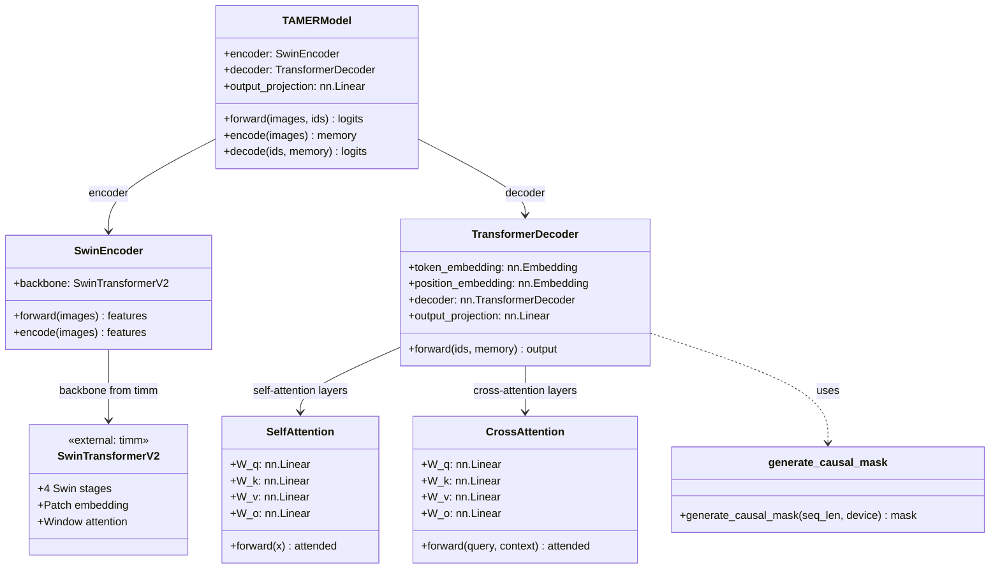

# 4. The Model Submodules - Attention, Encoder, Decoder

## Overview

The TAMER model is not a single monolithic class — it is composed of several distinct modules, each responsible for a different aspect of the image-to-LaTeX pipeline. These modules live in the `models/` directory and are organized into four files: `attention.py`, `encoder.py`, `decoder.py`, and `tamer.py`. This separation follows the principle of **modular design**: each file encapsulates a specific concern, making the code easier to understand, test, and modify. This note provides an in-depth examination of each module, its internal structure, and how the modules connect to form the complete TAMER model.

## The models/ Directory Structure

```
models/
├── attention.py    # Multi-head attention mechanisms (self + cross)
├── encoder.py      # Swin-v2 backbone wrapper for image encoding
├── decoder.py      # Transformer decoder for sequence generation
└── tamer.py        # Top-level model combining encoder + decoder
```

Each file defines one or more classes that implement a specific component. The `tamer.py` file imports from the other three to assemble the complete model, but each module can also be used and tested independently.

## attention.py: Multi-Head Attention

The `attention.py` file implements the attention mechanisms that power both the encoder's self-attention (within the Swin-v2 backbone) and the decoder's self-attention and cross-attention. While PyTorch provides `nn.MultiheadAttention`, the TAMER project uses a **custom implementation** for finer control over the computation, particularly for integrating with the Swin-v2 windowed attention and for generating causal masks.

### Separate Classes for Self-Attention and Cross-Attention

The file defines two distinct attention classes:

- **SelfAttention**: Used in the Transformer decoder layers. Each position attends to all previous positions (respecting the causal mask) in the sequence. The query, key, and value all come from the same input sequence.

- **CrossAttention**: Used to connect the decoder to the encoder. The query comes from the decoder's current hidden state, while the key and value come from the encoder's output features. This allows the decoder to "look at" relevant parts of the image while generating each token.

### The QKV Linear Projections

Both attention classes implement the standard QKV (Query, Key, Value) projection pattern:

```python
class SelfAttention(nn.Module):
    def __init__(self, d_model, n_heads):
        super().__init__()
        self.n_heads = n_heads
        self.d_k = d_model // n_heads
        
        # Separate linear projections for Q, K, V
        self.W_q = nn.Linear(d_model, d_model)
        self.W_k = nn.Linear(d_model, d_model)
        self.W_v = nn.Linear(d_model, d_model)
        
        # Output projection
        self.W_o = nn.Linear(d_model, d_model)
```

The input is projected into three separate representations: queries (what we are looking for), keys (what each position offers), and values (the actual content at each position). These projections are learned during training and allow the model to attend to different aspects of the input.

### Scaled Dot-Product Attention

The core attention computation follows the standard formula:

$$\text{Attention}(Q, K, V) = \text{softmax}\left(\frac{QK^T}{\sqrt{d_k}}\right)V$$

The scaling factor $\sqrt{d_k}$ prevents the dot products from growing too large (which would push the softmax into saturation). In the TAMER project, with `d_model=768` and `n_heads=12`, each head has `d_k=64`, so the scaling factor is $\sqrt{64} = 8$.

### Causal Mask Generation: generate_causal_mask()

The `generate_causal_mask()` function creates the **causal (autoregressive) mask** that prevents the decoder from attending to future positions. This is essential for maintaining the autoregressive property: the prediction at position $t$ can only depend on positions $1, 2, \ldots, t-1$.

```python
def generate_causal_mask(seq_len, device):
    """Generate an upper-triangular mask for autoregressive decoding."""
    mask = torch.triu(
        torch.ones(seq_len, seq_len, device=device), 
        diagonal=1
    ).bool()
    # True positions are MASKED (not attended to)
    return mask
```

The resulting mask is an upper-triangular boolean matrix where `True` indicates positions that should be masked (not attended to). Position $t$ can attend to all positions $\leq t$, but not to positions $> t$. This mask is applied to the attention scores before the softmax, setting masked positions to $-\infty$ so they receive zero attention weight.

## encoder.py: The Swin-v2 Backbone Wrapper

The `encoder.py` file wraps the **Swin Transformer v2** model as the image encoder. Rather than implementing Swin-v2 from scratch, it loads the pretrained model from the `timm` library (or a local checkpoint) and adapts its output for the decoder.

### Loading Pretrained Weights from Local Path

The TAMER project loads the Swin-v2 weights from a local path rather than downloading them at runtime. This ensures reproducibility and works in offline environments:

```python
class SwinEncoder(nn.Module):
    def __init__(self, config):
        super().__init__()
        # Load pretrained Swin-v2 from local checkpoint
        self.backbone = timm.create_model(
            config.encoder_name,  # e.g., "swinv2_base_window12to16_192to384"
            pretrained=False,
            num_classes=0,        # Remove classification head
        )
        # Load local weights
        state_dict = torch.load(config.encoder_weights_path)
        self.backbone.load_state_dict(state_dict, strict=False)
```

Setting `num_classes=0` removes the ImageNet classification head, leaving only the feature extraction stages. The `strict=False` flag allows loading even if the classification head weights are missing from the checkpoint.

### The Forward Method

The forward method processes images through all four Swin-v2 stages:

```python
def forward(self, images):
    """
    Args:
        images: [B, 3, 384, 384] input images
    Returns:
        features: [B, L, 768] encoder output features
                  where L = (384/16)^2 = 576 for base model
    """
    features = self.backbone.forward_features(images)
    # features shape: [B, 768, H', W'] where H'=W'=24
    features = features.flatten(2).transpose(1, 2)
    # features shape: [B, 576, 768]
    return features
```

The Swin-v2 base model processes the 384×384 input through four stages with progressive downsampling (4×, 8×, 16×, 32×... but Swin uses patch size 4, so the feature map at the final stage is 384/16 = 24, giving 24×24 = 576 spatial positions). The 2D feature map is flattened and transposed to produce a sequence of length 576 with 768-dimensional features, matching the decoder's expected input format.

### The encode() Method for Inference

During inference (beam search), only the encoder needs to run once per image. The `encode()` method provides a clean interface for this:

```python
def encode(self, images):
    """Encoder-only forward pass for inference."""
    with torch.no_grad():
        return self.forward(images)
```

This method wraps the forward pass in `torch.no_grad()` to disable gradient computation, saving memory during inference.

## decoder.py: The Transformer Decoder

The `decoder.py` file implements the Transformer decoder that generates LaTeX token sequences autoregressively. It uses PyTorch's `nn.TransformerDecoder` with custom configuration for the TAMER project.

### nn.TransformerDecoder with Custom Configuration

The decoder is built from `nn.TransformerDecoderLayer` instances stacked to the configured depth:

```python
class TransformerDecoder(nn.Module):
    def __init__(self, config):
        super().__init__()
        self.d_model = config.d_model  # 768
        self.n_heads = config.n_heads  # 12
        self.n_layers = config.decoder_layers  # 6
        
        decoder_layer = nn.TransformerDecoderLayer(
            d_model=self.d_model,
            nhead=self.n_heads,
            dim_feedforward=config.d_model * 4,  # 3072
            dropout=config.dropout,
            activation='gelu',
            batch_first=True,
        )
        self.decoder = nn.TransformerDecoder(
            decoder_layer, 
            num_layers=self.n_layers
        )
```

The `batch_first=True` flag ensures that all tensors use the `[batch, sequence, feature]` layout, which is more intuitive and consistent with the rest of the codebase than PyTorch's default `[sequence, batch, feature]` layout.

### Token Embedding + Positional Embedding

The decoder maps discrete token IDs to continuous vectors through two embedding layers:

```python
self.token_embedding = nn.Embedding(vocab_size, d_model)
self.position_embedding = nn.Embedding(max_seq_len, d_model)
```

The **token embedding** converts each token ID (0 to vocab_size-1) into a d_model-dimensional vector. The **positional embedding** provides position information, allowing the model to distinguish between the same token at different positions in the sequence. Unlike the sinusoidal positional encodings used in the original Transformer, the TAMER project uses **learned positional embeddings**, which give the model more flexibility to discover optimal position representations during training.

### The Causal Mask Integration

The causal mask is generated and applied during the forward pass:

```python
def forward(self, ids, memory, memory_key_padding_mask=None):
    seq_len = ids.size(1)
    causal_mask = generate_causal_mask(seq_len, ids.device)
    
    # Embed tokens and positions
    positions = torch.arange(seq_len, device=ids.device)
    x = self.token_embedding(ids) + self.position_embedding(positions)
    
    # Apply decoder with causal mask
    output = self.decoder(
        tgt=x,
        memory=memory,
        tgt_mask=causal_mask,
        memory_key_padding_mask=memory_key_padding_mask
    )
    return output
```

The `tgt_mask` parameter receives the causal mask, ensuring autoregressive property. The `memory_key_padding_mask` can optionally mask out padding positions in the encoder output, though in practice the Swin-v2 encoder produces dense features without padding.

### Cross-Attention Receiving Encoder Memory

The `memory` parameter in the decoder's forward pass is the encoder's output features. Each `TransformerDecoderLayer` contains both a **self-attention** sublayer (attending to previous decoder positions) and a **cross-attention** sublayer (attending to the encoder memory). The cross-attention is what allows the decoder to incorporate visual information from the image while generating each LaTeX token.

### The Output Projection Layer

After the decoder stack, a linear projection layer maps the d_model-dimensional output to vocabulary-size logits:

```python
self.output_projection = nn.Linear(d_model, vocab_size)
```

These logits are then passed through softmax (implicitly, during loss computation) to produce the probability distribution over the vocabulary for the next token prediction.

## tamer.py: The Top-Level TAMERModel Class

The `tamer.py` file defines the **TAMERModel** class that combines the encoder and decoder into a single model. It provides three methods corresponding to the three modes of operation: training (full forward pass), encoding (inference: encode the image), and decoding (inference: generate tokens).

### Combining Encoder and Decoder

```python
class TAMERModel(nn.Module):
    def __init__(self, config):
        super().__init__()
        self.encoder = SwinEncoder(config)
        self.decoder = TransformerDecoder(config)
        self.config = config
```

The TAMERModel holds references to both the encoder and decoder. During training, both are used. During inference, the encoder runs once and the decoder runs iteratively (for beam search).

### forward(images, ids): Full Forward Pass for Training

```python
def forward(self, images, ids):
    """
    Full forward pass for training.
    
    Args:
        images: [B, 3, 384, 384] input images
        ids: [B, seq_len] target token IDs (teacher forcing)
    
    Returns:
        logits: [B, seq_len, vocab_size] predictions for each position
    """
    memory = self.encoder(images)         # [B, 576, 768]
    decoder_out = self.decoder(ids, memory)  # [B, seq_len, 768]
    logits = self.output_projection(decoder_out)  # [B, seq_len, vocab_size]
    return logits
```

This method runs the full encoder-decoder pipeline in one call. The `ids` input is the target sequence (shifted right, with a BOS token prepended), providing the ground-truth context for teacher forcing. The output logits are compared against the target token IDs to compute the cross-entropy loss.

### encode(images): Encoder-Only Forward for Inference

```python
def encode(self, images):
    """Encode images into feature representations."""
    return self.encoder.encode(images)
```

During beam search, the encoder only needs to run once. The `encode()` method computes the encoder features and returns them as the `memory` that will be reused across all decoding steps.

### decode(ids, memory): Decoder-Only Forward for Inference

```python
def decode(self, ids, memory):
    """
    Decode given current token IDs and encoder memory.
    
    Args:
        ids: [B, current_len] token IDs generated so far
        memory: [B, 576, 768] encoder features
    
    Returns:
        logits: [B, current_len, vocab_size] predictions
    """
    decoder_out = self.decoder(ids, memory)
    logits = self.output_projection(decoder_out)
    return logits
```

The `decode()` method is called repeatedly during beam search, each time with an extended sequence of token IDs as new tokens are generated. The encoder memory is passed in directly, avoiding redundant computation.

## Module Hierarchy Diagram

The following Mermaid diagram shows how the four module files relate to each other and how the classes within them compose the complete TAMER model:



## How These Modules Connect in the Codebase

The module hierarchy creates a clear data flow:

1. **Image input** enters `TAMERModel.forward()`
2. The image is passed to `SwinEncoder.forward()`, which runs it through the Swin-v2 backbone
3. The encoder output (flattened feature sequence) is returned as `memory`
4. The token IDs and memory are passed to `TransformerDecoder.forward()`
5. The decoder generates causal mask, embeds tokens and positions, and processes through its layers
6. The decoder output is projected to vocabulary-size logits
7. The logits are returned for loss computation

During inference, the flow is split:

1. `TAMERModel.encode(images)` runs the encoder once
2. `TAMERModel.decode(ids, memory)` is called iteratively by the beam search algorithm
3. Each decode call produces logits for the next token

This modular design allows each component to be tested independently, swapped for alternatives (e.g., a different encoder backbone), or optimized separately (e.g., compiling only the decoder while keeping the encoder in eager mode).

## Summary

The TAMER model's modular architecture separates concerns across four files: `attention.py` provides the self-attention and cross-attention mechanisms with causal masking; `encoder.py` wraps the Swin-v2 backbone for image feature extraction; `decoder.py` implements the Transformer decoder with token/positional embeddings and cross-attention to the encoder; and `tamer.py` assembles everything into the top-level TAMERModel with three modes of operation (full forward, encode-only, decode-only). This clean separation makes the codebase maintainable and allows each component to evolve independently.
