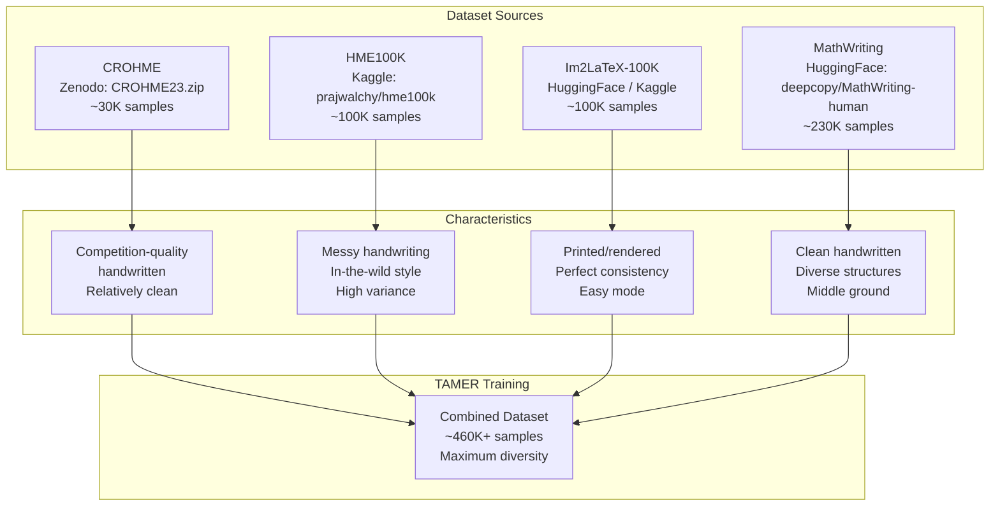

# 1. The Four Datasets

## Overview

The TAMER OCR system is trained on a carefully curated combination of **four distinct datasets**, each contributing a unique perspective on mathematical expression imagery. This multi-dataset strategy is not accidental — it is the cornerstone of the model's ability to generalize across wildly different input conditions. From pristine printed formulas to chaotic scribbles, the training data spans the full spectrum of what the model will encounter in production.

Training on a single dataset would produce a brittle model that excels only within that dataset's narrow domain. By combining four sources with complementary characteristics, TAMER learns representations that are robust to variations in writing style, image quality, rendering engine, and mathematical complexity.

---

## The Datasets at a Glance



---

## 1.1 CROHME — Competition Handwritten Math

**CROHME** stands for **Competition on Recognition of Online Handwritten Mathematical Expressions**. It is the gold-standard benchmark dataset for handwritten math OCR, produced through international competitions held since 2011. The TAMER project specifically uses the **CROHME 2023** release, sourced from Zenodo as `CROHME23.zip`.

### Key Characteristics

- **Source format**: `.inkml` files containing stroke-level data (pen trajectory coordinates with timestamps), not raster images. Each `.inkml` file records the sequence of pen strokes the writer used to produce the expression.
- **Conversion to images**: Since TAMER processes raster images (not stroke sequences), the `.inkml` files are rendered into grayscale PNG images during preprocessing. This conversion step traces the stroke coordinates onto a canvas, producing clean renderings of the handwritten input.
- **Quality level**: Competition quality. The handwriting in CROHME is relatively clean and deliberate because participants knew their input was being recorded and evaluated. Writers tended to form symbols clearly, maintain consistent spacing, and avoid excessive overlapping.
- **Size**: Approximately 30,000 samples across training and test splits. This is the smallest of the four datasets but arguably the highest quality per sample.
- **Mathematical diversity**: Despite its modest size, CROHME covers an impressive range of mathematical structures — fractions, integrals, summations, matrices, Greek letters, operators, and multi-line expressions.

### Why CROHME Matters

CROHME is the de facto evaluation benchmark in the handwritten math OCR community. A model that performs well on CROHME is considered production-viable. Including it in training ensures the model is exposed to the exact distribution it will be evaluated on, though care must be taken to avoid leakage between training and test splits.

### Challenges

- **Small size**: 30K samples is insufficient to train a modern deep learning model from scratch. CROHME must be supplemented with other data.
- **Stroke-to-image conversion loss**: Converting `.inkml` to images discards temporal information (stroke order, speed, pressure) that could be useful for recognition. TAMER accepts this trade-off for architectural simplicity.

---

## 1.2 HME100K — Messy Handwritten Math

**HME100K** (Handwritten Math Expression 100K) is sourced from Kaggle at `prajwalchy/hme100k-dataset`. It contains approximately 100,000 images of handwritten mathematical expressions written by diverse contributors.

### Key Characteristics

- **Source format**: Pre-rendered images (PNG/JPEG) paired with label files containing the ground-truth LaTeX strings. No conversion step is needed — the data is ready to use.
- **Quality level**: Significantly messier than CROHME. This is "in-the-wild" handwriting — people writing quickly, with inconsistent sizing, overlapping symbols, and non-standard notation. Some samples look like they were scribbled on a napkin.
- **Size**: ~100,000 samples, making it a substantial contributor to the training corpus.
- **Diversity**: High variance in writing style. Different writers have wildly different ways of forming the same symbol. A "2" from one writer might look like a "Z" from another.

### Why HME100K Matters

This dataset is the **reality check**. If TAMER only trained on clean data, it would fail catastrophically on real-world input. HME100K forces the model to develop robust feature representations that can handle sloppy, inconsistent handwriting — exactly what users will provide in production.

### Challenges

- **Label noise**: Some labels in HME100K contain errors or non-standard LaTeX. The sanitization pipeline (covered in [[3. Data Sanitization and Filtering]]) helps catch the worst offenders.
- **Visual ambiguity**: Many samples are genuinely ambiguous even to human readers. The model must learn to cope with inherent uncertainty.
- **Extreme aspect ratios**: Some expressions are very wide (long equations) or very tall (nested fractions), creating challenges for fixed-resolution input processing.

---

## 1.3 Im2LaTeX-100K — Printed Math Formulas

**Im2LaTeX-100K** is a dataset of **printed** (typeset) mathematical formulas, sourced from HuggingFace (`yuntian-deng/im2latex-100k`) or Kaggle. Unlike the other three datasets, these images are not handwritten — they are rendered from LaTeX source code using standard typesetting engines.

### Key Characteristics

- **Source format**: Pre-rendered images paired with LaTeX source strings. The images are produced by compiling LaTeX to PDF, then rasterizing to pixels — resulting in perfectly crisp, consistent rendering.
- **Quality level**: Flawless. Every symbol is rendered in the same font, at the same size, with perfect spacing. This is the "easy mode" of math OCR.
- **Size**: ~100,000 samples, sourced from academic papers on arXiv.
- **Content**: Dense, complex formulas typical of physics and mathematics papers — integrals, summations, tensors, matrices, and multi-line aligned equations.

### Why Im2LaTeX Matters

Printed formulas serve as the **foundation layer** of the curriculum. Because the images are perfectly consistent, the model can learn the basic symbol-to-LaTeX mapping without being confused by handwriting variation. It's like learning to read printed text before attempting cursive.

Key benefits:
- **Clean signal**: The model can focus on learning structural patterns (how fractions are laid out, how integrals are formed) without the noise of handwriting.
- **Symbol vocabulary coverage**: Printed formulas cover an extremely wide range of LaTeX commands, helping the tokenizer build a comprehensive vocabulary.
- **Volume**: At 100K samples, it provides substantial training data for the early curriculum stages.

### Challenges

- **Domain gap**: A model trained exclusively on printed formulas will fail on handwritten input. The visual appearance of a rendered `\int` is vastly different from a handwritten integral sign. This is why Im2LaTeX must be combined with handwritten datasets.
- **Overfitting risk**: Because printed formulas are so consistent, the model can memorize patterns that don't generalize to handwriting.

---

## 1.4 MathWriting — Clean Handwritten Math

**MathWriting** is sourced from HuggingFace (`deepcopy/MathWriting-human`) and contains a large collection of **clean handwritten** mathematical expressions. It occupies the middle ground between the pristine printed formulas of Im2LaTeX and the messy scribbles of HME100K.

### Key Characteristics

- **Source format**: Images with associated LaTeX labels. Some variants include stroke-level data similar to CROHME's `.inkml` format, but TAMER uses only the raster image version.
- **Quality level**: Clean and legible handwriting. Writers were instructed to write clearly, but the output is still recognizably handwritten — with natural variation in stroke width, symbol sizing, and alignment.
- **Size**: Approximately 230,000 samples — the **largest** of the four datasets by a significant margin.
- **Structural diversity**: MathWriting contains a rich variety of LaTeX structures, from simple arithmetic to complex multi-line expressions with matrices and aligned equations.

### Why MathWriting Matters

MathWriting is the **bread and butter** of the training corpus. Its combination of large volume, clean handwriting, and structural diversity makes it the single most important dataset for producing a well-rounded model. It provides:

- **Volume**: At 230K samples, it dominates the training distribution and ensures the model sees enough examples of each symbol and structure.
- **Handwriting realism**: Unlike Im2LaTeX's perfect rendering, MathWriting contains genuine human handwriting variation — but controlled enough that the model can extract clean patterns.
- **Bridge function**: MathWriting acts as a bridge between the printed world (Im2LaTeX) and the messy world (HME100K). It helps the model smoothly transition from recognizing idealized symbols to handling real handwriting.

### Challenges

- **Potential label issues**: As with any large crowdsourced dataset, some labels may contain LaTeX errors or non-standard notation.
- **Class imbalance**: Some LaTeX commands appear far more frequently than others. The model may overfit to common symbols while underperforming on rare ones.

---

## 1.5 Why Four Datasets? The Diversity Imperative

The decision to combine four datasets is driven by a fundamental principle of machine learning: **diversity improves generalization**. Each dataset fills a gap that the others leave:

| Dataset | Handwriting Style | Volume | Strength | Weakness |
|---------|-------------------|--------|----------|----------|
| CROHME | Clean handwritten | ~30K | Benchmark alignment | Too small alone |
| HME100K | Messy handwritten | ~100K | Robustness to noise | Label noise |
| Im2LaTeX | Printed | ~100K | Clean signal, vocab | Domain gap |
| MathWriting | Clean handwritten | ~230K | Volume + diversity | Class imbalance |

Without CROHME, the model wouldn't align with evaluation benchmarks. Without HME100K, it would fail on messy input. Without Im2LaTeX, it would struggle to learn basic symbol mappings. Without MathWriting, it would lack the volume needed for robust training.

The **MultiDatasetBatchSampler** (covered in [[5. The MathDataset and DataLoader]]) ensures that each batch contains a balanced mix of samples from all four datasets, using temperature-based sampling to control the mixing ratios.

---

## 1.6 The Dataset Registry Pattern

In the TAMER codebase, datasets are managed through a **registry pattern** — a dictionary mapping dataset names to their configuration objects. This design makes it trivial to add new datasets or remove existing ones without modifying the core training loop.

```python
DATASET_REGISTRY = {
    "crohme": DatasetConfig(
        name="crohme",
        source="zenodo",
        path="CROHME23.zip",
        format="inkml",
        expected_size=30_000,
    ),
    "hme100k": DatasetConfig(
        name="hme100k",
        source="kaggle",
        path="prajwalchy/hme100k-dataset",
        format="image_label",
        expected_size=100_000,
    ),
    "im2latex": DatasetConfig(
        name="im2latex",
        source="huggingface",
        path="yuntian-deng/im2latex-100k",
        format="image_label",
        expected_size=100_000,
    ),
    "mathwriting": DatasetConfig(
        name="mathwriting",
        source="huggingface",
        path="deepcopy/MathWriting-human",
        format="image_label",
        expected_size=230_000,
    ),
}
```

Each `DatasetConfig` specifies the download source, expected format, and approximate size. The sanitization pipeline uses these configs to locate and validate the data.

### Adding a New Dataset

To add a fifth dataset (say, a new Chinese math OCR corpus), you would:

1. Add a new entry to `DATASET_REGISTRY`
2. Implement a `_load_my_dataset()` function that reads the data into the standard `{image, latex, dataset_name}` format
3. The rest of the pipeline (sanitization, tokenization, curriculum, DataLoader) works automatically

This decoupled design is essential for a research codebase where datasets change frequently.

---

## Key Takeaways

- **Four datasets, four perspectives**: Each dataset contributes a unique distribution of visual and structural patterns.
- **Diversity = robustness**: The model must handle everything from perfect typesetting to chaotic scribbles.
- **Registry pattern**: Clean separation between dataset definition and pipeline logic.
- **CROHME is the benchmark**: Performance on CROHME is the primary evaluation metric.
- **MathWriting is the backbone**: Its large volume and clean handwriting make it the most important contributor to training.
- **Im2LaTeX is the teacher**: Printed formulas provide the cleanest signal for learning basic symbol-to-LaTeX mappings.
- **HME100K is the stress test**: Messy handwriting ensures the model doesn't crumble in production.
