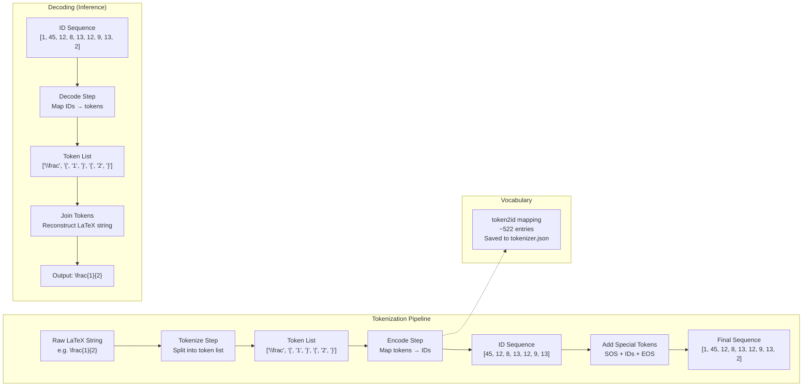

# 2. LaTeX Tokenization

## Overview

Before a neural network can process a LaTeX string, that string must be converted into a sequence of integers — a process called **tokenization**. In TAMER, this is handled by the `LaTeXTokenizer` class, which breaks LaTeX expressions into discrete tokens and maps each token to a unique integer ID. The tokenizer is the bridge between the human-readable world of mathematical notation and the machine-readable world of tensor indices.

Unlike natural language tokenization (which often uses subword methods like BPE or SentencePiece), LaTeX tokenization in TAMER operates at the **character and command level**. This choice is deliberate and deeply tied to the structured nature of the LaTeX language itself.

---

## 2.1 What Is Tokenization?

Tokenization is the process of converting a raw text string into a list of discrete symbols (tokens), each of which is then mapped to an integer index. Consider a simple example:

```
Input:  "\frac{1}{2}"
Tokens: ["\frac", "{", "1", "}", "{", "2", "}"]
IDs:    [45, 12, 8, 13, 12, 9, 13]
```

The tokenizer must correctly identify that `\frac` is a single token (not four separate characters `\`, `f`, `r`, `a`, `c`), while `{` and `1` are individual tokens. This requires understanding LaTeX's syntax — specifically, that a backslash followed by letters forms a command token.

---

## 2.2 LaTeX as a Structured Language

LaTeX is not natural language. It is a **markup language** with well-defined syntax rules:

- **Commands**: Tokens beginning with `\`, such as `\frac`, `\sqrt`, `\int`, `\alpha`. These are the "words" of LaTeX — each one represents a specific mathematical concept or formatting instruction.
- **Braces**: `{` and `}` are grouping delimiters that define the scope of arguments. In `\frac{1}{2}`, the first `{1}` is the numerator and the second `{2}` is the denominator.
- **Symbols**: Single characters like `+`, `-`, `=`, `x`, `2` that represent themselves in the mathematical expression.
- **Environment markers**: `\begin{aligned}` and `\end{aligned}` define block-level structures like matrices and aligned equations.
- **Spacing tokens**: `~`, `\,`, `\;`, `\quad` control horizontal spacing.

This structured nature means that LaTeX has a **finite and relatively small vocabulary** — unlike natural language, which has effectively unlimited words due to compound formation, names, and loan words.

---

## 2.3 The LaTeXTokenizer Architecture



The `LaTeXTokenizer` class implements a three-stage pipeline:

1. **Tokenize**: Split a LaTeX string into a list of string tokens
2. **Encode**: Convert the token list into a list of integer IDs
3. **Decode**: Convert integer IDs back into a LaTeX string

Each stage is described in detail below.

---

## 2.4 The `tokenize()` Method

The `tokenize()` method is responsible for splitting a raw LaTeX string into a list of tokens. The key challenge is correctly identifying LaTeX commands (which start with `\` and consist of one or more letters) while treating individual characters as separate tokens.

### Tokenization Rules

The tokenizer follows these rules, applied in order:

1. **LaTeX commands**: A backslash `\` followed by one or more alphabetic characters forms a single token. For example, `\frac` → one token, `\alpha` → one token, `\begin` → one token.
2. **Single-character commands**: A backslash followed by a single non-alphabetic character (e.g., `\{`, `\}`, `\\`) forms a single token. These are escape sequences for symbols that would otherwise be interpreted as LaTeX syntax.
3. **Individual characters**: Any character not part of a command is its own token. This includes digits, letters (outside commands), operators, and braces.
4. **Whitespace**: Spaces are generally ignored in LaTeX tokenization because LaTeX itself ignores most whitespace in math mode. The tokenizer strips spaces during tokenization.

### Example Walkthrough

```
Input:  "\sqrt{x^2 + 1}"

Step 1: Identify command token → "\sqrt"
Step 2: Next char "{" → token "{"
Step 3: Next char "x" → token "x"
Step 4: Next char "^" → token "^"
Step 5: Next char "2" → token "2"
Step 6: Next char " " → skip (whitespace)
Step 7: Next char "+" → token "+"
Step 8: Next char " " → skip (whitespace)
Step 9: Next char "1" → token "1"
Step 10: Next char "}" → token "}"

Result: ["\sqrt", "{", "x", "^", "2", "+", "1", "}"]
```

### Edge Cases

- **Nested commands**: `\frac{a}{b}` correctly tokenizes as `["\frac", "{", "a", "}", "{", "b", "}"]`. The tokenizer does not need to understand nesting — it just splits at token boundaries.
- **Subscripts and superscripts**: `x_{ij}` tokenizes as `["x", "_", "{", "i", "j", "}"]`. The `_` and `^` operators are individual tokens.
- **Matrix environments**: `\begin{pmatrix}` tokenizes as `["\begin", "{", "pmatrix", "}"]`. The `pmatrix` inside braces is treated as a regular string of individual character tokens in some implementations, or as a single argument token in others.

---

## 2.5 The `encode()` Method

Once we have a list of string tokens, the `encode()` method maps each token to its integer ID using the `token2id` dictionary:

```python
def encode(self, tokens: list[str]) -> list[int]:
    return [self.token2id[t] for t in tokens]
```

If a token is not in the vocabulary, the tokenizer either raises an error (strict mode) or maps it to an `<UNK>` token (lenient mode). In practice, TAMER builds the vocabulary from the entire training corpus before training, so out-of-vocabulary tokens should be rare during training — but they can appear during inference on unseen formulas.

### Special Tokens in Encoding

The `encode()` method typically wraps the token IDs with special tokens:

```
[SOS, token_id_1, token_id_2, ..., token_id_n, EOS]
```

Where:
- **SOS** (Start of Sequence, ID=1): Signals the decoder to begin generating output. Without SOS, the decoder has no initial input to condition on.
- **EOS** (End of Sequence, ID=2): Signals that the expression is complete. During inference, generating an EOS token terminates the decoding loop.
- **PAD** (Padding, ID=0): Used to pad sequences within a batch to equal length. PAD tokens are ignored by the loss function via `ignore_index=0`.

---

## 2.6 The `decode()` Method

The `decode()` method performs the inverse of `encode()` — it maps integer IDs back to string tokens and joins them into a LaTeX string:

```python
def decode(self, ids: list[int], skip_special: bool = True) -> str:
    tokens = []
    for id_ in ids:
        if skip_special and id_ in (self.pad_id, self.sos_id, self.eos_id):
            continue
        tokens.append(self.id2token[id_])
    return "".join(tokens)
```

### The `skip_special` Option

During inference, we typically call `decode()` with `skip_special=True` to strip PAD, SOS, and EOS tokens from the output. This produces a clean LaTeX string ready for rendering or evaluation.

During debugging, `skip_special=False` is useful for inspecting the raw token sequence, including where EOS was predicted and how much padding was applied.

### Important: No Spaces Between Tokens

Note that `"".join(tokens)` concatenates tokens without spaces. This is correct for LaTeX because the language doesn't use spaces to separate tokens in math mode — `\frac{1}{2}` is written as a continuous string. The spacing in rendered math is handled by the LaTeX typesetting engine, not by spaces in the source.

---

## 2.7 Vocabulary Construction

The vocabulary is built by scanning the entire training corpus and collecting all unique tokens:

```python
def build_vocab(self, latex_strings: list[str]) -> None:
    all_tokens = set()
    for latex in latex_strings:
        tokens = self.tokenize(latex)
        all_tokens.update(tokens)

    # Reserve IDs 0-2 for special tokens
    self.token2id = {"<PAD>": 0, "<SOS>": 1, "<EOS>": 2}
    for i, token in enumerate(sorted(all_tokens), start=3):
        self.token2id[token] = i

    self.id2token = {v: k for k, v in self.token2id.items()}
```

### Why ~522 Tokens?

LaTeX's vocabulary in mathematical expressions is remarkably small. The ~522 tokens break down roughly as:

- **3 special tokens**: PAD, SOS, EOS
- **~26 lowercase letters**: a-z (used as variable names)
- **~26 uppercase letters**: A-Z
- **~10 digits**: 0-9
- **~20 operators**: +, -, =, <, >, *, /, etc.
- **~150 LaTeX commands**: \frac, \sqrt, \int, \sum, \alpha through \omega, \begin, \end, etc.
- **~10 structural tokens**: {, }, [, ], (, ), _, ^, &, \\
- **~200+ additional symbols and commands**: Less common symbols, environment names (aligned, cases, pmatrix, etc.), and formatting commands

This is tiny compared to natural language vocabularies (typically 30,000–100,000 tokens). The small vocabulary is a major advantage — it means the output softmax is over a much smaller space, making the prediction task easier and the model more sample-efficient.

---

## 2.8 Why Not BPE or SentencePiece?

Modern NLP systems almost universally use subword tokenization methods like **Byte Pair Encoding (BPE)** or **SentencePiece**. Why doesn't TAMER?

The answer lies in the fundamental difference between LaTeX and natural language:

1. **LaTeX already has a natural token boundary**: The backslash `\` explicitly marks the start of a command. Braces `{}` explicitly mark argument boundaries. There is no ambiguity about where one token ends and another begins — unlike natural language, where word boundaries can be fuzzy (is "don't" one word or two?).

2. **Subword tokenization would destroy LaTeX's compositional structure**: BPE might split `\frac` into `\fr` + `ac`, or `\sqrt` into `\sq` + `rt`. These subword units have no semantic meaning in LaTeX and would make the model's job harder, not easier.

3. **The vocabulary is already small**: BPE was invented to handle the open-ended vocabulary problem in NLP — there are too many words to have one token per word. LaTeX doesn't have this problem. With only ~522 tokens, we can afford a one-token-per-symbol mapping without any vocabulary pressure.

4. **Decoding simplicity**: With character/command-level tokenization, decoding is trivial — just map each ID back to its token string and concatenate. With BPE, you need a merge table and special decoding logic.

---

## 2.9 Saving and Loading: tokenizer.json

The tokenizer's vocabulary mapping is saved to a JSON file called `tokenizer.json`:

```json
{
    "token2id": {
        "<PAD>": 0,
        "<SOS>": 1,
        "<EOS>": 2,
        "\\frac": 3,
        "\\sqrt": 4,
        "{": 5,
        "}": 6,
        ...
    },
    "id2token": {
        "0": "<PAD>",
        "1": "<SOS>",
        "2": "<EOS>",
        "3": "\\frac",
        "4": "\\sqrt",
        "5": "{",
        "6": "}",
        ...
    },
    "vocab_size": 522,
    "pad_id": 0,
    "sos_id": 1,
    "eos_id": 2
}
```

### Why This Matters

**The tokenizer must be absolutely identical between training and inference.** If the tokenizer used during inference has even a single different ID mapping, the model's output will be garbage. For example, if `\frac` is ID 3 during training but ID 5 during inference, the model will predict ID 3 when it means `\frac`, but the decoder will interpret ID 3 as whatever token occupies that slot in the new mapping.

This is why:
1. The tokenizer is saved immediately after vocabulary construction
2. The saved `tokenizer.json` is loaded at inference time, rather than rebuilding the vocabulary
3. The tokenizer file is version-controlled alongside the model checkpoint

---

## 2.10 Consistency Between Training and Inference

The golden rule of tokenization: **train and inference must use the same tokenizer**. This seems obvious, but it's violated surprisingly often in practice. Common mistakes include:

- **Rebuilding the vocabulary at inference time**: If the inference data contains a token not seen during training, the vocabulary size changes, shifting all IDs above the new token's position. The saved tokenizer must be loaded, not rebuilt.
- **Different tokenization rules**: If the training tokenizer treats `\\` as a single token but the inference tokenizer splits it into `\` + `\`, the model will receive incorrect input sequences.
- **Different special token IDs**: If SOS is ID 1 during training but ID 2 during inference, the decoder's initial input will be wrong.

TAMER avoids all these issues by saving the complete tokenizer state to `tokenizer.json` and loading it at inference time. The `save()` and `load()` methods ensure round-trip consistency:

```python
tokenizer.save("tokenizer.json")      # After vocab construction
tokenizer = LaTeXTokenizer.load("tokenizer.json")  # At inference time
```

---

## Key Takeaways

- **Tokenization converts LaTeX strings to integer sequences** that the model can process.
- **LaTeX has a natural token structure** — commands start with `\`, braces delimit arguments, and symbols are individual characters.
- **The vocabulary is small (~522 tokens)** because LaTeX is a structured language with finite vocabulary.
- **BPE/SentencePiece are unnecessary** for LaTeX — they would destroy compositional structure without solving a vocabulary problem that doesn't exist.
- **Special tokens (PAD=0, SOS=1, EOS=2)** are essential for batching, decoding, and loss computation.
- **tokenizer.json must be saved and reloaded** to ensure consistency between training and inference.
- **The three-stage pipeline** (tokenize → encode → decode) provides a clean abstraction that separates string processing from integer mapping.
