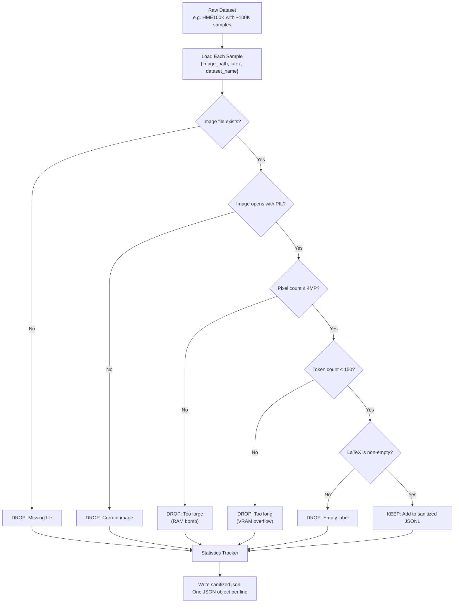

# 3. Data Sanitization and Filtering

## Overview

Raw datasets are never clean. They contain corrupt images, missing files, absurdly large images that would blow up GPU memory, and LaTeX strings with so many tokens that the decoder would run out of VRAM. The sanitization pipeline is the gatekeeper that prevents these pathological samples from reaching the training loop. Without it, training would crash randomly, waste epochs on garbage data, and produce a model that has learned from noise.

The TAMER sanitization pipeline processes each of the four datasets independently, applying a series of filters to remove samples that are too large, too long, corrupt, or missing. The result is a clean JSONL file per dataset that the `MathDataset` can load reliably.

---

## 3.1 Why Sanitize?

Consider what happens without sanitization:

- **A 20-megapixel image** enters the batch. The Swin Transformer attempts to process it, and the activation tensors consume 40GB of VRAM. The training run OOMs and crashes. You lose hours of compute.
- **A LaTeX string with 300 tokens** gets padded to length 300 in the batch. The decoder's self-attention mechanism builds a 300×300 attention matrix for every layer, for every head. VRAM usage spikes, and again — OOM.
- **A corrupt JPEG** causes PIL to throw an exception during `__getitem__`. The DataLoader worker crashes. The training loop hangs indefinitely waiting for data that will never arrive.
- **A missing image file** triggers a FileNotFoundError. Same result — crash or hang.

These are not theoretical risks. In a corpus of 460,000+ samples spanning four different sources, pathological cases are guaranteed to exist. The sanitization pipeline exists to find and remove them before they can cause problems.

---

## 3.2 The Filtering Pipeline



---

## 3.3 Pixel Count Filter (max_pixels = 4,000,000)

The pixel count filter rejects any image whose total number of pixels (width × height) exceeds 4,000,000 — approximately **4 megapixels**. This corresponds to, for example, a 2000×2000 pixel image.

### Why 4 Megapixels?

The Swin Transformer v2 encoder processes images at a fixed resolution (typically 384×384 = ~148K pixels), but the input image must first be loaded into RAM and decoded by PIL before it can be resized. A 20-megapixel image decoded as a float32 tensor occupies:

```
20,000,000 pixels × 3 channels × 4 bytes = 240 MB per image
```

With 48 DataLoader workers, each pre-fetching multiple images, the RAM consumption can reach tens of gigabytes — far exceeding what's available on most training machines.

The 4MP limit provides a comfortable safety margin. Images larger than 4MP are rare in math OCR (most formulas fit in a much smaller canvas) and typically indicate a misformatted or anomalous sample.

### Implementation

```python
from PIL import Image

def check_pixel_count(image_path: str, max_pixels: int = 4_000_000) -> bool:
    try:
        with Image.open(image_path) as img:
            width, height = img.size
            return width * height <= max_pixels
    except Exception:
        return False
```

Note that this check uses `Image.open()` in a lazy mode — PIL reads only the image header (which contains dimensions) without decoding the full pixel data. This makes the check extremely fast, even for large images.

---

## 3.4 Token Count Filter (max_tokens = 150)

The token count filter rejects any sample whose LaTeX string, when tokenized, produces more than **150 tokens** (not counting SOS and EOS).

### Why 150 Tokens?

The Transformer decoder's self-attention mechanism has O(L²) memory complexity, where L is the sequence length. At 150 tokens, the attention matrix is 150×150 = 22,500 entries per head per layer — manageable. At 300 tokens, it's 90,000 — four times the memory. With 8 attention heads and 6 decoder layers, the difference becomes significant.

Additionally, long sequences create training instability. The teacher-forcing signal degrades over long sequences because early prediction errors compound — a wrong token at position 10 shifts the context for all subsequent positions, making it increasingly difficult for the model to recover.

### What Gets Filtered

Samples that exceed 150 tokens are typically:
- **Multi-line aligned equations** with many columns
- **Large matrices** (5×5 or larger) with many entries
- **Deeply nested expressions** like `\frac{\frac{\frac{...}{...}}{...}}{...}`
- **Corrupt labels** where the LaTeX string contains repeated or garbage tokens

These samples are not inherently "bad" — they're just too long for the model to handle efficiently. Future work could extend the token limit with memory-efficient attention mechanisms like Flash Attention or linear attention.

---

## 3.5 Corrupt and Missing Image Filters

### Corrupt Images

Some images in the raw datasets are genuinely corrupt — truncated downloads, zero-byte files, or images with invalid headers. These cause PIL to raise `UnidentifiedImageError` or `OSError` when opened.

The filter simply attempts to open each image with `Image.open()` and `img.verify()`. If either operation raises an exception, the sample is dropped.

```python
def is_valid_image(image_path: str) -> bool:
    try:
        with Image.open(image_path) as img:
            img.verify()
        return True
    except Exception:
        return False
```

### Missing Images

In some datasets, the label file references an image path that doesn't exist on disk. This can happen when:
- The download was incomplete
- The directory structure changed after the label file was created
- The image was deleted during a cleanup operation

The filter simply checks `os.path.exists(image_path)` before proceeding with the other checks.

---

## 3.6 The JSONL Format

After sanitization, the surviving samples are written to a **JSONL** (JSON Lines) file — one JSON object per line. This format is chosen for several reasons:

1. **Streaming-friendly**: You can read one line at a time without loading the entire file into memory. This is important for 460K+ samples.
2. **Append-friendly**: New samples can be added by appending a line, without rewriting the entire file.
3. **Human-readable**: Each line is a standalone JSON object that can be inspected with any text editor.
4. **Parallelizable**: Multiple workers can write to different parts of the file without coordination.

### JSONL Schema

Each line contains a single JSON object with three fields:

```json
{"image": "/kaggle/input/hme100k/images/00001.png", "latex": "\\frac{1}{2}", "dataset_name": "hme100k"}
{"image": "/kaggle/input/crohme/rendered/00423.png", "latex": "x^2 + y^2 = r^2", "dataset_name": "crohme"}
```

- **image**: Absolute path to the image file on disk
- **latex**: The ground-truth LaTeX string (already normalized)
- **dataset_name**: Which dataset this sample came from (used for temperature-based sampling)

---

## 3.7 Caching Sanitized Results

The sanitization pipeline can take **several minutes** to process all 460K+ samples — opening each image, checking dimensions, tokenizing each LaTeX string, and writing the JSONL file. To avoid repeating this work on every training run, the pipeline checks whether the JSONL file already exists:

```python
sanitized_path = os.path.join(sanitized_dir, f"{dataset_name}_sanitized.jsonl")

if os.path.exists(sanitized_path):
    print(f"Loading cached sanitized data from {sanitized_path}")
    return load_jsonl(sanitized_path)

# Otherwise, run sanitization...
samples = sanitize_dataset(raw_data, max_pixels, max_tokens)
save_jsonl(samples, sanitized_path)
```

This caching strategy means that sanitization runs once per dataset, and subsequent training runs start almost immediately.

### When to Re-Sanitize

The cache should be invalidated when:
- The raw data changes (new download, updated version)
- The filtering parameters change (e.g., increasing `max_tokens` from 150 to 200)
- The tokenization rules change (adding or removing tokens from the vocabulary)

In practice, the simplest approach is to delete the JSONL file and let the pipeline regenerate it.

---

## 3.8 Image Path Resolution: The 4-Step Strategy

One of the trickiest parts of the sanitization pipeline is resolving image paths. The raw datasets specify image paths in various formats — sometimes absolute, sometimes relative, sometimes with different directory prefixes. The pipeline uses a **4-step resolution strategy** to find the actual file on disk:

```python
def resolve_image_path(image_ref: str, data_dir: str, sanitized_dir: str) -> str | None:
    candidates = [
        # Step 1: Try the path as-is (absolute path)
        image_ref,
        # Step 2: Try relative to data_dir
        os.path.join(data_dir, image_ref),
        # Step 3: Try relative to sanitized_dir
        os.path.join(sanitized_dir, image_ref),
        # Step 4: Suffix matching — find any file ending with this path component
        find_by_suffix(image_ref, data_dir),
    ]

    for candidate in candidates:
        if candidate and os.path.exists(candidate):
            return candidate

    return None  # Image not found anywhere
```

### Step 1: Absolute Path

If the image reference is already an absolute path (e.g., `/kaggle/input/hme100k/images/00001.png`), try it directly. This works when the dataset was downloaded to the same location on the current machine.

### Step 2: Relative to data_dir

If the image reference is relative (e.g., `images/00001.png`), prepend the `data_dir` (the root directory of the dataset). This is the most common case for Kaggle and HuggingFace datasets.

### Step 3: Relative to sanitized_dir

Some datasets organize their images differently after sanitization. This step checks the sanitized output directory as a fallback.

### Step 4: Suffix Matching

As a last resort, the pipeline searches for any file whose path ends with the image reference. For example, if the reference is `00001.png`, it will find `/kaggle/input/hme100k/subdir/images/00001.png`. This is slower (requires directory traversal) but handles cases where the exact directory structure is unknown.

---

## 3.9 The `_find_image_root()` Function

The `_find_image_root()` function is a utility that auto-discovers where images live within a dataset directory. It searches for common image directories (e.g., `images/`, `img/`, `data/`) and returns the root path.

```python
def _find_image_root(data_dir: str) -> str:
    common_dirs = ["images", "img", "data", "image", "imgs"]
    for d in common_dirs:
        candidate = os.path.join(data_dir, d)
        if os.path.isdir(candidate):
            return candidate

    # If no common directory found, assume images are in data_dir itself
    return data_dir
```

This function is called once per dataset during initialization and cached for subsequent use. It eliminates the need to hardcode directory structures, which vary between datasets and change over time.

---

## 3.10 Why We Don't Copy Images

You might wonder why the sanitization pipeline writes JSONL files with paths to the original images, rather than copying the images to a new directory. The answer is pragmatic:

1. **Read-only source directories**: On Kaggle, input data is mounted as read-only. You can't copy images from `/kaggle/input/` to another location within the same mount.
2. **Disk space**: Copying 460K+ images would double the storage requirements. On a Kaggle notebook with limited disk quota, this is prohibitive.
3. **Unnecessary**: The images don't change during training. There's no benefit to having a separate copy — the original files are perfectly good.

Instead, the JSONL file contains **absolute paths** to the original images, and the DataLoader reads them directly from their source locations.

---

## 3.11 Sanitization Statistics

Understanding what percentage of samples get dropped — and why — is crucial for debugging and optimization. The sanitization pipeline tracks statistics for each filter:

| Filter | Typical Drop Rate | Most Common In |
|--------|-------------------|----------------|
| Missing file | 1–3% | CROHME (path resolution issues) |
| Corrupt image | 0.1–0.5% | HME100K (download artifacts) |
| Pixel count > 4MP | 0.5–2% | Im2LaTeX (full-page equations) |
| Token count > 150 | 2–5% | Im2LaTeX (aligned environments) |
| Empty label | 0.1–0.3% | HME100K (label file errors) |
| **Total** | **3–8%** | **Varies by dataset** |

These numbers may seem small, but across 460K samples, even a 5% drop rate means 23,000 samples are removed — a significant number that would have caused problems during training.

---

## Key Takeaways

- **Sanitization prevents crashes**: Large images cause OOM, long sequences overflow VRAM, corrupt images crash DataLoader workers.
- **4MP pixel limit**: Blocks RAM bombs from oversized images.
- **150 token limit**: Prevents VRAM overflow in the decoder's attention mechanism.
- **JSONL format**: Streaming-friendly, append-friendly, human-readable.
- **4-step path resolution**: Handles the diversity of path formats across datasets.
- **Caching**: JSONL files are generated once and reused across training runs.
- **No image copying**: Read-only source directories and disk space constraints mean we reference original paths.
- **Statistics tracking**: Understanding drop rates helps debug data quality issues.
