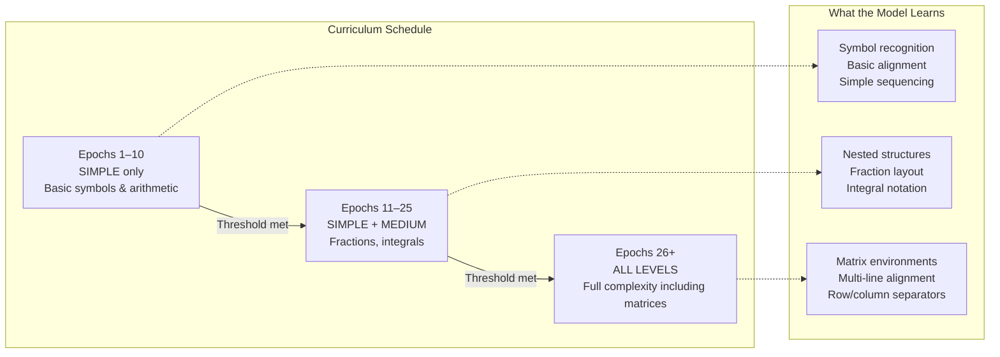

# 4. Curriculum Learning

## Overview

**Curriculum learning** is a training strategy inspired by how humans learn: start with easy examples and gradually introduce harder ones. In TAMER, this means training the model on simple mathematical expressions first (like `2 + 3` or `x^2`), then progressing to medium-complexity formulas (like `\frac{a}{b}` or `\int_0^1 f(x) dx`), and finally tackling the most complex expressions (like multi-line aligned equations and nested matrices).

The intuition is compelling: if you give a randomly initialized model a 5×5 matrix with aligned columns, it has no hope of producing the correct LaTeX. But if it has already learned to recognize individual numbers, then fractions, then simple matrices, it has a foundation to build on. Curriculum learning provides this structured progression.

---

## 4.1 Why Curriculum Learning Helps

Without curriculum learning, the model encounters the full difficulty distribution from epoch 1. At the start of training, the model's parameters are random — its predictions are essentially noise. For a simple expression like `x + 1`, there's a reasonable chance that the model will accidentally produce something close to the correct output, receive a useful gradient signal, and start learning. But for a complex expression like:

```latex
\begin{aligned}
a_{11} x_1 + a_{12} x_2 &= b_1 \\
a_{21} x_1 + a_{22} x_2 &= b_2
\end{aligned}
```

The model's random output has virtually zero overlap with the correct LaTeX. The loss is maximal, but the gradient is essentially uniform — "everything is wrong, update everything equally." This provides very little useful learning signal.

By contrast, when the model has already learned to recognize `x_1`, `+`, `=`, and basic symbols, the loss on complex expressions becomes more informative. The model can correctly predict many individual tokens even if the overall structure is wrong, providing focused gradient signals on the structural tokens it doesn't yet understand.

### Theoretical Justification

Curriculum learning was formalized by Bengio et al. (2009), who showed that:
1. Training on easier examples first leads to faster convergence
2. The model finds better local minima when guided by a curriculum
3. The training loss surface is smoother near easy examples, making optimization easier

In the context of math OCR, "easy" and "hard" have a natural interpretation in terms of LaTeX structure complexity.

---

## 4.2 Complexity Levels in TAMER

TAMER defines three complexity levels:

| Level | Description | Typical Examples | Token Count Range |
|-------|-------------|------------------|-------------------|
| **Simple** | Basic arithmetic, single symbols | `2+3`, `x^2`, `\alpha` | 1–15 |
| **Medium** | Fractions, integrals, subscripts | `\frac{a}{b}`, `\int_0^1 x dx` | 10–50 |
| **Complex** | Matrices, aligned equations, nested structures | `\begin{pmatrix}...`, multi-line | 40–150 |

### How Complexity Is Determined

The `get_complexity()` function in `latex_normalizer.py` analyzes the LaTeX string and computes a complexity score based on structural indicators:

```python
def get_complexity(latex: str) -> str:
    score = 0

    # Fractions add complexity (each \frac adds nesting)
    score += latex.count(r"\frac") * 2

    # Square roots add moderate complexity
    score += latex.count(r"\sqrt")

    # Superscripts and subscripts add a little
    score += latex.count("^")
    score += latex.count("_")

    # Environment markers add significant complexity
    score += latex.count(r"\begin") * 5
    score += latex.count(r"\end") * 5

    # Row separators in matrices
    score += latex.count(r"\\") * 3

    # Column separators
    score += latex.count("&") * 2

    # Braces indicate nesting depth
    score += latex.count("{") // 2  # Approximate nesting depth

    # Total token count as a proxy
    token_count = len(latex.split())  # Rough estimate
    score += token_count // 5

    # Classify
    if score <= 5:
        return "simple"
    elif score <= 15:
        return "medium"
    else:
        return "complex"
```

The scoring heuristic is not perfect — it can over-count complexity for expressions with many simple subscripts (like `a_1 + a_2 + a_3 + ...`) and under-count for visually complex but syntactically simple expressions. However, it provides a reasonable approximation that works well in practice.

### Examples

| LaTeX | Score | Level |
|-------|-------|-------|
| `x + 1` | 1 (`+`) + 0 (no structure) = 1 | Simple |
| `x^2 + y^2 = r^2` | 1 (`^`) + 1 (`^`) + 1 (`=`) = 3 | Simple |
| `\frac{a}{b}` | 2 (`\frac`) + 1 (`{`/`}`) = 3 | Simple/Medium |
| `\int_0^1 f(x) dx` | 1 (`_`) + 1 (`^`) = 2 + int | Medium |
| `\begin{pmatrix} a & b \\ c & d \end{pmatrix}` | 10 (`\begin`×2) + 3 (`\\`) + 2 (`&`×2) = 15+ | Complex |

---

## 4.3 The Curriculum Schedule



The curriculum schedule defines when each complexity level is introduced:

- **Epochs 1–10**: Only **simple** samples are included in the training set. The model learns basic symbol-to-LaTeX mapping without the distraction of complex structures.
- **Epochs 11–25**: **Simple + medium** samples are included. The model begins learning fractions, integrals, and other moderately complex structures, while still reviewing simple expressions.
- **Epochs 26+**: **All complexity levels** are included. The model is exposed to the full training distribution, including matrices, aligned equations, and deeply nested expressions.

### Why These Thresholds?

- **10 epochs of simple data**: At a learning rate of ~3e-4 with batch size 864, 10 epochs provides roughly 10 × (simple_samples / 864) gradient steps — enough for the model to converge on basic symbol recognition.
- **15 epochs of medium data**: Medium expressions require learning structural patterns (fraction bars, integral signs) that build on the symbol foundation. 15 epochs provides sufficient exposure.
- **Unlimited complex data**: The model trains on the full distribution until convergence or the maximum epoch limit.

### When to Transition Early

In practice, the transition can be triggered early if the validation loss plateaus. If the model has effectively learned the simple distribution before epoch 10, there's no point continuing to train on easy examples. The curriculum implementation can include a **loss plateau detector** that advances to the next stage when the validation loss stops improving.

---

## 4.4 How Curriculum Rebuilds the DataLoader

When the curriculum advances to a new stage, the training DataLoader must be rebuilt to include the newly available samples. This is handled by the `_rebuild_train_loader_for_curriculum()` method:

```python
def _rebuild_train_loader_for_curriculum(self, epoch: int):
    # Determine which complexity levels are available
    if epoch < 10:
        allowed = {"simple"}
    elif epoch < 25:
        allowed = {"simple", "medium"}
    else:
        allowed = {"simple", "medium", "complex"}

    # Filter training samples by complexity
    filtered_samples = [
        s for s in self.all_train_samples
        if s.complexity in allowed
    ]

    # Create new dataset and DataLoader
    train_dataset = MathDataset(filtered_samples, self.tokenizer, self.transform)
    self.train_loader = DataLoader(
        train_dataset,
        batch_sampler=MultiDatasetBatchSampler(filtered_samples, ...),
        num_workers=48,
        pin_memory=True,
        persistent_workers=True,
        prefetch_factor=4,
    )
```

### Important: Validation Set Is Never Filtered

The validation DataLoader always includes **all complexity levels**, regardless of the current curriculum stage. This is crucial for two reasons:

1. **Monitoring true performance**: If we only validated on simple expressions, we wouldn't know whether the model was actually improving on harder ones.
2. **Early stopping**: The validation loss must reflect the full distribution to make meaningful early stopping decisions.

---

## 4.5 All Four Datasets Contribute at Every Stage

A critical design decision: **every dataset contributes samples at every curriculum stage**. Even during the "simple" stage, the model sees simple expressions from CROHME, HME100K, Im2LaTeX, and MathWriting.

Why is this important?

1. **Diversity within simplicity**: A simple expression from HME100K (messy handwriting) looks very different from a simple expression from Im2LaTeX (printed). Both teach the model that `2 + 3` and `2+3` represent the same LaTeX, regardless of visual appearance.
2. **Preventing domain shift**: If the simple stage only used Im2LaTeX (which has the most simple expressions), the model would overfit to printed formulas and struggle when messy handwriting appears in later stages.
3. **Balanced feature learning**: The encoder must learn robust visual features from the start. Exposing it to diverse handwriting styles, even for simple expressions, builds this robustness early.

The **MultiDatasetBatchSampler** ensures balanced representation across datasets within each complexity level, using temperature-based sampling (covered in [[5. The MathDataset and DataLoader]]).

---

## 4.6 Temperature Sampling and Dataset Mixing

Even within a single complexity level, the four datasets have different numbers of samples. MathWriting dominates with ~230K samples, while CROHME contributes only ~30K. Without intervention, the model would see far more MathWriting samples than CROHME samples, potentially biasing it toward MathWriting's distribution.

Temperature sampling controls the mixing ratio:

```python
# Temperature-based sampling weights
# Higher temperature = more uniform distribution across datasets
# Lower temperature = more proportional to dataset size
temperature = 2.0

weights = {}
for name, count in dataset_counts.items():
    weights[name] = count ** (1.0 / temperature)

# Normalize
total = sum(weights.values())
weights = {k: v / total for k, v in weights.items()}
```

With `temperature=2.0`, the sampling becomes more uniform — each dataset gets roughly equal representation regardless of size. This ensures CROHME's high-quality competition data isn't drowned out by MathWriting's volume.

---

## 4.7 Why Curriculum Works for Math OCR

Math OCR is particularly well-suited for curriculum learning because mathematical expressions have a **natural complexity hierarchy**:

1. **Symbols are atomic**: Recognizing `2` or `+` is easier than recognizing `\frac{2}{3}` because the latter requires understanding spatial relationships between multiple symbols.
2. **Structures compose**: A matrix is made of rows (`\\`), columns (`&`), and individual entries. Learning entries first, then row/column structure, then full matrices is a natural progression.
3. **Visual complexity correlates with syntactic complexity**: A simple expression like `x + 1` is visually simple (few ink strokes, clear spacing) and syntactically simple (few LaTeX tokens). This correlation makes visual complexity a good proxy for training difficulty.

In natural language, curriculum learning is harder to apply because "easy" and "hard" sentences are less clearly delineated. But in math OCR, the structural properties of LaTeX provide a natural and effective curriculum.

---

## 4.8 Curriculum and the Loss Function

The curriculum interacts with the loss function in important ways:

- **Simple stage**: Label-smoothed cross-entropy is sufficient. The model is learning basic patterns and doesn't need structural token weighting.
- **Medium stage**: Structure-aware loss becomes beneficial as the model encounters `\frac`, `\int`, and other structural commands that require special attention.
- **Complex stage**: Structure-aware loss is essential. Without it, the model would treat `\\` and `&` as ordinary tokens, leading to frequent matrix structure errors.

The curriculum schedule for the loss function can be:
- Epochs 1–10: `LabelSmoothedCELoss` only
- Epochs 11+: `LabelSmoothedCELoss + StructureAwareLoss` (combined with a weighting factor)

---

## Key Takeaways

- **Curriculum learning trains on easy examples first**, building a foundation before tackling complex structures.
- **Three complexity levels** — simple, medium, complex — determined by counting structural tokens in the LaTeX string.
- **The schedule advances at epochs 10 and 25**, progressively adding harder samples to the training set.
- **All datasets contribute at every stage**, ensuring diversity even in simple mode.
- **Temperature sampling** prevents large datasets from drowning out small ones.
- **The DataLoader is rebuilt** when the curriculum advances, but the validation set always includes all complexities.
- **Math OCR is ideal for curriculum learning** because LaTeX has a natural complexity hierarchy.
- **The loss function evolves with the curriculum**, adding structure-aware weighting as complex expressions appear.
