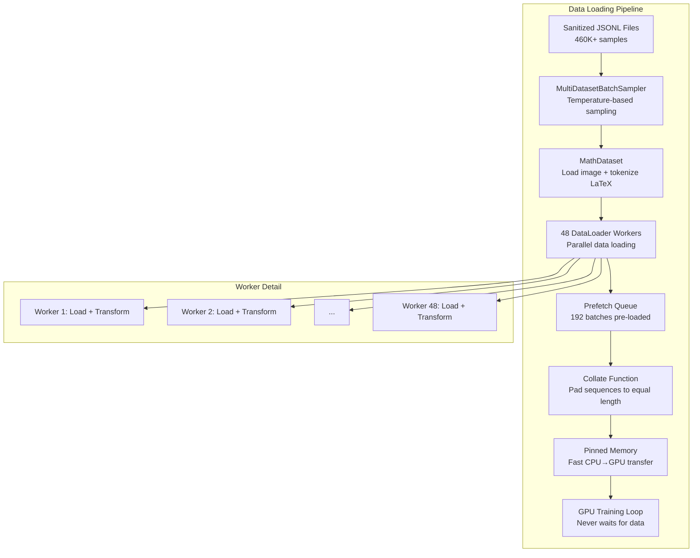

# 5. The MathDataset and DataLoader

## Overview

The `MathDataset` and `DataLoader` are the final components of the data pipeline — the bridge between the sanitized JSONL files on disk and the GPU tensors consumed by the model during training. Getting this bridge right is critical for training efficiency: a poorly configured DataLoader can leave the GPU starved for data, wasting expensive compute time, while an efficient DataLoader keeps the GPU fed at all times.

TAMER uses aggressive optimization settings for the DataLoader — 48 workers, persistent workers, prefetching, and pinned memory — to ensure that data loading never becomes the bottleneck. Combined with a custom `MultiDatasetBatchSampler` for balanced dataset mixing, the data loading pipeline is designed to saturate the GPU's compute capacity.

---

## 5.1 MathDataset: PyTorch Dataset Subclass

The `MathDataset` class is a standard PyTorch `Dataset` subclass that loads and preprocesses individual samples. Each sample consists of an image and its corresponding LaTeX string, stored in a JSONL file.

### Class Structure

```python
class MathDataset(torch.utils.data.Dataset):
    def __init__(
        self,
        samples: list[dict],  # From sanitized JSONL
        tokenizer: LaTeXTokenizer,
        transform: albumentations.Compose,
    ):
        self.samples = samples
        self.tokenizer = tokenizer
        self.transform = transform

    def __len__(self) -> int:
        return len(self.samples)

    def __getitem__(self, idx: int) -> dict:
        sample = self.samples[idx]
        # Load image, apply transform, tokenize LaTeX
        ...
```

---

## 5.2 The `__getitem__` Method

The `__getitem__` method is called by the DataLoader for each sample in the batch. It performs three operations:

### Step 1: Load the Image

```python
image = load_image(sample["image"])  # Returns numpy array (H, W, C)
```

The image is loaded using PIL and converted to a numpy array. If the image is grayscale (single channel), it is broadcast to 3 channels to match the Swin Transformer's expected input format.

### Step 2: Apply the Albumentations Transform

```python
transformed = self.transform(image=image)
image = transformed["image"]  # Returns tensor (C, H, W)
```

The transform pipeline (covered in the augmentation section) resizes the image to the model's expected input size (384×384), applies normalization, and optionally adds data augmentation during training.

### Step 3: Tokenize the LaTeX String

```python
ids = self.tokenizer.encode(sample["latex"])  # List[int]
ids = [self.tokenizer.sos_id] + ids + [self.tokenizer.eos_id]
```

The LaTeX string is tokenized and encoded into a list of integer IDs, with SOS and EOS tokens prepended and appended respectively.

### Return Value

```python
return {
    "image": image,        # Tensor, shape (3, 384, 384)
    "ids": torch.tensor(ids, dtype=torch.long),  # Tensor, shape (L,)
}
```

---

## 5.3 The Blank Image Fallback

Image loading can fail at runtime even after sanitization — for example, if a file is deleted between sanitization and training, or if a network filesystem drops a connection. Rather than crashing the training loop, `__getitem__` returns a **blank white canvas** as a fallback:

```python
def load_image(path: str) -> np.ndarray:
    try:
        with Image.open(path) as img:
            img = img.convert("RGB")
            return np.array(img)
    except Exception:
        # Return blank white canvas as fallback
        return np.ones((384, 384, 3), dtype=np.uint8) * 255
```

The blank image produces a near-random loss (the model has no meaningful signal to learn from), but it doesn't crash the training run. Over thousands of batches, a handful of blank images have negligible impact on the overall training dynamics.

> **Tip**: Some implementations use a `collate_fn` that detects blank images and replaces them, or use `worker_init_fn` to set different random seeds per worker for the augmentation pipeline. The blank fallback is the simplest robust solution.

---

## 5.4 The Collate Function: Batch Padding

Within a batch, different samples have different sequence lengths (different LaTeX expressions produce different numbers of tokens). PyTorch's `DataLoader` requires all tensors in a batch to have the same shape. The **collate function** handles this by padding shorter sequences with the PAD token (ID 0).

### How `pad_sequence` Works

PyTorch's `pad_sequence` function takes a list of tensors with different lengths and returns a single padded tensor:

```python
from torch.nn.utils.rnn import pad_sequence

# Input: three sequences of different lengths
sequences = [
    torch.tensor([1, 45, 12, 8, 2]),       # Length 5
    torch.tensor([1, 45, 12, 8, 13, 9, 2]), # Length 7
    torch.tensor([1, 23, 2]),                # Length 3
]

# Output: padded tensor
padded = pad_sequence(sequences, batch_first=True, padding_value=0)
# Shape: (3, 7)
# [
#   [1, 45, 12,  8,  2,  0,  0],
#   [1, 45, 12,  8, 13,  9,  2],
#   [1, 23,  2,  0,  0,  0,  0],
# ]
```

The `batch_first=True` argument ensures the output shape is `(batch_size, max_seq_len)` rather than `(max_seq_len, batch_size)`. The `padding_value=0` uses the PAD token ID.

### The Custom Collate Function

```python
def collate_fn(batch: list[dict]) -> dict:
    images = torch.stack([item["image"] for item in batch])
    ids_list = [item["ids"] for item in batch]
    ids_padded = pad_sequence(ids_list, batch_first=True, padding_value=0)

    return {
        "image": images,       # Shape: (B, 3, 384, 384)
        "ids": ids_padded,     # Shape: (B, L_max)
    }
```

The `torch.stack` for images works because all images have been resized to the same dimensions by the transform pipeline. Only the text sequences require padding.

---

## 5.5 DataLoader Configuration for Training



### Training DataLoader Settings

```python
train_loader = DataLoader(
    train_dataset,
    batch_sampler=multi_dataset_sampler,  # Custom sampler
    num_workers=48,           # 48 parallel data-loading processes
    pin_memory=True,          # Pin tensors for faster GPU transfer
    persistent_workers=True,  # Workers survive between epochs
    prefetch_factor=4,        # Each worker pre-loads 4 batches
    collate_fn=collate_fn,    # Custom padding function
)
```

Let's examine each setting in detail:

#### `batch_size=864`

The batch size of 864 is unusually large, but it's calculated to maximize GPU utilization on a T4/A100 GPU with BFloat16 AMP. At 384×384 resolution with the Swin Transformer, each image produces a large activation tensor. With BFloat16, the memory per sample is halved, allowing 864 samples per batch.

Why 864 specifically? It's 864 = 2⁵ × 3³, which factors evenly into sub-batches for gradient accumulation if needed, and is close to the maximum that fits in GPU memory with the given model configuration.

#### `num_workers=48`

Each DataLoader worker is a separate Python process that loads and transforms data in parallel with the GPU. With 48 workers, the CPU can prepare 48 batches simultaneously while the GPU processes the current batch.

Why 48? On a machine with 4 CPUs × 12 cores = 48 logical cores, setting `num_workers` equal to the number of cores maximizes CPU utilization without excessive context switching overhead.

#### `pin_memory=True`

When `pin_memory=True`, the DataLoader allocates tensors in **pinned (page-locked) memory** on the CPU. Pinned memory can be transferred to the GPU much faster than regular memory because the GPU's DMA (Direct Memory Access) engine can read from it directly without an intermediate copy.

The speedup is significant: pinned memory transfers are typically **2–3× faster** than non-pinned transfers, especially for large tensors like image batches.

#### `persistent_workers=True`

By default, DataLoader workers are spawned at the start of each epoch and destroyed at the end. With `persistent_workers=True`, workers survive between epochs, avoiding the overhead of process creation (which can take several seconds per worker × 48 workers = significant delay).

This is especially important with curriculum learning, where the DataLoader is rebuilt when the complexity stage changes. Persistent workers reduce the overhead of these rebuilds.

#### `prefetch_factor=4`

Each worker pre-loads 4 batches ahead of what the training loop has requested. With 48 workers, this means:

```
48 workers × 4 batches = 192 batches pre-loaded in RAM at all times
```

At batch size 864, each batch is roughly:
- Images: 864 × 3 × 384 × 384 × 2 bytes (BFloat16) ≈ 760 MB
- IDs: 864 × 150 × 4 bytes (int64) ≈ 0.5 MB

So 192 batches would require ~146 GB of RAM. In practice, the prefetch queue is managed as a circular buffer, so the actual RAM usage is much lower — but the key insight is that with `prefetch_factor=4`, the GPU should **never** wait for data.

---

## 5.6 Validation DataLoader Settings

The validation DataLoader uses less aggressive settings because it doesn't need to saturate the GPU:

```python
val_loader = DataLoader(
    val_dataset,
    batch_size=432,       # Half of training batch size
    shuffle=False,         # Deterministic order for reproducibility
    num_workers=48,        # Same number of workers
    pin_memory=True,
    persistent_workers=True,
    prefetch_factor=2,     # Reduced prefetch (96 batches)
    collate_fn=collate_fn,
    drop_last=False,       # Include all samples, even partial batch
)
```

- **batch_size=432**: Smaller because we don't need to maximize GPU utilization during validation — we just need to compute the loss and metrics accurately.
- **shuffle=False**: Deterministic order makes validation results reproducible and allows per-sample analysis.
- **drop_last=False**: We evaluate on every sample, even if the last batch is smaller than 432.

---

## 5.7 The MultiDatasetBatchSampler

The `MultiDatasetBatchSampler` is a custom batch sampler that ensures each batch contains a balanced mix of samples from all four datasets. It uses **temperature-based sampling** to control the mixing ratio.

### How It Works

```python
class MultiDatasetBatchSampler(Sampler):
    def __init__(self, samples, batch_size, temperature=2.0, seed=42):
        self.batch_size = batch_size
        self.temperature = temperature

        # Group samples by dataset
        self.dataset_indices = defaultdict(list)
        for i, sample in enumerate(samples):
            self.dataset_indices[sample["dataset_name"]].append(i)

        # Compute sampling weights using temperature scaling
        self.weights = {}
        for name, indices in self.dataset_indices.items():
            count = len(indices)
            self.weights[name] = count ** (1.0 / temperature)

        # Normalize weights
        total = sum(self.weights.values())
        self.weights = {k: v / total for k, v in self.weights.items()}

    def __iter__(self):
        while True:
            batch = []
            for _ in range(self.batch_size):
                # Sample a dataset according to weights
                dataset_name = random.choices(
                    list(self.weights.keys()),
                    weights=list(self.weights.values()),
                )[0]
                # Sample an index from that dataset
                idx = random.choice(self.dataset_indices[dataset_name])
                batch.append(idx)
            yield batch
```

### Temperature Effect

With `temperature=1.0`, sampling is proportional to dataset size (MathWriting dominates). With `temperature=∞`, sampling is uniform across datasets. `temperature=2.0` is a good middle ground that gives smaller datasets (like CROHME) more representation than their size would warrant, without ignoring the larger datasets.

---

## 5.8 Stratified Train/Val Split

The training and validation sets are split **per-dataset** with a 90/10 ratio and `seed=42`:

```python
from sklearn.model_selection import train_test_split

train_samples, val_samples = [], []
for dataset_name in ["crohme", "hme100k", "im2latex", "mathwriting"]:
    dataset_samples = [s for s in all_samples if s["dataset_name"] == dataset_name]
    train, val = train_test_split(
        dataset_samples,
        test_size=0.1,
        random_state=42,
    )
    train_samples.extend(train)
    val_samples.extend(val)
```

Why stratify by dataset? If we randomly split the combined dataset, we might end up with all CROHME samples in the training set and none in validation. By splitting per-dataset, we ensure that every dataset is represented in both training and validation, providing a more meaningful validation signal.

---

## 5.9 Why `drop_last=True` for Training

During training, `drop_last=True` ensures that every batch has exactly `batch_size=864` samples. This is important because:

1. **Consistent gradient magnitude**: A partial batch (say, 400 samples) produces a gradient with different magnitude than a full batch, causing instability in the optimization trajectory.
2. **BatchNorm behavior**: If the model uses batch normalization (TAMER uses LayerNorm, but some variants use BatchNorm), batch statistics computed on 400 samples differ from those computed on 864 samples.
3. **Memory optimization**: The GPU allocates memory based on the maximum batch size. A partial batch doesn't save memory — the allocation is the same — but it wastes compute.

The downside is that we lose the last partial batch of each epoch, but with 460K samples and batch size 864, this is at most 863 samples — less than 0.2% of the data.

---

## Key Takeaways

- **MathDataset** loads images, applies transforms, and tokenizes LaTeX — the standard PyTorch Dataset pattern.
- **The collate function** pads variable-length sequences using `pad_sequence` so all samples in a batch have the same shape.
- **Aggressive DataLoader settings** (48 workers, prefetch_factor=4, pin_memory=True) ensure the GPU never waits for data.
- **192 batches are pre-loaded** in RAM at all times (48 workers × 4 prefetch), providing a massive buffer against data loading latency.
- **MultiDatasetBatchSampler** uses temperature-based sampling to balance representation across datasets.
- **Stratified 90/10 split** per dataset ensures all datasets appear in both training and validation.
- **Blank image fallback** prevents crashes from missing or corrupt images.
- **drop_last=True** for training ensures consistent batch sizes and gradient magnitudes.
