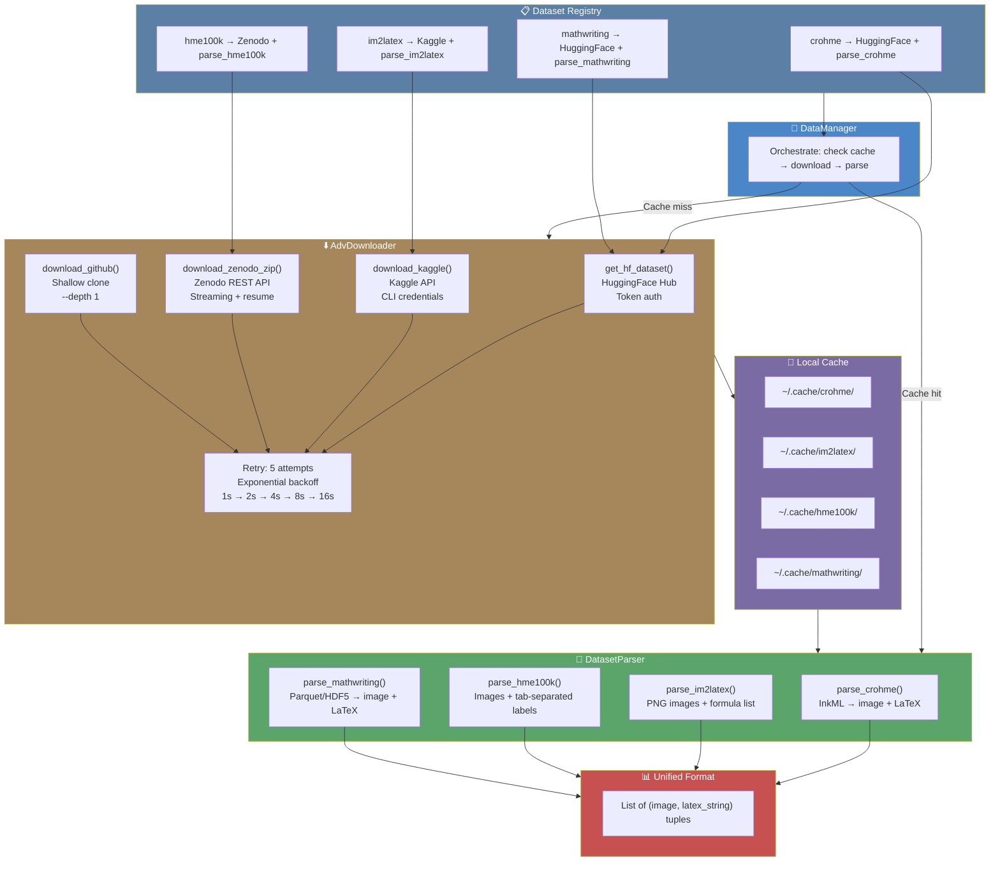

# 8. The Downloader and Dataset Registry

## Overview

The TAMER OCR project trains on data from multiple sources — CROHME, Im2LaTeX, HME100K, and MathWriting — each with different hosting platforms, file formats, and access requirements. The downloader module and dataset registry form the infrastructure that makes this multi-source data acquisition possible. Rather than requiring the user to manually download, extract, and format each dataset, the downloader automates the entire process: fetching data from HuggingFace, Kaggle, Zenodo, or GitHub; handling authentication; retrying on failure; and parsing each format into the unified representation that the training pipeline expects. This note covers the downloader module, the dataset registry, the parser module, and the data manager that orchestrates everything.

## The Downloader Module

The downloader module consists of two files: `downloader.py` and `advanced_downloader.py`. The base `downloader.py` provides simple download utilities (URL fetching, file extraction, checksum verification), while `advanced_downloader.py` implements the `AdvDownloader` class with platform-specific download methods.

### AdvDownloader: Multi-Source Dataset Downloading

The `AdvDownloader` class is the central download orchestrator. It provides methods for downloading from four different platforms, each with its own protocol and authentication requirements:

```python
class AdvDownloader:
    """Advanced multi-source dataset downloader with retry and resume."""
    
    def __init__(self, config):
        self.config = config
        self.cache_dir = Path(config.data_dir) / ".cache"
        self.cache_dir.mkdir(parents=True, exist_ok=True)
```

The downloader maintains a local cache directory (`.cache/` within the data directory) where downloaded files are stored. This cache prevents re-downloading data on subsequent runs, which is especially important for large datasets on bandwidth-limited connections.

### HuggingFace: get_hf_dataset()

HuggingFace Hub is the primary source for several TAMER datasets, including MathWriting and formatted versions of CROHME. The `get_hf_dataset()` method handles HuggingFace-specific authentication and downloading:

```python
def get_hf_dataset(self, repo_id, split=None, token=None):
    """Download a dataset from HuggingFace Hub.
    
    Args:
        repo_id: HuggingFace repository ID (e.g., "facebook/mathwriting")
        split: Optional split filter (e.g., "train", "validation")
        token: HuggingFace API token for gated datasets
    
    Returns:
        Path to the downloaded dataset directory
    """
    from datasets import load_dataset
    token = token or self.config.hf_token
    dataset = load_dataset(
        repo_id,
        split=split,
        token=token,
        cache_dir=str(self.cache_dir),
    )
    return dataset
```

The HuggingFace `datasets` library handles streaming, caching, and format conversion internally. The token parameter supports **gated datasets** that require authentication (accepting terms of use on the HuggingFace website before downloading). When `config.hf_token` is empty (offline mode), this method is skipped entirely.

### Kaggle: download_kaggle()

Kaggle hosts the Im2LaTeX dataset and competition data. The `download_kaggle()` method uses the Kaggle CLI and API:

```python
def download_kaggle(self, dataset_slug, path=None):
    """Download a dataset from Kaggle.
    
    Args:
        dataset_slug: Kaggle dataset slug (e.g., "xainano/handwrittenmath")
        path: Local path to save the dataset
    
    Requires:
        KAGGLE_USERNAME and KAGGLE_KEY environment variables,
        or ~/.kaggle/kaggle.json credentials file.
    """
    import kaggle
    kaggle.api.authenticate()
    kaggle.api.dataset_download_files(
        dataset_slug,
        path=path or str(self.cache_dir / dataset_slug.replace("/", "_")),
        unzip=True,
    )
```

Kaggle authentication requires either environment variables (`KAGGLE_USERNAME`, `KAGGLE_KEY`) or a credentials file at `~/.kaggle/kaggle.json`. The method automatically unzips the downloaded archive. On Kaggle notebooks, the data is typically already available in the `/kaggle/input/` directory, so this method detects and skips the download when the data is found locally.

### Zenodo: download_zenodo_zip()

Zenodo is a general-purpose research data repository that hosts some mathematical OCR datasets. The `download_zenodo_zip()` method implements streaming download with progress reporting:

```python
def download_zenodo_zip(self, record_id, filename=None):
    """Download a dataset from Zenodo.
    
    Args:
        record_id: Zenodo record ID
        filename: Optional specific file to download from the record
    
    Returns:
        Path to the downloaded file
    """
    url = f"https://zenodo.org/api/records/{record_id}"
    response = requests.get(url)
    data = response.json()
    
    # Find the file in the record's file list
    for file_info in data["files"]:
        if filename is None or file_info["key"] == filename:
            download_url = file_info["links"]["self"]
            self._streaming_download(download_url, file_info["key"])
```

The Zenodo API provides metadata about each record, including a list of associated files with download links. The method uses **streaming download** (`requests.get(stream=True)`) with a progress bar, which is important for large datasets that would not fit in memory all at once.

### GitHub: download_github()

Some auxiliary data (tokenizers, evaluation scripts) is hosted on GitHub. The `download_github()` method uses shallow cloning:

```python
def download_github(self, repo_url, branch="main"):
    """Shallow-clone a GitHub repository for data.
    
    Args:
        repo_url: GitHub repository URL
        branch: Branch to clone (default: main)
    """
    target_dir = self.cache_dir / repo_url.split("/")[-1].replace(".git", "")
    if target_dir.exists():
        return  # Already cloned
    subprocess.run([
        "git", "clone", "--depth", "1", "-b", branch, repo_url,
        str(target_dir)
    ], check=True)
```

Using `--depth 1` performs a **shallow clone** that downloads only the latest commit, not the entire history. This dramatically reduces the download size for repositories with long histories.

## The Retry Strategy

Network downloads are inherently unreliable — connections drop, servers return errors, and rate limits can be hit. The `AdvDownloader` implements a **retry strategy with exponential backoff**:

```python
def _retry_download(self, download_fn, max_retries=5):
    """Execute a download function with retries and exponential backoff."""
    for attempt in range(max_retries):
        try:
            return download_fn()
        except (requests.ConnectionError, requests.Timeout, 
                requests.HTTPError) as e:
            wait_time = 2 ** attempt  # 1, 2, 4, 8, 16 seconds
            print(f"Download failed (attempt {attempt+1}/{max_retries}): {e}")
            print(f"Retrying in {wait_time}s...")
            time.sleep(wait_time)
    raise RuntimeError(f"Download failed after {max_retries} retries")
```

The exponential backoff (1s, 2s, 4s, 8s, 16s) gives the server time to recover from transient errors while not wasting too much time on persistent failures. After 5 retries (totaling 31 seconds of wait time), the download is considered permanently failed.

## Resume Capability

For very large datasets (MathWriting is several GB), the downloader supports **resuming interrupted downloads**. This is implemented by checking the size of the partially downloaded file and using HTTP range requests to continue from where the download left off:

```python
def _streaming_download(self, url, filename, chunk_size=8192):
    """Download a file with resume support."""
    filepath = self.cache_dir / filename
    mode = "ab"  # Append mode for resume
    headers = {}
    
    if filepath.exists():
        existing_size = filepath.stat().st_size
        headers["Range"] = f"bytes={existing_size}-"
        print(f"Resuming download from {existing_size} bytes")
    else:
        mode = "wb"
    
    response = requests.get(url, headers=headers, stream=True)
    with open(filepath, mode) as f:
        for chunk in response.iter_content(chunk_size=chunk_size):
            f.write(chunk)
```

The `Range: bytes=N-` HTTP header tells the server to skip the first N bytes and send the rest. The file is opened in append mode (`"ab"`) so the new data is concatenated to the existing partial download. If the server does not support range requests, the download starts from the beginning.

## The datasets_registry.py

The `datasets_registry.py` file provides a **mapping** from dataset names to their download sources and parser functions. This decouples the "what" (which datasets to use) from the "how" (where to get them and how to parse them):

```python
DATASET_REGISTRY = {
    "crohme": {
        "source": "huggingface",
        "repo_id": "project-groundlight/crohme",
        "parser": "parse_crohme",
        "format": "inkml",
        "type": "handwritten",
    },
    "im2latex": {
        "source": "kaggle",
        "dataset_slug": "xainano/handwrittenmath",
        "parser": "parse_im2latex",
        "format": "image+formula",
        "type": "printed",
    },
    "hme100k": {
        "source": "zenodo",
        "record_id": "5123489",
        "parser": "parse_hme100k",
        "format": "image+label",
        "type": "handwritten",
    },
    "mathwriting": {
        "source": "huggingface",
        "repo_id": "facebook/mathwriting",
        "parser": "parse_mathwriting",
        "format": "hdf5",
        "type": "handwritten",
    },
}
```

Each entry specifies:
- **source**: The platform to download from (huggingface, kaggle, zenodo, github, or local)
- **Download parameters**: repo_id, dataset_slug, record_id, or path
- **parser**: The name of the parsing function in the parser module
- **format**: The file format, which determines how the data is structured
- **type**: Whether the data is printed, handwritten, or mixed — used for curriculum ordering

The registry makes it trivial to add new datasets: just add an entry with the appropriate source, parser, and metadata.

## The Parser Module: DatasetParser

The `parser.py` module implements the `DatasetParser` class with methods for each dataset format. Each parser method reads the raw files and converts them into a standardized format: a list of `(image_path_or_array, latex_string)` tuples.

### parse_crohme(): Parsing CROHME .inkml Files

CROHME uses the InkML format, an XML-based representation of digital ink (stroke data). The parser extracts the stroke trajectories and renders them to images, then pairs each image with its LaTeX annotation:

```python
def parse_crohme(self, inkml_dir):
    """Parse CROHME .inkml files into image-LaTeX pairs.
    
    InkML files contain stroke data (x, y, t coordinates) that must
    be rendered to images. The LaTeX annotation is in the <annotation>
    tag with type="truth".
    """
    samples = []
    for inkml_path in Path(inkml_dir).glob("**/*.inkml"):
        tree = ET.parse(inkml_path)
        # Extract LaTeX from annotation
        latex = tree.find('.//annotation[@type="truth"]').text
        # Extract strokes and render to image
        strokes = self._extract_strokes(tree)
        image = self._render_strokes(strokes, size=(384, 384))
        samples.append((image, latex))
    return samples
```

### parse_im2latex(): Parsing Im2LaTeX Formula Images

Im2LaTeX provides pre-rendered images of LaTeX formulas with a matching formula file:

```python
def parse_im2latex(self, data_dir):
    """Parse Im2LaTeX dataset: images + formula list."""
    samples = []
    formulas = self._load_formulas(Path(data_dir) / "im2latex_formulas.lst")
    with open(Path(data_dir) / "im2latex_train_filter.lst") as f:
        for line in f:
            idx, image_name = line.strip().split()
            image_path = Path(data_dir) / "formula_images" / f"{image_name}.png"
            samples.append((image_path, formulas[int(idx)]))
    return samples
```

### parse_hme100k(): Parsing HME100K Label Files

HME100K uses a simple text-based label format where each line contains an image path and its LaTeX label:

```python
def parse_hme100k(self, data_dir):
    """Parse HME100K dataset: image paths + label file."""
    samples = []
    label_file = Path(data_dir) / "labels.txt"
    with open(label_file) as f:
        for line in f:
            image_name, latex = line.strip().split("\t")
            image_path = Path(data_dir) / "images" / image_name
            samples.append((image_path, latex))
    return samples
```

### parse_mathwriting(): Parsing MathWriting HDF5/Parquet

MathWriting is distributed through HuggingFace as Parquet files (or can be loaded as HDF5). The parser uses the HuggingFace `datasets` library:

```python
def parse_mathwriting(self, data_dir=None, hf_dataset=None):
    """Parse MathWriting dataset from HuggingFace or local files."""
    if hf_dataset is not None:
        # Load from HuggingFace datasets
        for item in hf_dataset:
            image = item["image"]  # PIL Image
            latex = item["latex"]
            samples.append((image, latex))
    else:
        # Load from local HDF5/Parquet
        # ... local loading logic
    return samples
```

## Why the Project Supports Both Online and Offline Modes

Training on Kaggle requires **offline compatibility** — internet access is often restricted during competition notebook execution. The TAMER project handles this through a two-tier approach:

1. **Online mode**: When internet is available, the downloader fetches data from HuggingFace, Kaggle, Zenodo, or GitHub. The data is cached locally for future use.
2. **Offline mode**: When internet is not available (or `config.hf_token=""`), the project expects data to be pre-loaded in the data directory. Kaggle notebooks use the "Add Data" feature to attach datasets, which makes them available at `/kaggle/input/`.

The `data_manager.py` detects which mode to use by checking whether the expected data files exist locally. If they do, downloading is skipped entirely. This design ensures that the same training code works both on a local workstation with internet access and on a Kaggle notebook with pre-attached data.

## The data_manager.py: Orchestrating Downloads and Caching

The `data_manager.py` module sits above the downloader and parser, orchestrating the full data acquisition pipeline:

```python
class DataManager:
    """Orchestrate dataset downloads, caching, and loading."""
    
    def __init__(self, config):
        self.config = config
        self.downloader = AdvDownloader(config)
        self.parser = DatasetParser()
    
    def get_dataset(self, name):
        """Get a dataset by name, downloading if necessary."""
        registry_entry = DATASET_REGISTRY[name]
        local_path = self._get_local_path(name)
        
        if self._is_cached(local_path):
            print(f"[{name}] Using cached data at {local_path}")
        else:
            print(f"[{name}] Downloading...")
            self._download(registry_entry, local_path)
        
        parser_method = getattr(self.parser, registry_entry["parser"])
        return parser_method(local_path)
```

The `DataManager` checks the cache first, downloads only if necessary, and then invokes the appropriate parser. This three-step process (check → download → parse) ensures that data is only downloaded once and is always parsed consistently.

## Three-Stage Data Loading

The data manager supports the **curriculum learning** strategy by organizing datasets into three stages:

1. **Stage 1 — Printed formulas**: Im2LaTeX provides clean, typeset mathematical formulas. These are the easiest for the model to learn, providing a strong foundation for the decoder.
2. **Stage 2 — Clean handwritten**: CROHME and HME100K provide neatly written mathematical expressions. The model learns to handle handwritten strokes while the writing is still relatively clean.
3. **Stage 3 — Messy handwritten**: MathWriting provides diverse, sometimes messy handwritten mathematics. This is the hardest data, introduced last when the model has already learned robust feature extraction.

The data manager ensures that each stage's data is available when the training schedule transitions between stages.

## Download and Parsing Pipeline Diagram



## Summary

The downloader and dataset registry infrastructure is the backbone of the TAMER data pipeline. The `AdvDownloader` provides platform-specific download methods for HuggingFace, Kaggle, Zenodo, and GitHub, with retry logic and resume capability for reliability. The `DATASET_REGISTRY` decouples dataset selection from download and parsing logic, making it easy to add new datasets. The `DatasetParser` handles the diverse file formats (.inkml, images, label files, Parquet/HDF5) and converts them all into the same unified (image, LaTeX) format. The `DataManager` orchestrates the entire pipeline, caching results to avoid redundant downloads. This infrastructure supports both online and offline modes, ensuring the training pipeline works on workstations with internet access and on air-gapped Kaggle notebooks with pre-attached data.
