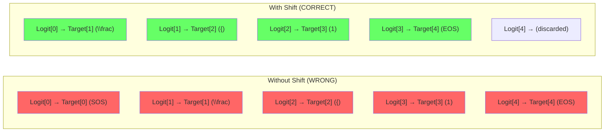
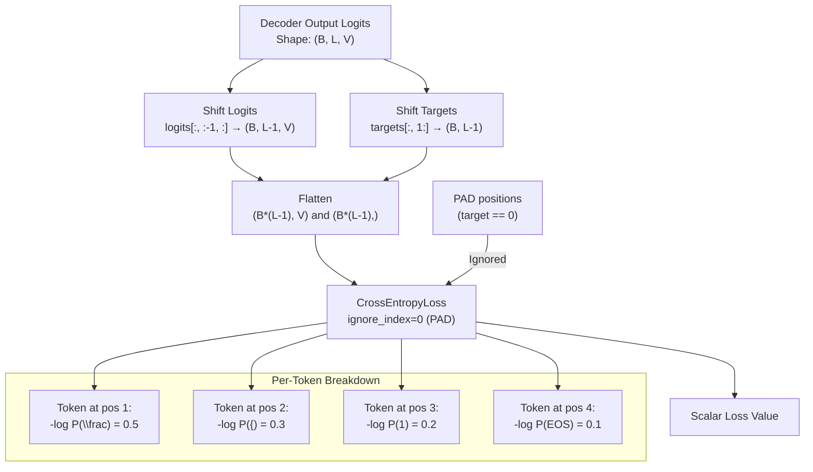

# 1. Cross-Entropy Loss for Sequence Models

## Overview

Cross-entropy loss is the foundation of sequence prediction in TAMER. Every token the decoder generates is a classification decision — "which of the ~522 vocabulary tokens should I output at this position?" — and cross-entropy is the standard loss function for classification. In this note, we explore how cross-entropy is applied to autoregressive sequence models, why the **autoregressive shift** is necessary, how padding tokens are handled, and how cross-entropy connects to the more interpretable metric of **perplexity**.

---

## 1.1 Cross-Entropy: The Core Concept

Cross-entropy measures the dissimilarity between two probability distributions: the model's predicted distribution and the true (target) distribution. For a single token prediction:

$$H(p, q) = -\sum_{k=1}^{K} p(k) \log q(k)$$

Where:
- $p$ is the true distribution (a one-hot vector in classification)
- $q$ is the model's predicted distribution (the softmax output)
- $K$ is the vocabulary size (~522 for TAMER)

Since the true distribution is one-hot (the correct token has probability 1, all others have probability 0), this simplifies to:

$$\text{CE} = -\log q(k^*)$$

Where $k^*$ is the index of the correct token. In words: **the cross-entropy loss is the negative log-probability that the model assigns to the correct token**.

### Intuition

- If the model assigns probability 1.0 to the correct token, the loss is $-\log(1) = 0$ — perfect prediction.
- If the model assigns probability 0.5 to the correct token, the loss is $-\log(0.5) = 0.693$ — decent but uncertain.
- If the model assigns probability 0.01 to the correct token, the loss is $-\log(0.01) = 4.605$ — very wrong.
- If the model assigns probability 0.001 to the correct token, the loss is $-\log(0.001) = 6.908$ — catastrophically wrong.

The logarithmic scaling means that **confident wrong predictions are heavily penalized**. A model that assigns 99.9% probability to the wrong token receives a much larger loss than one that assigns 60% to the wrong token. This is exactly the behavior we want — we want the model to be uncertain when it's wrong, not confidently wrong.

---

## 1.2 Cross-Entropy for Sequences

In sequence prediction, we don't make a single classification — we make one classification per token position. For a sequence of length $L$, the loss is the **average** cross-entropy over all positions:

$$\mathcal{L} = -\frac{1}{L} \sum_{t=1}^{L} \log q(k_t^*)$$

Where $k_t^*$ is the correct token at position $t$.

This formulation treats each position independently — the loss at position $t$ depends only on the model's prediction at position $t$, not on predictions at other positions. However, during training with teacher forcing, the model's input at position $t$ includes the ground-truth tokens at all previous positions, so the predictions are not truly independent — they're conditioned on the correct prefix.

---

## 1.3 The Autoregressive Shift

This is one of the most important and frequently misunderstood aspects of sequence model training. The key insight is:

> **Position $t$ in the decoder's output predicts the token at position $t+1$ in the target sequence.**

Or equivalently:

> **The logit at position $t$ is the model's prediction for the token at position $t+1$.**

### Why the Shift Exists

Consider the decoder's operation during autoregressive generation:

1. The decoder receives SOS as input at position 0
2. It produces a logit vector at position 0 → this should predict token at position 1 (the first real token)
3. The decoder receives the first real token as input at position 1
4. It produces a logit vector at position 1 → this should predict token at position 2
5. ...and so on until EOS

The pattern is clear: **the logit at position $t$ predicts the token at position $t+1$**. This is because the decoder at position $t$ has seen all tokens up to and including position $t$, and is asked "what comes next?" — which is position $t+1$.

### Implementing the Shift

In PyTorch, the shift is implemented by slicing the logits and targets:

```python
# Logits shape: (batch_size, seq_len, vocab_size)
# Targets shape: (batch_size, seq_len)

# Shift: logits at position t predict target at position t+1
shifted_logits = logits[:, :-1, :]    # (B, L-1, V)
shifted_targets = targets[:, 1:]       # (B, L-1)
```

The `logits[:, :-1, :]` slice drops the last position's logits (which would predict a token beyond the sequence). The `targets[:, 1:]` slice drops the first position's target (which is SOS, and doesn't need to be predicted — it's always given as input).



### Common Mistake: Forgetting the Shift

If you forget the shift and compute `CrossEntropyLoss(logits, targets)` directly, you'll be training the model to predict the **current** token given the **current** input — which is just copying the input, not generating the next token. The model will learn an identity function and produce gibberish during autoregressive inference.

This is such a common bug that it's worth always checking: **are your logits shifted one position to the left relative to your targets?**

---

## 1.4 Flattening for PyTorch's CrossEntropyLoss

PyTorch's `nn.CrossEntropyLoss` expects inputs of shape `(N, C)` and targets of shape `(N,)`, where N is the total number of predictions and C is the number of classes. For a batch of sequences, we need to flatten the 3D logits and 2D targets:

```python
# Before flattening:
# shifted_logits: (batch_size, seq_len-1, vocab_size)
# shifted_targets: (batch_size, seq_len-1)

# Flatten
B, L_minus_1, V = shifted_logits.shape
flat_logits = shifted_logits.reshape(B * L_minus_1, V)    # (B*(L-1), V)
flat_targets = shifted_targets.reshape(B * L_minus_1)      # (B*(L-1),)

loss = nn.CrossEntropyLoss()(flat_logits, flat_targets)
```

The reshape operation doesn't change any values — it just reorganizes the tensor so that PyTorch's loss function can process it as a standard classification problem. Each position in each sequence is treated as an independent classification decision.

---

## 1.5 The `ignore_index` Parameter

Not all positions in the target sequence contain meaningful tokens. After padding, many positions contain the PAD token (ID 0), which exists only to make the batch rectangular. We do **not** want the model to learn to predict PAD tokens — that would be actively harmful.

PyTorch's `CrossEntropyLoss` provides the `ignore_index` parameter for exactly this purpose:

```python
loss_fn = nn.CrossEntropyLoss(ignore_index=0)  # PAD token ID
```

When `ignore_index` is set, any target position matching that index contributes **zero** to the loss. The loss is computed only over non-PAD positions and averaged over the number of valid positions.

### Why This Is Crucial

Without `ignore_index`, the model would be penalized for not predicting PAD tokens at padding positions. This would:
1. **Dilute the learning signal**: The model would spend capacity learning to predict padding instead of meaningful tokens.
2. **Bias toward short sequences**: Longer sequences have more non-PAD tokens and thus more influence on the gradient. With `ignore_index`, each sample contributes proportionally to its actual length.
3. **Produce misleading loss values**: The reported loss would include the "easy" PAD predictions, making it appear lower than the true loss on meaningful tokens.

### Mathematical Formulation

With `ignore_index`, the loss becomes:

$$\mathcal{L} = -\frac{1}{|\{t : y_t \neq \text{PAD}\}|} \sum_{t : y_t \neq \text{PAD}} \log q(y_t)$$

Only non-PAD positions contribute to both the numerator and denominator.

---

## 1.6 Perplexity: A More Interpretable Metric

While cross-entropy is the optimization objective, **perplexity** is often reported as a more interpretable metric. Perplexity is defined as:

$$\text{PPL} = e^{H}$$

Where $H$ is the cross-entropy loss. In words, perplexity is the **weighted average number of tokens the model is equally uncertain between** at each position.

### Interpretation

- **PPL = 1**: The model always predicts the correct token with probability 1.0. Perfect performance.
- **PPL = 522**: The model's predictions are uniform over the entire vocabulary. This is random guessing — no better than chance.
- **PPL = 10**: On average, the model is "choosing" between 10 equally likely tokens. This is decent for a vocabulary of 522 — the model has narrowed it down from 522 to 10.
- **PPL = 2**: The model is typically choosing between just 2 tokens. Very good performance — it almost knows what comes next.

### Why Not Optimize Perplexity Directly?

Perplexity is a monotonic transformation of cross-entropy ($e^H$), so minimizing cross-entropy is equivalent to minimizing perplexity. We use cross-entropy for optimization because:
1. It's numerically more stable (log scale avoids very small probabilities)
2. It's additive over positions (perplexity is multiplicative)
3. PyTorch's loss functions operate on log-probabilities internally

---

## 1.7 Why Cross-Entropy Over MSE?

A natural question: why not use mean squared error (MSE) between the predicted probability distribution and the one-hot target?

$$\text{MSE} = \frac{1}{K} \sum_{k=1}^{K} (q(k) - p(k))^2$$

There are several reasons cross-entropy is preferred for classification:

1. **Gradient magnitude**: MSE produces very small gradients when the model's prediction is close to the target but not exact (e.g., $q(k^*) = 0.99$). Cross-entropy's gradient remains substantial: $\nabla_{q} \text{CE} = -1/q(k^*)$, which is still meaningful at $q = 0.99$.

2. **Saturation**: MSE treats all errors equally — being wrong by 0.01 is the same whether the probability is 0.99 or 0.01. Cross-entropy penalizes confident wrong predictions much more heavily, which is the desired behavior for classification.

3. **Information-theoretic justification**: Cross-entropy is the expected number of bits needed to encode the true distribution using the model's distribution as a code. Minimizing cross-entropy is equivalent to minimizing the "surprise" of the true tokens under the model.

4. **Softmax compatibility**: Cross-entropy combined with softmax produces a clean gradient: $\nabla_z \text{CE} = q - p$ (where $z$ are the pre-softmax logits). This simple gradient makes optimization well-behaved.

---

## 1.8 Complete Loss Computation Diagram



---

## Key Takeaways

- **Cross-entropy** measures the negative log-probability of the correct token under the model's predicted distribution.
- **The autoregressive shift** is essential: `logits[:, :-1]` predicts `targets[:, 1:]`. Forgetting the shift is a common and devastating bug.
- **Flattening** converts the 3D sequence problem into a standard 2D classification problem that PyTorch's `CrossEntropyLoss` can process.
- **`ignore_index=0`** ensures that PAD tokens contribute zero to the loss, preventing the model from wasting capacity on padding prediction.
- **Perplexity** ($e^H$) is a more interpretable metric: it tells you how many tokens the model is "choosing between" on average.
- **Cross-entropy is preferred over MSE** for classification because it produces better gradients and is information-theoretically motivated.
