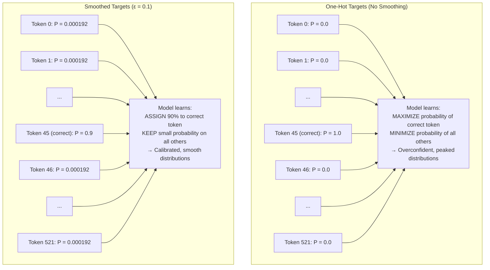

# 2. Label Smoothing

## Overview

Label smoothing is a regularization technique that prevents the model from becoming **overconfident** in its predictions. Instead of training the model to assign 100% probability to the correct token and 0% to all others (one-hot targets), label smoothing redistributes a small amount of probability mass across all incorrect tokens. This simple modification has a profound effect: it improves generalization, produces better-calibrated probability estimates, and makes the model more robust to label noise.

In TAMER, label smoothing is applied through PyTorch's built-in `nn.CrossEntropyLoss(label_smoothing=0.1)`, making it one of the easiest regularization techniques to implement — but understanding *why* it works requires a deeper look.

---

## 2.1 The Problem: Overconfidence

### What Is Overconfidence?

A model is overconfident when it assigns very high probability to its predicted class, even when that prediction is wrong. Consider a model that has learned to assign probability 0.9999 to the token `\frac` at a certain position, when the correct token is actually `\sqrt`. The cross-entropy loss for this prediction is:

$$-\log(0.0001) = 9.21$$

This is a very high loss — the model is heavily penalized for being confident and wrong. But here's the problem: **the gradient signal from this loss pushes the model to be even more confident on the examples it gets right**, because the model can only reduce its loss by increasing its probability on the correct class.

Over many epochs of training, the model learns to produce extremely peaked distributions — probability 0.99999+ for one token, 0.00001- for all others. This is problematic for several reasons:

### Why Overconfidence Hurts

1. **Poor generalization**: A model that is 99.999% confident on training examples has essentially memorized the training data. It hasn't learned the underlying patterns — it has learned to be certain about specific examples. When it encounters a slightly different input at test time, it will still be overconfident, but about the wrong token.

2. **Miscalibrated probabilities**: An overconfident model's output probabilities don't reflect true uncertainty. When the model says "90% chance this token is `\frac`", the actual accuracy might be only 70%. This makes the probabilities useless for downstream tasks like confidence-based rejection or ensemble methods.

3. **Gradient saturation**: When the model's softmax output for the correct class approaches 1.0, the gradient of the cross-entropy loss approaches zero. The model essentially stops learning from easy examples because the loss is already near zero and the gradient is negligible. This slows convergence.

4. **Sensitivity to label noise**: If a training example has an incorrect label (which is inevitable in large datasets like HME100K), an overconfident model will fit the wrong label with extreme confidence. This creates a strong gradient in the wrong direction, corrupting the model's parameters.

---

## 2.2 The Solution: Label Smoothing

Label smoothing modifies the target distribution from a one-hot vector to a **softened** distribution that assigns some probability to every token:

$$y_k^{\text{smooth}} = \begin{cases} 1 - \varepsilon & \text{if } k = k^* \text{ (correct token)} \\ \frac{\varepsilon}{K-1} & \text{if } k \neq k^* \text{ (incorrect token)} \end{cases}$$

Where:
- $\varepsilon$ is the smoothing parameter (typically 0.1)
- $K$ is the vocabulary size (~522 for TAMER)
- $k^*$ is the correct token index

### Concrete Example

With $\varepsilon = 0.1$ and $K = 522$, the target distribution for a correct token at index 45 becomes:

| Token Index | One-Hot Target | Smoothed Target |
|-------------|----------------|-----------------|
| 0 (PAD) | 0.0 | 0.000192 |
| 1 (SOS) | 0.0 | 0.000192 |
| ... | ... | ... |
| 45 (correct) | **1.0** | **0.9** |
| ... | ... | ... |
| 521 (last) | 0.0 | 0.000192 |

The correct token gets probability **0.9** instead of 1.0, and the remaining **0.1** is distributed equally among the other 521 tokens, each receiving approximately **0.000192**.

### What Changes Computationally

The cross-entropy loss with label smoothing becomes:

$$\mathcal{L}_{\text{smooth}} = -(1-\varepsilon) \log q(k^*) - \frac{\varepsilon}{K-1} \sum_{k \neq k^*} \log q(k)$$

The first term is the standard cross-entropy, weighted by $(1-\varepsilon)$. The second term is the **entropy of the predicted distribution**, weighted by $\frac{\varepsilon}{K-1}$. This second term encourages the model to maintain some probability mass across all tokens — it penalizes the model for assigning zero probability to any token.

In effect, label smoothing adds a **maximum entropy regularizer**: the model is incentivized to not be too certain, because it's penalized for making any token's probability too close to zero.

---

## 2.3 Mermaid Diagram: One-Hot vs Smoothed Targets



---

## 2.4 PyTorch Implementation

Label smoothing is so widely used that PyTorch provides it as a built-in parameter in `nn.CrossEntropyLoss`:

```python
loss_fn = nn.CrossEntropyLoss(
    label_smoothing=0.1,    # ε = 0.1
    ignore_index=0,         # PAD token
)
```

That's it. No custom loss function, no manual target manipulation. PyTorch handles the smoothing internally by modifying the target distribution before computing the loss.

### Under the Hood

When `label_smoothing=0.1`, PyTorch modifies the loss computation as follows:

```python
# Pseudocode for what PyTorch does internally
def smooth_cross_entropy(logits, targets, epsilon=0.1, num_classes=522):
    # Standard cross-entropy on the correct class
    ce_loss = F.cross_entropy(logits, targets, reduction='none')

    # Uniform distribution component
    uniform_loss = -F.log_softmax(logits, dim=-1).mean(dim=-1)

    # Combined loss
    loss = (1 - epsilon) * ce_loss + epsilon * uniform_loss
    return loss.mean()
```

The key insight is that label smoothing decomposes into two terms:
1. **Weighted standard CE**: $(1 - \varepsilon)$ × the usual cross-entropy loss
2. **Entropy regularizer**: $\varepsilon$ × the negative log-softmax averaged over all classes (which is the cross-entropy against a uniform distribution)

This decomposition makes it clear that label smoothing is simply adding a regularizer that encourages the model's predicted distribution to have higher entropy (i.e., be less peaked).

---

## 2.5 Why ε = 0.1 Is Standard

The value $\varepsilon = 0.1$ is the most commonly used smoothing parameter, and for good reason:

- **Small enough to preserve the signal**: At $\varepsilon = 0.1$, the correct token still receives 90% of the probability mass. The model clearly knows which token is correct — it just doesn't get to be absolutely certain.
- **Large enough to prevent overconfidence**: The 10% probability mass distributed across other tokens ensures the model never drives any token's probability to exactly zero. This prevents gradient saturation and keeps the model learning.
- **Empirically validated**: Szegedy et al. (2016) showed that $\varepsilon = 0.1$ consistently improves ImageNet classification accuracy. Müller et al. (2019) showed it improves calibration. The same value works well across domains.

### When to Adjust ε

- **ε = 0.05**: Use for very clean datasets (like Im2LaTeX) where labels are highly reliable and overconfidence is less of a concern.
- **ε = 0.1**: The default. Works well for most datasets and tasks.
- **ε = 0.2**: Use for noisy datasets (like HME100K) where label errors are more common. The higher smoothing makes the model more robust to incorrect labels.

### The TAMER Choice

TAMER uses $\varepsilon = 0.1$ as the default for the `LabelSmoothedCELoss`. This value works well across all four datasets — it's a good balance between preserving the learning signal and preventing overconfidence.

---

## 2.6 Effect on Training Dynamics

Label smoothing has several observable effects on the training process:

### Slightly Higher Training Loss

Because the model can no longer achieve zero loss (the target is 0.9, not 1.0, for the correct class), the training loss plateaus at a slightly higher value than without smoothing. This is normal and expected — it doesn't mean the model is worse. The model is being asked to match a softer target, which is inherently harder to optimize.

### Better Validation Performance

Despite the higher training loss, validation performance typically improves. The model generalizes better because it has learned smoother decision boundaries. The gap between training and validation loss is smaller, indicating less overfitting.

### More Uniform Attention Patterns

In the Transformer decoder, label smoothing leads to more diffuse attention distributions. Without smoothing, the model's attention tends to concentrate on a single source position (the one most relevant to the current prediction). With smoothing, the attention is spread across multiple positions, which can help the model capture broader context.

### Better Beam Search Performance

During inference, beam search benefits from more calibrated probabilities. Without smoothing, the model's probabilities are so peaked that the beam effectively degenerates to greedy search (one candidate dominates all others). With smoothing, the probabilities are more spread out, allowing the beam to explore diverse candidates and find better overall sequences.

---

## 2.7 Label Smoothing and LaTeX Structure

There's a subtle interaction between label smoothing and the structured nature of LaTeX:

- **For common tokens** like `{`, `}`, and digits: Smoothing is beneficial. The model shouldn't be 99.99% confident that the next token is `}` — there might be a subscript or superscript instead.
- **For rare tokens** like `\begin{gathered}`: Smoothing assigns a very small probability mass (0.1/521 ≈ 0.0002) to each rare token. This is actually fine — it's enough to keep the gradient non-zero for rare tokens without distorting the target distribution.
- **For structural tokens** like `\\` and `&`: Smoothing treats these the same as any other token. But as we'll see in [[3. Structure-Aware Loss]], these tokens benefit from additional weighting because getting them wrong is disproportionately harmful.

This is why TAMER uses both `LabelSmoothedCELoss` and `StructureAwareLoss` — they address different aspects of the problem. Label smoothing prevents overconfidence, while structure-aware loss prioritizes important tokens.

---

## 2.8 Common Misconceptions

### "Label smoothing makes the model less accurate"

**False.** Label smoothing typically improves test accuracy because it reduces overfitting. The model is slightly less confident on training data but more accurate on unseen data.

### "Label smoothing is the same as adding noise to the labels"

**Partially true, but misleading.** Label smoothing does add a small amount of uniform noise to the target distribution, but it's not random noise — it's structured noise that encourages maximum entropy. Random label noise (randomly flipping some labels to incorrect ones) is harmful; label smoothing is beneficial.

### "Label smoothing doesn't work for small vocabularies"

**False.** Label smoothing works for any vocabulary size. With a small vocabulary like LaTeX's ~522 tokens, the per-token smoothing mass (0.1/521 ≈ 0.0002) is slightly larger than with a large vocabulary, but the effect is the same — it prevents the model from driving probabilities to zero.

---

## Key Takeaways

- **Overconfidence** is a pervasive problem in neural network training — models learn to be extremely certain, which hurts generalization and calibration.
- **Label smoothing** replaces one-hot targets with softened targets: the correct token gets $(1-\varepsilon) = 0.9$ probability, and the remaining $\varepsilon = 0.1$ is distributed uniformly across other tokens.
- **The effect** is equivalent to adding an entropy regularizer that prevents the model from assigning zero probability to any token.
- **ε = 0.1 is standard** — small enough to preserve the signal, large enough to prevent overconfidence.
- **PyTorch makes it trivial**: `nn.CrossEntropyLoss(label_smoothing=0.1)`.
- **Training loss is slightly higher** but validation performance improves — the model generalizes better.
- **Beam search benefits** from more calibrated probabilities that allow diverse candidates to be explored.
- **Structure-aware loss** complements label smoothing by prioritizing important structural tokens.
