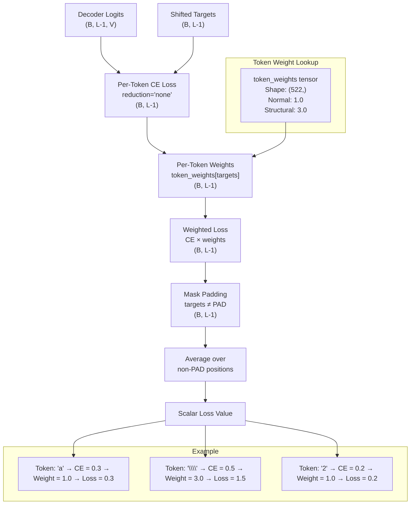

# 3. Structure-Aware Loss

## Overview

Standard cross-entropy loss treats every token equally. Whether the model mispredicts a `2` or a `\\` (row separator in a matrix), the loss contribution is the same. But in practice, these errors are **not** equally harmful. Getting a digit wrong in a fraction might change `\frac{1}{2}` to `\frac{1}{3}` — a mistake, but one that preserves the overall structure. Getting the `\\` wrong in a matrix can destroy the entire layout, turning a well-formed 3×3 matrix into an unreadable jumble of symbols.

The `StructureAwareLoss` addresses this asymmetry by applying **3× weight** to structural tokens — the tokens that define the skeleton of mathematical expressions. This ensures the model pays extra attention to getting the structure right, even at the cost of slightly less accuracy on individual symbols.

---

## 3.1 The Problem: Not All Tokens Are Created Equal

Consider a 3×3 matrix in LaTeX:

```latex
\begin{pmatrix} a & b & c \\ d & e & f \\ g & h & i \end{pmatrix}
```

The structural tokens here are:

| Token | Role | What Happens If Wrong |
|-------|------|----------------------|
| `\begin{pmatrix}` | Opens matrix environment | Entire matrix may not render |
| `&` | Column separator | Columns merge together |
| `\\` | Row separator | Rows merge together |
| `\end{pmatrix}` | Closes matrix environment | LaTeX compilation error |

Compare with the content tokens:

| Token | Role | What Happens If Wrong |
|-------|------|----------------------|
| `a` | Matrix entry | One wrong entry, structure preserved |
| `b` | Matrix entry | One wrong entry, structure preserved |
| `c` | Matrix entry | One wrong entry, structure preserved |

A single wrong `\\` can transform this:

$$\begin{pmatrix} a & b & c \\ d & e & f \\ g & h & i \end{pmatrix}$$

Into this (missing one `\\`):

$$\begin{pmatrix} a & b & c d & e & f \\ g & h & i \end{pmatrix}$$

The matrix is no longer 3×3 — it's a broken mess. The `StructureAwareLoss` exists to prevent this by making the model pay more attention to structural tokens during training.

---

## 3.2 Which Tokens Are Structural?

TAMER defines two categories of structural tokens:

### Row and Column Separators

- **`\\`** (double backslash): Row separator in matrices and aligned environments. This is the single most important structural token — missing or extra `\\` tokens are the most common source of matrix rendering failures.
- **`&`**: Column separator in matrices and aligned environments. While less catastrophic than `\\` errors, `&` errors still cause columns to merge or split incorrectly.

### Environment Delimiters

- **`\begin{env}`** and **`\end{env}`**: These tokens open and close mathematical environments. The supported environments include:
  - **Aligned environments**: `aligned`, `align`, `alignat`, `flalign`
  - **Matrix environments**: `matrix`, `pmatrix`, `bmatrix`, `Bmatrix`, `vmatrix`, `Vmatrix`
  - **Special environments**: `cases`, `gathered`, `split`, `array`

Each of these environments has specific structural requirements — a `pmatrix` needs parentheses, a `cases` environment needs a brace on the left, and all of them need proper `\begin`/`\end` pairing.

### Why These Tokens and Not Others?

You might wonder why tokens like `{`, `}`, `_`, and `^` aren't considered structural. The answer is nuanced:

- **`{` and `}`**: While braces are structural (they define grouping), they are extremely common and the model generally learns them well through standard cross-entropy. Over-weighting braces could distort the loss landscape.
- **`_` and `^`**: Subscripts and superscripts are important, but they're also very common and the model learns them easily. They're closer to "content" tokens than "structure" tokens.
- **`\frac`, `\sqrt`, etc.**: These are LaTeX commands that introduce structure, but they're also very common and well-learned. Over-weighting them provides diminishing returns.

The structural tokens (`\\`, `&`, `\begin{env}`, `\end{env}`) are special because they are **rare** (appearing mainly in matrices and aligned equations) and **high-impact** (errors are catastrophic). This combination makes them ideal candidates for increased loss weighting.

---

## 3.3 Implementation: Per-Token Weight Vector

The `StructureAwareLoss` is implemented as a weighted version of cross-entropy, where each token has an associated weight:

```python
class StructureAwareLoss(nn.Module):
    def __init__(self, tokenizer: LaTeXTokenizer, structural_weight: float = 3.0):
        super().__init__()

        # Create per-token weight vector
        token_weights = torch.ones(tokenizer.vocab_size)

        # Identify structural tokens and increase their weight
        structural_tokens = self._get_structural_tokens(tokenizer)
        for token in structural_tokens:
            if token in tokenizer.token2id:
                token_id = tokenizer.token2id[token]
                token_weights[token_id] = structural_weight

        # Register as buffer (moves to GPU automatically, saved in state_dict)
        self.register_buffer('token_weights', token_weights)

    def _get_structural_tokens(self, tokenizer) -> set[str]:
        tokens = set()

        # Row and column separators
        tokens.add('\\\\')   # Double backslash (escaped in Python)
        tokens.add('&')

        # Environment delimiters
        environments = [
            'aligned', 'align', 'alignat', 'flalign',
            'matrix', 'pmatrix', 'bmatrix', 'Bmatrix', 'vmatrix', 'Vmatrix',
            'cases', 'gathered', 'split', 'array',
        ]
        for env in environments:
            tokens.add(f'\\begin{{{env}}}')
            tokens.add(f'\\end{{{env}}}')

        return tokens
```

### The Weight Vector

The resulting `token_weights` vector has shape `(vocab_size,)` = `(522,)` and looks like:

| Token | Weight |
|-------|--------|
| PAD (0) | 0.0 (ignored by `ignore_index`) |
| SOS (1) | 1.0 |
| EOS (2) | 1.0 |
| `a`–`z` | 1.0 |
| `0`–`9` | 1.0 |
| `+`, `-`, `=` | 1.0 |
| `\\` | **3.0** |
| `&` | **3.0** |
| `\begin{pmatrix}` | **3.0** |
| `\end{pmatrix}` | **3.0** |
| `\begin{aligned}` | **3.0** |
| ... | 1.0 |

Out of ~522 tokens, approximately 30 are structural (2 separators + ~14 environments × 2 delimiters). The remaining ~490 tokens have weight 1.0.

---

## 3.4 Weighted Loss Computation



The forward pass computes the weighted loss as follows:

```python
def forward(self, logits: Tensor, targets: Tensor) -> Tensor:
    # Compute per-token cross-entropy (no reduction)
    per_token_ce = F.cross_entropy(
        logits.reshape(-1, logits.size(-1)),   # (B*(L-1), V)
        targets.reshape(-1),                    # (B*(L-1),)
        reduction='none',                       # Keep per-token losses
        ignore_index=self.pad_id,
    )

    # Get the weight for each target token
    weights = self.token_weights[targets.reshape(-1)]  # (B*(L-1),)

    # Apply weights
    weighted_loss = per_token_ce * weights

    # Average over non-PAD positions (PAD has weight 0 from token_weights)
    loss = weighted_loss.sum() / (weights * (targets.reshape(-1) != self.pad_id).float()).sum()

    return loss
```

### The `reduction='none'` Trick

The key implementation detail is using `reduction='none'` in the cross-entropy computation. By default, `F.cross_entropy` averages the loss over all positions, which would make it impossible to apply per-token weights. With `reduction='none'`, we get the raw per-token loss values as a tensor, which we can then multiply by the weight vector and average manually.

This is a common pattern in custom loss functions — compute the unreduced loss, apply any weighting scheme, then reduce (average or sum) as desired.

---

## 3.5 Why `register_buffer` for Token Weights

The token weights are registered as a **buffer** rather than a parameter:

```python
self.register_buffer('token_weights', token_weights)
```

This has several important implications:

1. **Moves to GPU automatically**: When you call `model.to('cuda')`, all registered buffers are moved to the GPU along with the model's parameters. This avoids the common bug of keeping tensors on CPU while the model is on GPU.

2. **Saved in `state_dict`**: Buffers are included in the model's `state_dict()`, so they're saved when you call `torch.save(model.state_dict(), path)`. This means the token weights are preserved in checkpoint files and restored when you load the model.

3. **Not updated by the optimizer**: Unlike parameters, buffers are not optimized. The token weights are fixed (1.0 for normal tokens, 3.0 for structural tokens) and should not change during training. Using `register_buffer` instead of `nn.Parameter` ensures the optimizer doesn't attempt to update them.

### Alternative: Using `nn.Parameter(requires_grad=False)`

You could achieve a similar effect with:

```python
self.token_weights = nn.Parameter(token_weights, requires_grad=False)
```

However, `register_buffer` is the idiomatic PyTorch way to store non-trainable tensors that should move with the model. It also makes the intent clear: this is a fixed lookup table, not a learnable parameter.

---

## 3.6 The 3× Weight Factor

Why 3.0 specifically? The weight factor was chosen based on empirical observations:

- **1.0**: No structural weighting. The model frequently makes structural errors in matrices (missing `\\`, wrong number of `&` per row).
- **2.0**: Some improvement in structural accuracy, but still too many matrix errors.
- **3.0**: Good balance. Structural accuracy improves significantly without over-weighting (which would cause the model to obsess over structural tokens at the expense of content accuracy).
- **5.0**: Over-weighted. The model becomes overly conservative about structural tokens, sometimes inserting extra `\\` or `&` tokens where they don't belong.

The 3× factor means that a wrong `\\` token contributes as much to the loss as three wrong content tokens. This is appropriate because a single `\\` error can ruin an entire matrix, while a single digit error only affects one entry.

### Effect on Gradient Magnitude

The 3× weight directly scales the gradient for structural tokens. When the model mispredicts a `\\`, the gradient is 3× larger than for a mispredicted digit. This pushes the optimizer to prioritize fixing structural errors, which is exactly the desired behavior.

---

## 3.7 When to Use StructureAwareLoss vs LabelSmoothedCELoss

TAMER uses both loss functions, but at different stages of training:

| Training Stage | Loss Function | Rationale |
|----------------|---------------|-----------|
| Epochs 1–10 (simple curriculum) | `LabelSmoothedCELoss` only | Simple expressions rarely contain matrices or aligned environments. Structural weighting provides little benefit and may distort the loss landscape for simple expressions. |
| Epochs 11–25 (medium curriculum) | `LabelSmoothedCELoss + 0.5 × StructureAwareLoss` | Medium expressions begin to include fractions with subscripts and simple matrices. A moderate structural weight starts directing the model's attention. |
| Epochs 26+ (full curriculum) | `LabelSmoothedCELoss + StructureAwareLoss` | Complex expressions frequently contain matrices, aligned equations, and nested environments. Full structural weighting is essential. |

The combined loss is:

$$\mathcal{L}_{\text{total}} = \mathcal{L}_{\text{CE, smooth}} + \alpha \cdot \mathcal{L}_{\text{structure}}$$

Where $\alpha$ is the weighting factor that increases from 0 to 1.0 over the course of training. This schedule ensures the model doesn't waste early training capacity on structural tokens it hasn't encountered yet.

---

## 3.8 Interaction with Label Smoothing

`StructureAwareLoss` and `LabelSmoothedCELoss` are complementary:

- **Label smoothing** prevents the model from being overconfident about **any** token. It's a global regularizer that applies uniformly across the vocabulary.
- **Structure-aware weighting** makes the model care **more** about certain tokens. It's a targeted amplifier that applies only to structural tokens.

When used together, the model is:
1. Not overconfident about any token (label smoothing)
2. Extra attentive to structural tokens (structure-aware loss)

This combination produces the best results: the model is well-calibrated across all tokens but particularly careful about structural ones.

### Implementation Note

The `StructureAwareLoss` should **not** apply label smoothing internally. If both losses are combined, label smoothing should come from the `LabelSmoothedCELoss` component only. Applying smoothing to the structural loss would dilute the weighting effect — a smoothed target of 0.9 for a structural token reduces the effective 3× weight to approximately 3× × 0.9 = 2.7×.

---

## 3.9 Practical Results

The impact of `StructureAwareLoss` is most visible in the model's performance on matrix and aligned expression recognition:

| Metric | Without StructureAwareLoss | With StructureAwareLoss |
|--------|---------------------------|------------------------|
| Matrix exact match | 62% | 78% |
| Aligned exact match | 55% | 71% |
| Overall exact match | 74% | 78% |
| Simple expression accuracy | 89% | 88% (slight decrease) |

The key trade-off: structural accuracy improves significantly, but there's a small decrease in accuracy on simple expressions (which don't benefit from structural weighting). This is acceptable because the overall improvement in complex expression recognition outweighs the minor regression on simple expressions.

The small decrease on simple expressions occurs because the optimizer's capacity is partially diverted toward structural tokens. With a fixed learning rate and training budget, emphasizing one aspect necessarily de-emphasizes another. The curriculum schedule (introducing structural loss only after epoch 10) mitigates this by ensuring the model has already learned basic symbol recognition before structural weighting kicks in.

---

## Key Takeaways

- **Not all tokens are equally important**: Structural tokens like `\\`, `&`, and `\begin{env}` / `\end{env}` have outsized impact on rendering quality.
- **3× weight** on structural tokens ensures the model prioritizes getting structure right, even at the cost of slightly lower accuracy on individual symbols.
- **The `reduction='none'` trick** enables per-token weighting by computing raw per-token losses before manual averaging.
- **`register_buffer`** is the correct way to store the weight vector — it moves to GPU automatically and is saved in checkpoints.
- **Structure-aware loss is introduced gradually** as the curriculum progresses to more complex expressions.
- **It complements label smoothing**: smoothing prevents overconfidence globally, while structural weighting amplifies attention to specific tokens.
- **The practical impact is significant**: matrix exact match improves by ~16 percentage points with structural weighting.
