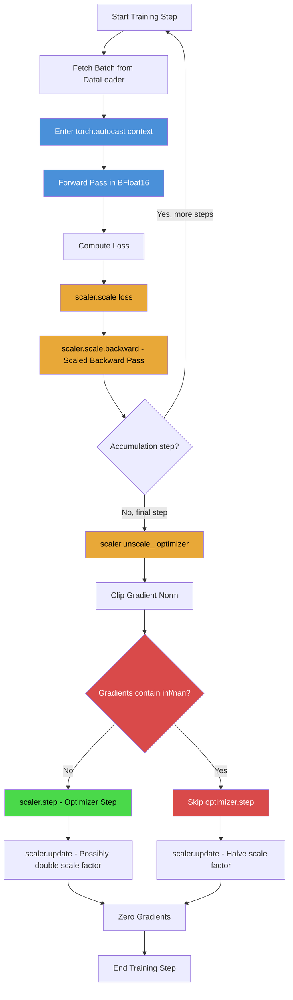

# 1. Mixed Precision Training with BFloat16

## 1.1 What Is Mixed Precision Training

Mixed precision training is a technique that accelerates deep learning by using lower-precision floating-point formats for portions of the computation that tolerate reduced precision, while retaining full 32-bit precision where it matters most. In practice, this means performing the **forward pass** and **backward pass** in 16-bit floating point, but keeping the **optimizer state** (momentum buffers, second-moment estimates in Adam) in full FP32. The key insight is that neural network weights and activations often do not need the full dynamic range or precision of FP32 to represent useful information, and modern GPU tensor cores are dramatically faster at 16-bit matrix multiplies than at 32-bit ones.

The "mixed" in mixed precision refers to the deliberate combination of two precision levels within a single training iteration. The master copy of each weight tensor is stored in FP32. During the forward pass, the weights are cast to 16-bit for the actual computation. The loss and gradients are computed in 16-bit, then the gradients are cast back to FP32 before being applied to the FP32 master weights by the optimizer. This gives us the best of both worlds: the speed of 16-bit arithmetic with the numerical stability of FP32 optimization.

## 1.2 FP16 vs BFloat16: A Critical Distinction

Not all 16-bit formats are created equal. The two contenders are **FP16** (IEEE half precision) and **BFloat16** (Brain Float 16, developed by Google Brain). Both use 16 bits total, but they allocate those bits very differently:

| Property | FP16 | BFloat16 | FP32 |
|---|---|---|---|
| Total bits | 16 | 16 | 32 |
| Exponent bits | 5 | 8 | 8 |
| Mantissa bits | 10 | 7 | 23 |
| Dynamic range | $2^{-14}$ to $2^{15}$ | $2^{-126}$ to $2^{127}$ | $2^{-126}$ to $2^{127}$ |
| Precision | High | Low | Highest |

**FP16** allocates 5 exponent bits and 10 mantissa bits. The 5 exponent bits give a representable range of approximately $6 \times 10^{-8}$ to $65504$. This tiny range is the Achilles' heel of FP16: values outside this range underflow to zero or overflow to infinity. When training with large batch sizes, loss values and intermediate activations can easily exceed 65504, causing **NaN (Not a Number)** or **Inf (infinity)** values that poison the entire training run.

**BFloat16** allocates 8 exponent bits and 7 mantissa bits. Crucially, the 8 exponent bits give BFloat16 the **same dynamic range as FP32** — from $1.2 \times 10^{-38}$ to $3.4 \times 10^{38}$. The trade-off is reduced precision (7 mantissa bits vs 10 for FP16), but for deep learning this is almost never a problem. The gradients and activations in a well-behaved model do not require 10 bits of mantissa precision; the extra exponent range is far more valuable.

In mathematical terms, BFloat16 can be thought of as a truncated FP32: it simply chops off the last 16 mantissa bits of an FP32 number. This makes conversion between BF16 and FP32 trivially cheap — just round or truncate. FP16 conversion, on the other hand, requires actual range checking and scaling, which is what the GradScaler was originally designed to handle.

## 1.3 Why TAMER OCR Chose BFloat16

The TAMER OCR project initially trained with FP16 mixed precision. This worked fine at smaller batch sizes (e.g., batch_size=128). However, when scaling up to **massive batch sizes** (batch_size=864 with gradient accumulation), the training would intermittently produce **NaN losses**. The root cause was clear: with larger batches, the per-GPU loss values grew proportionally, and the raw sum of losses across many samples could exceed FP16's representable range. Even with GradScaler attempting to manage the scale factor, certain intermediate activations in the Swin-V2 encoder would overflow during the attention computation, where the softmax of large dot-product values pushes some terms toward Inf.

Switching to BFloat16 eliminated these NaN issues entirely. Because BF16 has the same exponent range as FP32, the same computations that overflowed in FP16 proceed without issue in BF16. The reduced mantissa precision (7 bits instead of 10) caused no measurable degradation in final model quality — the BLEU and exact-match scores were identical to FP32 training within noise.

The **RTX 6000 Ada Generation** GPUs used in this project have dedicated BFloat16 Tensor Cores, meaning BF16 matrix multiplications receive the same hardware acceleration as FP16. There is no performance penalty for choosing BF16 over FP16 on these GPUs.

## 1.4 torch.autocast: The Context Manager

PyTorch provides `torch.autocast` as the primary interface for mixed precision training. It is a context manager that automatically determines which operations should run in 16-bit and which should remain in FP32:

```python
with torch.autocast(device_type="cuda", dtype=torch.bfloat16):
    logits = model(images, decoder_input_ids)
    loss = criterion(logits.shifted, labels.shifted)
```

Under the hood, `autocast` maintains an **op registry** that classifies every PyTorch operation into one of several categories:

- **FP16/BF16 eligible**: Matrix multiplications (`torch.matmul`, `nn.Linear`), convolutions (`nn.Conv2d`), and other compute-intensive ops. These run in 16-bit for maximum speed.
- **FP32 required**: Reductions (`torch.sum`, `torch.softmax`), loss functions, and normalization layers. These remain in FP32 because they are numerically sensitive.
- **Promotion rules**: If an operation receives a mix of FP32 and BF16 inputs, the FP32 input is cast to BF16 for the computation, and the output is BF16.

The beauty of autocast is that you do not need to manually cast any tensors. The context manager handles everything transparently. If you step outside the `autocast` block, all operations revert to their default dtype (typically FP32).

## 1.5 The GradScaler: Preventing Underflow

Even with BFloat16's wider range, gradient values can become extremely small (close to zero), especially during the early stages of training or in deeper layers of the network. When these tiny gradients are represented in 16-bit, they risk **underflowing to zero** — the gradient simply becomes 0.0 and no learning occurs for that parameter.

The `GradScaler` solves this by **scaling up the loss** before calling `.backward()`, which proportionally scales up all gradients. After the backward pass, the scaler **unscales** the gradients back to their true magnitude before the optimizer step. The key API:

```python
scaler = torch.amp.GradScaler("cuda")

# Inside the training loop:
scaler.scale(loss).backward()        # Step 1: Scale loss, then backward
scaler.unscale_(optimizer)           # Step 2: Unscale gradients
torch.nn.utils.clip_grad_norm_(model.parameters(), max_norm=1.0)
scaler.step(optimizer)               # Step 3: Step optimizer (if no inf/nan)
scaler.update()                      # Step 4: Adjust scale factor
```

**Step 1 — `scaler.scale(loss).backward()`**: The loss is multiplied by a large scale factor $S$ (initially $2^{16} = 65536$). Since $\frac{\partial (S \cdot L)}{\partial w} = S \cdot \frac{\partial L}{\partial w}$, all gradients are scaled by $S$, moving them well above the underflow threshold.

**Step 2 — `scaler.unscale_(optimizer)`**: Before clipping or stepping, the gradients must be restored to their true magnitude. This divides all gradients by $S$. This step must happen before gradient clipping, otherwise the clipping threshold would be operating on scaled gradients and would be meaningless.

**Step 3 — `scaler.step(optimizer)`**: This is a guarded optimizer step. The scaler checks whether any gradients contain `inf` or `nan` after unscaling. If they do, the optimizer step is **skipped entirely** — the weights are not updated, protecting the model from corruption. If the gradients are clean, the optimizer steps normally.

**Step 4 — `scaler.update()`**: The scaler dynamically adjusts the scale factor $S$ for the next iteration. If an inf/nan was detected (step was skipped), the scale factor is **halved** — the assumption is that $S$ was too large, causing overflow. If no inf/nan was detected for a configurable number of consecutive steps (default 2000), the scale factor is **doubled** — maximizing the margin against underflow.

> **Note**: When using BFloat16, the GradScaler is technically less critical than with FP16, because BF16's range makes underflow much less likely. However, it is still good practice to include it as a safety net, and PyTorch's AMP documentation recommends keeping it even with BF16.

## 1.6 The Complete AMP Training Loop

The following Mermaid diagram illustrates the complete mixed precision training loop as implemented in TAMER OCR:



## 1.7 Key Takeaways

1. **Always prefer BFloat16 over FP16** when your hardware supports it (Ampere+ GPUs). The identical dynamic range to FP32 prevents the NaN/Inf issues that plague FP16 training at scale.
2. **Use GradScaler even with BF16** — it costs nothing and provides an additional safety net against gradient underflow.
3. **Always unscale before clipping** — `scaler.unscale_(optimizer)` must be called before `clip_grad_norm_`, or your gradient clipping threshold will be meaningless.
4. **The autocast context manager is your friend** — do not manually cast tensors. Let autocast handle the op-level decisions.
5. **Check your hardware** — older GPUs (pre-Ampere) may not have BF16 tensor cores and would fall back to slower software emulation. The RTX 6000 Ada has full BF16 hardware support.
