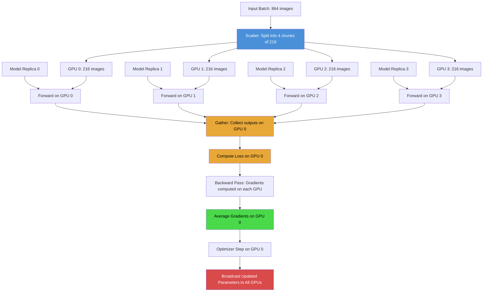

# 2. Multi-GPU Training with DataParallel

## 2.1 Why Multi-GPU Training Is Necessary

The TAMER OCR model is a large vision-language architecture consisting of a Swin-V2 encoder (roughly 88 million parameters) and a RoBERTa-based decoder (roughly 125 million parameters). Combined with the cross-attention bridge, the total model size exceeds **200 million parameters**. At a batch size of 864 images, the memory requirements are staggering:

- **Model parameters**: ~200M × 4 bytes (FP32 master copy) = ~800 MB
- **Model gradients**: ~200M × 2 bytes (BF16) = ~400 MB
- **Optimizer state** (AdamW: momentum + variance): ~200M × 4 bytes × 2 = ~1.6 GB
- **Activations** (forward pass intermediates for backprop): several GB depending on image resolution
- **Input data**: 864 images × 3 channels × 384 × 384 × 4 bytes = ~1.4 GB

A single GPU cannot hold all of this. The RTX 6000 Ada has 48 GB of VRAM, which sounds generous, but even with gradient checkpointing and mixed precision, the peak memory during training comfortably exceeds what one GPU can provide. Multi-GPU training is not a luxury — it is a **necessity**.

## 2.2 DataParallel: The Simplest Multi-GPU Strategy

PyTorch's `torch.nn.DataParallel` (DP) is the simplest way to distribute training across multiple GPUs. It wraps an existing model and transparently handles the distribution of data and collection of results. The usage is delightfully simple:

```python
model = TamerOCR(config)
model = torch.nn.DataParallel(model, device_ids=[0, 1, 2, 3])
```

That single wrapping line transforms the model from a single-GPU model to a multi-GPU model. No code changes to the training loop, no process spawning, no distributed samplers.

### How DataParallel Works

The mechanism of DataParallel follows a clear **scatter–replicate–parallel–gather** pattern:

1. **Scatter**: The input batch is split into roughly equal chunks along the batch dimension. With 4 GPUs and batch_size=864, each GPU receives 216 samples.

2. **Replicate**: The model is copied to each GPU. Each replica holds a full copy of the model parameters. This is a significant memory overhead — each GPU stores the entire model — but it is necessary because PyTorch's autograd needs a local computation graph.

3. **Parallel Forward**: Each GPU independently runs the forward pass on its chunk of data. The computation is truly parallel; all GPUs compute simultaneously.

4. **Gather**: The outputs from all GPUs are collected back on the primary GPU (device 0), where the loss is computed and the backward pass begins. Gradients from each replica are then averaged and applied to the model on the primary GPU, and the updated parameters are broadcast to all replicas at the start of the next iteration.

This pattern repeats every training step. The key limitation is that the **gradient averaging and parameter broadcast** happen through Python-level threading, which introduces overhead. Additionally, GPU 0 does more work (it handles the gather, loss computation, and broadcast), leading to a **load imbalance** where GPU 0 is often the bottleneck.

## 2.3 The .module Attribute and Model Unwrapping

When you wrap a model with `DataParallel`, the original model becomes accessible as the `.module` attribute of the DataParallel object. This means:

```python
# Before wrapping:
model.encoder  # Direct access to the encoder

# After wrapping:
model.module.encoder  # Must go through .module first
```

This is not just a cosmetic inconvenience. Many operations require accessing the raw model directly:

- **Freezing/unfreezing layers**: `model.module.encoder.requires_grad_(False)`
- **Accessing model configuration**: `model.module.config`
- **Saving checkpoints**: You want to save `model.module.state_dict()`, not `model.state_dict()`, to avoid the `module.` prefix in key names
- **Computing parameter counts**: `sum(p.numel() for p in model.module.parameters())`

If you forget the `.module` and try `model.encoder`, you get an `AttributeError`, because `DataParallel` does not forward arbitrary attribute access to the wrapped model.

## 2.4 The _unwrap_model() Helper

TAMER OCR introduces a `_unwrap_model()` helper function that recursively unwraps a model from any combination of DataParallel and `torch.compile` wrappers:

```python
def _unwrap_model(model):
    """Unwrap model from DataParallel and torch.compile wrappers."""
    if hasattr(model, "module"):
        return _unwrap_model(model.module)
    if hasattr(model, "_orig_mod"):
        return _unwrap_model(model._orig_mod)
    return model
```

This recursive function handles two layers of wrapping:

1. **DataParallel wrapping**: The `.module` attribute stores the original model.
2. **torch.compile wrapping**: The `._orig_mod` attribute stores the pre-compilation model.

By recursing, `_unwrap_model` works correctly regardless of the wrapping order. Whether the model is `DataParallel(torch.compile(raw_model))` or `torch.compile(DataParallel(raw_model))`, calling `_unwrap_model` always returns the raw `TamerOCR` instance.

This function is used throughout the codebase wherever direct model access is needed:

```python
# Freezing the encoder during early training:
_unwrap_model(model).encoder.requires_grad_(False)

# Saving a checkpoint (no "module." prefix in keys):
torch.save(_unwrap_model(model).state_dict(), path)

# Accessing the tokenizer for decoding:
tokenizer = _unwrap_model(model).tokenizer
```

## 2.5 DataParallel vs DistributedDataParallel

It is worth understanding why TAMER OCR uses DataParallel instead of the more commonly recommended DistributedDataParallel (DDP):

| Feature | DataParallel | DistributedDataParallel |
|---|---|---|
| Setup complexity | One line of code | Requires process spawning, dist.init_process_group |
| Code changes | Minimal | Must use DistributedSampler, adjust rank-aware logic |
| Performance | Thread-based, GIL-limited | Process-based, true parallelism |
| Memory efficiency | Each GPU holds full model + optimizer | Same (unless using FSDP or model parallelism) |
| Gradient sync | After backward, on GPU 0 | During backward, all-reduce across GPUs |
| Load balance | GPU 0 is the bottleneck | Perfectly balanced |

For TAMER OCR, DataParallel was chosen for **simplicity**. The project was initially developed on a single machine with 4 GPUs, and the overhead of setting up DDP was not justified for that scale. The training speed with DP on 4 GPUs was sufficient — the model trained in reasonable time, and the GPU utilization was acceptable.

However, if the project were to scale to more GPUs or multiple machines, migrating to DDP would be recommended. DDP's `all-reduce` gradient synchronization overlaps with backward computation, providing significantly better scaling efficiency, especially beyond 4 GPUs.

## 2.6 Batch Splitting in Practice

When using DataParallel, the effective per-GPU batch size is:

$$\text{batch\_per\_gpu} = \frac{\text{total\_batch\_size}}{\text{num\_gpus}}$$

With `batch_size=864` and 4 GPUs, each GPU processes 216 images per step. This is important for:

- **Memory planning**: Each GPU needs enough VRAM for 216 forward/backward passes.
- **Batch normalization**: If the model uses batch norm, the statistics are computed per-GPU on 216 samples, not 864. Swin-V2 uses LayerNorm, so this is not an issue for TAMER OCR.
- **Gradient accumulation**: If the effective batch size is achieved through gradient accumulation, the accumulation steps operate on the per-GPU batch size.

## 2.7 Wrapping Order: Raw Model → DataParallel → torch.compile

The correct wrapping order for combining DataParallel with `torch.compile` is:

```python
# Step 1: Create the raw model
model = TamerOCR(config)

# Step 2: Wrap with DataParallel
model = torch.nn.DataParallel(model, device_ids=[0, 1, 2, 3])

# Step 3: Compile with torch.compile
model = torch.compile(model)
```

This order matters because `torch.compile` traces the computation graph and applies optimizations (operator fusion, memory planning) to the entire DataParallel-wrapped model. If you compiled first and then wrapped with DataParallel, each GPU would receive a separately compiled replica, and the compilation overhead would multiply by the number of GPUs.

By compiling the DataParallel wrapper, PyTorch can optimize the scatter/gather operations alongside the model computation, potentially fusing data transfer with computation for better pipeline utilization.

## 2.8 DataParallel Flow Diagram

The following Mermaid diagram illustrates the complete DataParallel flow for a single training step:



## 2.9 Key Takeaways

1. **DataParallel is the simplest multi-GPU solution** — a single line of code enables multi-GPU training.
2. **Always use `_unwrap_model()`** when you need to access the raw model for freezing, saving, or configuration.
3. **The wrapping order matters**: raw model → DataParallel → torch.compile.
4. **DP has limitations**: GPU 0 is a bottleneck, and GIL contention reduces efficiency. For >4 GPUs, consider DDP.
5. **Batch splitting is automatic**: DataParallel handles it transparently, but be aware of per-GPU memory constraints.
