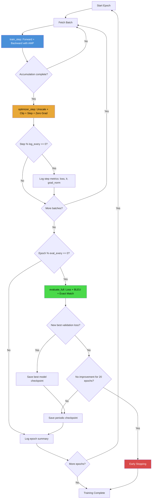

# 3. Training Loop and Engine Functions

## 3.1 Overview of the Training Engine

The TAMER OCR training engine is built around a set of composable functions that each handle one aspect of the training loop. Rather than a single monolithic `train()` function, the codebase separates concerns into `train_step()`, `optimizer_step()`, `eval_step()`, `evaluate_full()`, and various helper utilities. This modular design makes the training loop easy to understand, test, and modify. Each function has a clear contract: what it takes as input, what it produces as output, and what side effects it performs.

## 3.2 The train_step() Function

The `train_step()` function encapsulates a single forward-backward pass, including mixed precision and gradient accumulation. Its core logic is:

```python
def train_step(model, batch, criterion, scaler, accumulation_steps=1):
    images, labels = batch["image"], batch["labels"]

    with torch.autocast(device_type="cuda", dtype=torch.bfloat16):
        logits = model(images, decoder_input_ids=labels[:, :-1])
        loss = criterion(logits.reshape(-1, logits.size(-1)), labels[:, 1:].reshape(-1))
        loss = loss / accumulation_steps  # Normalize by accumulation steps

    scaler.scale(loss).backward()
    return loss.item() * accumulation_steps  # Return unscaled loss for logging
```

The critical detail here is the **loss division by accumulation_steps**. When using gradient accumulation, the effective batch size is:

$$\text{effective\_batch\_size} = \text{batch\_size} \times \text{accumulation\_steps}$$

To ensure that the accumulated gradients represent the average gradient over the full effective batch (not the sum), each per-step loss must be divided by `accumulation_steps`. This is because PyTorch's `.backward()` **accumulates** (adds) gradients by default. If we summed 4 steps of loss without dividing, the gradient magnitude would be 4× too large, and the optimizer would take steps that are 4× too aggressive.

The division `loss / accumulation_steps` ensures that after `accumulation_steps` backward passes, the accumulated gradient equals the gradient that would have been computed from a single pass with the full effective batch size. This is mathematically equivalent to:

$$\frac{1}{K} \sum_{k=1}^{K} \nabla L_k = \nabla \left( \frac{1}{K} \sum_{k=1}^{K} L_k \right)$$

where $K$ is the number of accumulation steps.

## 3.3 The optimizer_step() Function

The `optimizer_step()` function handles everything that happens after gradient accumulation is complete — unscaling, clipping, stepping, and cleanup:

```python
def optimizer_step(model, optimizer, scaler, scheduler, max_grad_norm=1.0):
    scaler.unscale_(optimizer)
    grad_norm = torch.nn.utils.clip_grad_norm_(
        _unwrap_model(model).parameters(), max_grad_norm
    )
    scaler.step(optimizer)
    scaler.update()
    optimizer.zero_grad(set_to_none=True)
    scheduler.step()
    return grad_norm.item()
```

The **order of operations** here is critical and must not be changed:

1. **`scaler.unscale_(optimizer)`**: Converts the scaled gradients back to their true magnitude. Must happen before clipping.
2. **`clip_grad_norm_`**: Clips the gradient norm to `max_grad_norm=1.0`. This prevents gradient explosions — situations where a single bad batch causes enormous gradients that catastrophically damage the model weights. The clipping operation scales down the gradient vector if its $\ell_2$ norm exceeds the threshold: $\mathbf{g} \leftarrow \mathbf{g} \cdot \min\left(1, \frac{C}{\|\mathbf{g}\|}\right)$ where $C$ is `max_grad_norm`.
3. **`scaler.step(optimizer)`**: Applies the optimizer step, but only if no inf/nan gradients were detected during unscaling.
4. **`scaler.update()`**: Adjusts the scale factor for the next iteration.
5. **`optimizer.zero_grad(set_to_none=True)`**: Clears gradients. The `set_to_none=True` option sets gradient tensors to `None` instead of zeroing them, which is slightly faster and reduces memory fragmentation.
6. **`scheduler.step()`**: Advances the learning rate scheduler.

## 3.4 Why Gradient Clipping with max_grad_norm=1.0

Gradient clipping is essential for transformer-based models. The attention mechanism can produce extremely large gradients when the softmax saturates (one element near 1, rest near 0), and the cross-entropy loss can have very steep curvature near the decision boundary. Without clipping, a single batch with anomalous data (e.g., a corrupted image, a mislabeled formula) can produce gradients with norm 1000× the typical value, causing the optimizer to take a step that destroys weeks of training progress.

The choice of `max_grad_norm=1.0` is standard for transformer training. It means that if the total $\ell_2$ norm of all model gradients exceeds 1.0, the entire gradient vector is rescaled to have norm 1.0. This is a per-parameter-group norm — the norm is computed over all parameters jointly, not per-layer.

In practice, during normal training, the gradient norm is typically between 0.1 and 5.0. Clipping activates on perhaps 10-20% of steps, gently constraining the worst offenders without significantly affecting the average training dynamics.

## 3.5 The eval_step() Function

The `eval_step()` function evaluates the model on a single validation batch. Unlike `train_step()`, it computes both the validation loss **and** generates predictions for metric computation:

```python
def eval_step(model, batch, criterion, tokenizer, max_len=256):
    images, labels = batch["image"], batch["labels"]

    with torch.no_grad(), torch.autocast(device_type="cuda", dtype=torch.bfloat16):
        logits = model(images, decoder_input_ids=labels[:, :-1])
        loss = criterion(logits.reshape(-1, logits.size(-1)), labels[:, 1:].reshape(-1))

        # Generate predictions using greedy decoding
        pred_ids = _unwrap_model(model).generate(
            images, max_len=max_len, strategy="greedy"
        )

    pred_texts = tokenizer.batch_decode(pred_ids, skip_special_tokens=True)
    label_texts = tokenizer.batch_decode(labels, skip_special_tokens=True)
    return loss.item(), pred_texts, label_texts
```

The `torch.no_grad()` context manager disables gradient computation, which significantly reduces memory usage (no need to store intermediate activations for backprop) and speeds up computation. The predictions are decoded using greedy decoding (fast) during evaluation; beam search is reserved for the final evaluation on the test set.

## 3.6 The evaluate_full() Function

`evaluate_full()` iterates over the entire validation set and collects all predictions for metric computation:

```python
def evaluate_full(model, val_loader, criterion, tokenizer, max_len=256):
    model.eval()
    all_preds, all_labels, total_loss = [], [], 0.0

    for batch in val_loader:
        loss, preds, labels = eval_step(model, batch, criterion, tokenizer, max_len)
        total_loss += loss * len(preds)
        all_preds.extend(preds)
        all_labels.extend(labels)

    avg_loss = total_loss / len(all_preds)
    bleu = compute_bleu(all_preds, all_labels)
    exact_match = compute_exact_match(all_preds, all_labels)
    model.train()
    return avg_loss, bleu, exact_match
```

The function sets the model to eval mode (disabling dropout, using running statistics for batch norm), processes every validation batch, aggregates results, and computes aggregate metrics.

## 3.7 Early Stopping

The training loop implements **early stopping** with a patience of 20 epochs. If the validation loss has not improved for 20 consecutive evaluation points, training is terminated:

```python
if no_improvement_count >= 20:
    print(f"Early stopping at epoch {epoch}")
    break
```

This prevents wasting GPU hours on a model that has already converged or is starting to overfit. The patience of 20 is generous — it allows for temporary plateaus in the loss curve that sometimes resolve with continued training. In practice, early stopping rarely triggers because the OneCycleLR scheduler forces the learning rate to zero by the end of training, which naturally prevents overfitting.

## 3.8 Evaluation Frequency and Warmup

Evaluation is not run every epoch. Instead, it runs every **2 epochs** (`eval_every=2`):

```python
if epoch % eval_every == 0:
    metrics = evaluate_full(model, val_loader, ...)
```

This halves the evaluation overhead, which is significant because evaluation requires generating sequences autoregressively — a slow process that takes roughly 2-3 minutes on the full validation set.

Additionally, there is an **eval warmup** mechanism: during the first few epochs, evaluation is run on a **subset** of the validation data (e.g., 10% of batches). This speeds up the early epochs when the model's predictions are mostly garbage anyway, and detailed metrics would not be meaningful. After the warmup period, the full validation set is used.

## 3.9 Checkpoint Saving

Checkpoints are saved at two triggers:

1. **Periodic**: Every 2 epochs (same as evaluation frequency), a regular checkpoint is saved.
2. **Best model**: Whenever the validation loss achieves a new minimum, a "best model" checkpoint is saved separately.

The checkpoint contains all state needed to resume training exactly where it left off:
- Model `state_dict`
- Optimizer `state_dict`
- Scheduler `state_dict`
- GradScaler `state_dict`
- Current epoch and step numbers
- Best validation loss so far

## 3.10 The _profile_dataloader() Function

Before training begins, `_profile_dataloader()` times the first batch to detect I/O bottlenecks:

```python
def _profile_dataloader(dataloader, num_batches=3):
    times = []
    for i, batch in enumerate(dataloader):
        if i >= num_batches:
            break
        start = time.perf_counter()
        _ = batch["image"].shape  # Force data loading
        times.append(time.perf_counter() - start)
    avg_time = sum(times) / len(times)
    print(f"Dataloader avg time per batch: {avg_time:.3f}s")
    return avg_time
```

This function is essential for diagnosing whether the training pipeline is **compute-bound** (GPU is the bottleneck) or **I/O-bound** (data loading is the bottleneck). If the dataloader time approaches or exceeds the GPU compute time, you need to increase `num_workers`, enable `pin_memory`, or use a faster storage system.

## 3.11 Logging

The training loop implements two levels of logging:

- **Step-level**: Every 10 steps, log the current loss, learning rate, gradient norm, and throughput (samples/second). This provides real-time visibility into training health.
- **Epoch-level**: At the end of each epoch, log the average loss, validation metrics (BLEU, exact match), learning rate, and epoch duration. This provides a high-level summary of training progress.

Both levels use structured logging with consistent keys, making it easy to parse and visualize training curves.

## 3.12 Training Loop Diagram

The following Mermaid diagram illustrates the complete training loop:



## 3.13 Key Takeaways

1. **Modular functions** make the training loop readable and testable. Each function has a single responsibility.
2. **Loss division by accumulation_steps** is essential for correct gradient magnitude when using gradient accumulation.
3. **Gradient clipping at max_norm=1.0** prevents catastrophic gradient explosions in transformer training.
4. **Evaluation every 2 epochs** with eval warmup balances monitoring quality against computational cost.
5. **Early stopping with patience=20** prevents wasted compute on converged or overfitting models.
6. **Profile your dataloader** before training to ensure you are compute-bound, not I/O-bound.
