# 4. Encoder Freeze and Differential Learning Rates

## 4.1 The Problem: Pretrained Encoder vs Random Decoder

The TAMER OCR model consists of two very different components that start from very different initial states:

- **Swin-V2 Encoder**: Pretrained on ImageNet-22K (14 million images, 22,000 categories). Its weights encode rich visual features — edge detectors, texture patterns, shape recognizers, and part-whole relationships — that are highly relevant for understanding math formula images.
- **RoBERTa Decoder**: Initialized from a pretrained language model, but the cross-attention layers and the output projection layer are **randomly initialized**. More importantly, the decoder must learn an entirely new task: translating visual features into LaTeX token sequences, which is very different from the masked language modeling that RoBERTa was pretrained on.

When training begins, the decoder's random cross-attention weights produce meaningless outputs. The loss gradients flowing back from these random outputs are essentially noise. If we allow these noisy gradients to update the encoder from the very first step, we risk **destroying the pretrained features** that the encoder spent millions of images learning. The encoder weights would be contaminated by noise before the decoder has learned anything useful to teach it.

This is the fundamental tension: the encoder has valuable knowledge but the decoder needs to learn, and early training signals from the decoder are not trustworthy.

## 4.2 The Encoder Freeze Strategy

TAMER OCR solves this with a **freeze-unfreeze curriculum**: for the first 3 epochs, the encoder is completely frozen (all parameters have `requires_grad=False`), and only the decoder is trained. After epoch 3, the encoder is unfrozen and both components train together.

```python
# Epochs 0-2: Freeze the encoder
if epoch < 3:
    _unwrap_model(model).encoder.requires_grad_(False)
else:
    # Epoch 3+: Unfreeze the encoder
    _unwrap_model(model).encoder.requires_grad_(True)
```

During the frozen phase:

1. The forward pass still uses the encoder to extract visual features — the encoder is not disabled, it simply does not learn.
2. The decoder receives the same visual features it will receive after unfreezing, so it learns to interpret them correctly.
3. The gradients from the decoder's loss do **not** flow through the encoder, so the pretrained features remain intact.
4. The decoder learns a reasonable mapping from visual features to LaTeX tokens, producing meaningful gradients.

By the time the encoder unfreezes at epoch 3, the decoder has already converged to a reasonable (if imperfect) solution. The gradients flowing back through the decoder are now **meaningful signal** rather than noise, and the encoder can fine-tune its features to better serve the decoder's needs.

## 4.3 Why 3 Freeze Epochs?

The number 3 is not arbitrary — it is calibrated to the training dynamics of TAMER OCR:

- **Large batch size (864)**: With 864 samples per step, the decoder sees a large and diverse set of examples each step, leading to fast convergence. After 3 epochs with 864 samples/step, the decoder has seen roughly $3 \times 864 \times \text{steps\_per\_epoch}$ samples, which is enough to learn a basic mapping.
- **Monitoring decoder loss**: During development, we observed that the decoder's training loss drops steeply in the first 2-3 epochs and then begins to plateau. This plateau indicates that the decoder has extracted most of what it can from the frozen encoder features.
- **Too few freeze epochs** (e.g., 1): The decoder has not yet learned a coherent mapping. Unfreezing too early risks contaminating the encoder with noisy gradients.
- **Too many freeze epochs** (e.g., 10): The decoder overfits to the frozen encoder features. When the encoder finally unfreezes and its features shift, the decoder's learned mapping becomes partially invalid, causing a temporary performance drop (catastrophic forgetting in the decoder).

Three epochs is the sweet spot where the decoder is competent enough to provide useful gradient signal, but not so overfit that it cannot adapt to the encoder's fine-tuning.

## 4.4 Differential Learning Rates

When the encoder is unfrozen, it does not train at the same learning rate as the decoder. Instead, TAMER OCR uses **differential learning rates**:

- **Encoder learning rate**: $5 \times 10^{-5}$ (0.00005)
- **Decoder learning rate**: $5 \times 10^{-4}$ (0.0005)

The decoder's learning rate is **10× higher** than the encoder's. This reflects the different needs of the two components:

- The encoder already has good features from ImageNet pretraining. It needs only **fine-tuning** — small adjustments to adapt its features to the specifics of math formula images (e.g., emphasizing thin lines, recognizing mathematical symbols).
- The decoder must learn a **new task** from scratch (translating visual features to LaTeX). It needs large updates to discover the correct mapping.

If both components used the same learning rate, one of two bad things would happen:
- **Same high LR**: The encoder's pretrained features would be destroyed by overly aggressive updates (catastrophic forgetting of ImageNet knowledge).
- **Same low LR**: The decoder would learn too slowly, wasting GPU hours.

## 4.5 Implementation with AdamW Param Groups

PyTorch's AdamW optimizer supports **parameter groups**, each with its own learning rate and weight decay settings. TAMER OCR creates two groups:

```python
encoder_params = list(_unwrap_model(model).encoder.parameters())
decoder_params = list(_unwrap_model(model).decoder.parameters())

optimizer = AdamW([
    {"params": encoder_params, "lr": 5e-5, "weight_decay": 0.01},
    {"params": decoder_params, "lr": 5e-4, "weight_decay": 0.01},
])
```

Each parameter group maintains its own momentum and variance buffers in AdamW, so the optimizer state is completely independent between the encoder and decoder. The learning rate, weight decay, and any per-group settings are applied separately.

## 4.6 OneCycleLR with Multiple Max Learning Rates

The OneCycleLR scheduler is configured with a list of max learning rates, one per parameter group:

```python
scheduler = OneCycleLR(
    optimizer,
    max_lr=[5e-5, 5e-4],  # [encoder_max_lr, decoder_max_lr]
    total_steps=num_training_steps,
    pct_start=0.1,        # 10% warmup
    anneal_strategy="cos",
    div_factor=25,        # Initial LR = max_lr / 25
    final_div_factor=10000 # Final LR = initial_LR / 10000
)
```

This means each parameter group follows its own OneCycleLR schedule, but the **shape** of the schedule (warmup fraction, cosine annealing) is the same. The encoder starts at $5 \times 10^{-5} / 25 = 2 \times 10^{-6}$, warms up to $5 \times 10^{-5}$, and decays to $2 \times 10^{-6} / 10000 = 2 \times 10^{-10}$. The decoder starts at $5 \times 10^{-4} / 25 = 2 \times 10^{-5}$, warms up to $5 \times 10^{-4}$, and decays to $2 \times 10^{-5} / 10000 = 2 \times 10^{-9}$.

## 4.7 The Linear Scaling Rule and Why We Cap Learning Rates

The **linear scaling rule** states that when you increase the batch size by a factor $k$, you should increase the learning rate by the same factor to maintain the same effective step size. This is because with a larger batch, the gradient estimate is more accurate (lower variance), so you can afford to take larger steps.

For TAMER OCR with batch_size=864:
- Baseline: If we assume a standard batch size of 256 with a decoder LR of $1.5 \times 10^{-4}$
- Scaling factor: $k = 864 / 256 = 3.375$
- Scaled decoder LR: $1.5 \times 10^{-4} \times 3.375 \approx 5 \times 10^{-4}$ — which happens to match our chosen value.

However, for the encoder, the naive scaling gives:
- Baseline encoder LR of $6.5 \times 10^{-5}$
- Scaled: $6.5 \times 10^{-5} \times 3.375 \approx 2.2 \times 10^{-4}$

This value is **too aggressive** for the pretrained encoder. In experiments, the encoder LR of $2.2 \times 10^{-4}$ caused the validation loss to spike and never recover — the pretrained features were being destroyed faster than the decoder could adapt. We therefore **cap** the encoder LR at $5 \times 10^{-5}$, well below the naively scaled value.

The lesson: the linear scaling rule is a useful starting point, but it must be validated empirically, especially for pretrained components that require gentle fine-tuning.

## 4.8 Freeze/Unfreeze Timeline Diagram

The following Mermaid diagram illustrates the complete freeze/unfreeze timeline with learning rate schedules:

```mermaid
gantt
    title Training Timeline: Encoder Freeze and Differential LR
    dateFormat X
    axisFormat %s

    section Encoder
    Frozen (no gradient)           :f1, 0, 3
    Fine-tune LR=5e-5              :a1, 3, 30

    section Decoder
    Full training LR=5e-4          :b1, 0, 30

    section Learning Rate Schedule
    Decoder LR warmup              :c1, 0, 3
    Decoder LR cosine decay        :c2, 3, 30
    Encoder LR warmup (after unfreeze) :d1, 3, 6
    Encoder LR cosine decay        :d2, 6, 30
```



## 4.9 Key Takeaways

1. **Freeze the encoder for the first few epochs** to prevent noisy decoder gradients from destroying pretrained visual features.
2. **3 freeze epochs** is appropriate for large-batch training where the decoder converges quickly.
3. **Differential learning rates** (10× difference) allow the encoder to fine-tune gently while the decoder learns aggressively.
4. **Use AdamW parameter groups** to implement differential learning rates cleanly.
5. **The linear scaling rule** gives a starting point for learning rates, but always validate — pretrained components often need lower LRs than the rule suggests.
6. **OneCycleLR with `max_lr` as a list** applies different peak learning rates to each parameter group while keeping the schedule shape consistent.
