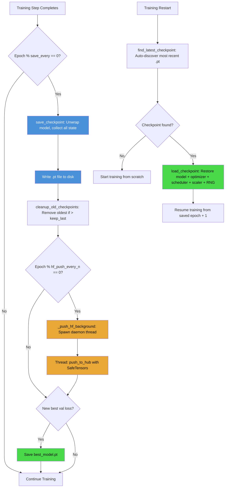

# 5. Checkpointing and Model Persistence

## 5.1 Why Checkpointing Is Essential

Training the TAMER OCR model takes many hours on multiple GPUs. A training run of 30 epochs with batch_size=864 on 4× RTX 6000 Ada GPUs takes roughly 18-24 hours. During this time, many things can go wrong:

- **Hardware failures**: GPU overheating, power supply issues, memory errors (ECC corrections on HBM)
- **Software failures**: CUDA out-of-memory errors, Python exceptions in the dataloader, network timeouts when fetching data from remote storage
- **Human errors**: Accidentally killing the process, needing to reboot the machine, preempted by a higher-priority job on a shared cluster
- **Experimentation**: Wanting to try different hyperparameters from a midpoint, or evaluating an intermediate checkpoint

Without checkpointing, any of these events means starting training from scratch — wasting hours of GPU time and electricity. With checkpointing, you can **resume training exactly where you left off**, with the optimizer state, learning rate schedule, and random number generator state all preserved.

## 5.2 What to Save in a Checkpoint

A complete training checkpoint contains all state needed to resume training without any loss of progress:

| Component | Key | Why It Is Needed |
|---|---|---|
| Model weights | `model_state_dict` | The learned parameters — the whole point of training |
| Optimizer state | `optimizer_state_dict` | AdamW momentum (m) and variance (v) buffers per parameter |
| Scheduler state | `scheduler_state_dict` | Current learning rate, step count, cycle position |
| Scaler state | `scaler_state_dict` | Current scale factor and growth tracker for AMP |
| Epoch number | `epoch` | Which epoch to resume from |
| Global step | `global_step` | Total steps completed (for logging continuity) |
| Best validation loss | `best_val_loss` | For early stopping and best-model tracking |
| Training metrics | `metrics` | Recent loss history for trend analysis |
| Random state | `rng_state` | `torch`, `numpy`, and `random` RNG states for reproducibility |

The **optimizer state** is particularly important and often overlooked by beginners. AdamW maintains two buffers per parameter: the first-moment estimate $m_t$ and the second-moment estimate $v_t$. These buffers encode the optimizer's "memory" of past gradients, which is what gives Adam its adaptive learning rate behavior. If you restore the model weights but not the optimizer state, the optimizer starts with zero momentum and variance — it effectively "forgets" everything it learned about the gradient landscape, and the first few hundred steps after resumption will be unstable.

## 5.3 The save_checkpoint Function

The `save_checkpoint()` function saves the **unwrapped model** — that is, the raw model without DataParallel or torch.compile wrappers:

```python
def save_checkpoint(model, optimizer, scheduler, scaler, epoch, step,
                    best_val_loss, metrics, path):
    checkpoint = {
        "model_state_dict": _unwrap_model(model).state_dict(),
        "optimizer_state_dict": optimizer.state_dict(),
        "scheduler_state_dict": scheduler.state_dict(),
        "scaler_state_dict": scaler.state_dict(),
        "epoch": epoch,
        "global_step": step,
        "best_val_loss": best_val_loss,
        "metrics": metrics,
        "rng_state": {
            "torch": torch.random.get_rng_state(),
            "cuda": torch.cuda.get_rng_state_all(),
            "numpy": numpy.random.get_state(),
            "random": random.getstate(),
        },
    }
    torch.save(checkpoint, path)
```

### Why Save the Unwrapped Model?

When a model is wrapped in DataParallel, the state dict keys acquire a `module.` prefix:

```python
# Raw model state dict keys:
"encoder.patch_embed.proj.weight"
"decoder.embed_tokens.weight"

# DataParallel-wrapped state dict keys:
"module.encoder.patch_embed.proj.weight"
"module.decoder.embed_tokens.weight"
```

This prefix makes checkpoints **non-portable** across different GPU configurations. If you save a DataParallel-wrapped checkpoint on 4 GPUs and try to load it on a single-GPU machine (no DataParallel), the key names will not match and loading will fail. By saving `_unwrap_model(model).state_dict()`, we get clean key names without any wrapper prefix, making the checkpoint usable in any configuration.

## 5.4 The load_checkpoint Function

The `load_checkpoint()` function restores all training state:

```python
def load_checkpoint(path, model, optimizer, scheduler, scaler):
    checkpoint = torch.load(path, map_location="cpu")

    _unwrap_model(model).load_state_dict(checkpoint["model_state_dict"])
    optimizer.load_state_dict(checkpoint["optimizer_state_dict"])
    scheduler.load_state_dict(checkpoint["scheduler_state_dict"])
    scaler.load_state_dict(checkpoint["scaler_state_dict"])

    # Restore RNG states for exact reproducibility
    torch.random.set_rng_state(checkpoint["rng_state"]["torch"])
    torch.cuda.set_rng_state_all(checkpoint["rng_state"]["cuda"])
    numpy.random.set_state(checkpoint["rng_state"]["numpy"])
    random.setstate(checkpoint["rng_state"]["random"])

    return checkpoint["epoch"], checkpoint["global_step"], checkpoint["best_val_loss"]
```

The model is loaded onto CPU first (`map_location="cpu"`) and then moved to the appropriate GPU. This avoids GPU memory spikes that can occur when loading a large checkpoint directly to GPU.

After loading, the training loop resumes from `epoch + 1` and `global_step + 1`, continuing exactly where it left off. The RNG state restoration ensures that the data shuffling and dropout patterns are identical to what they would have been without the interruption — this is critical for **exact reproducibility** in debugging scenarios.

## 5.5 Finding the Latest Checkpoint

The `find_latest_checkpoint()` function auto-discovers the most recent checkpoint by examining file modification times:

```python
def find_latest_checkpoint(checkpoint_dir):
    checkpoints = glob.glob(os.path.join(checkpoint_dir, "checkpoint_epoch_*.pt"))
    if not checkpoints:
        return None
    latest = max(checkpoints, key=os.path.getmtime)
    return latest
```

This function is called at the start of training to enable **automatic resumption**. If a checkpoint exists, training resumes from it. If not, training starts from scratch. The user does not need to manually specify which checkpoint to load — the system finds it automatically.

## 5.6 Cleanup of Old Checkpoints

Each checkpoint is roughly 2-3 GB (model weights + optimizer state + scheduler + scaler). After 30 epochs with checkpoints every 2 epochs, that is 15 checkpoints × 2.5 GB ≈ **37.5 GB** of disk space. The `cleanup_old_checkpoints()` function keeps only the last N checkpoints:

```python
def cleanup_old_checkpoints(checkpoint_dir, keep_last=5):
    checkpoints = sorted(
        glob.glob(os.path.join(checkpoint_dir, "checkpoint_epoch_*.pt")),
        key=os.path.getmtime
    )
    while len(checkpoints) > keep_last:
        os.remove(checkpoints.pop(0))  # Remove oldest
```

This ensures that disk usage stays bounded. The `keep_last=5` default means we always have the 5 most recent checkpoints available for rollback, while older ones are automatically deleted.

## 5.7 Best Model Checkpoint

In addition to periodic checkpoints, a special **best model checkpoint** is saved whenever the validation loss achieves a new minimum:

```python
if val_loss < best_val_loss:
    best_val_loss = val_loss
    save_checkpoint(model, optimizer, scheduler, scaler, epoch, step,
                    best_val_loss, metrics,
                    os.path.join(checkpoint_dir, "best_model.pt"))
```

The best model checkpoint is never deleted by `cleanup_old_checkpoints`. It represents the model at its peak performance and is the one used for final evaluation and deployment. Even if later epochs show overfitting (training loss continues to decrease but validation loss increases), the best model checkpoint preserves the optimal weights.

## 5.8 HuggingFace Hub Push

TAMER OCR integrates with the **HuggingFace Hub** for model versioning and sharing. After saving a checkpoint locally, the model is pushed to a HuggingFace repository in a **background thread**:

```python
def _push_hf_background(model, repo_id, tokenizer, epoch):
    """Push model to HuggingFace Hub in a daemon thread."""
    def _push():
        try:
            unwrapped = _unwrap_model(model)
            unwrapped.push_to_hub(
                repo_id=repo_id,
                commit_message=f"Epoch {epoch}",
                safe_serialization=True,
            )
            tokenizer.push_to_hub(repo_id=repo_id)
        except Exception as e:
            print(f"HF push failed: {e}")

    thread = threading.Thread(target=_push, daemon=True)
    thread.start()
```

Key design decisions:

- **Daemon thread**: The thread is marked as `daemon=True`, meaning it will not prevent the Python process from exiting. If training finishes or crashes, the push thread is automatically terminated.
- **Exception handling**: Network errors, authentication failures, and rate limits are caught and logged, not raised. A failed push should never crash training.
- **Non-blocking**: Training continues immediately after starting the push thread. The push happens asynchronously and typically completes in 30-60 seconds.

### Throttling

Pushes are throttled to `hf_push_every_n_epochs` (default: 5). Pushing every epoch would waste bandwidth and risk HuggingFace rate limits. Every 5 epochs provides a reasonable cadence of remote backups without excessive overhead.

## 5.9 SafeTensors vs Pickle

PyTorch's default serialization format uses Python's `pickle` module, which is **insecure**: loading a pickled file can execute arbitrary code. This is a known security risk, especially when loading models from untrusted sources.

HuggingFace's **SafeTensors** format addresses this by using a simple, deterministic binary format that can only store tensor data — no executable code. When `safe_serialization=True` is passed to `push_to_hub()`, the model is serialized in SafeTensors format instead of pickle.

For local checkpoints, TAMER OCR continues to use PyTorch's native format (which uses pickle) because the optimizer state and scheduler state contain Python objects that SafeTensors cannot represent. However, for Hub pushes (which only include the model weights and tokenizer), SafeTensors is the preferred format.

## 5.10 Checkpoint Lifecycle Diagram

The following Mermaid diagram illustrates the complete lifecycle of a checkpoint:



## 5.11 Key Takeaways

1. **Save everything**: model, optimizer, scheduler, scaler, epoch, step, metrics, and RNG states. Omitting any component means resuming training will not be truly equivalent to uninterrupted training.
2. **Save the unwrapped model** to avoid the `module.` prefix, making checkpoints portable across GPU configurations.
3. **Cleanup old checkpoints** to prevent disk space from growing unboundedly.
4. **Always keep the best model checkpoint** separate from periodic checkpoints — it is your safety net against overfitting.
5. **Push to HuggingFace Hub in a background thread** so that network I/O does not block training.
6. **Use SafeTensors** for Hub pushes to avoid pickle's security vulnerabilities.
7. **Throttle Hub pushes** to avoid rate limits and unnecessary bandwidth usage.
