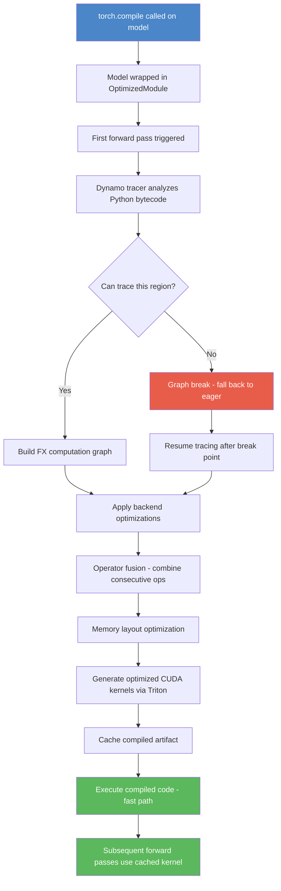

# 6. torch.compile Deep Dive

## Overview

**torch.compile** is PyTorch's just-in-time (JIT) compilation system introduced in PyTorch 2.0. It takes a standard eager-mode PyTorch model and compiles it into optimized machine code that runs significantly faster. In the TAMER OCR project, torch.compile delivers approximately a **30% training speedup**, which translates to hours saved over a multi-epoch training run on the RTX 6000 Ada GPU. Understanding how it works, what its limitations are, and how to integrate it properly is critical for getting the most out of the training pipeline.

## What torch.compile Does

At its core, `torch.compile` analyzes the operations your model performs and rewrites them into **fused kernels** — combined operations that execute on the GPU with fewer memory round-trips. In eager mode, every PyTorch operation is dispatched individually: the framework reads input tensors from GPU memory, computes a result, and writes it back. When you have hundreds of small operations chained together, the **memory bandwidth** becomes the bottleneck, not the compute capability of the GPU.

torch.compile traces through the model's forward pass (and backward pass during training), identifies sequences of operations that can be fused, and generates optimized CUDA kernels that perform multiple operations in a single pass through the data. This dramatically reduces the number of times intermediate results need to be written to and read from GPU memory.

```python
# The simplest usage — wrap your model before training
model = torch.compile(model)
# Now model.forward() is compiled on first call
```

## The Compilation Pipeline

The compilation process follows a well-defined pipeline. When you first call the compiled model, PyTorch does not immediately execute the forward pass. Instead, it traces through the computation graph, applies a series of optimization passes, and then generates optimized code. This is why the **first epoch** of training takes significantly longer — the model is being compiled, not just executed.



The key stages are:

1. **Dynamo Tracing**: PyTorch Dynamo intercepts Python bytecode execution and translates it into an intermediate representation (IR) called the FX graph. It tracks tensor operations, control flow, and data dependencies.

2. **Graph Breaks**: When Dynamo encounters an operation it cannot trace (such as a Python `print()` call, a conditional based on tensor data, or an unsupported library call), it must **break the graph**. At a graph break, the compiled code falls back to eager mode execution for that region, then resumes tracing afterward. Each graph break introduces overhead because it forces a transition between compiled and eager execution.

3. **Backend Optimization**: The FX graph is handed to the compilation backend (by default, the TorchInductor backend). The Inductor applies a series of transformations including operator fusion, memory layout optimization, and loop reordering.

4. **Kernel Generation via Triton**: The Inductor generates optimized GPU kernels using **Triton**, a Python-like DSL for writing GPU code. Triton kernels are compiled to PTX/CUBIN at runtime, targeting the specific GPU architecture.

5. **Caching**: The compiled artifact is cached. On subsequent calls with the same input shapes and dtypes, the cached kernel is reused without recompilation.

## Compilation Modes

torch.compile supports several modes that trade off compilation time against runtime performance:

| Mode | Compilation Time | Runtime Speed | Use Case |
|------|-----------------|---------------|----------|
| `"default"` | Moderate | Good | General training |
| `"reduce-overhead"` | Faster to compile | Best for small models/batches | Reduces Python overhead via CUDA graphs |
| `"max-autotune"` | Longest (tries many kernel variants) | Best throughput | Production training on fixed hardware |

```python
# In the TAMER project, the default mode is used
model = torch.compile(model, mode="default")
# For maximum throughput on a stable model:
# model = torch.compile(model, mode="max-autotune")
```

The `"reduce-overhead"` mode uses **CUDA Graphs** to eliminate the CPU-side launch overhead between kernel calls. This is most beneficial when individual operations are very fast (small models, small batch sizes) and the Python dispatch overhead dominates. The `"max-autotune"` mode benchmarks multiple kernel implementations for each operation and selects the fastest one, but compilation can take significantly longer.

## The First-Epoch Pause

One of the most surprising aspects of torch.compile for new users is the **3-5 minute compilation pause** at the start of the first epoch. During this time, the GPU appears idle — it is not processing data, it is compiling. This is normal and expected. The compilation cost is amortized across all subsequent forward and backward passes, which is why the 30% speedup materializes over the full training run.

For the TAMER project, with its Swin-v2 encoder producing features of shape `[B, L, 768]` and the Transformer decoder processing sequences up to 512 tokens, the compilation pause is a worthwhile investment. Over a typical 10-epoch training run, the time saved from faster execution far exceeds the one-time compilation cost.

## Dynamic Shapes and Recompilation

torch.compile achieves maximum performance when input tensor shapes are **fixed** across iterations. The TAMER project uses padding and batching to ensure consistent tensor shapes within each batch, which is ideal for compilation. However, if the sequence length varies between batches (as can happen with variable-length LaTeX sequences), torch.compile may need to **recompile** for each new shape, negating the speedup.

To mitigate this, the project uses `collate_fn` that pads all sequences in a batch to the same length. The batch size and sequence length remain constant across iterations, ensuring the compiled kernel is reused throughout training.

If recompilation does occur (for example, during the stress test when batch sizes change), you will see compilation messages in the log. Each recompilation costs time proportional to the model complexity.

## Compile and DataParallel

When combining `torch.compile` with `nn.DataParallel` for multi-GPU training, **the wrapping order matters critically**. The correct order is:

```python
# CORRECT: compile the model, then wrap in DataParallel
model = torch.compile(model)
model = nn.DataParallel(model)

# WRONG: DataParallel first, then compile
# This compiles each replica separately and causes issues
model = nn.DataParallel(model)
model = torch.compile(model)  # Problematic!
```

When you compile first and then wrap, the compiled model is replicated across GPUs. When you wrap first, each GPU's replica needs to be compiled independently, which wastes time and can cause inconsistencies.

## Compile and Automatic Mixed Precision (AMP)

torch.compile works seamlessly with PyTorch's automatic mixed precision. The `torch.autocast` context manager and `GradScaler` operate correctly with compiled models. The compilation process traces through the autocast operations and generates kernels that respect the precision settings.

```python
with torch.autocast(device_type="cuda", dtype=torch.bfloat16):
    output = model(images)  # compiled model, autocast active
```

The key insight is that autocast performs its dtype casting at the operation level, and these casts are visible to the Dynamo tracer. The compiled kernel will include the appropriate cast operations, maintaining numerical correctness while benefiting from the fusion and optimization that compilation provides.

## The _orig_mod Attribute

When `torch.compile` wraps a model, it creates an `OptimizedModule` that contains the original model as an attribute called `_orig_mod`. This means that after compilation, `model._orig_mod` gives you access to the original, unwrapped model.

```python
model = torch.compile(model)
# model is now an OptimizedModule
# model._orig_mod is the original TAMERModel
```

This is important for several operations:
- **Accessing model attributes**: If you need to inspect model parameters or call model methods, you may need to go through `_orig_mod`.
- **Saving and loading**: When saving a checkpoint, you might save `model._orig_mod.state_dict()` to ensure compatibility with non-compiled loading.
- **Unwrapping for evaluation**: Some evaluation code expects the raw model, not the compiled wrapper.

In the TAMER project, the `_unwrap_model()` helper function handles both the `nn.DataParallel` `.module` attribute and the `torch.compile` `_orig_mod` attribute:

```python
def _unwrap_model(model):
    """Unwrap DataParallel and/or torch.compile wrappers."""
    if hasattr(model, 'module'):       # DataParallel
        model = model.module
    if hasattr(model, '_orig_mod'):    # torch.compile
        model = model._orig_mod
    return model
```

This ensures that regardless of whether the model is wrapped in DataParallel, compiled, or both, you can always access the underlying TAMERModel for inspection, saving, or evaluation.

## Potential Issues and Numerical Differences

While torch.compile generally preserves numerical correctness, it can produce **slightly different results** compared to eager mode. This happens because:

1. **Operation fusion** changes the order of floating-point operations. Since floating-point arithmetic is not associative (`(a + b) + c ≠ a + (b + c)` in floating-point), fusing operations can change the accumulation order and produce results that differ by small amounts.

2. **Different kernel implementations** may use different internal precision strategies. The Triton-generated kernels may use different reduction strategies than the stock CUDA kernels.

These differences are typically within the **tolerance** of floating-point precision (on the order of 1e-6 for float32, 1e-2 for bfloat16). They should not affect training convergence or final model quality. However, if you observe significant divergence between compiled and eager training runs, you may want to verify that no graph breaks are occurring (which would cause parts of the model to run in eager mode with different numerical behavior).

You can check for graph breaks by setting the environment variable `TORCH_LOGS="dynamo"` before running training. This will print information about where Dynamo encounters operations it cannot trace and where graph breaks occur.

## Summary

torch.compile is one of the most impactful optimizations in the TAMER training pipeline. The ~30% speedup comes primarily from **kernel fusion** reducing memory bandwidth bottlenecks, which is especially valuable for the Swin-v2 encoder with its many small operations. The one-time compilation cost of 3-5 minutes is quickly amortized over a multi-epoch training run. Key considerations include maintaining fixed tensor shapes to avoid recompilation, using the correct wrapping order with DataParallel, and understanding the `_orig_mod` attribute for model introspection and checkpointing.
